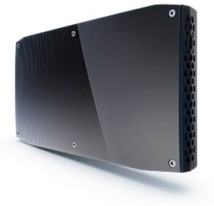
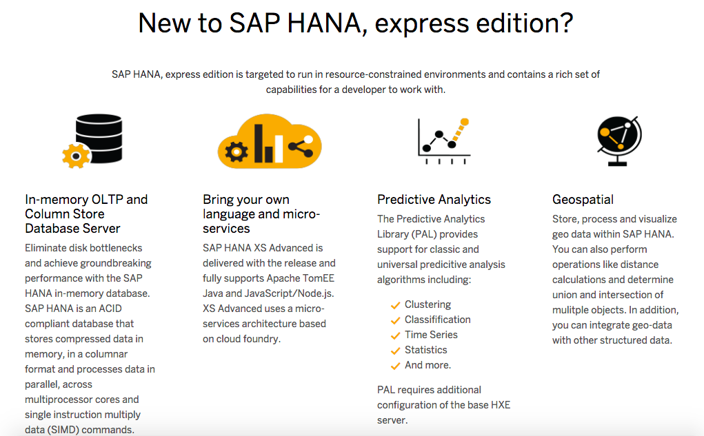
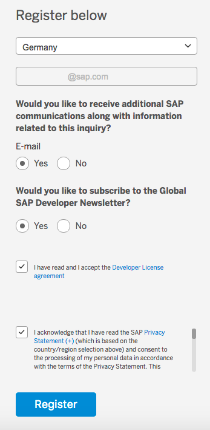
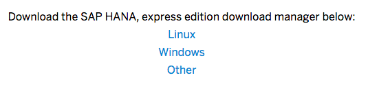
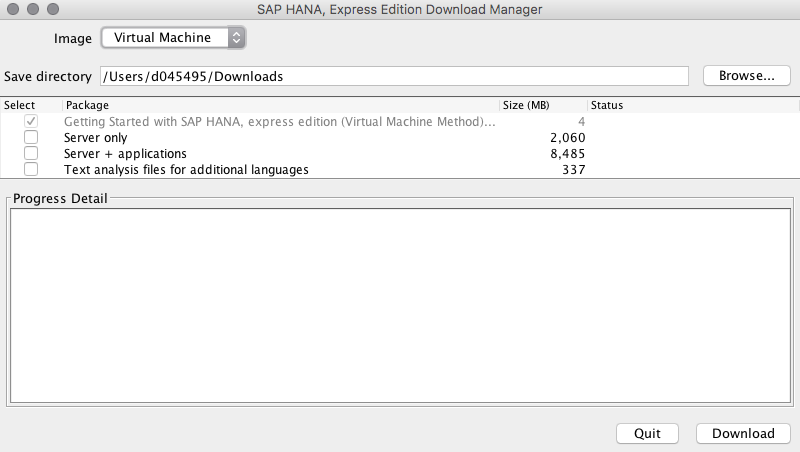
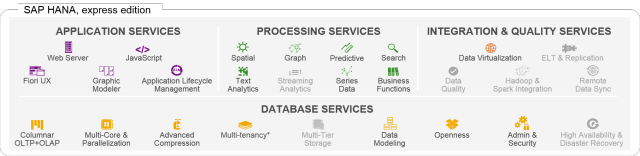
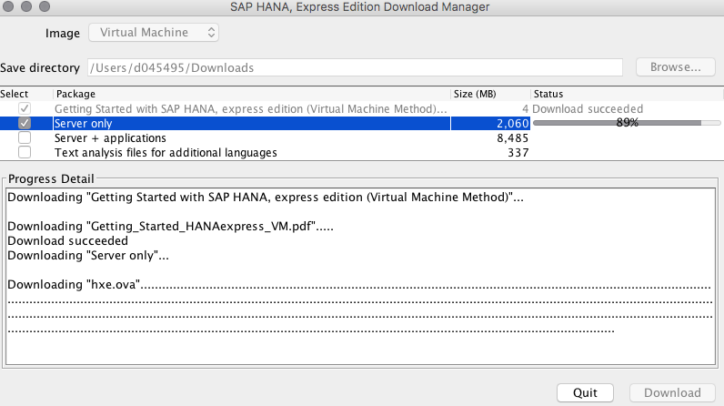

## Next Steps
 - [View similar How-Tos](http://www.sap.com/developer/tutorials.html) or [View all How-Tos](http://www.sap.com/developer/tutorials.html)

## How-To Details
The Intel&reg; NUC is a small form factor PC that packs an amazing amount of power into a small box. Intel&reg; re-imagines the desktop experience through their line of NUC systems designed to fit your every need. Especially when we consider our addition of the SAP HANA, express edition.

This guide will help you decide on the [best possible system](http://www.intel.com/content/www/us/en/nuc/nuc-comparison.html) for your desired SAP HANA, express edition [flavor](http://www.sap.com/developer/tutorials/hxe-ua-version.html).

> Graphic from Intel&reg;

### Time to Complete
**10 Min**.

---

1. To begin the process you might think the best idea would be to start with deciding which NUC to purchase, however you need first decide which type of operating system you will use; which will [determine which download](https://www.sap.com/developer/topics/sap-hana-express.html) of `express` you will need.

    From this point you will need to decide between the `server` or `full system`. The difference between the two choices boil down to which type of development you would like to do and this will directly impact your choice of NUC you ultimately decide to purchase.

    

2. To make your decision you will need to [first register and get the download manager](https://www.sap.com/cmp/ft/crm-xu16-dat-hddedft/index.html).

    - Select your **country**
    - Enter your **email address**
    - SAP of course highly recommends **selecting to receive** both emails as well as the developer newsletter
    - Acknowledge that you have read the terms of use and license agreement

    

    - Select **Register**

    > Note: You will be directed to a download link for Windows, Linux or Other version

    

3. Once you have the `Download Manager` of your choice you can execute it.

    

    > Note: You will need Java JRE 8 in order to execute the `Download Manager`

4. At this point you will need to finally make your choice on which flavor you want to have.

    - Server Only
    - Server + Applications

    

    The difference between these two choices directly effects both what you can do immediately out of the box as well as what type of NUC you will need to be most effective as you begin down the path to [SAP HANA development](http://scn.sap.com/people/craig.cmehil/blog/2016/09/14/developing-on-the-sap-hana-platform).

5. Both options provide a multitude of examples and areas to explore, therefore it boils down now to whether you wish to explore the Node.js development environment referred to as `XSA` or the data modeling and SQL environments. With the `XSA` option it is recommended to have at least 16 to 32 GB of memory, while the `Server Only` option will be fine with 8 to 16 GB.

6. So while you begin your download you can then jump over and make your decision about which Intel&reg; NUC, although this guide talks about this processing taking 10 minutes it does not include the fact that the download is dependent upon your internet connection speeds. So take your time deciding before you purchase.

    

7. Experience has told us already that the Intel&reg; Core&trade; `i5` processors work, however the Intel&reg; Core&trade; `i7` processors give the best experience. So if you are inclined narrow your search to those.

8. The following should provide some guidance, keep in mind this is based on development scenarios only.

	 - Server Only (minimum 8 GB of Ram for the VM)
	 - Server + Applications (minimum 16 GB of Ram for the VM)

9. The ultimate solution, the best choice based on current experiences is the  Intel&reg; NUC SKU (Intel&reg; NUC Kit `NUC6i7KY`).

## Next Steps
 - [View similar How-Tos](http://www.sap.com/developer/tutorials.html) or [View all How-Tos](http://www.sap.com/developer/tutorials.html)
