## Prerequisites
 - You have registered for [an account in Google Cloud Platform](https://cloud.google.com/free/) (either using the free credits or any type of account).
 - You have registered for [Docker](https://store.docker.com/signup)

## Intro
SAP HANA is a complete database and application development platform. It lets you use advanced data processing capabilities —text, spatial, predictive, and more— to pull insights from all types of data.
SAP HANA, express edition is a streamlined version of SAP HANA that can run on laptops and other resource-constrained hosts. The express edition is free to use for in-memory databases up to 32GB of RAM. Memory capacity increases beyond 32GB are available for purchase in the SAP Store.


## Details

Ready to explore SAP HANA, express edition? As a fun exercise, you can first help our fictional developer, Thomas, work with other developers in the community to deploy SAP HANA, express edition and use Kubernetes, text analytics, graph and geospatial capabilities.


### You will learn
  - How to easily deploy SAP HANA, express edition and SQLPAD from Docker into Google Kubernetes Cluster
  - How to configure persistency and services in Kubernetes for the two containers in the same pod
  - How to access the database from SQLPAD
  - How to use advanced analytics features in SAP HANA, including the document store, geospatial, graph and linguistic text search functions

This tutorial will use Google Kubernetes Engine to deploy SAP HANA, express edition and an SQL client. If you do not want to use this method, you can check other [available options to download or install SAP HANA, express edition](https://developers.sap.com/topics/hana.html).

## How do we help Thomas?
Like most developers, Thomas wants to stay on top of the latest technologies. His first step is to get started with free tutorials, like this one. The second step is to connect with other developers and experts in the SAP Community to share knowledge and learn together.

Fellow developers from all around the world connect daily to exchange information. And we're going to find out if they share Thomas' interest for SAP HANA and related topics by using text analytics on their opinions in the community.

Thanks to the multiple engines in SAP HANA, we'll also combine text analytics with graph analytics to find out how community members are connected.

Finally, we'll use the geospatial capabilities in SAP HANA to find out developers closer to Thomas' location in Munich.


---

[ACCORDION-BEGIN [Step 1: ](Log in to the community)]

This tutorial uses validations to track completion and make sure you are all set after finishing important steps.

**Sign in or register** by clicking on the `person` icon in the top right corner. If you're registering for the first time, all you need is an email address or social media account.


Use your email address or social media account.


[DONE]
[ACCORDION-END]

[ACCORDION-BEGIN [Step 2: ](Create an account or log in to Google Cloud)]

This tutorial works either with the free trial [account in Google Cloud Platform](https://cloud.google.com/free/) or with the paid tier.

> Additional options to download or install SAP HANA, express edition for free are [available in the SAP Developer Center](https://developers.sap.com/topics/hana.html). There are options for `Database Server Only` and an SQL client like [`DBeaver`](https://developers.sap.com/tutorials/hana-clients-install.html), [Visual Studio](https://developers.sap.com/tutorials/hxe-ua-visual-studio.html).
>
>&nbsp;
>
> **If you decide to use your own instance, mark the first 9 steps as done, and [continue to step 10](https://developers.sap.com/tutorials/hxe-k8s-advanced-analytics.html#9cf5e22c-2112-4084-aad4-9efc68f76078).**

If you haven't done this already, follow the steps to [sign in](https://accounts.google.com/signin) to Google Cloud Platform. Even if you are eligible for the free trial, you'll be required to enter your credit card details for validation.

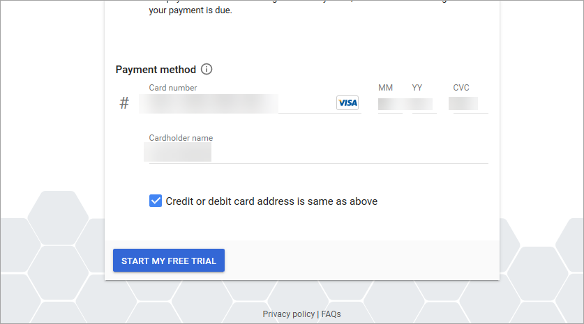

> Check out more information on [how the free Google Cloud trial works](https://cloud.google.com/free/docs/gcp-free-tier) and [how to disable billing](https://cloud.google.com/billing/docs/how-to/manage-billing-account ).

[DONE]
[ACCORDION-END]

[ACCORDION-BEGIN [Step 3: ](Create a cluster)]

Navigate to **Kubernetes Engine -> Clusters**.

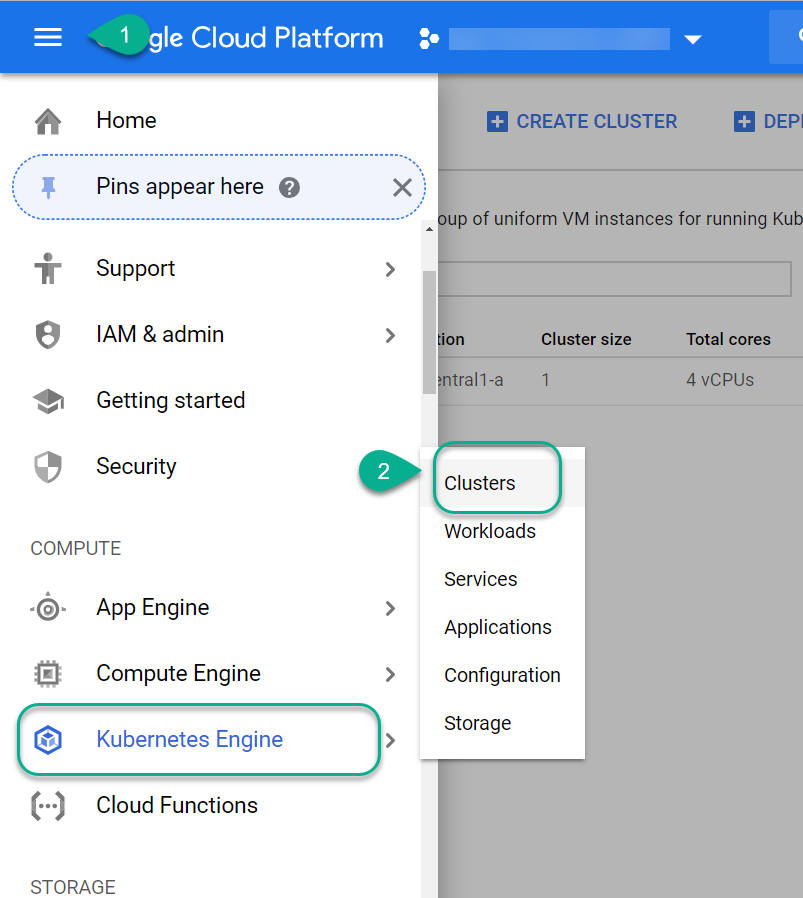

Click **Create a Cluster**.

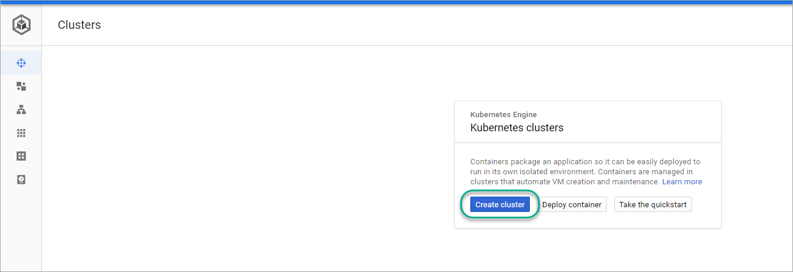

Leave **Standard Cluster** marked.

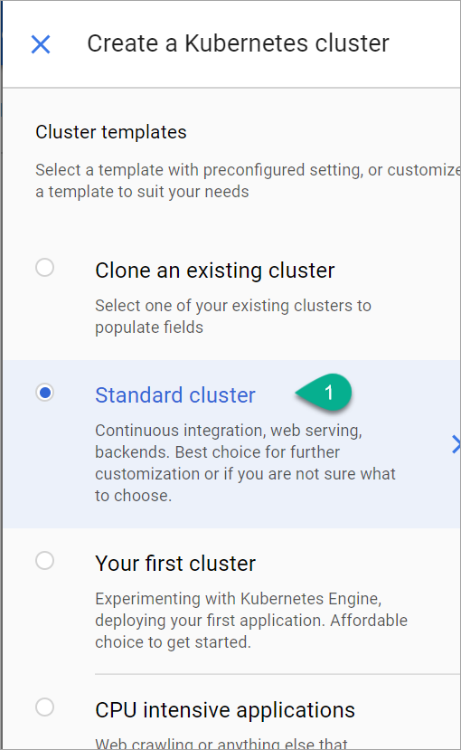

Change the amount of nodes to **1** and choose the configuration with 4 `vCPUs` and 15 GB memory.

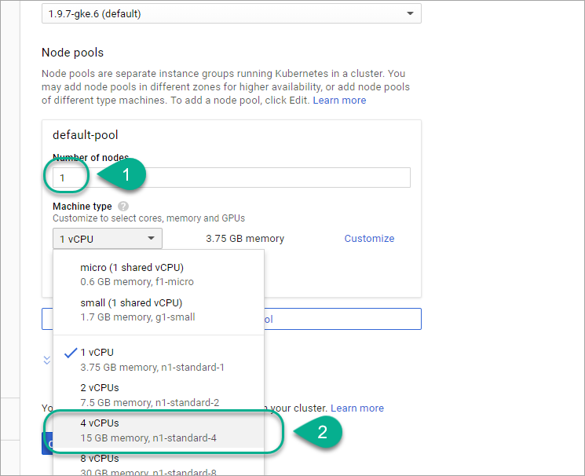

Click **Advanced edit**.

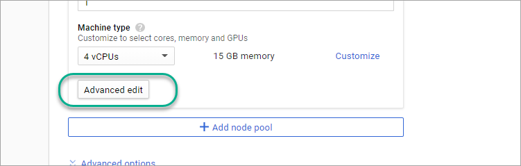

Change the image type to **Ubuntu** and the book disk type to **SSD persistent disk**.

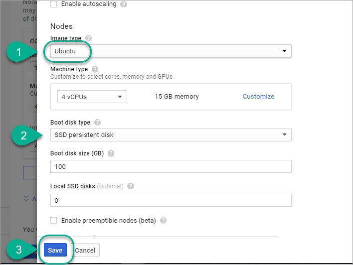

Click **Save**.

**Review** the options. Then click **create**.

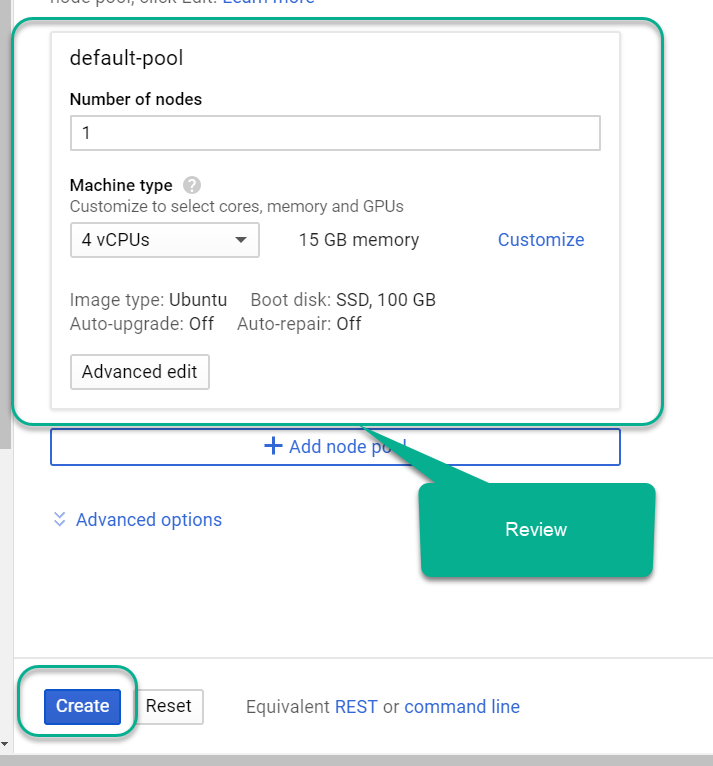


> **What is going on?**

> You're creating a Kubernetes cluster with the computing capacity for SAP HANA, express edition and a web SQL client, SQLPAD, in a single node. The images for these containers will be pulled from the public `Docker` repository and store. The containers will be connected to each other and have some ports exposed to the Internet.


[DONE]
[ACCORDION-END]


[ACCORDION-BEGIN [Step 4: ](Connect to the cluster)]

Deployment takes a couple of minutes. **Refresh the browser** periodically and wait until the cluster is ready.

Once the cluster has been created successfully, click **Connect**.

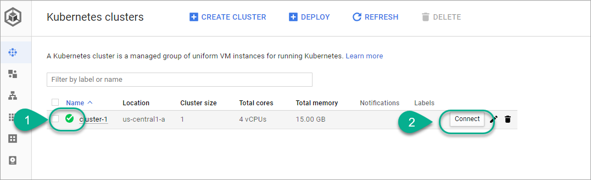

Click **Run in Cloud Shell**.

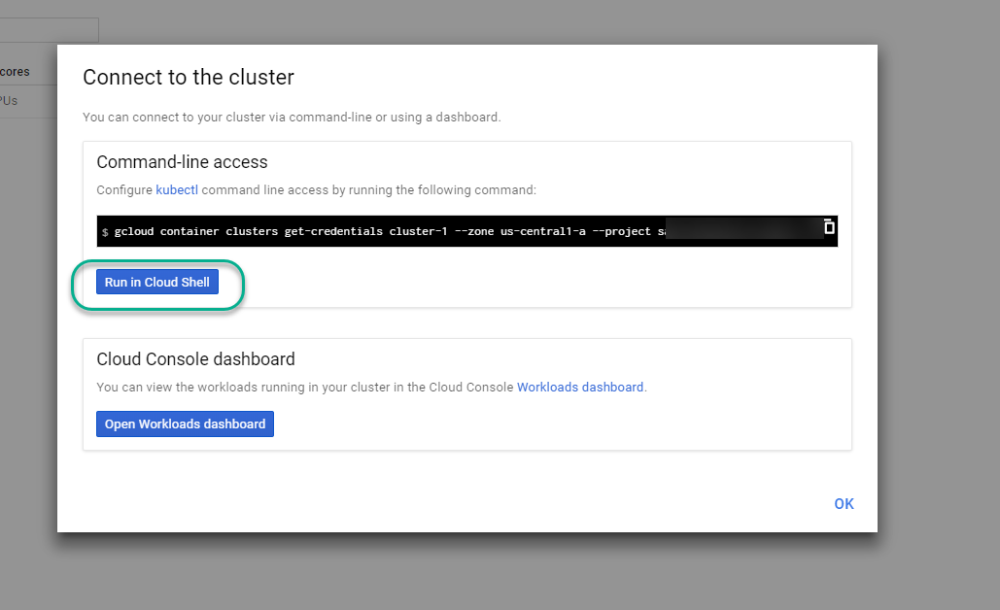

Once the console is open and the command has been copied, press **Enter**.

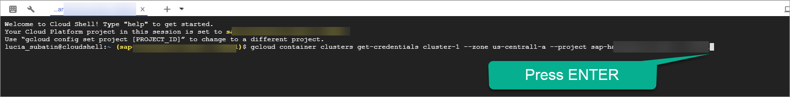

Copy the following command into the command line, and press **Enter** to execute:

```ssh
touch hxe.yaml
```

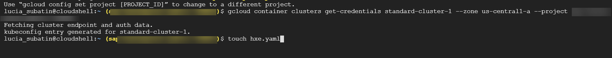

Execute the following command:

```ssh
edit hxe.yaml
```
This will open a new tab with an editor. Agree to **open in editor**.

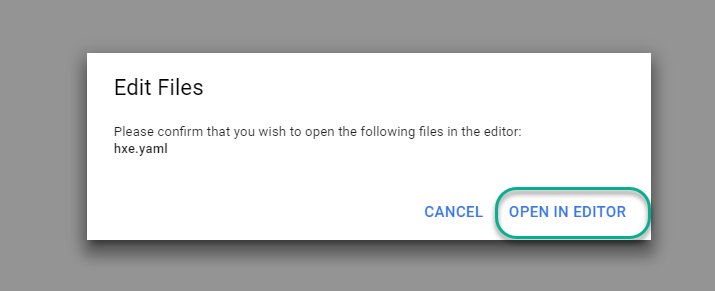

[DONE]
[ACCORDION-END]


[ACCORDION-BEGIN [Step 5: ](Create a deployment file)]

Use the **copy** function in the top right corner for the file below and paste it into the open file:

```text

kind: ConfigMap
apiVersion: v1
metadata:
  creationTimestamp: 2018-01-18T19:14:38Z
  name: hxe-pass
data:
  password.json: |+
    {"master_password" : "HXEHana1"}
---
kind: PersistentVolume
apiVersion: v1
metadata:
  name: persistent-vol-hxe
  labels:
    type: local
spec:
  storageClassName: manual
  capacity:
    storage: 150Gi
  accessModes:
    - ReadWriteOnce
  hostPath:
    path: "/data/hxe_pv"
---
kind: PersistentVolumeClaim
apiVersion: v1
metadata:
  name: hxe-pvc
spec:
  storageClassName: manual
  accessModes:
    - ReadWriteOnce
  resources:
    requests:
      storage: 50Gi
---
apiVersion: apps/v1
kind: Deployment
metadata:
  name: hxe
  labels:
    name: hxe
spec:
  selector:
    matchLabels:
      run: hxe
      app: hxe
      role: master
      tier: backend
  replicas: 1
  template:
    metadata:
      labels:
        run: hxe
        app: hxe
        role: master
        tier: backend
    spec:
      initContainers:
        - name: install
          image: busybox
          command: [ 'sh', '-c', 'chown 12000:79 /hana/mounts' ]
          volumeMounts:
            - name: hxe-data
              mountPath: /hana/mounts
      volumes:
        - name: hxe-data
          persistentVolumeClaim:
             claimName: hxe-pvc
        - name: hxe-config
          configMap:
             name: hxe-pass
      imagePullSecrets:
      - name: docker-secret
      containers:
      - name: hxe-container
        image: "store/saplabs/hanaexpress:2.00.033.00.20180925.2"
        ports:
          - containerPort: 39013
            name: port1
          - containerPort: 39015
            name: port2
          - containerPort: 39017
            name: port3
          - containerPort: 8090
            name: port4
          - containerPort: 39041
            name: port5
          - containerPort: 59013
            name: port6
        args: [ "--agree-to-sap-license", "--dont-check-system", "--passwords-url", "file:///hana/hxeconfig/password.json" ]
        volumeMounts:
          - name: hxe-data
            mountPath: /hana/mounts
          - name: hxe-config
            mountPath: /hana/hxeconfig
      - name: sqlpad-container
        image: "sqlpad/sqlpad"
        ports:
        - containerPort: 3000

---
apiVersion: v1
kind: Service
metadata:
  name: hxe-connect
  labels:
    app: hxe
spec:
  type: LoadBalancer
  ports:
  - port: 39013
    targetPort: 39013
    name: port1
  - port: 39015
    targetPort: 39015
    name: port2
  - port: 39017
    targetPort: 39017
    name: port3
  - port: 39041
    targetPort: 39041
    name: port5
  selector:
    app: hxe
---
apiVersion: v1
kind: Service
metadata:
  name: sqlpad
  labels:
    app: hxe
spec:
  type: LoadBalancer
  ports:
  - port: 3000
    targetPort: 3000
    protocol: TCP
    name: sqlpad
  selector:
    app: hxe

```

The file will be automatically saved.

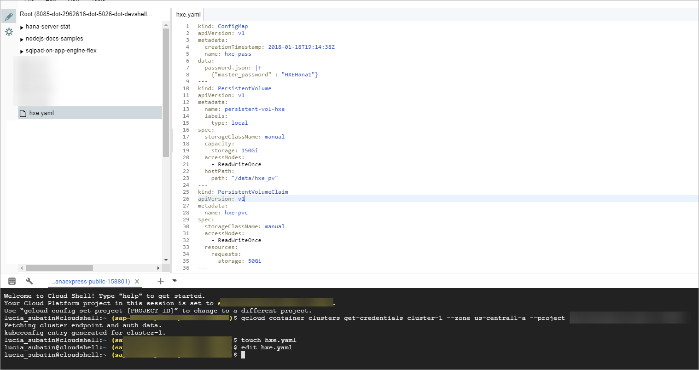

[DONE]
[ACCORDION-END]

[ACCORDION-BEGIN [Step 6: ](Create a Docker secret)]

You'll create a secret with your credentials to log in to Docker and pull the images. If you don't yet have an account, create one by [signing up with Docker](https://store.docker.com/signup).

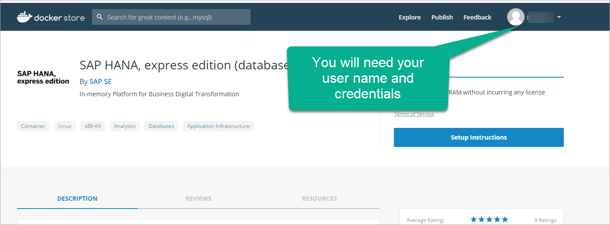

Go back to the Cloud Shell. You will use the console below the editor.

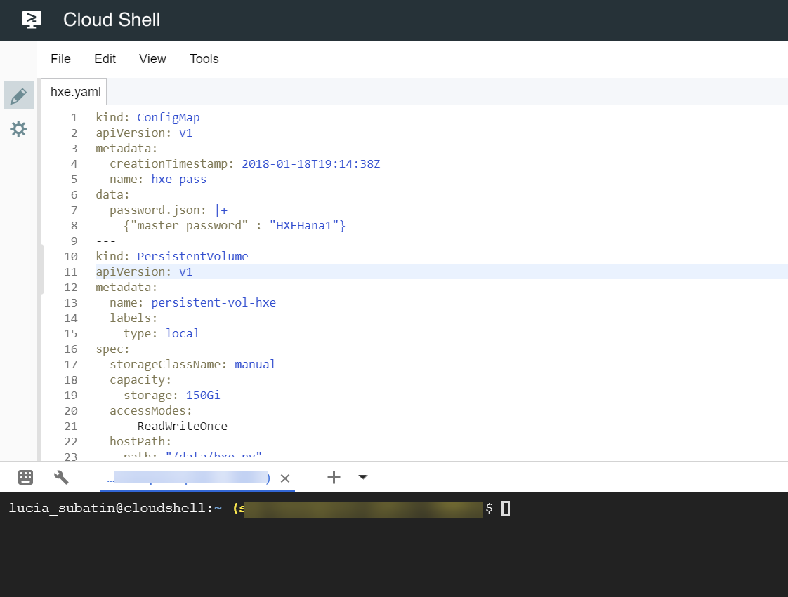

Use your registered email address, account ID and password in Docker to replace the placeholders in the command below:

```text
kubectl create secret docker-registry docker-secret --docker-server=https://index.docker.io/v1/ --docker-username=<<USER_NAME>> --docker-password=<<PASSWORD>> --docker-email=<<EMAIL>>
```
You should get a message saying **secret `docker-secret` created**.

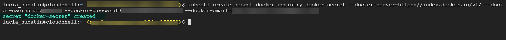

[DONE]
[ACCORDION-END]

[ACCORDION-BEGIN [Step 7: ](Deploy your containers and connect to them)]

You will now use the deployment file (`hxe.yaml`) to create a variety of artifacts. Use the following command to create the artifacts based on the `yaml` file.

```ssh
kubectl create -f hxe.yaml
```

You should get confirmation that the deployment, persistency and additional artifacts have been created.

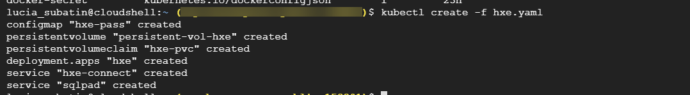

You can check the progress of the creation with the following command:

```ssh
kubectl describe pods
```


Give it a couple of minutes for the database to start. Check out this explanation in the meantime:

> **What is going on?**

> Kubernetes is an open source platform to manage containerized workloads and services. In this case, you have used two containers, one for SAP HANA, express edition and the other for SQLPAD. SAP HANA needs persistency and you want that persistency to remain accessible even if the container disappears.

>This is why you created a persistent volume and attached a portion of it to a container using a claim. With the proper mechanisms, this would also allow you to restore the log and data files in the database from an upgraded version of the Docker container.

> You also want SAP HANA to have some ports accessible from outside the Kubernetes environment. In Kubernetes language, your containers are deployed in a pod. Physically, in this example, these are the two Docker containers in a virtual machine. Within the pod, containers can connect to each other but you want to be able to access SQLPAD from the external network.

>Services provide a mechanism to define a policy to access the pod from the outside world and expose specific ports for each of the applications. For example, SAP HANA express edition will be listening to JDBC connections on port 39041 while SQLPAD will be listening for web requests on port 3000

> 

Use the following command to get the name of the pod that has been created:

```ssh
kubectl get pods
```
Use the name of the pod in the command below to access the database:

```ssh
kubectl exec -it <<POD>> bash
```

For example:

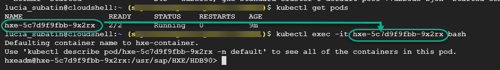

**Congratulations!** You are now connected to your instance of SAP HANA, express edition.

[DONE]
[ACCORDION-END]

[ACCORDION-BEGIN [Step 8: ](Log in and configure the database)]

You'll now configure your database for the advanced analytic features to work.

First, import the file with data for the document store using the following command:

```ssh
 wget -O ./work/json.csv https://raw.githubusercontent.com/SAPDocuments/Tutorials/master/tutorials/gcp-hxe-evt-gke-2/json.csv
```
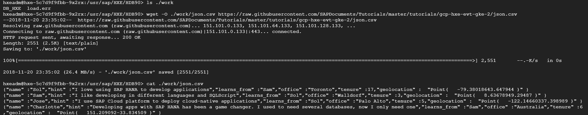

Log in to the SQL console using the following command:

```sql
hdbsql -i 90 -d systemdb -u SYSTEM -p HXEHana1
```

Use the following command to enable the document store:

```sql
alter database HXE add 'docstore';
```

Use `quit` to exit the SQL command line and `exit`.

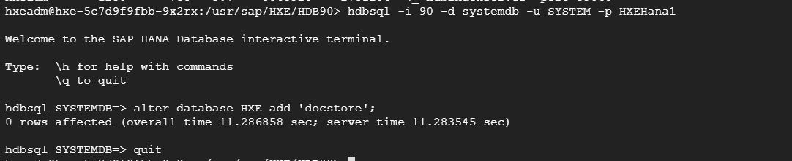

Finally, type **exit** to leave the container.

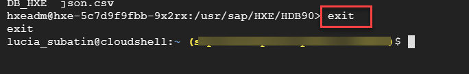

[DONE]
[ACCORDION-END]

[ACCORDION-BEGIN [Step 9: ](Connect to the database using the SQL client)]

Use the following command to get the services that expose your connections to the database and the SQL client:

```text
kubectl get services
```
**Copy** the external IP address from the previous command for the service called `sqlpad`.


**Open a new tab**. Paste the IP address followed by port 3000.

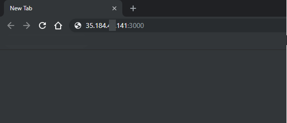

Hit **Enter** and click on **Sign up**.

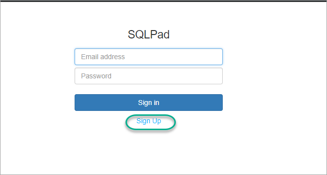

Use the following credentials to set up the administration access:

| Email | Password |
|:------|:---------|
| `admin@email` | `HanaRocks` |

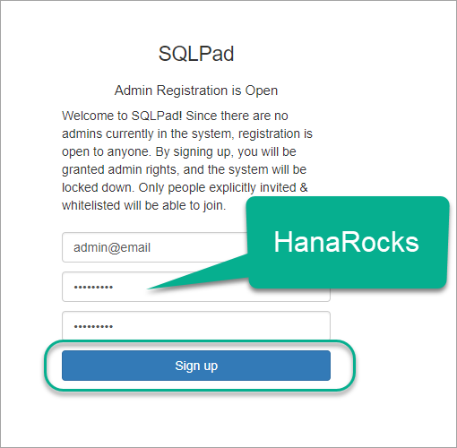

Repeat the credentials to log in.

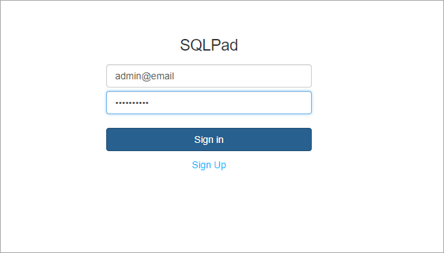

Click `admin > Connections` on the right-upper corner.

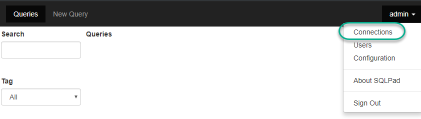

Click **New Connection**.

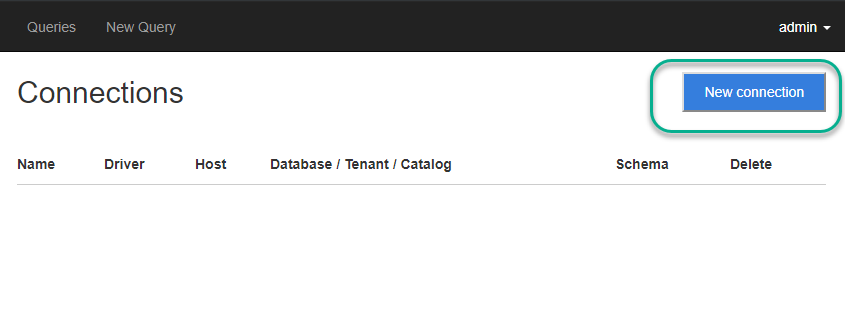

Call it `HANA` and choose the SAP HANA driver.

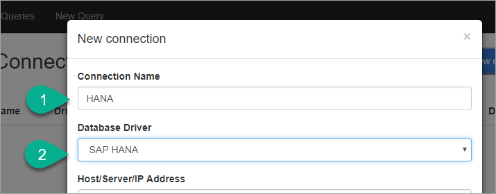

Go back to the cloud console.  **Copy the external IP address** for the service `hxe-connect`.


Paste it into the `Host Server IP address` and complete the rest of the fields to access your tenant database.


Click **Save**. Then click **New Query**.

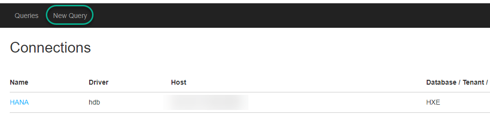

You should see the schemata on the left side panel indicating the connection has been successful.

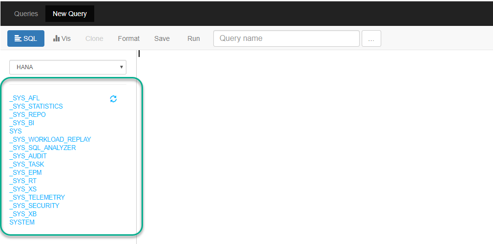

> **Errors?** Make sure you are using the external IP address for SAP HANA and that there are no spaces before or after the IP address or port.

[DONE]
[ACCORDION-END]

[ACCORDION-BEGIN [Step 10: ]( NoSQL time! Create a JSON document store)]

In SQLPAD, statements need to be executed **one by one**. You can do this by **selecting the statement** first and then pressing **run**.

Create a collection first using the following command:

```sql
create collection hints;
```
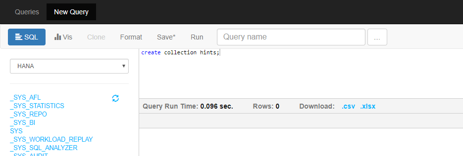

> You are using the SYSTEM user and its schema for convenience purposes. The recommended approach for productive databases is to create development users and deactivate the SYSTEM user. [More information in the security guide](https://help.sap.com/viewer/b3ee5778bc2e4a089d3299b82ec762a7/2.0.03/en-US/c511ddf1767947f0adfc9636148718d9.html)

Use the following statement to import data into your document store:

```sql
IMPORT FROM CSV FILE '/usr/sap/HXE/HDB90/work/json.csv' INTO system.hints WITH batch 2 threads 10 RECORD DELIMITED BY '\n' FIELD DELIMITED BY ',' optionally enclosed by '""'  ERROR LOG '/usr/sap/HXE/HDB90/work/load.err';

```
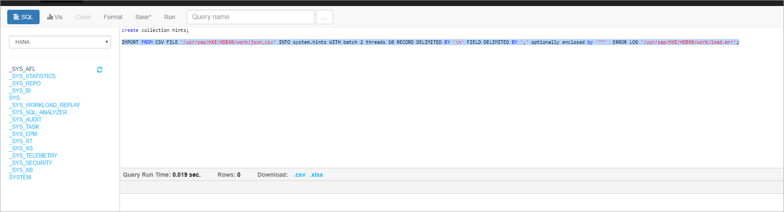

> **What is going on?**

> Document store allows you to store all of the information related to the same record in the same document. These documents do not have a predefined format or number of fields like a table.

> Here is a sample document you inserted in the document store with the import command:

> 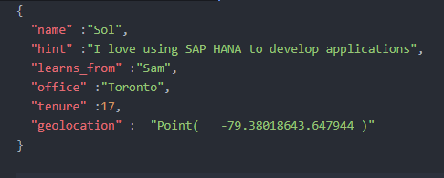
> &nbsp;
> Document stores do not have tables or schemas, they use collections and documents. Documents in the same collection may have different structures and data types.
> &nbsp;
> This is particularly useful when relationships across documents are not too relevant and data structure needs to be flexible. For example, data for user accounts where fields like the phone number may not be entered and may not be stored at all. In this same scenario, there is no need for foreign keys and relations between the user records.
> &nbsp;
> This type of database is also referred to as `NoSQL` because data operations are not performed using SQL in other platforms. However, SAP HANA uses SQL for CRUD operations in JSON document store.
> &nbsp;
> For more information about the document store in SAP HANA, [refer to the help](https://help.sap.com/viewer/6b94445c94ae495c83a19646e7c3fd56/2.0.03/en-US/5e783b7f5a9749bcbfffe167524aeccc.html)

Use the following statement to complete the validation below:


```sql
 select TO_NVARCHAR("hint"), TO_NVARCHAR("office") from hints where "name"  = 'Maria';
```

[VALIDATE_1]
[ACCORDION-END]

[ACCORDION-BEGIN [Step 11: ]( SQL time! Select people in the community with at least one year of experience)]

Free resources, like this tutorial, are a great way to get started. People in the community with more experience are often willing to help you on your learning journey. For our developer Thomas, choosing people with more experience means that he can get up to speed quickly.

You will select people whose experience is 2 years or more. You'll also need to move those records into a columnar table so that you can perform advanced analytics that are only available in the columnar store.

Create the columnar table first:

```sql
create column table "DEVS"
  (
  "DEVNAME" nvarchar(100) PRIMARY KEY,
  "LEARNS_FROM" nvarchar(100),
  "HINT_TEXT" text FAST PREPROCESS OFF ASYNC,
  "CITY" nvarchar(100),
  "LON_LAT" nvarchar(200)
);
```
> Note the columnar table has a text index on the field `HINT_TEXT`.

Insert the data from the documents store into the columnar table, filtering out community members with tenure below 1 year:

```sql
insert into "DEVS"
select "name", "learns_from", "hint", "office", , "geolocation"
	from hints where to_bigint("tenure") > 1
```

Count the inserted records in the new columnar table:

```sql
select count(*) from "DEVS";
```

Insert the result of the previous SQL command in the box below to complete the following validation:

[VALIDATE_2]
[ACCORDION-END]

[ACCORDION-BEGIN [Step 12: ](Use linguistic text search to find developers who can help)]

There are plenty of different ways to work with SAP HANA. Some developers are interested in its analytics, some keep it running smoothly through system and database administration, and others use it to create data-driven applications. In order to help Thomas, you'll need to look for people who like to develop applications.

You'll use a linguistic text search to find out who has said anything related developing applications.

```SQL
select "DEVNAME", TO_NVARCHAR("HINT_TEXT"), "LEARNS_FROM"
  from "DEVS"
  where contains(hint_text, 'develop', linguistic)
```
Notice how the linguistic search brings all records containing the verb `develop` as a stem.

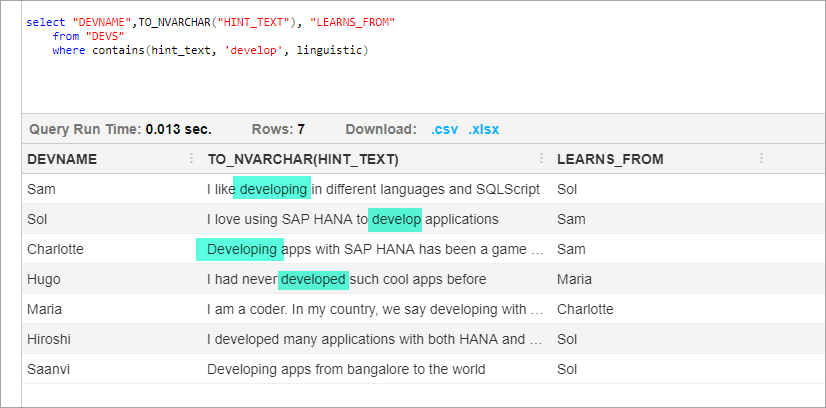

> Other functions such as fuzzy search, text mining and sentiment analysis can be applied using the text engine in SAP HANA. To learn more about linguistic and other types of search, visit [the official documentation](https://help.sap.com/viewer/691cb949c1034198800afde3e5be6570/2.0.00/en-US/83dc5e659691429f85e8eb02b50a9260.html)

You'll use these results to create a table to show who learns from whom. This table will be used to create a graph workspace. Create it using the following SQL statement:

```sql
create column table learning_relation (
	"ID" int generated always as identity(start with 10 increment by 1) unique not null,
	"SOURCE" NVARCHAR(100) not null,
    "TARGET" NVARCHAR(100) not null
);
```

Insert the records into the new table:

```sql
insert into learning_relation
(source, target)
select learns_from, devname from devs
```
How many records were inserted into the new table?

[VALIDATE_3]
[ACCORDION-END]

[ACCORDION-BEGIN [Step 13: ](Use Graph to find out who learns from whom)]

Now that you have a table populated with learning relationships and expert developers in the community, you can find out how these people are related to each other. One of the ways to represent a network of people is by using a graph database.

In SAP HANA, graphs are represented by vertices (in this example, developers) and edges (the connections between them, taken from the field `learns_from`).


> Find more information about the graph data model in the [SAP HANA reference](https://help.sap.com/viewer/f381aa9c4b99457fb3c6b53a2fd29c02/2.0.00/en-US/7734f2cfafdb4e8a9d49de5f6829dc32.html) and [how to apply to text analytics](https://help.sap.com/viewer/62e301bb1872437cbb2a8c4209f74a65/2.0.02/en-US/f585411bd05c49c58bdd2b99710f66c3.html).

Create a graph workspace to define a graph in terms of tables and columns:

```sql
CREATE GRAPH WORKSPACE "HANA_GRAPH"
	edge table "LEARNING_RELATION"
	    SOURCE COLUMN "SOURCE"
	    TARGET COLUMN "TARGET"
	    KEY COLUMN "ID"
	VERTEX TABLE "DEVS"
	    KEY COLUMN "DEVNAME";

```

There are some known algorithms to apply on a graph. One of them is the `strongly connected components`. As this is a directed graph (the `learns_from` establishes has a direction from one node to the other), you can establish an index with the most strongly connected members.

In this example, you'll find those developers to whom most other developers in the community are connected. In turn, others can learn from them directly or indirectly.

One of the methods to execute calculations on graph workspaces is through a calculation node. You can create these graphically in SAP Web IDE for SAP HANA, as well as by using SQL and an XML definition.

```sql
CREATE CALCULATION SCENARIO "HANA_GRAPH_CS" USING '
<?xml version="1.0"?>
<cubeSchema version="2" operation="createCalculationScenario" defaultLanguage="en">
  <calculationScenario schema="SYSTEM" name="HANA_GRAPH_CS">
    <calculationViews>
      <graph name="cs_node" defaultViewFlag="true" schema="SYSTEM" workspace="HANA_GRAPH" action="GET_STRONGLY_CONNECTED_COMPONENTS">
        <expression>
        </expression>
        <viewAttributes>
          <viewAttribute name="DEVNAME" datatype="string"/>
          <viewAttribute name="COMPONENT" datatype="int"/>
        </viewAttributes>
      </graph>
    </calculationViews>
  </calculationScenario>
</cubeSchema>
' WITH PARAMETERS ('EXPOSE_NODE'=('cs_node', 'HANA_GRAPH_CS'));

```
You can now use the calculation scenario. The highest index returned by the algorithm indicates the strongest connected component.

```sql
SELECT * FROM "HANA_GRAPH_CS" ORDER BY "COMPONENT" DESC;
```

[VALIDATE_4]
[ACCORDION-END]

[ACCORDION-BEGIN [Step 14: ](Find the closest geographical location)]

So far, you've found the most connected developers with two or more years of experience, plus an interest in developing applications. Now find out who is closest to Thomas, so that they can meet him at the next community event.

Thomas is located in Munich, Germany. The geolocation is longitude:  11.569299 latitude: 48.145130


Use the following query to calculate distance to Thomas' location:

```sql
select devname, st_geomFromText( 'Point( 11.569299 48.145130 )', 4326).st_distance(st_geomFromtext( devs.lon_lat, 4326), 'meter') / 1000 as DISTANCE_KM
  from "DEVS"
  where contains(hint_text, 'develop', linguistic)
    order by distance_km asc
```

[VALIDATE_5]
[ACCORDION-END]

[ACCORDION-BEGIN [Step 15: ](Who can help me get started?)]

Congratulations on helping Thomas find and collaborate with other developers!

Here's how you can get started with any developer-focused topic in SAP HANA and more:

-   **SAP Developer Center**: You'll find plenty of free downloads and missions to help you with different topics on developers.sap.com. You can learn new topics like [geospatial](https://developers.sap.com/group.hana-aa-spatial-get-started.html) or switch to a full SAP HANA, express edition image with XS Advanced, to [create cloud native applications with micro-services](https://developers.sap.com/mission.xsa-get-started.html)
-   **The community**: Fellow developers write about their experiences and recommendations in [blog posts](https://blogs.sap.com), and many are willing to answer your questions [in the Q&A](https://answers.sap.com/index.html)
-   **Community events**: You can also check out [events](https://community.sap.com/events) closest to you in order to meet other developers.


[DONE]
[ACCORDION-END]


---
