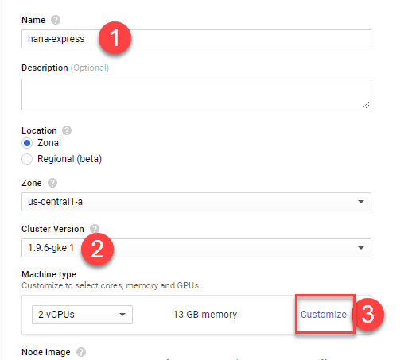
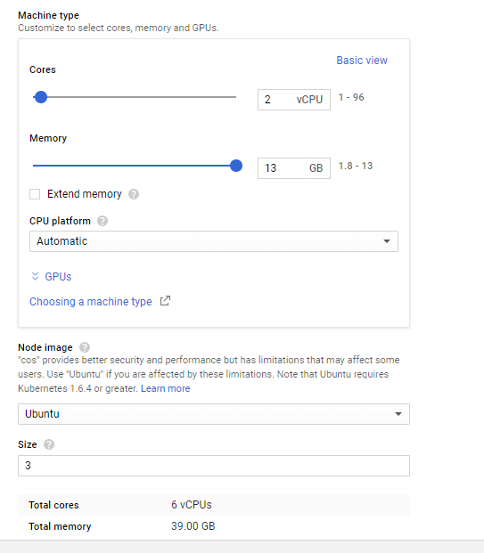
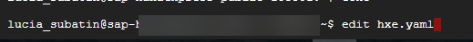
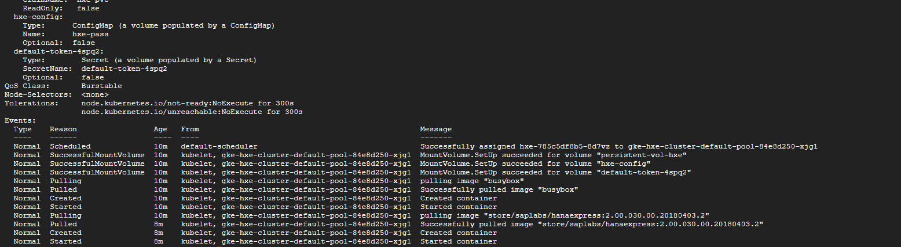
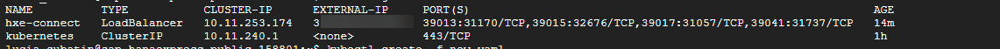

## Prerequisites  
 - **Proficiency:** Beginner

## Details
### You will learn  
This tutorial will guide you through the creation and configuration of a Kubernetes cluster on Google Kubernetes Engine (GKE). You will then learn how to connect to SAP HANA, express edition running on the pods. The configurations provided here should also work on other Kubernetes orchestrators such as Azure Kubernetes Service or Amazon EKS.

The image used in this tutorial is the **database server only**. The Extended Application Services, advanced and classic models (XS Advanced or XS Classic), are not included in the image pulled here.

## Disclaimer
SAP HANA, express edition (HXE) is officially supported on SLES. SAP Community members have been successful in running HXE on other Linux operating systems that are not formally supported by SAP, such as Red Hat, Ubuntu, openSUSE and Fedora. SAP is not committing to resolving any issues that may arise from running HXE on these platforms.

### Time to Complete
**15 Min**

---

[ACCORDION-BEGIN [Step 1: ](Create a new Kubernetes cluster)]
Create an account or log into the [Google Cloud Platform console](https://console.cloud.google.com). If you do not have one, follow the steps to create a new project and enable the necessary APIs as detailed in this [`quickstart` from Google](https://cloud.google.com/kubernetes-engine/docs/quickstart):


Once there, use the menu on the top left corner to navigate a new Kubernetes cluster from the `Kubernetes Engine` menu.


Click **Create cluster**.


[ACCORDION-END]

[ACCORDION-BEGIN [Step 2: ](Configure your Kubernetes cluster)]

Fill in the basic details as per your preferences, and click **Customize**.



Configure the minimum requirements for your nodes. The **minimum** requirements for each container with the server-only Docker image for SAP HANA, express edition are:

- 2 `vCPU`
- 8 GB RAM
- Ubuntu operating system

If you are planning on running multiple containers per pod, you can adjust accordingly. This example is based on a single container per pod.



>Note: You can only run only one container with SAP HANA, express edition per pod.

Review the other options, scroll down, and click **Create**.

[ACCORDION-END]


[ACCORDION-BEGIN [Step 3: ](Connect to your cluster)]

Once the cluster has finished deploying, click **Connect**.


Use **Run in Cloud Shell** to connect from the web console.


>Note: Alternatively, you can download the Google Cloud SDK and execute the commands locally.

This will open a `gcloud` console with a command ready to connect to the cluster in your project and selected zone. Hit **enter** to execute the command.


[ACCORDION-END]

[ACCORDION-BEGIN [Step 4: ](Create the deployment configuration files)]

Go back to the `gcloud` console for your cluster.


In order to authenticate with `Docker` and pull the image, you will need to create a secret. Use the following command, with your logon data for `Docker`. If you do not have an account yet, you can [create one for free](https://store.docker.com/images/sap-hana-express-edition/plans/f2dc436a-d851-4c22-a2ba-9de07db7a9ac?tab=instructions)

```ssh
kubectl create secret docker-registry docker-secret --docker-server=https://index.docker.io/v1/ --docker-username=<<DOCKER_USER>> --docker-password=<<DOCKER_PASSWORD>> --docker-email=<<DOCKER_EMAIL>>
```

For example:


From the console, use the following command to create a new file:

```
edit hxe.yaml
```


This will open an online editor where you will paste the contents of the file below.

**Replace** the path to password file with the one you have just created considering the following rules:


> ### **Note: Please check the password policy to avoid errors**
>
> SAP HANA, express edition requires a very strong password that complies with these rules:
>
> - At least 8 characters
> - At least 1 uppercase letter
> - At least 1 lowercase letter
> - At least 1 number
> - Can contain special characters, but not _&grave;_ (backtick), _&#36;_ (dollar sign),  _&#92;_ (backslash), _&#39;_ (single quote), or _&quot;_ (double quotes)
> - Cannot contain dictionary words
> - Cannot contain simplistic or systematic values, like strings in ascending or descending numerical or alphabetical order

Replace the password in the new file using the provided rules.

```text
kind: ConfigMap
apiVersion: v1
metadata:
  creationTimestamp: 2018-01-18T19:14:38Z
  name: hxe-pass
data:
  password.json: |+
    {"master_password" : "HXEHana1"}
`---`
kind: PersistentVolume
apiVersion: v1
metadata:
  name: persistent-vol-hxe
  labels:
    type: local
spec:
  storageClassName: manual
  capacity:
    storage: 150Gi
  accessModes:
    - ReadWriteOnce
  hostPath:
    path: "/data/hxe_pv"
`---`
kind: PersistentVolumeClaim
apiVersion: v1
metadata:
  name: hxe-pvc
spec:
  storageClassName: manual
  accessModes:
    - ReadWriteOnce
  resources:
    requests:
      storage: 50Gi
`---`
apiVersion: apps/v1
kind: Deployment
metadata:
  name: hxe
  labels:
    name: hxe
spec:
  selector:
    matchLabels:
      run: hxe
      app: hxe
      role: master
      tier: backend
  replicas: 1
  template:
    metadata:
      labels:
        run: hxe
        app: hxe
        role: master
        tier: backend
    spec:
      initContainers:
        - name: install
          image: busybox
          command: [ 'sh', '-c', 'chown 12000:79 /hana/mounts' ]
          volumeMounts:
            - name: hxe-data
              mountPath: /hana/mounts
      volumes:
        - name: hxe-data
          persistentVolumeClaim:
             claimName: hxe-pvc
        - name: hxe-config
          configMap:
             name: hxe-pass
      imagePullSecrets:
      - name: docker-secret
      containers:
      - name: hxe-container
        image: "store/saplabs/hanaexpress:2.00.030.00.20180403.2"
        ports:
          - containerPort: 39013
            name: port1
          - containerPort: 39015
            name: port2
          - containerPort: 39017
            name: port3
          - containerPort: 8090
            name: port4
          - containerPort: 39041
            name: port5
          - containerPort: 59013
            name: port6
        args: [ "--agree-to-sap-license", "--dont-check-system", "--passwords-url", "file:///hana/hxeconfig/password.json" ]
        volumeMounts:
          - name: hxe-data
            mountPath: /hana/mounts
          - name: hxe-config
            mountPath: /hana/hxeconfig
`---`
apiVersion: v1
kind: Service
metadata:
  name: hxe-connect
  labels:
    app: hxe
spec:
  type: LoadBalancer
  ports:
  - port: 39013
    targetPort: 39013
    name: port1
  - port: 39015
    targetPort: 39015
    name: port2
  - port: 39017
    targetPort: 39017
    name: port3
  - port: 39041
    targetPort: 39041
    name: port5
  selector:
    app: hxe
```

The file will be automatically saved to your home directory (`/home/YOUR_GOOGLE_ID`).

[ACCORDION-END]

[ACCORDION-BEGIN [Step 5: ](Deploy a HANA Express docker container on your Docker pod)]

Use the following command to deploy the image on your pods and check deployment:

```
kubectl create -f hxe.yaml
kubectl describe pods
```

Initially, you will probably see a message stating that the image is being pulled. repeat the command a couple of minutes later until you see the container is started:

  

The following command will provide the name of the pod created by the deployment configuration:

```
kubectl get pods
```
Use the name of the pod form the previous command to check additional logs or log in to the database
```
kubectl logs <<pod resulting from above command>>
kubectl exec -it <<name of pod resulting from above command>> bash
```


Once in the container, you can check SAP HANA, express edition is running using `HDB info`.

  

You can edit the name in the `yaml` to deploy additional containers in empty nodes.

[ACCORDION-END]

[ACCORDION-BEGIN [Step 6: ](Check your external IP address to connect to SAP HANA, express edition)]

Since you are using a service to expose the ports in case you want to connect with external tools, such as `DBeaver`, you can see the external IP assigned to your container using

```
kubectl get services
```

>Note: The default port for SYSTEMDB in the Docker container is 39017 and for the default tenant, `HXE` the port is 39041.

  

[ACCORDION-END]
