## Prerequisites  
 - **Proficiency:** Beginner

## Details
### You will learn  
This tutorial will guide you through the creation and configuration of a Kubernetes cluster on Google Kubernetes Engine (GKE). You will then learn how to connect to SAP HANA, express edition running on the pods.

The currently available image includes the **database server only**. The Extended Application Services, advanced and classic models (XS Advanced or XS Classic) are not included.

## Disclaimer
SAP HANA, express edition (HXE) is officially supported on SLES. SAP Community members have been successful in running HXE on other Linux operating systems that are not formally supported by SAP, such as Red Hat, Ubuntu, `OpenSUSE` and Fedora. SAP is not committing to resolving any issues that may arise from running HXE on these platforms.

### Time to Complete
**15 Min**

---

[ACCORDION-BEGIN [Step 1: ](Create a new Kubernetes cluster)]

Create an account or Log in to the [Google Cloud Platform console](https://console.cloud.google.com) . If you do not have one, follow the steps to create a new project and enable the necessary APIs as detailed in this [`quickstart` from Google](https://cloud.google.com/kubernetes-engine/docs/quickstart):

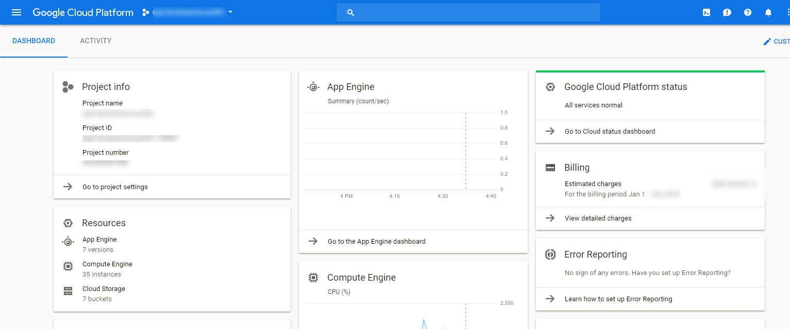

Once there, use the menu on the top left corner to navigate a new Kubernetes cluster from the `Kubernetes Engine` menu:

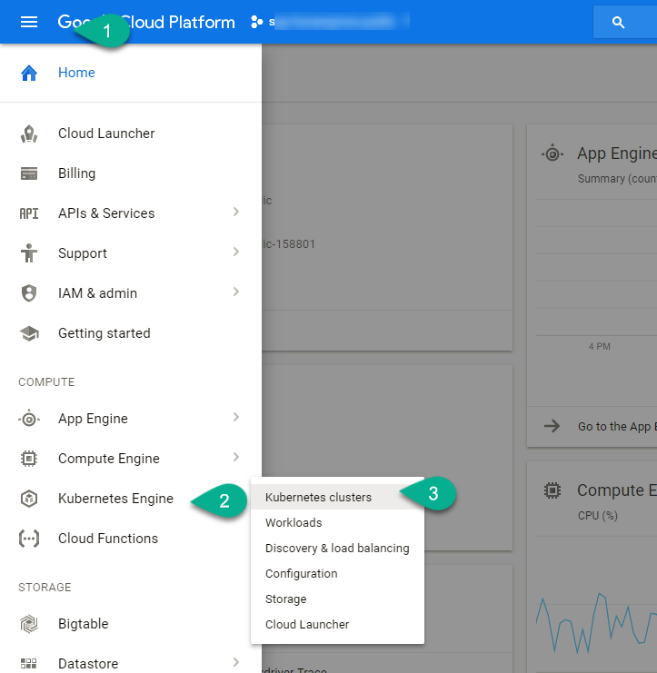

Click on **Create cluster**


[ACCORDION-END]

[ACCORDION-BEGIN [Step 2: ](Configure your Kubernetes cluster)]

Fill in the basic details as per your preferences and click on **Customize**

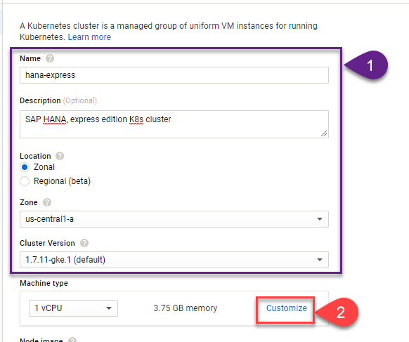

Configure the minimum requirements for your nodes. The **minimum** requirements for each container are
- 4 `vCPU`
- 8 GB RAM
- Ubuntu operating system

If you are planning on running multiple containers per pod, you can adjust accordingly. This example is based on a single container per pod.

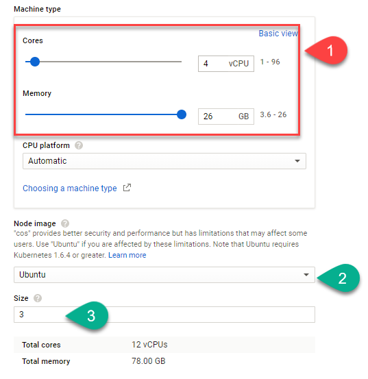

>Note: You can only run only one container with SAP HANA, express edition per pod.

Review the other options, scroll down and click on **Create**

[ACCORDION-END]


[ACCORDION-BEGIN [Step 3: ](Connect to your cluster)]

Once the cluster has finished deploying, click on **Connect**

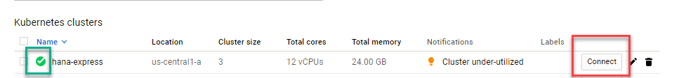

Use **Run in Cloud Shell** to connect from the web console:

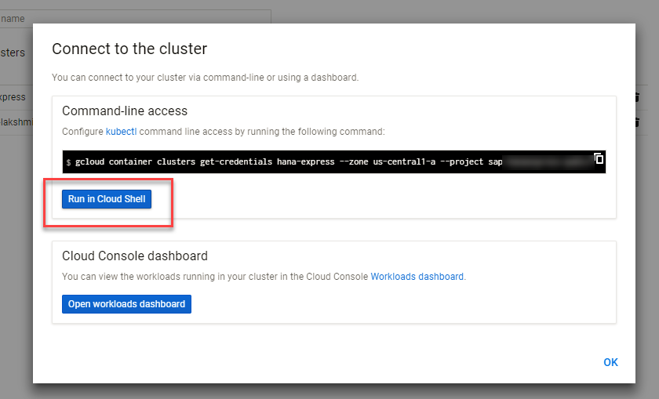

>Note: Alternatively, you can download the Google Cloud SDK and execute the commands locally.

This will open a `Gcloud` console with a command ready to connect to the cluster in your project and selected zone. Hit **enter** to execute the command:

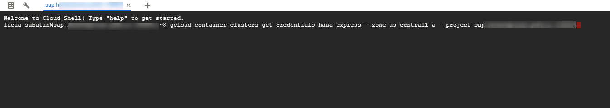

Use command `kubectl get nodes` to list the nodes and their status:

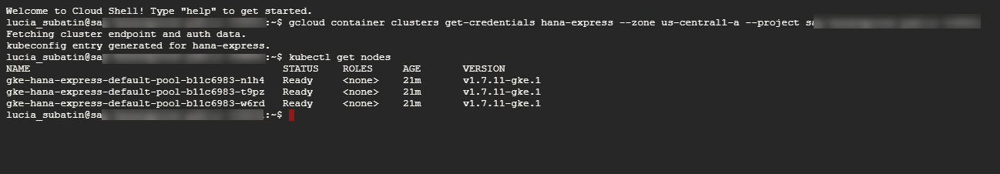

[ACCORDION-END]

[ACCORDION-BEGIN [Step 4: ](Prepare the nodes)]

For the time being, you will need to manually create and mount a persistent directory in each of the nodes.

Navigate to the Virtual Machines


Find the nodes corresponding to your cluster and use the **SSH** button to open a console. You will need to enter the following commands in each of the nodes.

```ssh
sudo mkdir -p /data/hxe_pv
sudo chown 12000:79 /data/hxe_pv
```

For example:


Create a configuration file with a password of your choice. This password will be set to the administration users (e.g., SYSTEM) in your SAP HANA instances.

Use the following command to open a text editor and create a file for your password:

```ssh
sudo nano /data/hxe_pv/password.json
```

Replace the sample password, `HXEHana1` with the password you have chosen and make sure it complies with the password rules described below.  

```ssh
{
	"master_password" : "HXEHana1"
}

```

> ### **Note: Please check the password policy to avoid errors**
>
> SAP HANA, express edition requires a very strong password that complies with these rules:
>
> - At least 8 characters
> - At least 1 uppercase letter
> - At least 1 lowercase letter
> - At least 1 number
> - Can contain special characters, but not _&grave;_ (backtick), _&#36;_ (dollar sign),  _&#92;_ (backslash), _&#39;_ (single quote), or _&quot;_ (double quotes)
> - Cannot contain dictionary words
> - Cannot contain simplistic or systematic values, like strings in ascending or descending numerical or alphabetical order

&nbsp;

Once you have finished editing the file, press `Ctrl+O` and `Ctrl+X` to save the file and exit the editor.


Change the permissions to the password file with the following commands:

```ssh
sudo chmod 600 /data/hxe_pv/password.json
sudo chown 12000:79 /data/hxe_pv/password.json
```

> ### **Repeat this step for each of the nodes**
> You can copy and paste from one Google web SSH console to the other. The names of the files and password need to remain the same

[ACCORDION-END]

[ACCORDION-BEGIN [Step 5: ](Create the deployment configuration files)]

Go back to the `Gcloud` console for your cluster:


In order to authenticate with `Docker` and pull the image, you will need to create a secret. Use the following command, with your logon data for `Docker`. If you do not have an account yet, you can [create one for free](https://store.docker.com/images/sap-hana-express-edition/plans/f2dc436a-d851-4c22-a2ba-9de07db7a9ac?tab=instructions)

```ssh
kubectl create secret docker-registry docker-secret --docker-server=https://index.docker.io/v1/ --docker-username=<<DOCKER_USER>> --docker-password=<<DOCKER_PASSWORD>> --docker-email=<<DOCKER_EMAIL>>
```

For example:


Both the secret and the password file are used in the configuration file below. Locally on your computer, create a text file called `hxe.yaml` with the following content. **Replace** the path to password file with the one you have just created:

```text
apiVersion: v1
kind: Pod
metadata:
  name: hxe-pod
  labels:
    name: hxe-pod
#  annotations:
#    security.alpha.kubernetes.io/unsafe-sysctls: kernel.shmmax=1073741824,kernel.shmall=8388608,kernel.shmmni=8192
spec:
  containers:
  - name: hxe-container
    image: "store/saplabs/hanaexpress:2.00.022.00.20171211.1"
    ports:
      - containerPort: 39013
        name: port1
      - containerPort: 39015
        name: port2
      - containerPort: 39017
        name: port3
      - containerPort: 8090
        name: port4
      - containerPort: 39041
        name: port5
      - containerPort: 59013
        name: port6
    args: [ "--agree-to-sap-license", "--dont-check-system", "--passwords-url", "file:///hana/mounts/password.json" ]
    volumeMounts:
      - name: hxe-data
        mountPath: /hana/mounts
  restartPolicy: OnFailure
  volumes:
  - name: hxe-data
    hostPath:
      path: /data/hxe_pv
  imagePullSecrets:
  - name: docker-secret
```

Save it and use the **Upload file** tool to upload it to your cluster.

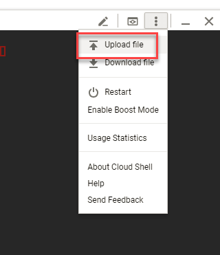  

The file will be uploaded to your home directory (`/home/YOUR_GOOGLE_ID`)

[ACCORDION-END]

[ACCORDION-BEGIN [Step 5: ](Deploy a HANA Express docker container on your `Docker` pod)]

Use the following command to deploy the image on your pods and check deployment:

```
kubectl create -f hxe.yaml
kubectl describe pod hxe-pod
```
If you scroll down, you will probably see a message stating that the image is being pulled.

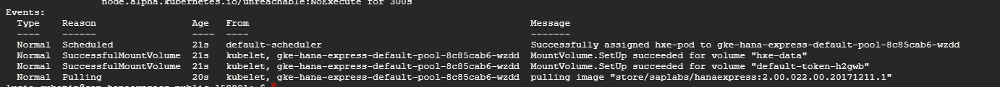  

Repeat the command `kubectl describe pod hxe-pod` until you see the container has started:

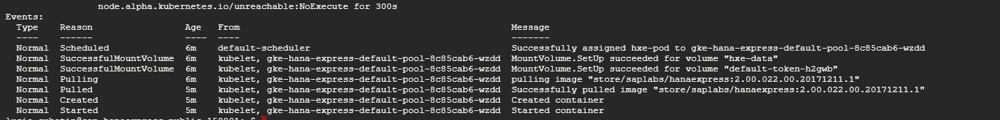  

The following command will give you more information about deployment and the `exec` command will log you into the container

```
kubectl logs hxe-pod
kubectl exec -it hxe-pod bash
```

Once in the container, you can check SAP HANA, express edition is running using `HDB info`:

  

You can edit the name in the `yaml` to deploy additional containers in empty nodes.

[ACCORDION-END]
