## Prerequisites  
 - **Proficiency:** Beginner | Intermediate | Advanced
 - Create an account in [MS Azure](https://portal.azure.com/)


## Next Steps
-  **Build your first app:** [Get started with XS Advanced development](https://developers.sap.com/mission.xsa-get-started.html)
- [Explore the basic tools in the XS Advanced platform](https://developers.sap.com/tutorials/xsa-explore-basics.html)
- [Review SAP HANA, express edition content, tutorials and quick start guides](https://developers.sap.com/topics/hana.html)

## Details
### You will learn  
This tutorial will guide you through the provisioning and setup of SAP HANA, express edition, on Microsoft Azure including the Extended Application Services, advanced model.

### Time to Complete
**15 Min**

---

[ACCORDION-BEGIN [Step 1: ](Choose your instance)]

Connect to your account in [MS Azure](https://portal.azure.com/) and click **Create a resource**

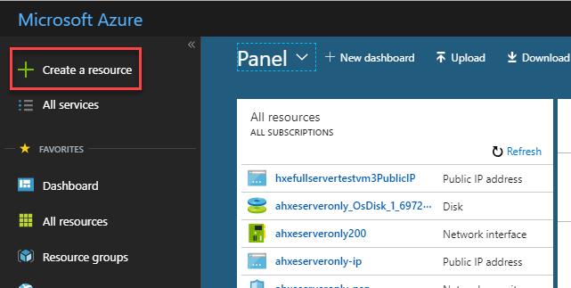

You will be presented with **two options**:

- **SAP HANA, express edition (server-only)**: You can connect using SQL clients like SAP HANA Studio or any other client. Includes the Predictive Analytic Library, Machine learning libraries and other advanced analytics. You can find this option in [this other tutorial](https://developers.sap.com/tutorials/hxe-ms-azure-marketplace-getting-started.html)
- **SAP HANA, express edition + XS Advanced Applications** (also referred to as XSA): Includes all of the other features plus the Cloud Foundry based development platform,  SAP Web IDE for SAP HANA, administration cockpit among other applications like SHINE and Smart Data Streaming. OData support, Node.js and Java runtime environments are also included. This option requires more resources. **This version is covered in this tutorial**.


In the search box, enter `HANA express`


**Click** on the option that includes `Server + applications`.


[ACCORDION-END]

[ACCORDION-BEGIN [Step 2: ](Create your instance)]

Click on **Create** to start the process of creating your instance.


The wizard will walk you through the basic steps. Fill-in the **name** of the instance and a username:

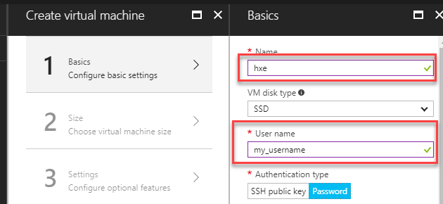

You can now enter a password or generate an SSH key. Complete all the fields and click on **OK**:


>Note: Alternatively, you can follow [these steps](https://docs.microsoft.com/en-us/azure/virtual-machines/linux/ssh-from-windows) if you prefer to generate an SSH key

[ACCORDION-END]


[ACCORDION-BEGIN [Step 3: ](Review pricing and finish setup)]

Step 2 in the wizard presents you with the pre-defined resources for your SAP HANA, express edition instance. You can also review the pricing per month:


Click on **Select**.

Step 3 will provide you with additional options. Choose the advanced network options:

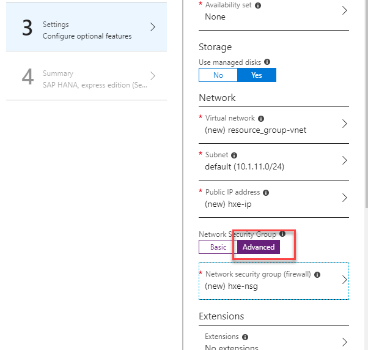

Generally, the rest of the default values should suit your needs. Review them and modify them if necessary. Click **OK** when ready:


Review the final summary and click on **Purchase** to continue:

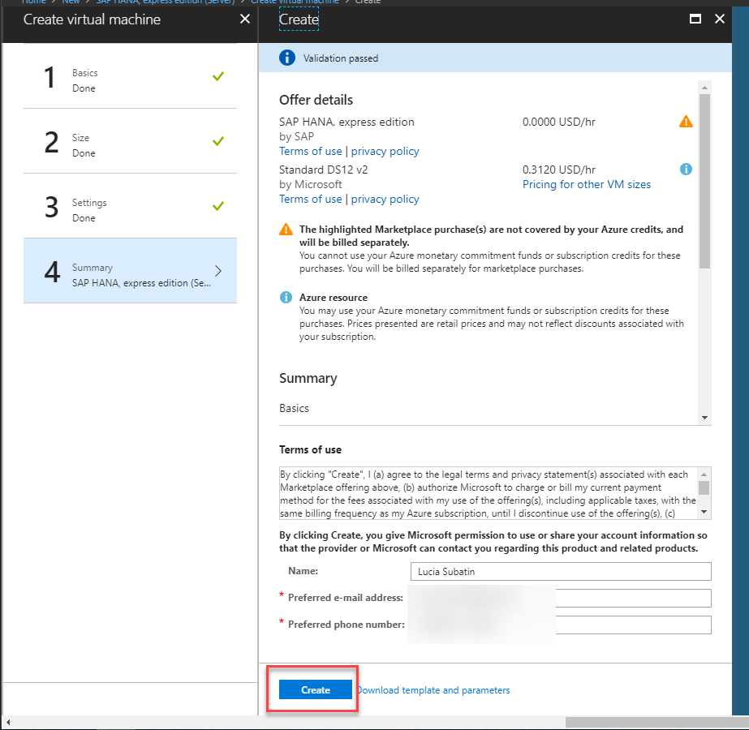

Once deployment is finished, you will be redirected to the dashboard for your new virtual machine:


[ACCORDION-END]

[ACCORDION-BEGIN [Step 4: ](Connect to your virtual machine using SSH)]

Take note of your external IP address:


- If you are using a **Windows** computer, you will need to download an SSH client [such as `PuTTY`](https://winscp.net/eng/download.php#putty).

      In `PuTTY`, add the IP to the Host field and click **OK**:

      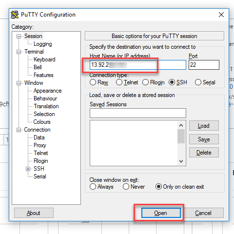

      >Note: If you chose to use an SSH key as an authentication method, you will need to add it in `SSH->Auth`

- If you are using an **Apple** computer, open a terminal (`Finder -> Applications -> Terminal`)

      Run the following command in the terminal, replacing the username and IP by the one in your virtual machine:

      ```SSH
      ssh <<my_username>>@<<your_IP>>
      ```
      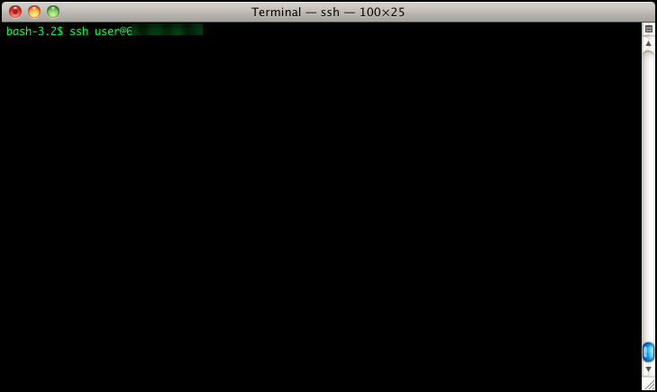


[ACCORDION-END]

[ACCORDION-BEGIN [Step 5: ](Setup your machine)]

From the SSH console, enter the following command:

```SSH
  sudo su - hxeadm
```

You will be prompted for a password for the administration users. **Read the rules** carefully before selecting one:

> ### **Note: Please check the password policy to avoid errors**
>
> SAP HANA, express edition requires a very strong password that complies with these rules:
>
> - At least 8 characters
> - At least 1 uppercase letter
> - At least 1 lowercase letter
> - At least 1 number
> - Can contain special characters, but not _&grave;_ (backtick), _&#36;_ (dollar sign),  _&#92;_ (backslash), _&#39;_ (single quote), or _&quot;_ (double quotes)
> - Cannot contain dictionary words
> - Cannot contain simplistic or systematic values, like strings in ascending or descending numerical or alphabetical order

&nbsp;

You will also be asked if you want to wait for the configuration to finish. It is advised to choose **No** for the installation to run in the background and not be interrupted in case of connectivity issues.

You can check the status of the installation using the command `cat /usr/sap/HXE/home/xsa_config_status`


Once the configuration is finished, you will see the following message:


[ACCORDION-END]

[ACCORDION-BEGIN [Step 6: ](Map the hosts file)]

Use your IP address to map it to the hosts file in your computer. You need administration permissions to do this.

- For Windows Computers:
  If your user is not an administrator but has administrator rights, right-click on Notepad and choose `Run as Administrator`. If you are an administrator user, proceed to the next point.

  

  Open the file or navigate with Windows explorer. You need to edit the file called `hosts` in the directory `C:\Windows\System32\drivers\etc`

  


- For Mac OS:
  Open a terminal (`Finder -> Applications -> Terminal`) and type `sudo nano /etc/hosts`

  


Add the IP address followed by the name of the host, `hxehost`:


**Save** and close the editor.

> Note: If Notepad asks you to create a new file you do not have enough permissions to save the file. Creating a new file will not alter the configuration as intended.

</br>

You can test you have successfully modified your configuration by entering the following URL in your browser: `https://hxehost:39030/`


>If you get a privacy error, continue browsing. The error is related to using a self-signed certificate.

You an use the link to the Web IDE (`https://hxehost:53075/`) to open it

>Note: If you get a **503 error - service unavailable**, the service is probably still starting. Try again in a couple of minutes.

Log in with `XSA_DEV` and the master password. You will see the Web IDE.


You can now start to use your SAP HANA, express edition. The additional steps in this tutorial are only required if you are using additional components.

You can get started with your [first end-to-end XS Advanced application](https://developers.sap.com/group.hana-xsa-get-started.html) or [explore additional tutorials at the Developer Center](https://developers.sap.com/topics/hana.html).


[ACCORDION-END]

[ACCORDION-BEGIN [Step 7 (Optional): ](Change the password for the operating system user)]

The default password for the operating system administration user is `HXEHana1`. You can change it to one of your choice.

Open a **new SSH session** and log in with user `hxeadm`. You will be automatically prompted to change your password.


[ACCORDION-END]

[ACCORDION-BEGIN [Step 8 (Optional): ](Install SHINE or Enterprise Designer)]

If you chose the **XS Advanced** applications, you can install additional components. These components are **OPTIONAL** and independent among themselves.

Open a new console and log in with your MS Azure id. Go into the `Downloads` folder and list the contents.

```
cd /Downloads
ls
```

You will find the installation packages for the Enterprise Architecture Designer  (`eadesigner.tgz`) and the SAP HANA Interactive Education (SHINE, `shine.tgz`).

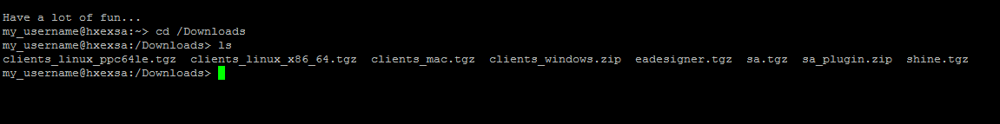

To install any of these packages, change permissions and decompress it first with the following command:

```
sudo chmod 777 -R <<compressed_file>>
sudo tar -xvzf <<name of the file>>

```

For example:

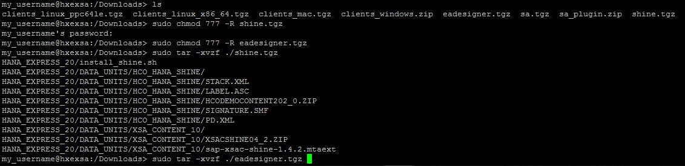

Switch to user `hxeadm`. Go into the decompressed folder and execute the installation script you want.

```
sudo su hxeadm
cd /Downloads/HANA_EXPRESS_20
```
</br>
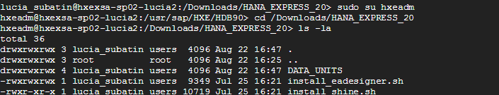


Execute `install_eadesigner.sh` if you want to install the Enterprise Architecture Designer:


```
./install_eadesigner.sh
```

For example:

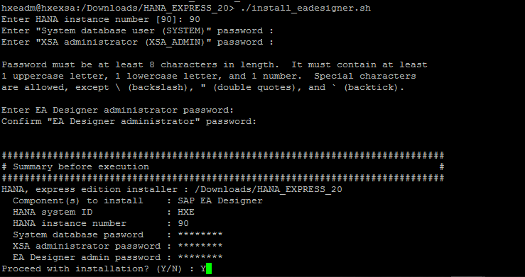

If you want to know the URLs to connect to the Enterprise Designer, type `xs apps`:


And/or `install_shine.sh` to install SHINE:

```
./install_shine.sh
```
For example:

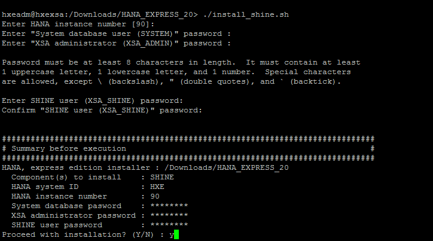

Make sure installation is successful when finished.


You can find more information on the SHINE module in the [official GitHub repository](https://github.com/SAP/hana-shine-xsa)


[ACCORDION-END]

[ACCORDION-BEGIN [Step 9 (Optional): ](Install Smart Data Streaming)]

Open a new SSH console and log in as you MS Azure VM user ID. Find out your internal IP address with the following command:

```
sudo ifconfig
```

Once the IP is shown, take note of it:


And map it in the hosts file in your virtual machine:

```
sudo edit /etc/hosts
```

A text-editor will open. Use the arrow keys to move to where `127.0.0.2` is. Once there, press letter `i` to enter insert mode. Use the Delete key to delete IP `127.0.0.1` and enter your internal IP:

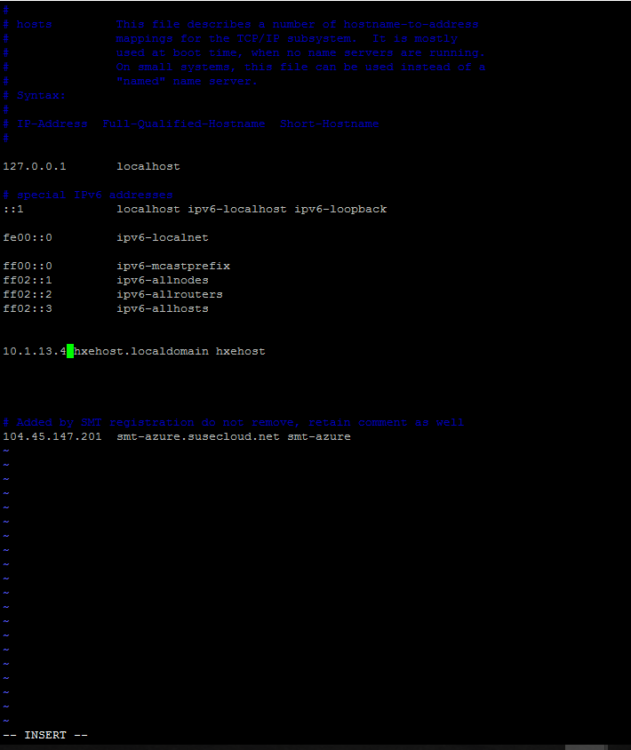

Once you are finished editing, press `Esc` and write `:wq` to save your changes. If you want to discard your changes, you can use `:!q`


Back in the console prompt, navigate to the Downloads folder, extract the installation files:

```
cd /Downloads
sudo tar -xvzf sa.tgz
```


Once finished, execute the installation script. Be sure to enter **`hxehost`** as the name of the host when prompted:

```
sudo ./HANA_EXPRESS_20/install_sa.sh
```

As follows:


Once finished, you can verify it is running with the following command
```
ps -ef | grep streaming
```


You can later enable a link to the tool from the SAP Web IDE for SAP HANA:


[ACCORDION-END]


### Additional Information
-  **Build your first app:** [Get started with XS Advanced development](https://developers.sap.com/mission.xsa-get-started.html)
- [Explore the basic tools in the XS Advanced platform](https://developers.sap.com/tutorials/xsa-explore-basics.html)
- [Review SAP HANA, express edition content, tutorials and quick start guides](https://developers.sap.com/topics/hana.html)
