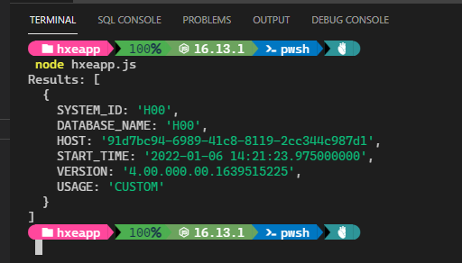

## Prerequisites and Assumptions
 - User knows how to install packages and develop using Node.js
 - Setup: `HANA, express edition` or `SAP HANA Cloud` must be running and accessible from your client platform. For instructions on how to setup a `HANA, express edition` see the [HANA Express database deploy tutorial](hxe-database-server). For instructions on starting `SAP HANA Cloud` trial see the [Help Thomas Get Started with SAP HANA](hana-trial-advanced-analytics).
 - This tutorial assumes that you have a database login that can access the `M_DATABASE` view in the `HANA, express edition` `SystemDB` or in `SAP HANA Cloud`.
 - **Tutorials:** [Setup Node.js to connect to SAP HANA](hxe-nodejs-setup)

## Details
### You will learn  
This tutorial will guide you through the process to deploy a sample Node.js application  which connects to SAP HANA, express edition or SAP HANA Cloud.


---

[ACCORDION-BEGIN [Step 1: ](Prepare Environment for Node.js)]

Find the right package to download from [Node.js Foundation](https://nodejs.org/en/download/).

Look for correctly platform download that matches your development environment.

Install support package for `Node.js` and Express:

Follow the prompts and install `Node.js`. The installation downloads to the default location.
In case you need to change the installation location from the defaults, make sure to update the PATH variable.

Install the Node.js package called `express-generator` globally:

```shell
npm install -g express-generator
```

[DONE]

[ACCORDION-END]

[ACCORDION-BEGIN [Step 2: ](Develop Simple Node.js Application)]

Create a simple standalone `node.js` app:

```shell
% mkdir hxeapp
% cd hxeapp
```

Edit a file named `hxeapp.js` with the following content:

```JavaScript
console.log ("Hello Node World!")
```

   Test the simple app created in the previous step

```shell
cd hxeapp
node hxeapp.js
```

Access the HANA content from this Node application.  First install HANA database driver to Node. Ignore any warnings that it may produce.

```shell
npm install @sap/hdbext
```

Create a Node application that allows you to access SAP HANA, express edition data.

Open the `hxeapps.js` file and add the following content:

```JavaScript
// Reference HANA driver in the Node app and update the connection details
let hdbext = require('@sap/hdbext')

// Modify the host IP and password based on your system information
let hanaConfig = {
    host: '<HANA hostname>',
    port: `<HANA Port>`,
    sslValidateCertificate: false,
    encrypt: true,
    user: `<SYSTEM|DBADMIN>`,
    password: '<HANA SYSTEM or DBADMIN user password>'
}
// select from a sample table
let sql = "select * from m_database"

// Execute the query and output the results
// Note: this code doesn't handle any errors (e.g. connection failures etc.,)
hdbext.createConnection(hanaConfig, function (error, client) {
    if (error) {
        return console.error(error);
    }

    client.exec(sql, function (error, rows) {
        console.log('Results:', rows)
    })
})
```

Replace the `<HANA hostname>` with the IP address or host name of your HANA Express or HANA Cloud database server. Replace `user` with `SYSTEM` if targeting HANA Express or `DBADMIN` if targeting HANA Cloud.  Replace `HANA Port` with the SQL port for your HANA system. Replace the `<HANA SYSTEM or DBADMIN user password>` with your database system user password. Then save changes.

Start your application:

```shell
node hxeapp.js
```

The above command should produce results something like the below:


[DONE]

[ACCORDION-END]

[ACCORDION-BEGIN [Step 3: Extend Application](Extend Simple Node.js Application to Run as a Web Application)]

Modify this app to be a `WebApp`.

Install support packages for `Node.js` and Express.

```shell
npm install express
```

Execute express to create a template for developing `WebApp`

```shell
express
```

Above step will create template files with dependencies.

Note: It was installed manually previously. We want to do it automatically along with other packages

Modify `package.json` to include `@sap/hdbext` driver.

Edit `package.json` and add below line in the dependencies section.

```json
"@sap/hdbext": "latest"
```

After the edits, your `package.json` file would looks something like:
```json
{
  "name": "hxeapp",
  "version": "0.0.0",
  "private": true,
  "scripts": {
    "start": "node ./bin/www"
  },
  "dependencies": {
    "@sap/hdbext": "latest",
    "cookie-parser": "~1.4.4",
    "debug": "~2.6.9",
    "express": "~4.16.1",
    "http-errors": "~1.6.3",
    "jade": "~1.11.0",
    "morgan": "~1.9.1"
  }
}
```

Call `npm` `install` to pull the dependencies

```shell
npm install
```

Create an app that does what our `hxeapp.js` does, but now we should modify the template file to do it.

Your directory content would look something like:

```shell
app.js  
hxeapp.js      
public/  
views/
bin/    
node_modules/  
package.json      
routes/
```

```shell
$ ls routes/
index.js  users.js
```
Modify the `index.js` file to include the following code snippet:

```JavaScript
var express = require('express');
var hdbext = require('@sap/hdbext')
var router = express.Router();
var hanaConfig = {
  host: '<HANA hostname>',
  port: `<HANA Port>`,
  sslValidateCertificate: false,
  encrypt: true,
  user: `<SYSTEM|DBADMIN>`,
  password: '<HANA SYSTEM or DBADMIN user password>'
}
var sql = "select * from m_database"
/* GET home page. */
router.get('/', function (req, res, next) {

  hdbext.createConnection(hanaConfig, function (error, client) {
    if (error) {
      return console.error(error);
    }

    client.exec(sql, function (error, rows) {
      res.render('index', { title: 'Sample Node.js on HANA ', datarow: rows });
    })
  })
});

module.exports = router;
```
Replace the `<HANA hostname>` with the IP address or host name of your SAP HANA, express edition or SAP HANA Cloud database server. Replace `user` with `SYSTEM` if targeting HANA Express or `DBADMIN` if targeting SAP HANA Cloud.  Replace `HANA Port` with the SQL port for your SAP HANA system. Replace the `<HANA SYSTEM or DBADMIN user password>` with your database system user password. Then save changes.

Edit the file `views/index.jade` that controls the `WebApp` output layout as follows:

```text
extends layout

block content
  h1= title
  - each v, k in datarow[0]
    p #{k} : #{v}
```

Start the application

```shell
npm start
```

   Open a new browser and access `http://localhost:3000/`
   Notice that the browser displays information like what was displayed in earlier output.

[DONE]

[ACCORDION-END]

---
### Additional Information
 - [View similar How-Tos](http://developers.sap.com/tutorials.html) or [View all How-Tos](http://developers.sap.com/tutorials.html)
 - Go to [SAP HANA](https://developers.sap.com/topics/hana.html) tutorials page
