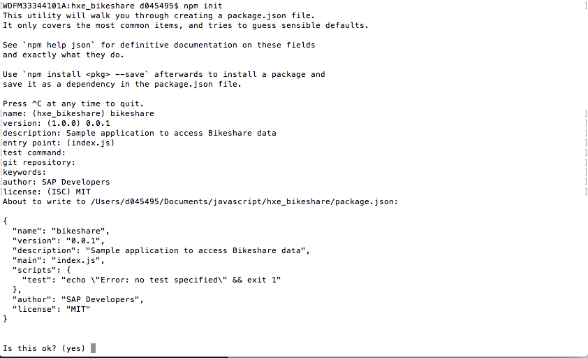
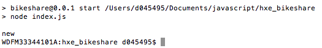
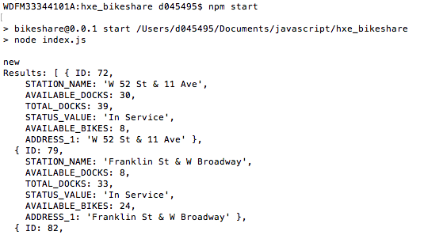

## Prerequisites  
 - **Proficiency:** Beginner
 - **Tutorials:**  [Setup Node.js to connect to HXE](https://www.sap.com/developer/tutorials/hxe-nodejs-connect.html)


## Next Steps
 - Select a tutorial group from the [Tutorial Navigator](http://www.sap.com/developer/tutorial-navigator.html) or the [Tutorial Catalog](https://www.sap.com/developer/tutorial-navigator.tutorials.html)

## Details
### You will learn  
Now that your system is setup to work with both Node.js and the HDB library it is time to make your initial application and make your connection.

### Time to Complete
**15 Min**

---

[ACCORDION-BEGIN [Step 1: ](Create your application directory)]

To begin with you will need to create a new directory where you will keep your files for this project. For the purposes of this tutorial it really does not matter what you call but for consistency it will be referred to here as `hxe_bikeshare`


[DONE]
[ACCORDION-END]

[ACCORDION-BEGIN [Step 2: ](Set your connection parameters)]

Now that you have your directory it is time to start your new Node.js application. The easiest way to do this is by running the command from your newly created directory.

```
npm init
```

This will launch a wizard to help you create your new application.



The result will be a `package.json` file being created which defines various aspects of the application.

[DONE]
[ACCORDION-END]


[ACCORDION-BEGIN [Step 3: ](Be sure HDB is available)]

If you did not use the `-g` flag on the `npm install hdb` command from the previous tutorial you will need to run the following command now.

`npm install hdb --save`

By running that command it will automatically add the `hdb` module as a dependency for your application which is very important if you plan on deploying your application to a server later on.

```
"dependencies": {
    "hdb": "^0.12.2"
  }
```

This makes the overall `package.json` the following

```
{
  "name": "bikeshare",
  "version": "0.0.1",
  "description": "Sample application to access Bikeshare data",
  "main": "index.js",
  "scripts": {
    "test": "echo \"Error: no test specified\" && exit 1"
  },
  "author": "SAP Developers",
  "license": "MIT",
  "dependencies": {
    "hdb": "^0.12.2"
  }
}
```

[DONE]
[ACCORDION-END]

[ACCORDION-BEGIN [Step 4: ](Create the database connection)]

From `package.json` the main file for the application was defined as `index.js` therefore you will now need to create a file in the directory matching that name.

```
var hdb    = require('hdb');

var client = hdb.createClient({
    host     : 'hostname',
    port     : 30015,
    database : 'DB1', 
    user     : 'user',
    password : 'secret'
});

client.on('error', function (err) {
  console.error('Network connection error', err);
});

console.log(client.readyState); 
```

Here the main parts are to change the `hostname`, as well as the `user`, `password` and finally the port based on your system configuration.


[DONE]
[ACCORDION-END]

[ACCORDION-BEGIN [Step 5: ](First execution)]

Provided you have made all the appropriate changes you should be able to actually run your application and check that it works. 

First to make this an easy process open up the `package.json` file and you will add the following line right after the `test` line which should be line 7 in the `scripts` section.

```
"start": "node index.js"
```

Be sure to include the `,` after the line before. Now to run the following command after saving your changes.

```
npm start
```

[DONE]
[ACCORDION-END]

[ACCORDION-BEGIN [Step 6: ](Execute your Query)]

If everything executed properly, then it is time to access your data.

 

Now you will need to modify your `index.js` file and add the following statement to the end.

```
client.connect(function (err) {
  if (err) {
  	return console.error('Connect error', err);
  }
  client.exec('select * from "CODEJAM"."BIKE_STATIONS"', function (err, rows) {
	client.end();
    if (err) {
      return console.error('Execute error:', err);
    }
    console.log('Results:', rows);
  });
});
```

Now to save the file and run it again.

```
npm start
```

  

[DONE]
[ACCORDION-END]

## Next Steps
 - Select a tutorial group from the [Tutorial Navigator](http://www.sap.com/developer/tutorial-navigator.html) or the [Tutorial Catalog](https://www.sap.com/developer/tutorial-navigator.tutorials.html)
