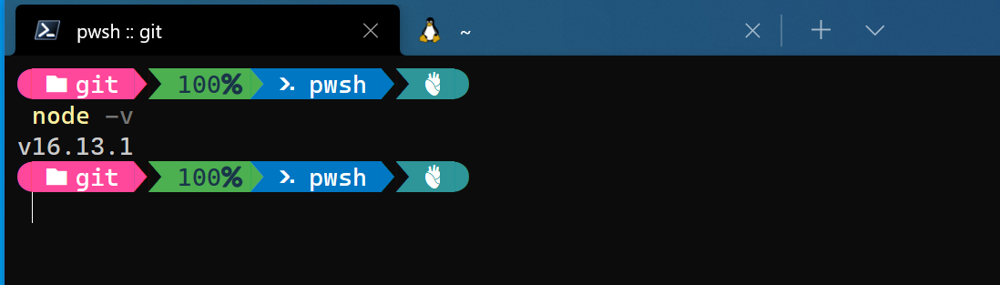

## Prerequisites  
 - **Proficiency:** Beginner
 - **Tutorials:** [SAP HANA, express edition, server-only: Create tables and upload data](https://www.sap.com/developer/tutorials/hxe-cj1-create-table-upload-data.html)


## Next Steps
 - [Connect to HXE using Node.js](https://www.sap.com/developer/tutorials/hxe-nodejs-connect.html)

## Details
### You will learn  
Now that you have tables and data in your system the next step will be to access that data through the use of an application. The following steps will prepare your system to do the development.

### Time to Complete
**15 Min**

---

[ACCORDION-BEGIN [Step 1: ](Setup your system)]

> Node.js® is a JavaScript runtime built on Chrome's V8 JavaScript engine. Node.js uses an event-driven, non-blocking I/O model that makes it lightweight and efficient. Node.js' package ecosystem, npm, is the largest ecosystem of open source libraries in the world.

To setup your system you will need to install the appropriate Node.js on your system. To do this please go to the [website](https://nodejs.org/en/) for Node.js and follow the instructions there for the type of system you have.


[DONE]
[ACCORDION-END]

[ACCORDION-BEGIN [Step 2: ](Install HDB)]

Now that you have installed Node.js you can open a command line on your system and check to be sure it is there. To do so type the following command.

```
node -v
```



Now that you have verified that Node.js is installed it is time install the appropriate library to connect to your SAP HANA express edition. This is the `HDB` library which you can learn more about in [GitHub](https://github.com/SAP/node-hdb). 

To install this library from your command line you will run the following command.

```
npm install hdb
```

Your system may require administrator access to run the install so keep that in mind if you get an error. You can also use the `-g` flag on the install command to make it a universal install otherwise you will have to install the module into each application directory you make.


[DONE]
[ACCORDION-END]


[ACCORDION-BEGIN [Step 3: ](Check your install)]

Now from the command line you should be able to check to verify the install was successful. To do so run the following command.

```
npm list
```

This command lists all of the modules that are installed on your system and in the list you should see `hdb@0.12.2` (or the latest version)


[DONE]
[ACCORDION-END]


## Next Steps
- [Connect to HXE using Node.js](https://www.sap.com/developer/tutorials/hxe-nodejs-connect.html)
