## Prerequisites  
 - **Proficiency:** Beginner
 - Your have a working setup of HANA Studio installed
 - You have a Google Account and/or have registered for the free trial on `cloud.google.com`
 - **Tutorials:**  [Setup HANA Studio](https://www.sap.com/developer/how-tos/2016/09/hxe-howto-eclipse.html), [Create a new project using the Cloud Platform Console](https://cloud.google.com/resource-manager/docs/creating-managing-projects) and [SAP HANA, express edition, in Google Cloud Platform Launcher](https://www.sap.com/developer/tutorials/hxe-gcp-getting-started-launcher.html)

## Next Steps
 - Python Flask OData tutorial

## Details
### You will learn  
This tutorial will guide you through the process to deploy a simple `OData` service to expose data from a table in the tenant database of SAP HANA, express edition, that is deployed on Google Compute Engine.

This `OData` service can then be consumed in various applications similar to consuming REST services.

### Time to Complete
**20 Min**

---

[ACCORDION-BEGIN [Step 1: ](Add a HANA Express edition system to HANA Studio)]

1. Add a HANA Express edition system into HANA Studio as shown below:

    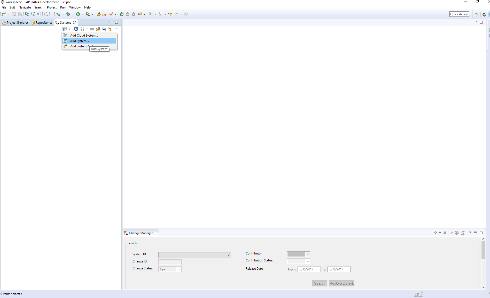

2. Enter the required details for `IP` address, instance number and select SYSTEM database as the option.

    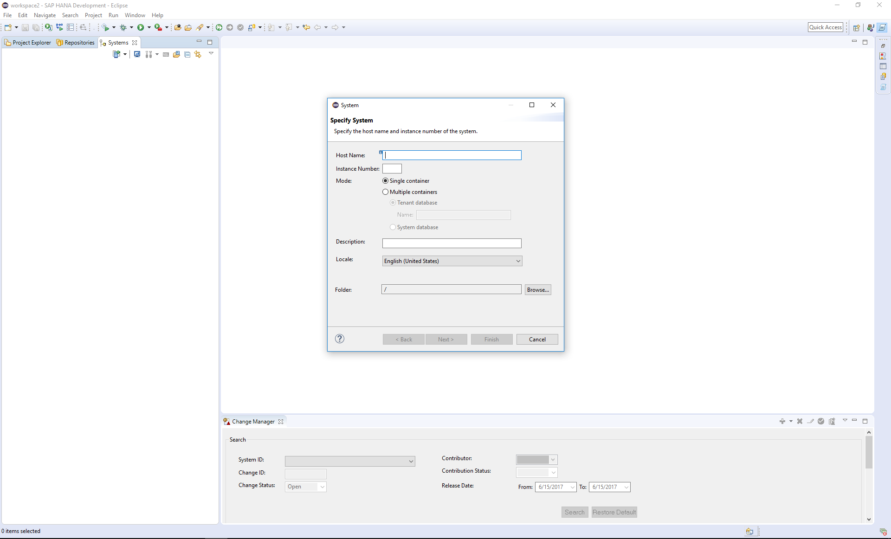

    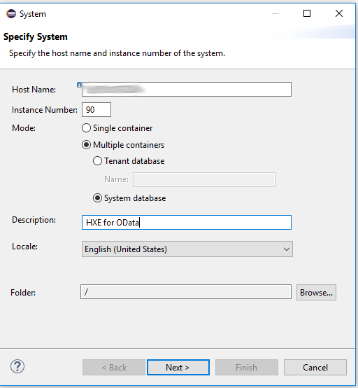

3. Enter the credentials needed to access the SYSTEM database and add the system.

    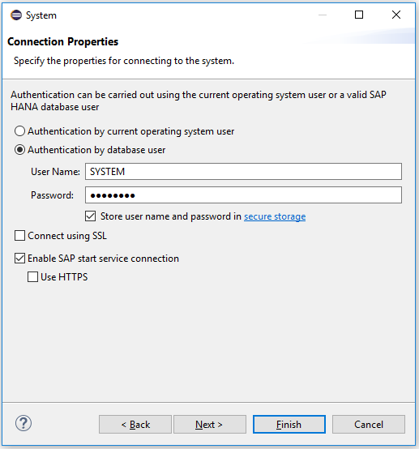

4. Once added make sure you are able to log on to the system. Open the Configuration tab.

    

5. Under the configuration tab, search for "public". Look for the options `map_localhost` and `public_urls` and map it to the `IP` address of the HANA Express host machine.

    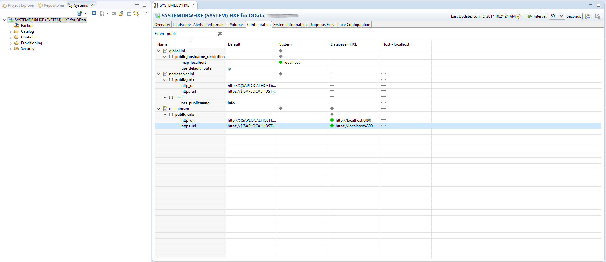

    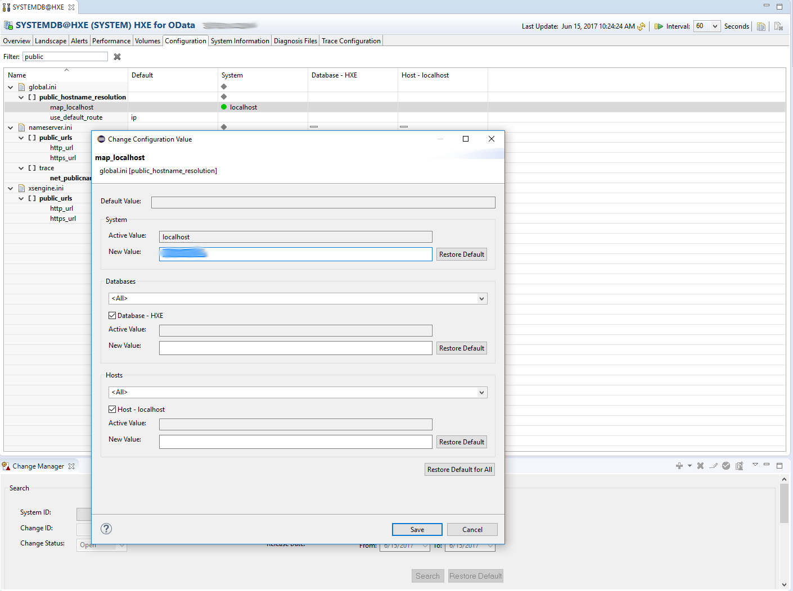

    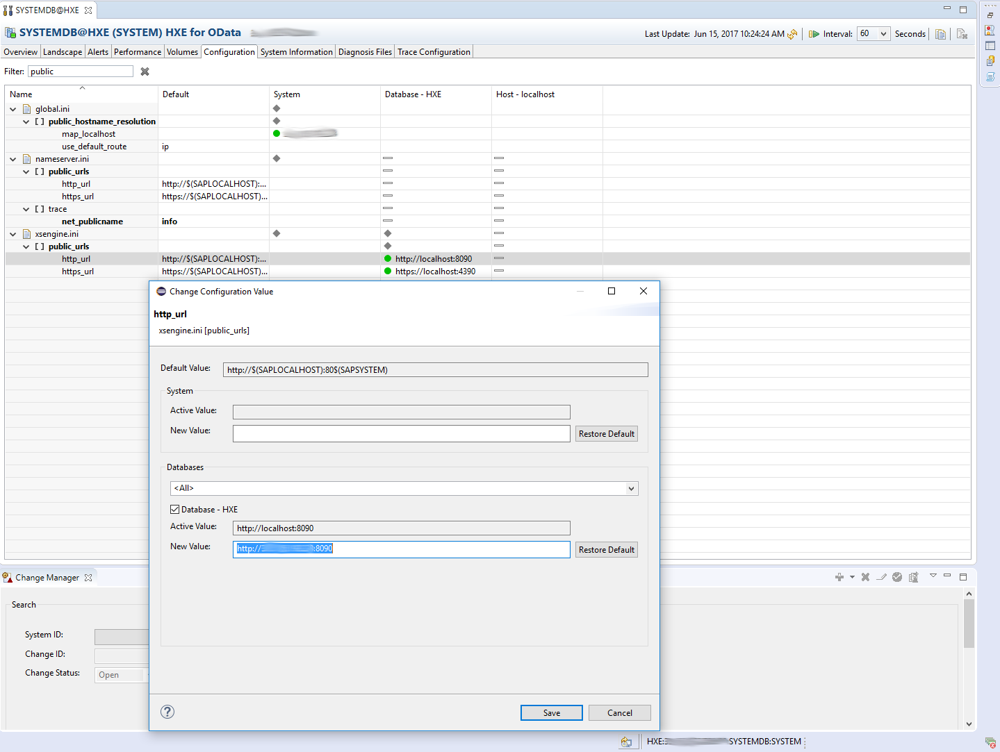

6. Save and deploy the changes.

7. Follow Steps 1-4 but now select "Tenant database" as the option and enter the corresponding details.
    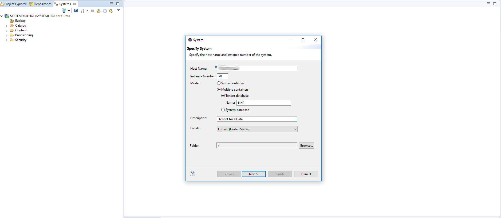

8. Save and deploy the changes.

9. Make sure you are able to log on to the system.

[DONE]
[ACCORDION-END]

[ACCORDION-BEGIN [Step 2: ](Create an XS Project)]

1. Create a new XS project in the HANA studio. Give a name for the project, and select the "default" workspace or create a new workspace, as needed. Make sure to select the system corresponding to the tenant database.

    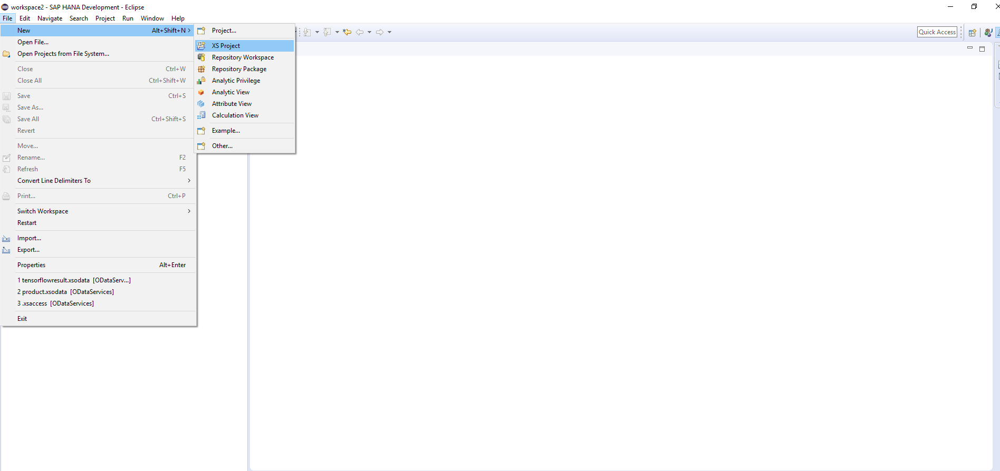

    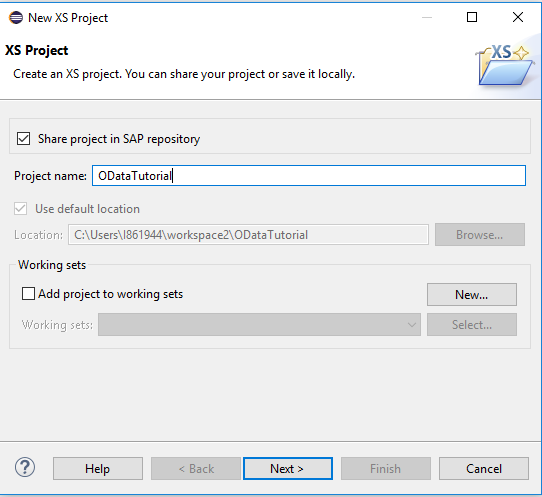

    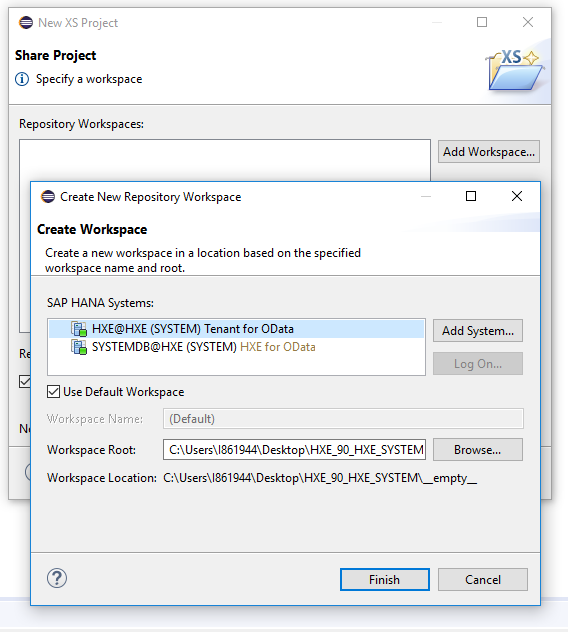

[DONE]
[ACCORDION-END]

[ACCORDION-BEGIN [Step 3: ](Create an XS OData Service)]

1. Create a new XS `OData` file under the XS project as follows

    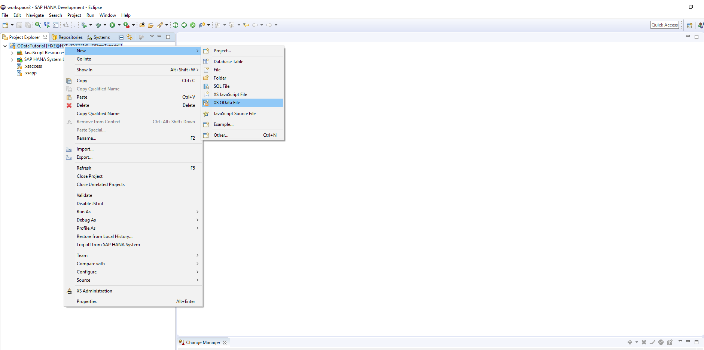

2. Create a new `OData` service on the XS `OData` file in the following format : `"YOUR_SCHEMA_NAME"."YOUR_TABLE_THAT_NEEDS_TO_BE_EXPOSED" as "SERVICE_NAME"`

    

3. Deploy the project and activate it as follows.

    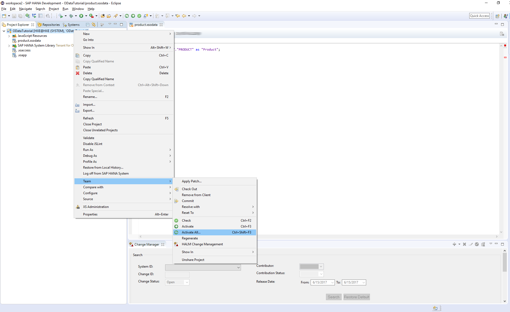

    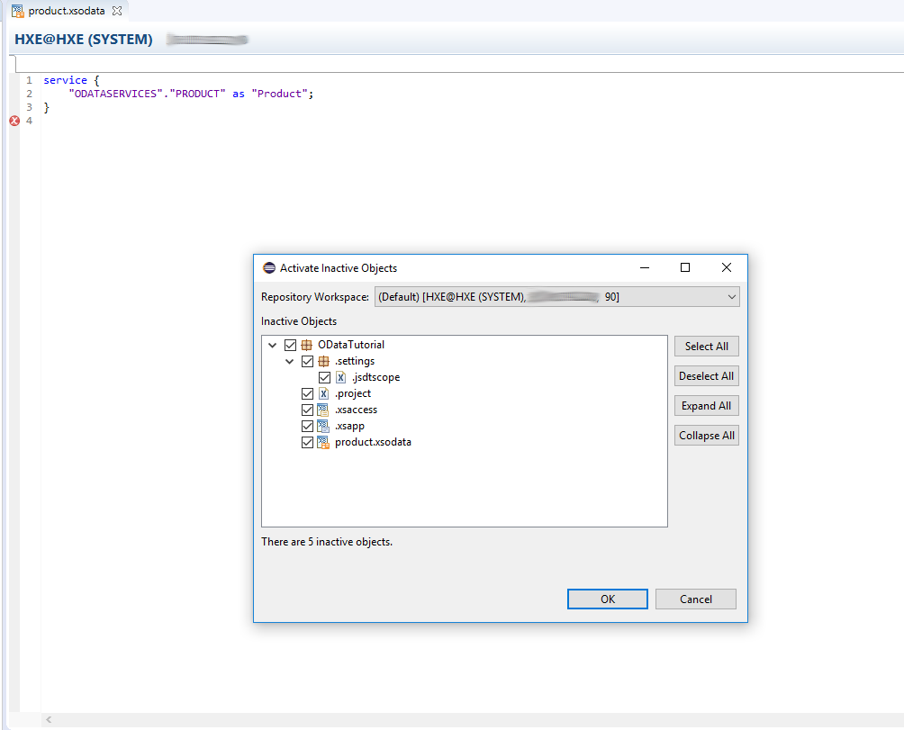

4. Once the service is activated, you would see a status message as follows.

    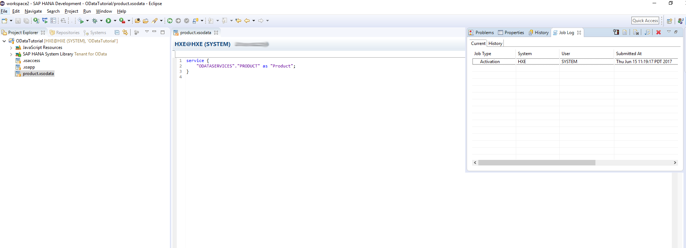

5. Once the service is successfully activated, you can check the `OData` service in the browser as follows.

  When you go to the URL, the application would redirect you to the XS Login page and you can authenticate by using any valid XS credentials.

  This URL shows the `OData` service details.

  The format of the URL would be as follows :
  `http://<HOSTNAME>:8090/<XS Project Name>/<XS ODatafile>.xsodata`

  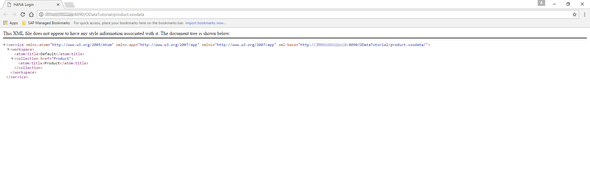

  This URL shows how the entries in the table can be obtained by querying the service.

  `http://<HOSTNAME>:8090/<XS Project Name>/<XS ODatafile>.xsodata/<Service_Name>`

  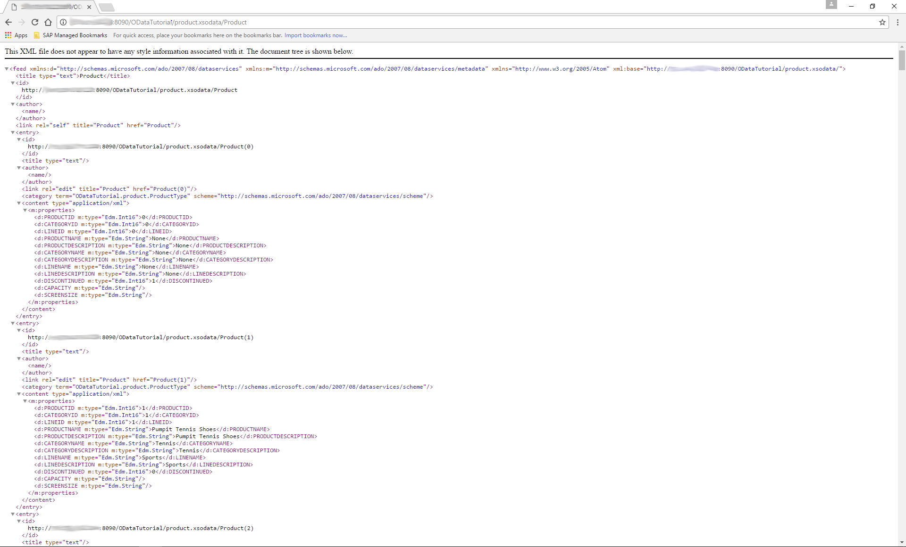

    >**Note 1:**
    > The OData service mentioned here uses a table "Product" which has the following columns :
    PRODUCTID, CATEGORYID, LINEID, PRODUCTNAME, PRODUCTDESCRIPTION, CATEGORYNAME, CATEGORYDESCRIPTION, LINENAME, LINEDESCRIPTION, DISCONTINUED, CAPACITY, SCREENSIZE.

    >**Note 2:**
    > You can use the following link to create table from a csv file.
      Use the STS_DIMPRODUCT.csv file. [Github Link](https://github.com/saphanaacademy/HXE/tree/master/STS)

      >**Note 3:**
      > You can use the following tutorial to import data into SAP HANA from a csv file.
      [Import Data into SAP HANA](https://www.sap.com/developer/tutorials/studio-import-data.html)

[DONE]
[ACCORDION-END]

---

## Next Steps
 - Go to [SAP HANA, express edition](https://www.sap.com/developer/topics/sap-hana-express.tutorials.html) tutorials page
