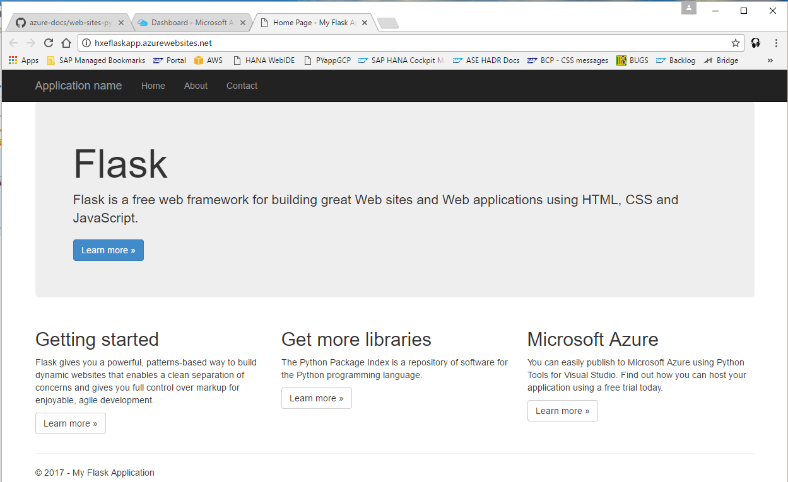

## Prerequisites  
 - A `HANA, express edition` database server must be running and accessible from Azure App Service.
 - Familiarity with the Python language.
 - Familiarity with Azure App Service(AAS).
 - An account on Azure. If you do not already have an Azure account, you can go to the [Azure Portal Page](https://portal.azure.com) and set one up.
 - Git installed on your client system. You can follow these instructions to [download git](https://git-scm.com/downloads).
 - Follow the Azure procedure to create a simple Python web service application.

## Next Steps
 - Complete other tutorials.

## How-To Details
This How-To shows how to create a web application with Flask for Azure's App Service that queries a HANA, express edition database. It requires that you have a HANA, express edition database that is accessible from Azure's App Service.

### Time to Complete
**30 Min**.

[ACCORDION-BEGIN [Step 1: ](Setup a HANA Database Accessible from Azure's App Service)]

Make sure that you have the HANA, express edition database running, and that it is accessible from Azure's App Service. For instructions on how to perform a binary installation of HANA, express edition on an Azure virtual machine see the [Installing SAP HANA, express edition, on Microsoft Azure and `openSUSE`](https://www.sap.com/developer/tutorials/hxe-azure-open-suse.html).


[ACCORDION-END]

[ACCORDION-BEGIN [Step 2: ](Update Application to Access HXE)]

You will now modify the Flask application to enable it to query the HANA database and displays an html page containing the contents of the HANA `M_DATABASE` view. Your application will replace the original `__init__.py`  and `templates/hello.html` source files:

    `__init__.py` - the python source file. The file contains the application code that queries the HANA Express database, places the results in a data structure then merges that data with `template.html`.

    `templates/hello.html` - An HTML formatted template that uses the flask rendering functionality to merge data generated results from `__init__.py` to create the html page. `hello.html` must be in the `templates` directory.

Follow procedure defined by Azure to create an application using the Flask web framework. Do not configure Git publishing for your newly created web app as instructed in the Azure Doc Tutorial step #6. You will clone the generated Git repository later to have access to the application code.

Confirm the application framework is working by clicking the `Browse` link in the Application Services Overview window or follow the link provided in the `URL` field.

.

Clone the generated application git repository using the provided `Git clone url` in the Application Services Overview window:

```
git clone <Git clone url from Application Services Overview>
```

Navigate to the `application` directory to find the files cloned from the Git repository, if you don't find the applications including the `requirements.txt` your clone command didn't work, verify the Deployment Credentials, or Deployment options, you may need to `Disconnect` and setup a new Git Local repository:

.

Edit the `requirements.txt` file to have the following packages:
```
Flask<1
pyhdb
```

Delete the file `.skipPythonDeployment` in the `application` directory, this is required to assure Azure does a full deployment of the application.

Navigate to the folder named `FlaskWebProject1` and modify the `__init__.py` file to include the following code. Update the `HXE host IP Address` and `HXE system DB password` in the below code:

```
    # [START application]
    import logging
    from flask import Flask
    from flask import render_template
    import pyhdb

    app = Flask(__name__)

    @app.route('/')
    def hello_world():
      # define connection to the HXE database
      user_provided_host='<HXE host IP Address>'
      user_provided_password='<HXE system DB password>'
      user_provided_port=39013
      user_provided_user='system'
      connection = pyhdb.connect(
              host = user_provided_host,
              port = user_provided_port,
              user = user_provided_user,
              password = user_provided_password
              )
      if not connection.isconnected():
          return 'HXE Server is not accessible'
      cursor=connection.cursor();
      cursor.execute ("SELECT * from M_DATABASE")
      allrows = ''
      row = cursor.fetchone()
      while row is not None:
          print (row)
          allrows = allrows + str(row)
          row = cursor.fetchone()
      cursor.close()
      if row is None:
          return render_template(
                  'hello.html',
                  host = user_provided_host,
                  port = user_provided_port,
                  user = user_provided_user,
                  name = allrows)
      else:
          return 'Select failed'

    @app.errorhandler(500)
    def server_error(e):
        #log the error and stacktrace
        logging.exception ('an error occurred during a request.')
        return 'An internal error occurred.', 500

    if __name__ == '__main__':
      app.run(host='127.0.0.1', port=8080, debug=True)
    #[END application]
```

Delete the `views.py` file, this file is not needed and will conflict with the new code in `__init__.py`

Navigate to the `templates` folder and create a new file `hello.html` with the below content:

```
<!doctype html>
<title>HXE Select from HXE</title>

<h1>IP Address: {{ host }}</h1>

<h1>IP Address missing</h1>


<h1>HXE Port Number: {{ port }}</h1>

<h1>HXE Port Number missing</h1>


<h1>HXE User Name: {{ user }}</h1>

<h1>HXE User Name missing</h1>


<h1>M_DATABASE contents:</h1>
  </h1>
  {{n}}
  

<h1>M_DATABASE contents missing</h1>

```

Add the `hello.html` file to the git repository:
```
git add hello.html
```

Commit all of the changes to the repository:

```
$ git commit -a -m "updates for HXE application"

```

Push the updated files to Azure to the Git repository:
```
git push
```

[ACCORDION-END]

[ACCORDION-BEGIN [Step 3: Test Flask Application](Test Your Application to Azure's App Service)]

1. Click the `Browse` link on the Application Services Overview Window to view the web application. Example URL will be something like this:
   ```
   http://<your application name>.azurewebsites.net
   ```

3. After you push your code successfully to Azure using Git, go to the Azure dashboard and select the URL for your application. When you do so, you should see results from the select of the `M_DATABASE` table on your HANA, express edition like the following:

.


[ACCORDION-END]

