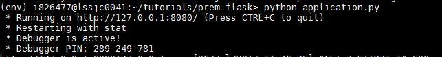

## Prerequisites  
 - **Proficiency:** Beginner
 - Setup: `HANA, express edition` must be running and accessible from your client platform. For instructions on how to setup a `HANA, express edition` see the [HANA Express database deploy tutorial](https://www.sap.com/developer/tutorials/hxe-db-deploy.html).
 - This tutorial assumes that you have a database login that can access the `M_DATABASE` view in the `HANA, express edition` `SystemDB`.

## Next Steps
 - Go to [SAP HANA, express edition](https://www.sap.com/developer/topics/sap-hana-express.tutorials.html) tutorials page

## Details
### You will learn  
This tutorial will guide you through the process of creating a sample Python/Flask application to connect to SAP HANA, Express Edition.

### Time to Complete
**15 Min**

---

[ACCORDION-BEGIN [Step 1: ](Create a sample python application on your local machine)]
>**Note:**
> The tutorial assumes you have a UNIX machine. Please use equivalent commands if running a Windows environment.


1. Open terminal and create a directory.

    ```
    ~$ mkdir TinyWorldFlaskApp
    ~$ cd TinyWorldFlaskApp/

    ```
2. Run the following commands.

    ```
    ~TinyWorldFlaskApp$ touch application.py
    ~TinyWorldFlaskApp$ touch requirements.txt
    ~TinyWorldFlaskApp$ mkdir templates
    ~TinyWorldFlaskApp$ cd templates
    ~TinyWorldFlaskApp/templates$ touch hello.html
    ~$ cd ..
    ```

3. Copy the below code to the file `application.py` in this directory:

    ```
    # [START application]
    import logging
    from flask import Flask
    from flask import render_template
    import pyhdb

    application = Flask(__name__)

    @application.route('/')
    def connHXE():
        # define connection to the HXE database you have access to
        # replace the IP address and password below
          user_provided_host='<xxx.xxx.xxx.xxx>'
          user_provided_password='<password>'
          user_provided_port=39013
          user_provided_user='system'

          connection = pyhdb.connect(
            user_provided_host,
            user_provided_port,
            user_provided_user,
            user_provided_password
            )
          if not connection.isconnected():
              return 'HXE Server is not accessible'
          cursor=connection.cursor();
          cursor.execute("SELECT * from M_DATABASE")
          allrows = ''
          row = cursor.fetchone()
          while row is not None:
            print (row)
            allrows = allrows + str(row)
            row = cursor.fetchone()
          cursor.close()
          if row is None:
              return render_template (
    	    'hello.html',
    	    host = user_provided_host,
    	    port = user_provided_port,
    	    user = user_provided_user,
    	    name= allrows )
          else:
              return 'Select failed'

    @application.errorhandler(500)
    def server_error(e):
        #log the error and stacktrace
        logging.exception ('An error occurred during a request.')
        return 'An internal error occured.', 500

    #run the app.
    if __name__ == "__main__":
        application.run(host='127.0.0.1', port =8080, debug=True)
    #[END application]
    ```

4. Edit the `application.py` file to specify your HXE IP address and the system user password:

    ```
    # replace the IP address and password below
      user_provided_host='<xxx.xxx.xxx.xxx>'
      user_provided_password='<password>'
    ```

5. Copy the below lines to the  `requirements.txt` file in this directory.

    ```
    Flask==0.12.1
    pyhdb==0.3.3
    ```

6. Copy the following code to the file `hello.html` under the `templates` directory.

    ```
    <!doctype html>
    <title>HXE Select from HXE</title>
    
    <h1>IP Address: {{ host }}</h1>
    
    <h1>IP Address missing</h1>
    
    
    <h1>HXE Port Number: {{ port }}</h1>
    
    <h1>HXE Port Number missing</h1>
    
    
    <h1>HXE User Name: {{ user }}</h1>
    
    <h1>HXE User Name missing</h1>
    
    
    <h1>M_DATABASE contents:</h1>
      </h1>
      {{n}}
      
    
    <h1>M_DATABASE contents missing</h1>
    
    ```

[ACCORDION-END]

[ACCORDION-BEGIN [Step 2: ](Run the application locally to test.)]

1. Run the following commands at the root of the project directory.

    ```
    ~TinyWorldFlaskApp$ pip install virtualenv
    ~TinyWorldFlaskApp$ virtualenv env
    ~TinyWorldFlaskApp$ source env/bin/activate
    ~TinyWorldFlaskApp$ pip install -r requirements.txt
    ~TinyWorldFlaskApp$ python application.py
    ```
    

2. Browse the application at `http://127.0.0.1:8080`.
The results would look like below.

    


You now have a working Python/Flask application connecting to SAP HANA.


[ACCORDION-END]

---

## Next Steps
 - If you intend to deploy your application to Google App Engine, go to the [Google App Engine deployment tutorial](https://www.sap.com/developer/tutorials/hxe-app-deploy-gcp.html)
 - If you intend to deploy your application to Azure App Service, go to the [Azure App Service deployment tutorial](https://www.sap.com/developer/tutorials/hxe-app-deploy-azure.html)
 - If you intend to deploy your application to AWS Elastic Beanstalk, go to the [AWS Elastic Beanstalk deployment tutorial](https://www.sap.com/developer/tutorials/hxe-app-deploy-aws.html)
 - [View similar How-Tos](http://www.sap.com/developer/tutorials.html) or [View all How-Tos](http://www.sap.com/developer/tutorials.html)
