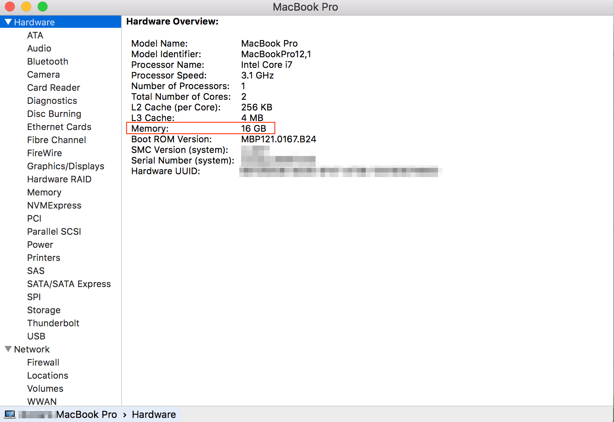

## Details
### You will learn  
- How to verify that you have enough RAM to run SAP HANA, express edition, locally on your computer

---

[ACCORDION-BEGIN [Step 1: ](Open System Information)]

Go to the **`launchpad`** on the dock. Type `System` in the search bar and select **System Information**.

[DONE]
[ACCORDION-END]

[ACCORDION-BEGIN [Step 2: ](Check memory)]
Take note of the value after `memory`.

!

If the RAM memory is not enough or if you are looking for the best possible performance, there are plenty of cloud providers where you can deploy your SAP HANA, express edition instance.

[DONE]
[ACCORDION-END]
