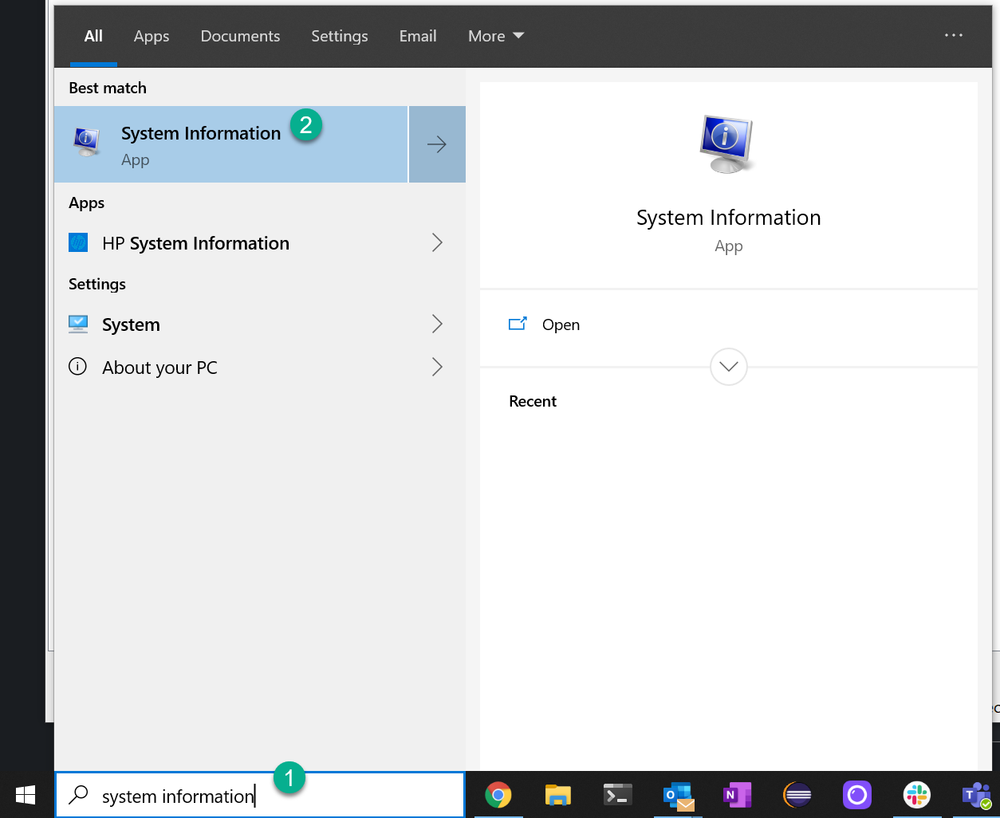

## Prerequisites  
 - **Proficiency:** Beginner

## Details
### You will learn  
You will verify how much Random Access Memory you have in your system to run SAP HANA, express edition, locally on your computer.

### Time to Complete
**1 Min**

---
[ACCORDION-BEGIN [System Requirements Check: ](MS Windows)]

Go into the `Start` menu and type `System Information`

Take note of the value after `Installed Physical Memory`:

If the RAM memory is not enough for the scenario of your choice or if you are looking for the best possible performance, there are plenty of cloud providers where you can deploy your SAP HANA, express edition instance.

[ACCORDION-END]
