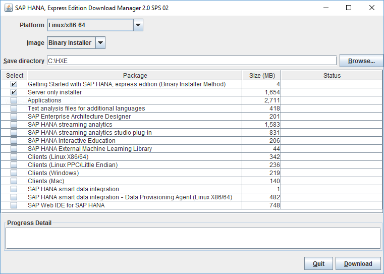

### You will learn
In this tutorial, you will install the dependencies needed and configure your Red Hat Enterprise Linux system for the setup and execution of SAP HANA, express edition.

Then you will learn how to download the binary installer archives of SAP HANA 2.0, express edition, decompress and install it on your server, including some additional packages for your SAP HANA 2.0, express edition installation.

For troubleshooting information, see [SAP HANA, express edition Troubleshooting](http://www.sap.com/developer/how-tos/2016/09/hxe-ua-troubleshooting.html).

> ### **Note:**
>**This tutorial was build and tested using SAP HANA, express edition 2.0 SPS02 revision 21 and Red Hat Enterprise Linux 7.2 for `x86-64` as VMware Virtual Machine**.

&nbsp;

## Details

### Time to Complete
**90 Min**

[ACCORDION-BEGIN [Step 1: ](Verify your Machine Requirements)]

Before you get started, you should check if your machine meet the recommended software and hardware to successfully install and run SAP HANA 2.0, express edition.

> ### **Note: Supported Platform Disclaimer**
>
>The operating systems officially supported by ***SAP HANA, express edition 1.0 SPS12*** include:
>
> - SUSE Linux Enterprise for SAP Applications, 11.4, 12.0, 12.1
> - Red Hat Enterprise Linux 7.2
>
>The operating systems officially supported by ***SAP HANA, express edition 2.0*** include:
>
> - SUSE Linux Enterprise Server for SAP Applications, 12.1, 12.2
> - SUSE Linux Enterprise Server for SAP Applications, IBM Power Systems (`ppc64le` - "Little Endian"), 12.1, 12.2
>
>SAP Community members have been successful in running HXE on newer or other Linux operating systems that are not formally supported by SAP, such as Ubuntu, openSUSE and Fedora.
>
However, SAP is not committing to resolving any issues that may arise from running SAP software on any unsupported platforms.
>

&nbsp;

Your server will need the following:

Hardware | Details
---------|-----------------
RAM      | 24 GB minimum (32 GB recommended)<br><br> <blockquote> <b>Note:</b> If you are installing on a system with 16 GB of RAM, increase the amount of swap space to at least 32 GB.</blockquote>
HDD      | 120 GB HDD recommended
Cores    | 2 cores (4 recommended)

#### <u><b>RAM</b></u>&nbsp;

To check the amount of RAM memory available on your system you can execute the following as the root user or using `sudo` from your server terminal console:

```bash
free -m
```

And the output will look like this:

```
        total   used   free   shared  buff/cache   available
Mem:     7808   7265    133       23         409         235
Swap:    8064   3627   4437
```

#### <u><b>HDD (Hard Drive Disk)</b></u>&nbsp;

To check the amount of disk space available on your system, you can execute the following as the root user or using `sudo` from your server terminal console:

```bash
df --block-size=1G
```

Here it is important to consider that the software will be installed in the `/usr/sap` directory.

#### <u><b>CPU</b></u>&nbsp;

To check the number of CPU available on your system, you can execute the following as the root user or using `sudo` from your server terminal console:

```bash
grep -c ^processor /proc/cpuinfo
```

[ACCORDION-END]

[ACCORDION-BEGIN [Step 2: ](Prepare Your System)]

#### <u><b>Red Hat Enterprise Linux for SAP HANA Subscription</b></u>&nbsp;

In order to install and run SAP HANA, express edition on a Red Hat Enterprise Linux (RHEL) operating system, the following additional Red Hat software components must be installed via ***Red Hat Enterprise Linux for SAP HANA channel***:

- Scalable File System Add-On (XFS).
- `compat-sap-c++.so` package which is the `gcc-4.7 libstdc++` rebuilt for RHEL.
- tuned profiles `sap-hana` and `sap-hana-vmware`

An overview of the ***Red Hat Enterprise Linux for SAP HANA Subscription*** is available here:

 - <a href="https://access.redhat.com/articles/1187363" target="new">https://access.redhat.com/articles/1187363</a>

And the detailed options and instructions to subscribe your RHEL system to the ***RHEL for SAP HANA channel*** are available here:

 - <a href="https://access.redhat.com/solutions/2334521" target="new">https://access.redhat.com/solutions/2334521</a>

Once your system is properly configured with the subscription, you should be able to run the following command from a terminal console on your server either as the root user or using `sudo`:

```bash
yum repolist
```

In the output you should have an entry like **`RHEL EUS Server SAP HANA`**.

Now, let's clean cached data.

From your server terminal console, execute the following as the root user or using `sudo`:

```bash
yum clean all
```

#### <u><b>Environment package</b></u>&nbsp;

In order to install and run SAP HANA, express edition on your RHEL system, you will need the ***Base*** environment group package, as the ***Core*** or the ***Minimal*** group package is not enough.

From your server terminal console, execute the following as the root user or using `sudo` to get the available group packages:

```bash
yum grouplist
```

The ***Base*** environment group package may not be marked as installed in the previous list which may require to run the following command:

```bash
yum group mark convert
```

If not installed, then run the following command:

```bash
yum -y groupinstall base
```

#### <u><b>Required packages</b></u>&nbsp;

You also need the following packages to be installed before getting started:

- `kernel-3.10.0-514.28.1.el7` or newer
- `kexec-tools-2.0.7-50.el7_3.2` or newer
- `glibc-2.17-157.el7_3.5` or newer

To verify that the packages are available, you can execute the following as the root user or using `sudo`:

```bash
rpm -qa --queryformat '(%{installtime:date}) %{name} %{version}\n' kernel
rpm -qa --queryformat '(%{installtime:date}) %{name} %{version}\n' kexec-tools
rpm -qa --queryformat '(%{installtime:date}) %{name} %{version}\n' glibc
```

#### <u><b>Additional packages dependencies</b></u>&nbsp;

We also need to install the following additional packages dependencies:

|-------------------|-----------------|-------------------|-------------------------|
|xulrunner 					| sudo 						| libssh2 					| expect 									|
|graphviz 					| iptraf-ng 			| krb5-workstation 	| libpng12 								|
|nfs-utils 					| lm_sensors 			| openssl 					| PackageKit-gtk3-module 	|
|libcanberra-gtk2 	| xorg-x11-xauth 	| numactl 					| bind-utils 							|

From your terminal console, execute the following as the root user or using `sudo`:

```bash
yum -y install xulrunner \
	sudo \
	libssh2 \
	expect \
	graphviz \
	iptraf-ng \
	krb5-workstation \
	libpng12 \
	nfs-utils \
	lm_sensors \
	openssl \
	PackageKit-gtk3-module \
	libcanberra-gtk2 \
	xorg-x11-xauth \
	numactl \
	bind-utils
```

The command uses the `-y` which will assume that all question like using more space will be answered as yes.

As the output may be long and not easy visualize, you can run the command again, you should be able to spot easily packages that can't install as properly installed ones won't get reinstalled.

#### <u><b>RHEL SAP HANA Compatibility Library</b></u>&nbsp;

The `gcc-4.7 libstdc++` library is required to install and run SAP HANA in general whatever the Linux distribution.

A compatibility library was built for RHEL by Red Hat to enable the SAP HANA installation & execution, and this requirement is applicable to any SAP HANA, express edition installations on RHEL.

The compatibility library is available via the **Red Hat Enterprise Linux for SAP HANA Subscription**, which was configured during the first step.

To verify is the package was previously installed, you can execute the following as the root user or using `sudo`:

```bash
rpm -qa --queryformat '(%{installtime:date}) %{name}\n' compat-sap-c++-6
```

The output should include an entry with version 6.3.1 or higher.

To install the package if it is missing or with an older version, execute the following as the root user or using `sudo`:

```bash
yum -y install compat-sap-c++-6
```

#### <u><b>Activate the RHEL SAP HANA Specific Tuned Profiles</b></u>&nbsp;

The tuned tuning service for Linux can adapt the operating system to perform better under certain workloads by setting a tuning profile.

Red Hat has developed specific tuned profiles to optimize the performance of SAP HANA on RHEL.

From your terminal console, execute the following as the root user or using `sudo`:

```bash
yum -y install tuned-profiles-sap-hana
```

Now you need to start and enable the tuning service by executing the following as the root user or using `sudo`:

```bash
systemctl start tuned
systemctl enable tuned
```

You can check the service status using the following command:

```bash
systemctl status tuned
```

Once started, you can run execute the profile by executing the following as the root user or using `sudo`:

```bash
tuned-adm profile sap-hana
```

> **Note:** when executing RHEL on VMware the tuned profile is named `sap-hana-vmware`

&nbsp;

#### <u><b>Disable SELinux</b></u>&nbsp;

RHEL 7.2 is delivered with `SELinux` enabled by default. Since there is no supported `SELinux` policy for SAP HANA, `SELinux` must be disabled to be able to run SAP HANA on RHEL7.

From your terminal console, execute the following as the root user or using `sudo`:

```bash
setenforce 0
sed -i 's/\(SELINUX=enforcing\|SELINUX=permissive\)/SELINUX=disabled/g' /etc/selinux/config
```

For the change to permanently take effect you will need to restart your system, but we will do that at the end of the configuration.

You can check the service status using the following command:

```bash
sestatus
```

It should return the following:

```
SELinux status:                 disabled
```

You can check the service status using the following command:

```bash
getenforce
```

It should return the following:

```
Disabled
```

#### <u><b>Disable Automatic NUMA Balancing</b></u>&nbsp;

SAP HANA is aware of NUMA (non-uniform memory access), and it does not rely on the Linux kernel features to optimize NUMA usage automatically.

Therefore, the automatic NUMA balancing features of the Linux Kernel should be disabled.

To disable this feature, from your terminal console, execute the following as the root user or using `sudo`:

```bash
cp /etc/sysctl.d/sap_hana.conf /etc/sysctl.d/sap_hana.conf.bkp
echo "kernel.numa_balancing = 0" > /etc/sysctl.d/sap_hana.conf
sysctl -p /etc/sysctl.d/sap_hana.conf
```

RHEL7 also provides the ***`numad`*** user space daemon that can be used to control NUMA balancing of applications. This needs to be disabled as well using the executing the following as the root user or using `sudo`:

```bash
systemctl stop numad
systemctl disable numad
```

#### <u><b>Symbolic Links</b></u>&nbsp;

Since SAP HANA is built on a different Linux Distribution some of the library names used during the built process do not match with the library names used on RHEL7.

Check if the following symbolic exists by execute the following commands:

```bash
ls -la /usr/lib64/libssl.so.1.0.1 /usr/lib64/libcrypto.so.1.0.1
```

Make sure they point to respectively:

```
lrwxrwxrwx. 1 root root XX yyy zz aa:bb /usr/lib64/libcrypto.so.1.0.1 -> /usr/lib64/libcrypto.so.1.0.1e
lrwxrwxrwx. 1 root root XX yyy zz aa:bb /usr/lib64/libssl.so.1.0.1 -> /usr/lib64/libssl.so.1.0.1e
```

If they are not present you can add them by executing the following as the root user or using `sudo`:

```bash
ln -s /usr/lib64/libssl.so.1.0.1e /usr/lib64/libssl.so.1.0.1
ln -s /usr/lib64/libcrypto.so.1.0.1e /usr/lib64/libcrypto.so.1.0.1
```

#### <u><b>Configure your Firewall</b></u>&nbsp;

To protect your servers from unauthorized access, it is usual to configure the built-in firewall of the OS to only allow its access via a specified series of ports and communication protocol.

To configure the firewall, you can use the `firewall-config` tool. In this case, you will need an X11 System to display the GUI version or you can use the command line tool `firewall-config-cmd`.

To avoid problems with the firewall during installation, it can be beneficial to disable it completely during the installation process with the following commands:

```bash
systemctl stop firewalld
systemctl disable firewall
```

#### <u><b>Java Version</b></u>&nbsp;

One the requirement to install SAP HANA, express edition is a 64-bit Java Runtime Environment (JRE) 8 or Higher, especially if you are planning to use the SAP HANA 2.0, express edition ***Download Manager***.

To check if Java is installed, you can run the following command from your terminal console:

```bash
java -version
```

which should return:

```
java version "1.8.0_xx"
Java(TM) SE Runtime Environment (build 1.8.0_xx-yyy)
```

If you don't have it yet installed, you can check the following link for download link and installation instructions : <a href="https://tools.hana.ondemand.com/#cloud" target="new">https://tools.hana.ondemand.com/#cloud</a>

Using the RPM option is most likely the easiest, as you will have to simply run the following command from your terminal command (where **<version>** needs to be adjusted based on the downloaded version) as the root user or using `sudo`:

```bash
rpm -ivh ./sapjvm-<version>-linux-x64.rpm
```

Then you will need to update the "alternatives" and enable your flavor of java using the following command as the root user or using `sudo`:

```bash
update-alternatives --install "/usr/bin/java" "java" "/usr/java/sapjvm_8_latest/bin/java" 1
update-alternatives --set java /usr/java/sapjvm_8_latest/bin/java
```

[ACCORDION-END]

[ACCORDION-BEGIN [Step 3: ](Reboot your system)]

Some of the changes applied requires a restart of the system to fully take effect, you must reboot your system before proceeding with the installation.

[ACCORDION-END]

[ACCORDION-BEGIN [Step 4: ](Register for SAP HANA, express edition)]

Go to the registration page at http://sap.com/sap-hana-express published on the SAP site.

Alternately, you can go to the SAP HANA, express edition launch page at http://www.sap.com/developer/topics/sap-hana-express.html published on SAP site and click the Register and download SAP HANA, express edition download manager link.

Complete the registration form and click the Register button. The Registration Success page displays. You will also receive an email indicating successful registration.

> **Note:**
>If you have an SAP login, click the Login icon at the top of the page to populate the registration form automatically.

&nbsp;


The **Registration Success** page displays. (You will also receive an email indicating successful registration.)


On the **Registration Success** page, under **1A. ON-PREMISE INSTALLATION**, you will get the different download manager options listed:

 - ***Linux*** (`HXEDownloadManager_linux.bin`)

	 This standard Linux executable allows you to run the download manager directly from your Linux server machine, using either the ***GUI Mode*** (assuming you have a X11 properly configured) or the ***Console Mode***

 - ***Windows*** (`HXEDownloadManager_win.exe`)

 This standard Windows executable allows you to run the download manager directly from your Window machine, using only the ***GUI Mode***. Then you will need to transfer the downloaded archives to you target server.

 - ***Platform-independent*** (`HXEDownloadManager.jar`)

 Allows you to run the download manager directly from any platform (as it is a Java based program), using either the ***GUI Mode*** or the ***Console Mode***.

 To run the Platform-independent download manager, you will need to execute the following:

```bash
java -jar HXEDownloadManager.jar
```

> **Note:** If you have a Mac, or another type of machine, click "Platform-independent" for a platform-independent download manager.

&nbsp;

You will find next the instructions for both the ***GUI Mode*** and the ***Console Mode***. We however, recommend you to use the ***Console Mode*** directly from the RHEL server.

Save the ***Platform-independent*** **Download Manager** file directly on your RHEL system.

> **Note:** If your RHEL system is not connected to the internet, then you have no choice but to save the Download Manager locally, download the packages locally then transfer them to your RHEL system.

&nbsp;

[ACCORDION-END]

[ACCORDION-BEGIN [Step 5:](Download Your Packages)]

As stated in the previous section you can download the installation packages either using a *GUI Mode* or a *Console Mode*.

You will find below the instructions for both. We however, recommend you to use the *Console Mode* directly from the RHEL server.

> **Note:** Again, if your RHEL system is not connected to the internet, then you have no choice but to save the Download Manager locally, download the packages locally (using either the *GUI Mode* or a *Console Mode*) then transfer them to your RHEL system.

&nbsp;

#### <u><b>Using the Console Mode</b></u>&nbsp;

> **Note:** Before, run running the Download Manager in console, make sure to close any open GUI Mode running instances.

&nbsp;

Open a command prompt or a terminal console at the location where you saved the *Platform-independent* download manager file.

You can display the command help using the `-h` argument like this:

```bash
java -jar HXEDownloadManager.jar -h
```

The command syntax is:

```bash
HXEDownloadManager [( [-h|-X] | [-d <save_directory>] [--ph <proxy_host>] [--pp <proxy_port>] <platform> <image> <file>... )]
```

> **Note:** You must include an argument with each command. If you call the Download Manager without an argument, it opens in GUI mode.

&nbsp;

You will need to download the following packages:

- *Server Only Installer*
- *Applications*
- *Client for Linux X86/64*
- *SAP HANA Interactive Education (SHINE)*
- *SAP HANA External Machine Learning AFL*
- *Text analysis files for additional languages*

Execute the following command as the root user or using `sudo`:

```bash
mkdir /opt/hxe
chmod a+rwx /opt/hxe
java -jar HXEDownloadManager.jar linuxx86_64 installer \
  -d /opt/hxe \
  --ph proxy \
  --pp 8080 \
  hxe.tgz \
  hxexsa.tgz \
  clients_linux_x86_64.tgz \
  shine.tgz \
  eml.tgz \
  additional_lang.tgz
```
The archive packages will be downloaded in the ***`/opt/hxe`***.

For more information about the other downloadable package, please refer to the ***Appendix*** step.

#### <u><b>Using the GUI Mode</b></u>&nbsp;

> **Note:** To run the download manager suing the GUI Mode, we assume that your RHEL is configured with a *Desktop* environment like GNOME or KDE.

&nbsp;

Start the download manager.



In the **Platform** pull-down, select **Linux/`x86-64`** (unless your target system is **Linux/Power (little endian)**.)

In the **Image** pull-down, select **Binary Installer**.

Click **Browse** and select where you want your downloads to be saved.

Then select the following packages:

- *Server Only Installer*
- *Applications*
- *Client for Linux X86/64*
- *SAP HANA Interactive Education (SHINE)*
- *SAP HANA External Machine Learning AFL*
- *Text analysis files for additional languages*

Click the **Download** button to being your download.

Your download is complete when a pop-up message appears confirming successful download. Make sure you wait for this message before accessing the downloaded files.

Now that the file are downloaded, you can transfer them to the ***`/opt/hxe`*** directory on your target RHEL system.

Make sure you update the read/write/execute permission on the `/opt/hxe` directory using the following command:

```bash
chmod a+rwx /opt/hxe
```

For more information about the other downloadable package, please refer to the ***Appendix*** step.

[ACCORDION-END]

[ACCORDION-BEGIN [Step 6:](Install SAP HANA, express edition)]

#### <u><b>Install the Server + Applications package</b></u>&nbsp;

We need to extract the contents of the downloaded archive packages using the following command:

From your server terminal console, execute the following as the root user or using sudo:

```bash
mkdir /opt/hxe/installer
tar -xvzf /opt/hxe/hxe.tgz -C /opt/hxe/installer
tar -xvzf /opt/hxe/hxexsa.tgz -C /opt/hxe/installer
```

> **Note:** the `hxe.tgz` package must be downloaded and extracted first whatever the installation you are planning as it include the *core* data units to be installed.

&nbsp;

Then, you will need to navigate to the directory where the archives were extracted and run `./setup_hxe.sh` as the root user or using sudo:

From your server terminal console, execute the following as the root user or using sudo:

```bash
cd /opt/hxe/installer
./setup_hxe.sh
```

Accept the prompts default values (unless no value is provided) to configure your installation:

|--------------------------|---------------------------------------|
| Installer root directory | `/opt/hxe/installer/HANA_EXPRESS_20`
| SAP HANA system ID       | HXE
| HANA instance number     | 90
| Components to install    | all
| local host name          | should display your local host name
| HDB master password      | you will need to conform to the *Master password policy* as described bellow

Once the installation is completed, you should get the following elements in your console:

```
  ##################################
  # Summary after execution        #
  ##################################
  Server Installation...(OK)
  XSC Installation...(OK)
  XSA Installation...(OK)
  HXE Optimization...(OK)

```

After the installation is completed, we encourage you to run the ***Memory Management Script*** as described in the ***Best Practice*** to release all unused resources and free up some memory.

```bash
cd /usr/sap/HXE/home/bin
./hxe_gc.sh
```

> **Note: Master password policy**
> The master password you will specify is used for the `<sid>adm` and `sapadm` OS users, the telemetry technical user, and the HANA SYSTEM user.
>
> SAP HANA, express edition requires a very strong password that complies with these rules:
>
> - At least 8 characters
> - At least 1 uppercase letter
> - At least 1 lowercase letter
> - At least 1 number
> - Can contain special characters, but not _&grave;_ (backtick), _&#36;_ (dollar sign),  _&#92;_ (backslash), _&#39;_ (single quote), or _&quot;_ (double quotes)
> - Cannot contain dictionary words
> - Cannot contain simplistic or systematic values, like strings in ascending or descending numerical or alphabetical order

&nbsp;

#### <u><b>Install the Client for Linux</b></u>&nbsp;

The downloaded archive for the client package contains both the ***SAP HANA HDB Client*** and the ***SAP HANA XS CLI***.

Here we will only install the ***SAP HANA HDB Client***, as the ***SAP HANA XS CLI*** is only applicable for a ***Server + Applications*** installation.

The ***SAP HANA HDB Client*** software package includes the following connectivity/drivers:

 - SQLDBC
 - ODBC
 - JDBC
 - Python (PyDBAPI)
 - Node.js
 - Ruby

Then, we need to extract the contents of `clients_linux_x86_64.tgz` into the ***`/opt/hxe`*** directory using the following command:

```bash
tar -xvzf /opt/hxe/clients_linux_x86_64.tgz -C /opt/hxe
```
The following files will be extracted:

 - ***`hdb_client_linux_x86_64.tgz`*** : the *SAP HANA HDB Client* software package
 - ***`xs.onpremise.runtime.client_linuxx86_64.zip`*** : the *SAP HANA XS CLI* software package

We need now to decompress the *SAP HANA HDB Client* package executing the following command as the root user or using sudo:

```bash
tar -xvzf /opt/hxe/hdb_client_linux_x86_64.tgz -C /opt/hxe/installer
```

And now run the installer program executing the following commands as the root user or using sudo

```bash
cd /opt/hxe/installer/HDB_CLIENT_LINUX_X86_64
./hdbinst
```

Accept the prompts default values to configure your installation:

 - Installation Path : `/usr/sap/hdbclient`


Once the installation is completed, you should get the following elements in your console:

```
Installation done
```

#### <u><b>Install the SAP HANA External Machine Learning AFL package</b></u>&nbsp;

We need to extract the contents of the downloaded archive packages using the following command:

From your server terminal console, execute the following as the root user or using sudo:

```bash
mkdir /opt/hxe/installer
tar -xvzf /opt/hxe/eml.tgz -C /opt/hxe/installer
```

We need now to login as the `<sid>adm` user (where `<sid>` is your system identifier in lower case which by default is `HXE` so `hxeadm`).

From a terminal console, execute the following command:

```bash
sudo su -l hxeadm
```

You should be prompted for the master password.

Then, you will need to navigate to the `HANA_EXPRESS_20` directory run the installer script:

From your server terminal console, execute the following:

```bash
cd /opt/hxe/installer/HANA_EXPRESS_20
./install_eml.sh
```

Once the installation is completed, you should get the following elements in your console:

```
Installation done
```

After the installation is completed, we encourage you to run the ***Memory Management Script*** as described in the ***Best Practice*** to release all unused resources and free up some memory.

```bash
cd /usr/sap/HXE/home/bin
./hxe_gc.sh
```

#### <u><b>Install the SAP HANA Interactive Education (SHINE)</b></u>&nbsp;

SAP HANA Interactive Education (SHINE) makes it easy to learn how to build applications on SAP HANA Extended Application Services Advanced Model.

We need to extract the contents of the downloaded archive packages using the following command:

From your server terminal console, execute the following as the root user or using sudo:

```bash
mkdir /opt/hxe/installer
tar -xvzf /opt/hxe/shine.tgz -C /opt/hxe/installer
```

We need now to login as the `<sid>adm` user (where `<sid>` is your system identifier in lower case which by default is `HXE` so `hxeadm`).

From a terminal console, execute the following command:

```bash
sudo su -l hxeadm
```

You should be prompted for the master password.

Then, you will need to navigate to the `HANA_EXPRESS_20` directory run the installer script:

From your server terminal console, execute the following:

```bash
cd /opt/hxe/installer/HANA_EXPRESS_20
./install_shine.sh
```

You will be prompted to enter the SYSTEM and `XSA_ADMIN` credentials where you should enter the master password.

You will also be prompted to enter new credentials for the **`XSA_SHINE`** user that will be created during the process (we recommend you to use the same master password provided earlier).

Once the installation is completed, you should get the following elements in your console:

```
Software component XSAC_SHINE (sap.com) 'SAP Hana Demo Model for XS Advanced 1.0' successfully registered.
Process [install] finished successfully.
Performance /opt/hxe/installer/HANA_EXPRESS_20/DATA_UNITS/XSA_CONTENT_10/XSACSHINE04_2.ZIP: UploadFiles 9.99 s (9985 ms), Installation 9 m 49 s (589148 ms).
Installation of archive file '[/opt/hxe/installer/HANA_EXPRESS_20/DATA_UNITS/XSA_CONTENT_10/XSACSHINE04_2.ZIP]' finished successfully.
To see installation logs execute 'xs display-installation-logs 3001 -scv'.
```

After the installation is completed, we encourage you to run the ***Memory Management Script*** as described in the ***Best Practice*** to release all unused resources and free up some memory.

```bash
cd /usr/sap/HXE/home/bin
./hxe_gc.sh
```

#### <u><b>Install the additional Text Analysis files</b></u>&nbsp;

If you want to use the SAP HANA, express edition **Text Analysis** feature in a language other than English or German, you will need to install the **Text analysis files for additional languages** package.

You should be prompted for the master password provided during the installation process.

Then, extract the contents of `additional_lang.tgz` to the ***`lexicon`*** directory using the following command as the root user or using sudo:

```bash
tar -xvzf /opt/hxe/additional_lang.tgz -C /hana/shared/HXE/global/hdb/custom/config/lexicon
```

[ACCORDION-END]

[ACCORDION-BEGIN [Step 7: ](Test Your Installation)]

#### <u><b>Running processes</b></u>&nbsp;

By default, when the server installation is completed, all required process should be started.

Here are the steps to verify that all the required processes are up and running.

We need first to login as the `<sid>adm` user (where `<sid>` is your system identifier in lower case which by default is `HXE` so `hxeadm`).

From a terminal console, execute the following command:

```bash
sudo su -l hxeadm
```

Then execute the following command to get the list of running services:

```bash
HDB info | grep -e hdbnameserver -e hdbcompileserver -e hdbindexserver -e hdbdiserver -e hdbwebdispatcher
```

The output should look like this:

```
hxeadm    71252  71235 55.2 7982280 5377200      \_ hdbnameserver
hxeadm    71347  71235  2.1 1580412 257312      \_ hdbcompileserver
hxeadm    71374  71235 12.8 5321396 2845732      \_ hdbindexserver -port 39003
hxeadm    71516  71235  1.6 1588012 260768      \_ hdbdiserver
hxeadm    71518  71235  1.9 1880592 279788      \_ hdbwebdispatcher
```

The following services must be running:

  * `hdbnameserver`
  * `hdbcompileserver`
  * `hdbindexserver`
  * `hdbdiserver`
  * `hdbwebdispatcher`

If any of the above services is not listed, you must start your instance executing the following command:

```bash
HDB start
```

When the prompt returns, the system is started.

#### <u><b>SAP HANA Client</b></u>&nbsp;

You can check the following links to verify some of the connectivity options available for the ***SAP HANA HDB Client***:

 - <a href="https://www.sap.com/developer/how-tos/2016/08/hxe-connect-hxe-using-jdbc.html" target="new">JDBC</a>
 - <a href="https://www.sap.com/developer/how-tos/2016/08/hxe-python-connection.html" target="new">Python</a>
 - ODBC (content coming soon!)
 - SQLDBC (content coming soon!)
 - Node.js (content coming soon!)
 - Ruby (content coming soon!)

#### <u><b>SAP HANA External Machine Learning Library (EML)</b></u>&nbsp;

The SAP HANA External Machine Learning Library is an application function library (AFL) supporting the integration of Google `TensorFlow`, as an external machine learning framework, with SAP HANA, express edition.

Let's now test that the installation was successful using the following `hdbsql` command from a terminal console :

```bash
cd /usr/sap/<SID>/HDB<instance-number>/exe

./hdbsql \
	-i <instance-number> \
	-d SystemDB \
	-u SYSTEM \
	-p "<SYSTEM-password>" \
	"SELECT * FROM SYS.AFL_AREAS WHERE AREA_NAME = 'EML';"
```

Make sure to replace:

 - `<SID>` by your instance identifier (the default value is ***HXE***)
 - `<instance-number>` by your instance number (the default value is ***90***)
 - `<SYSTEM-password>` by the master password as provided during the installation
 - `<admin-username>` and `<admin-password>` by the new admin user name you want to create and the associated password

You should receive a result similar to this:

```
AREA_OID,SCHEMA_NAME,AREA_NAME,CREATE_TIMESTAMP
159136,"_SYS_AFL","EML","<installation date>"
```
#### <u><b>XS Engine</b></u>&nbsp;

you can check that the `XSEngine` is running from your browser using the following URL:

```URL
http://<hostname>:80<instance-number>
```

or

```URL
https://<hostname>:43<instance-number>
```

The `<hostname>` and the `<instance-number>` shall be replaced by the SAP HANA, express edition instance IP address or host name used during the installation.

A success page displays:


If you can't connect to the page you can verify that the port is in LISTEN mode using the following command:

```bash
netstat -ano | grep -e 8090 -e 4390 | grep LISTEN
```

And the expected result should be:

```
tcp   0   0 0.0.0.0:8090    0.0.0.0:*     LISTEN   off (0.00/0/0)
tcp   0   0 0.0.0.0:4390    0.0.0.0:*     LISTEN   off (0.00/0/0)
```

If the result is empty, then one of the required services is not up and running else your firewall is blocking the communication.

#### <u><b>XSA Engine</b></u>&nbsp;

As we have installed the *Server + Applications* binary (`hxe.tgz` + `hxexsa.tgz`), you can test your XSA installation with the following instructions.

From a terminal console logged in as the `<sid>adm` user, execute the following command to log in to the XSA services (where `<master-password>` shall be replaced by master password provided during the installation):  

```bash
xs login -u xsa_admin -p "<master-password>"
```  

Then execute the following command to view the list of XSA applications and their statuses:  

```bash
xs apps
```

> **Note:** When you run the `xs apps` command for the first time, it may take 1-2 minutes for the system to return the list of XSA applications.

&nbsp;

Check that the application **`cockpit-admin-web-app`** is shown as **STARTED** with 1/1 instances in the list of XSA applications using the following command:

```bash
xs apps | grep cockpit-admin-web-app
```

> **Note:** Normally it only takes a few minutes for XSA services to start. However. depending on your machine, it can take over 30 minutes for XSA services to begin. If the service doesn't show STARTED and doesn't show 1/1 instances, keep waiting until the service is enabled.

&nbsp;

Open in your browser the URL for the `cockpit-admin-web-app` application (here as an example: `https://my.hostname:51043` from the screenshot).


> **Note:** the host name and port will be different from the screenshot.

&nbsp;

> **Note:** If you receive a ***Forbidden*** message while accessing the URL, this means that you currently have a pending session with a different user name. Opening a new browser window or using the icognito mode usually help solve this issue.

&nbsp;

> ### **Warning**: If you are using a browser from outside your the server itself, your network host name resolution may not allow you to use the host name displayed in the list.
>Therefore you may need to either:
>   - make sure your server is properly registered in your DNS
>   - replace the host name by the host IP address
>   - configure your host file

&nbsp;

Then, you can login using `XSA_ADMIN` as the username and the master password provided during the installation.

When you connect for the first time, you will receive a message regarding missing COCKPIT_ADMIN role collection. Accept the COCKPIT_ADMIN role collection to be added to the `XSA_ADMIN` user.

Login again using `XSA_ADMIN` as the username and the master password.

Make sure to logout before moving to the next step.


#### <u><b>SAP Web IDE for SAP HANA</b></u>&nbsp;

SAP Web IDE for SAP HANA is a browser-based integrated development environment for the development of applications comprised of extensive SAP HANA data models, business logic, and web-based `UIs`.

Before installing the Web IDE, you must have installed the Applications package.

From a terminal console, we need first to login as the `<sid>adm` user (where `<sid>` is your system identifier in lower case, by default `HXE` so `hxeadm`), execute the following command:

```bash
sudo su -l <sid>adm
```

You should be prompted for the master password.

Execute the following command to get the SAP Web IDE for SAP HANA application URL where `<master-password>` is the `XSA_ADMIN` password which should be the master password:

```bash
xs login -u xsa_admin -p "<master-password>"
```

Check that the application **`webide`** shows **STARTED** in the list of XSA applications , and has 1/1 instances. (If the list shows 0/1 in the instance column, the application is not started.) using the following command:

```bash
xs apps | grep webide
```

Get application URL using the following command:

```bash
xs app webide -urls
```

Open the returned URL in your browser.

> **Note:** If you receive a ***Forbidden*** message while accessing the URL, this means that you currently have a pending session with a different user name. Opening a new browser window or using the icognito mode usually help solve this issue.

&nbsp;

> ### **Warning**: If you are using a browser from outside your the server itself, your network host name resolution may not allow you to use the host name displayed in the list.
>Therefore you may need to either:
>   - make sure your server is properly registered in your DNS
>   - replace the host name by the host IP address
>   - configure your host file

&nbsp;

This should give you access to the *SAP Web IDE for SAP HANA* login screen.

Use the `XSA_DEV` user and credentials that was created during the installation process to login.

You should then reach the following screen:


#### <u><b>SAP HANA Interactive Education (SHINE)</b></u>&nbsp;

SAP HANA Interactive Education (SHINE) makes it easy to learn how to build applications on SAP HANA Extended Application Services Advanced Model.

From a terminal console, we need first to login as the `<sid>adm` user (where `<sid>` is your system identifier in lower case, by default `HXE` so `hxeadm`), execute the following command:

 ```bash
 sudo su -l <sid>adm
 ```

You should be prompted for the master password.

Execute the following command to get the SHINE application URL where `<master-password>` is the `XSA_ADMIN` password (the master password):

```bash
xs login -u xsa_admin -p "<master-password>"
xs app shine-web -urls
```

Open the returned URL in your browser.

This should give you access to the *SAP HANA Interactive Education* login screen.

Use the `XSA_SHINE` user and credentials that was created during the package installation process to login.

You should then reach the following screen:


[ACCORDION-END]

[ACCORDION-BEGIN [Best Practice: ](Deactivate the SYSTEM user)]

The SYSTEM user is the database "super-user" and is not intended for day-to-day activities in production systems.

For better security, you can create other database users with only the privileges that they require for their tasks (for example, user administration), then deactivate the SYSTEM user.

We need first to login as the `<sid>adm` user (where `<sid>` is your system identifier in lower case which by default is `HXE` so `hxeadm`).

From a terminal console, execute the following command:

```bash
sudo su -l hxeadm
```

Create a new admin user with the USER ADMIN system privilege using the following commands:

```bash
cd /usr/sap/<SID>/HDB<instance-number>/exe

./hdbsql \
	-i <instance-number> \
	-d SystemDB \
	-u SYSTEM \
	-p "<SYSTEM-password>" \
	"CREATE USER <admin-username> PASSWORD <admin-password> NO FORCE_FIRST_PASSWORD_CHANGE;"

./hdbsql \
	-i <instance-number> \
	-d SystemDB \
	-u SYSTEM \
	-p "<SYSTEM-password>" \
	"GRANT USER ADMIN TO <admin-username> WITH ADMIN OPTION;"
```

Make sure to replace:

 - `<SID>` by your instance identifier (the default value is ***HXE***)
 - `<instance-number>` by your instance number (the default value is ***90***)
 - `<SYSTEM-password>` by the master password as provided during the installation
 - `<admin-username>` and `<admin-password>` by the new admin user name you want to create and the associated password

Now that the new admin user is created, you can deactivate the SYSTEM user:

> ### **Warning**: do not run the next command until you have successfully created an alternate admin user.

&nbsp;

```bash
cd /usr/sap/<SID>/HDB<instance-number>/exe

./hdbsql \
	-i <instance-number> \
	-d SystemDB \
	-u <admin-username> \
	-p "<admin-password>" \
	"ALTER USER SYSTEM DEACTIVATE USER NOW;"
```

[ACCORDION-END]

[ACCORDION-BEGIN [Best Practice: ](Backups)]

It a good practice to make regular data backups and save your work.

For information on data backup, recovery, and log file growth, see the <a href="https://help.sap.com/viewer/6b94445c94ae495c83a19646e7c3fd56/2.0.00/en-US" target="new">SAP HANA 2.0 Administration Guide</a>.

[ACCORDION-END]

[ACCORDION-BEGIN [Best Practice: ](Set the Global Memory Allocation Limit)]

You can set how much memory SAP HANA, express edition utilizes by modifying the `global_allocation_limit` parameter in the `global.ini` file.

The measure unit for the `global_allocation_limit` parameter is MB.

The default value is 0, which sets the maximum memory to the minimum of your machine limit and license limit.

If the machine size is less than 16 GB, the maximum memory is set to 16 GB.

If you set `global_allocation_limit` to a non-zero value, the server instance will use that value as maximum memory.

Here an example command to alter the `global_allocation_limit` value to 16 GB (to be executed as `hxeadm` user):

```bash
cd /usr/sap/HXE/HDB90/exe
./hdbsql \
	-i 90 \
	-d SystemDB \
	-u SYSTEM \
	-p "<master_password>" \
  "alter system alter configuration ('global.ini','SYSTEM') set ('memorymanager', 'global_allocation_limit') = '16384' with reconfigure;"
```

> **Note:** Do not set `global_allocation_limit` to a value above the limit of your license. This may cause the database to lock down.

&nbsp;

[ACCORDION-END]

[ACCORDION-BEGIN [Best Practice: ](Run the Memory Management Script)]

On a regular basis, we recommend you to use the memory management / Garbage collector script to free up available memory.

From a terminal console, we need first to login as the `<sid>adm` user (where `<sid>` is your system identifier in lower case, by default `HXE` so `hxeadm`), execute the following command:

```bash
sudo su -l hxeadm
```

Then you can execute the following:

```bash
cd /usr/sap/HXE/home/bin
./hxe_gc.sh
```

When prompted for System database user (SYSTEM) password, enter the master password you specified during SAP HANA, express edition installation.

The command prompt returns when the cleanup process is finished, and the expected logs shoudl be displayed in the console:

```
tcp   0   0 0.0.0.0:8090    0.0.0.0:*     LISTEN   off (0.00/0/0)
```

[ACCORDION-END]

[ACCORDION-BEGIN [Best Practice: ](Text Analysis As Embedded Preprocessor)]

If your tables do not use a full text index, or if your tables use a full text index but contain very little data, you can save about 120 MB of memory if you turn off the standalone text analysis preprocessor, and activate the embedded text analysis preprocessor.

Stop the standalone preprocessor:

```bash
cd /usr/sap/HXE/HDB90/exe
./hdbsql \
	-i 90 \
	-d SystemDB \
	-u SYSTEM \
	-p "<master_password>" \
  "alter system alter configuration ('daemon.ini','SYSTEM') set ('preprocessor','instances') = '0' with reconfigure;"
```

Start the embedded preprocessor:

```bash
cd /usr/sap/HXE/HDB90/exe
./hdbsql \
	-i 90 \
	-d SystemDB \
	-u SYSTEM \
	-p "<master_password>" \
  "alter system alter configuration ('preprocessor.ini','SYSTEM') set ('general','embedded') = 'true' with reconfigure;"
```

[ACCORDION-END]

[ACCORDION-BEGIN [Best Practice: ](Firewall Configuration)]

SAP HANA, express edition, just like SAP HANA, will use a series of port based on the current instance id (the default value is ***90*** starting version 2.0).

Here a description of the port used (Source <a href="https://help.sap.com/viewer/ports" target="new">https://help.sap.com/viewer/ports</a>):

Name                     | Default | Range                      | Rule              | Comments (Explanation of Table Headings)
-------------------------|---------|----------------------------|-------------------|--------------------
Host Agent               | 1128    | 1128                       | 1128              | SAP Host Agent with SOAP/HTTP
Host Agent               | 1129    | 1129                       | 1129              | SAP Host Agent with SOAP/HTTPS
HTTPS                    | 4300    | <nobr>4300 – 4399</nobr>   | 43&lt;NN&gt;      | SAP Web Dispatcher
HTTP                     | 8000    | <nobr>8000 – 8099</nobr>   | 80&lt;NN&gt;      | SAP Web Dispatcher
`indexserver`            | 30013   | <nobr>30013 – 39913</nobr> | 3&lt;NN&gt;13     | SQL/MDX access port for standard access to the system database of a multitenant system.
`indexserver`            | 30015   | <nobr>30015 – 39915</nobr> | 3&lt;NN&gt;15     | SQL/MDX access port for standard access to the tenant database of a multitenant system (automatically created).
`statisticsserver`       | 30017   | <nobr>30017 – 39917</nobr> | 3&lt;NN&gt;17     | Applicable when run as a separate service (default is embedded).
HTTP(S)                  | 30030   | <nobr>30030 – 39930</nobr> | 3&lt;NN&gt;30     | In an XSA runtime environment and port routing used, allow data access connection to the `xscontroller-managed` Web Dispatcher
HTTP(S)                  | 30032   | <nobr>30032 – 39932</nobr> | 3&lt;NN&gt;32     | In an XSA runtime environment and port routing used, allow data access connection to the `xscontroller-managed` Web Dispatcher
HTTP(S)                  | 30033   | <nobr>30033 – 39933</nobr> | 3&lt;NN&gt;33     | Single port for all SAP HANA XSA application and services when routing is done by host names instead of ports. For more information see SAP Note 2245631.
`indexserver`            | None    | <nobr>30041– 39998</nobr>  | 3&lt;NN&gt;41 – 3&lt;NN&gt;98 | SQL/MDX access port for standard access to the tenant databases of a multitenant system. Port assigned automatically from available port at creation time.
SOAP/HTTP                | 50013   | <nobr>50013 – 59913</nobr> | 5&lt;NN&gt;13     | Instance Agent
SOAP/HTTPS               | 50014   | <nobr>50014 – 59914</nobr> | 5&lt;NN&gt;14     | ‌Instance Agent
HTTP(S)                  | None    | <nobr>51000 – 51500</nobr> | 51000 – 51500     | In an XSA runtime environment and port routing used, port range used for the connection from the `xscontroller-managed` Web Dispatcher to the `xscontroller` for application instances access

> **Note**: &lt;NN&gt; represent the instance id of your SAP HANA, expression edition. The default value is 90.

&nbsp;

Therefore, if your instance number is ***90***, here is an example for the firewall configuration.

You can execute the following as the root user or using `sudo`:

```bash
echo "<?xml version=\"1.0\" encoding=\"utf-8\"?>" > /etc/firewalld/services/hana.xml
echo "<service>" >> /etc/firewalld/services/hana.xml
echo "	<short>SAP HANA</short>" >> /etc/firewalld/services/hana.xml
echo "	<description>Firewall rules for SAP HANA</description>" >> /etc/firewalld/services/hana.xml
echo "	<port port=\"1128\" protocol=\"tcp\"/>" >> /etc/firewalld/services/hana.xml
echo "	<port port=\"1129\" protocol=\"tcp\"/>" >> /etc/firewalld/services/hana.xml
echo "	<port port=\"4390\" protocol=\"tcp\"/>" >> /etc/firewalld/services/hana.xml
echo "	<port port=\"8090\" protocol=\"tcp\"/>" >> /etc/firewalld/services/hana.xml
echo "	<port port=\"30000-39999\" protocol=\"tcp\"/>" >> /etc/firewalld/services/hana.xml
echo "	<port port=\"50000-59999\" protocol=\"tcp\"/>" >> /etc/firewalld/services/hana.xml
echo "</service>" >> /etc/firewalld/services/hana.xml

chmod 0640 /etc/firewalld/services/hana.xml

systemctl start firewalld
systemctl enable firewalld

firewall-cmd --zone=public --add-service=hana --permanent
firewall-cmd --reload
```

You can check the service status using the following command where `hana` should be listed:

```bash
firewall-cmd --list-services
```
[ACCORDION-END]

[ACCORDION-BEGIN [Appendix: ](Download Manager)]

#### <u><b>Using the GUI Mode</b></u>&nbsp;

When using the GUI Mode, you will be able to download the following packages.

The table below provide more details around each package.

<style>
  th, td {
      border: 1px solid black;
      vertical-align:top;
  }
</style>

<table>
  <tr>
    <th style="width: 30%">Package</th>
    <th>Details</th>
  </tr>
  <tr>
    <td><nobr><b>Getting Started Guide</b></nobr></td>
    <td>
      User manual in PDF format
    </td>
  </tr>
  <tr>
    <td><nobr><b>Server only installer (Required)</b></nobr></td>
    <td>
      Downloads <code>hxe.tgz</code>; the SAP HANA 2.0, express edition server with Application Function Library.
      </br>
      <b>This file is necessary for installing SAP HANA 2.0, express edition.</b>
    </td>
  </tr>
  <tr>
    <td><b>Applications</b></td>
    <td>
      Downloads the optional package <code>hxexsa.tgz</code>; XSA and SAP HANA cockpit.
      </br>
      <b>The "Server only" package is required to install this package.</b>
    </td>
  </tr>
  <tr>
    <td><b>Text analysis files for additional languages</b></td>
    <td>
      For languages other than English and German, these files are required for the HANA Text Analysis function.
      <br>
      The text analysis files for English and German are already included in the Server only and Applications packages.
      <br>
      <b>The "Server only" package is required to install this package.</b>
    </td>
  </tr>
  <tr>
    <td><b>SAP Enterprise Architect Designer</td>
    <td>Downloads <code>eadesigner.tgz</code></td>
  </tr>
  <tr>
    <td><b>SAP HANA streaming analytics</b></td>
    <td>
      Downloads <code>hsa.tgz</code>, which contains SAP HANA streaming analytics.
      <br>
      <b>The "Applications" package is required to install this package.</b>
    </td>
  </tr>
  <tr>
    <td><b>SAP HANA streaming analytics studio plug-in</b></td>
    <td>
      Downloads <code>hsa_plugin.zip</code>, which contains an Eclipse plugin for creating and deploying streaming analytics projects.
    </td>
  </tr>
  <tr>
    <td><b>SAP HANA Interactive Education (SHINE)</b></td>
    <td>
      Downloads <code>shine.tgz</code>.
      <br>
      <b>The "Applications" package is required to install this package.<b>
    </td>
  </tr>
  <tr>
    <td><b>SAP HANA External Machine Learning AFL</b></td>
    <td>
      Downloads <code>eml.tgz</code>, which contains the SAP HANA External Machine Learning Library.
      <br>
      The SAP HANA External Machine Learning Library is an application function library (AFL) supporting the integration of Google TensorFlow, as an external machine learning framework, with SAP HANA, express edition.
      <br>
      <b>The "Server only" package is required to install this package.</b>
    </td>
  </tr>
  <tr>
    <td>
      <b>Clients</b>:
      <br>
      <ul>
        <li>Linux X86/64</li>
        <li>Linux PPC/Little Endian</li>
        <li>Windows</li>
        <li>Mac</li>
      </ul>
    </td>
    <td>
      Downloads: <br>
      <ul>
        <li><code>clients_linux_x86_64.tgz</code></li>
        <li><code>clients_linux_ppc64le.tgz</code></li>
        <li><code>clients_windows.zip</code></li>
        <li><code>clients_mac.tgz</code></li>
      </ul>
      Each clients package downloads an archive containing client-tools bundles for the listed platform. Use the client packages to access developed SAP HANA 2.0, express edition applications from a client PC.
      <br>
      The client machine does not require a SAP HANA installation to install and run the clients.
      <br>
      The package includes:
      <ul>
        <li>
          <b><code>hdb_client_xxxx.tgz</code></b> - Reduced HANA client for the selected operating system. Contains the HANA client package, drivers, and required licenses.</li>
        <li>
          <b><code>xs.onpremise.runtime.client_xxxxx.zip</code></b> Command-line tools for the selected operating system that enable access to (and control of) the SAP HANA XS advanced run-time environment.
        </li>
      </ul>
      <blockquote>
        <b>Tip</b>
        <br>
        After you develop an application using SAP HANA 2.0, express edition, install Download Manager to a client machine and download the Clients package to that client machine. You can then use the clients to connect to -- and test -- your HANA applications, emulating a customer.
      </blockquote>
    </td>
  </tr>
  <tr>
    <td><b>SAP HANA smart data integration</b></td>
    <td>
      Downloads <code>sdi.tgz</code>.
      <br>
      SAP HANA smart data integration provides functionality to access source data, and to provision, replicate, and transform that data in SAP HANA on premise, or in the cloud.
      <br>
      <b>The "Server only" package is required to install this package.</b>
    </td>
  </tr>
  <tr>
    <td><b>SAP HANA smart data integration - Data Provisioning Agent</b></td>
    <td>
      Downloads <code>dpagent_linux_x86_64.tgz</code>.
      <br>
      The Data Provisioning Agent provides secure connectivity between the SAP HANA database and your adapter-based sources.
      <br>
      Download this and "Server only" package to install this additional component.
      <br>
      <b>This package is only available for Linux X86/64 environments</b>
    </td>
  </tr>
  <tr>
    <td><b>SAP Web IDE for SAP HANA</b></td>
    <td>
      Downloads <code>webide.tgz</code>.
      <br>
      SAP Web IDE for SAP HANA is a browser-based integrated development environment for the development of SAP HANA-based applications comprised of extensive SAP HANA data models, business logic, and web-based UIs.
      <b>The "Applications" package is required to install this package.</b>
    </td>
  </tr>
</table>


#### <u><b>Using the Console Mode</b></u>&nbsp;

Here is the complete list of command arguments with the Console Mode:

| Argument                             | Description  |
| ------------------------------------ | -------------|
| `-h`                                 | Print this help.|
| `-x`                                 | Print extended help.|
| <nobr>`-d <save_directory>`</nobr>   | Directory where to save the download file. Default is `%USERPROFILE%\Downloads` on Windows; `~/Downloads` on Linux.|
| <nobr>`--ph <proxy_host>`</nobr>     | Proxy host name or IP address.|
| <nobr>`--pp <proxy_port>`</nobr>     | Proxy host name or IP address.|
| <nobr>`<platform>`</nobr>            | HANA platform. Valid values are `linuxx86_64`, `linuxppc64le`.|
| <nobr>`<image>`</nobr>               | Type of image to download. Valid values for `linuxx86_64` platform are: `vm`, `installer`. Valid values for `linuxppc64le` platform are: `installer`.|
| `<file>`                             | File(s) to download.|

And the complete list of <file> values for the `linuxx86_64` platform:

| Values                                                     |    Description    |
| ---------------------------------------------------------- |-------------------|
| `Getting_Started_HANAexpress_Binary_Installer.pdf`         | User manual in PDF format|
| <nobr>`hxe.tgz`</nobr>                                     | Downloads `hxe.tgz`; the server only binary installer|
| <nobr>`hxexsa.tgz`</nobr>                                  | Downloads `hxexsa.tgz`; the application binary installer, which requires the `hxe.tgz` binary installer to run|
| <nobr>`additional_lang.tgz`</nobr>                         | Downloads `additional_lang.tgz`. For languages other than English and German, this package is required for the HANA Text Analysis function. (The text analysis files for English and German are already included in the `hxe.tgz` and `hxexsa.tgz` packages.)|
| <nobr>`eadesigner.tgz`</nobr>                              | Valid only with `hxexsa.tgz`. SAP EA Designer lets you capture, analyze, and present your organization's landscapes, strategies, requirements, processes, data, and other artifacts in a shared environment|
| <nobr>`hsa.tgz`</nobr>                                     | Downloads SAP HANA streaming analytics.|
| <nobr>`hsa_plugin.zip`</nobr>                              | Downloads the Eclipse plugin for creating and deploying streaming analytics projects.|
| <nobr>`shine.tgz`</nobr>                                   | Valid only with `hxexsa.tgz`. SAP HANA Interactive Education (SHINE) makes it easy to learn how to build applications on SAP HANA Extended Application Services Advanced Model (XSA).|
| <nobr>`eml.tgz`</nobr>                                     | Downloads HANA Extended Machine Learning AFL.|
| <nobr>`clients_linux_x86_64.tgz`</nobr>                    | Client download package for Linux machines (x86/64 architectures). Use the client packages to access developed SAP HANA, express edition applications from a client PC.|
| <nobr>`clients_linux_ppc64le.tgz`</nobr>                   | Client download package for Linux machines (little endian on Power architectures). Use the client packages to access developed SAP HANA, express edition applications from a client PC.|
| <nobr>`clients_windows.zip`</nobr>                         | Client download package for Windows machines. Use the client packages to access developed SAP HANA, express edition applications from a client PC.|
| <nobr>`clients_mac.tgz`</nobr>                             | Client download package for Mac. Use the client packages to access developed SAP HANA, express edition applications from a client PC.|
| <nobr>`sdi.tgz`</nobr>                                     | SAP HANA smart data integration download package. SAP HANA smart data integration provides functionality to access source data, and to provision, replicate, and transform that data in SAP HANA on premise, or in the cloud.|
| <nobr>`dpagent_linux_x86_64.tgz`</nobr>                    | SAP HANA smart data integration - Data Provisioning Agent (Linux X86/64) download package. The Data Provisioning Agent provides secure connectivity between the SAP HANA database and your adapter-based sources.|
| <nobr>`webide.tgz`</nobr>                                  | SAP Web IDE for SAP HANA is a browser-based integrated development environment for the development of SAP HANA based applications comprised of extensive SAP HANA data models, business logic, and web-based UI's.|

[ACCORDION-END]
