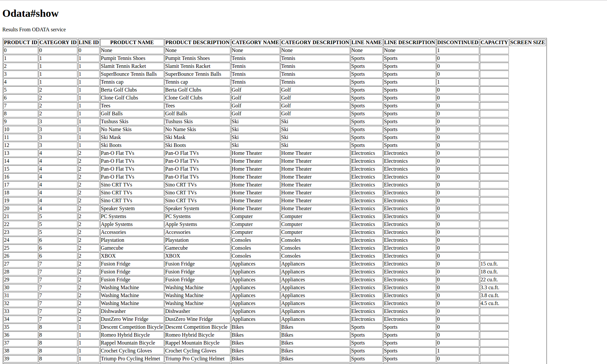

## Prerequisites
 - **Proficiency:** Beginner
 - You have Ruby and Rails installed on your development environment.
 - You have an instance of SAP HANA, Express Edition deployed and running.
 - You have an OData service deployed on the instance of SAP HANA, Express Edition as per the prerequisite OData tutorial.
 - **Tutorials:** [SAP HANA, express edition, in Google Cloud Platform Launcher](https://www.sap.com/developer/tutorials/hxe-gcp-getting-started-launcher.html)


## Next Steps
 - Go to [SAP HANA, express edition](https://www.sap.com/developer/topics/sap-hana-express.tutorials.html) tutorials page

## Details
### You will learn
This tutorial will guide you through the process to create a sample Ruby on Rails application which connects to SAP HANA, Express Edition, using OData services. This tutorial assumes that you have already created an OData service as mentioned in the prerequisite tutorial.

### Time to Complete
**15 Min**

---

[ACCORDION-BEGIN [Step 1: ](Create a new Rails application)]

In your local environment open a terminal and Create a new Rails application

```
    ~$ rails new Odatatest
    ~$ cd Odatatest/

```

Run the following commands.

```
    ~Odatatest$ rails generate controller odata show

```

Navigate to the file `Odatatest/Gemfile`. Add the following code after all the gems.

```
    gem 'ruby_odata'

```

Navigate to the file `Odatatest/app/controllers/odata_controller.rb`. Replace the `show` method with the following code:

```
  def show
    svc = OData::Service.new "http://<YOUR_HOSTNAME>:8090/ODataTutorial/product.xsodata", { :username => "<YOUR_USERNAME>", :password=> "<YOUR_PASSWORD>" }
    svc.Product
    allProducts = svc.execute
    @products = allProducts
    @headers = ['PRODUCTID', 'CATEGORYID', 'LINEID', 'PRODUCTNAME', 'PRODUCTDESCRIPTION', 'CATEGORYNAME', 'CATEGORYDESCRIPTION',
       'LINENAME', 'LINEDESCRIPTION', 'DISCONTINUED', 'CAPACITY', 'SCREENSIZE']
  end

```
>**Note:**
> The URL used here assumes that the OData service is deployed as mentioned in the prerequisite tutorial.


Navigate to the file `Odatatest/app/views/odata/show.html.erb`. Replace the file contents with the following code.

```
    <h1>Odata#show</h1>
    <p>Results From ODATA service</p>
    <table class="table table-condensed" border="1">
          <thead>
            <tr>
              <th>PRODUCT ID</th>
              <th>CATEGORY ID</th>
              <th>LINE ID</th>
              <th>PRODUCT NAME</th>
              <th>PRODUCT DESCRIPTION</th>
              <th>CATEGORY NAME</th>
              <th>CATEGORY DESCRIPTION</th>
              <th>LINE NAME</th>
              <th>LINE DESCRIPTION</th>
              <th>DISCONTINUED</th>
              <th>CAPACITY</th>
              <th>SCREEN SIZE</th>
            </tr>
          </thead>
          <tbody>
            <% @products.each do |product| %>
            <% jprod = JSON.parse(product.to_json) %>
              <tr>
                <td><%= jprod[@headers[0]]%></td>
                <td><%= jprod[@headers[1]]%></td>
                <td><%= jprod[@headers[2]]%></td>
                <td><%= jprod[@headers[3]]%></td>
                <td><%= jprod[@headers[4]]%></td>
                <td><%= jprod[@headers[5]]%></td>
                <td><%= jprod[@headers[6]]%></td>
                <td><%= jprod[@headers[7]]%></td>
                <td><%= jprod[@headers[8]]%></td>
                <td><%= jprod[@headers[9]]%></td>
                <td><%= jprod[@headers[10]]%></td>

              </tr>
            <% end %>
          </tbody>
        </table>

```

[ACCORDION-BEGIN [Step 2: ](Run the application to test.)]

Run the following commands at the root of the project directory.

```
    ~Odatatest$ bundle install

    ~Odatatest$ rails server

```

Browse the application at `http://localhost:3000/odata/show`.
The results should look like below.




[ACCORDION-END]

You now have a working Ruby on Rails application that connects to SAP HANA, Express Edition using OData services.

---

## Next Steps
 - Go to [SAP HANA, express edition](https://www.sap.com/developer/topics/sap-hana-express.tutorials.html) tutorials page
