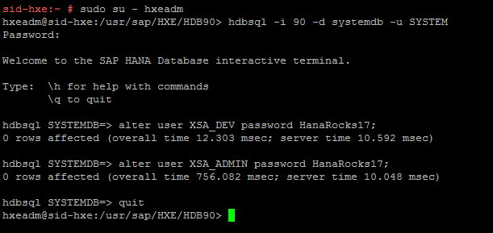
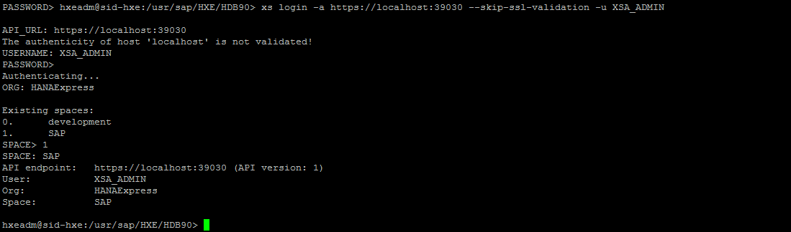
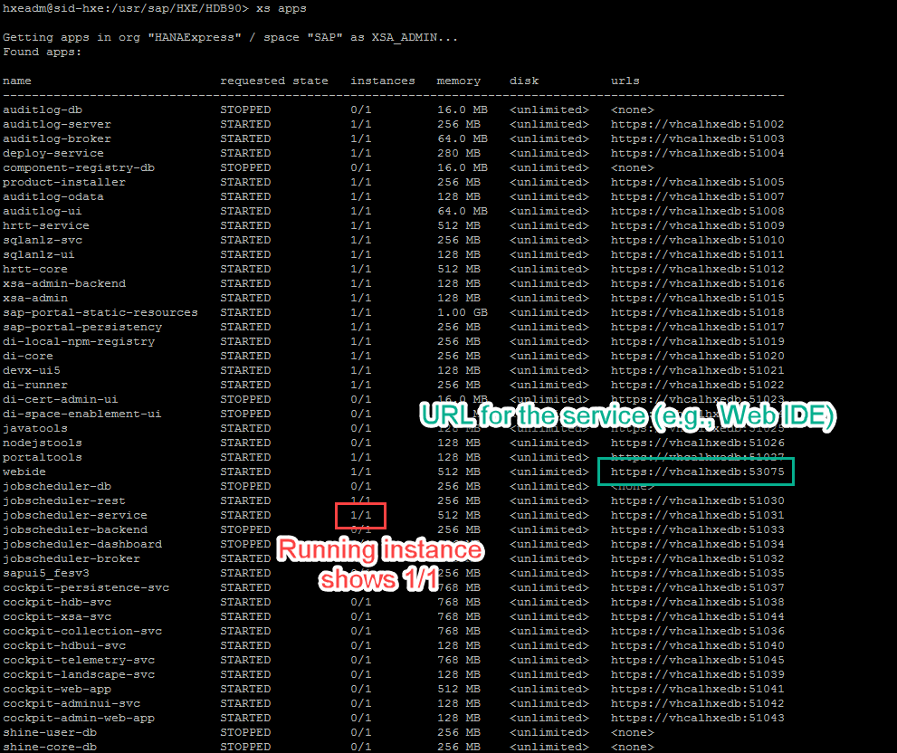
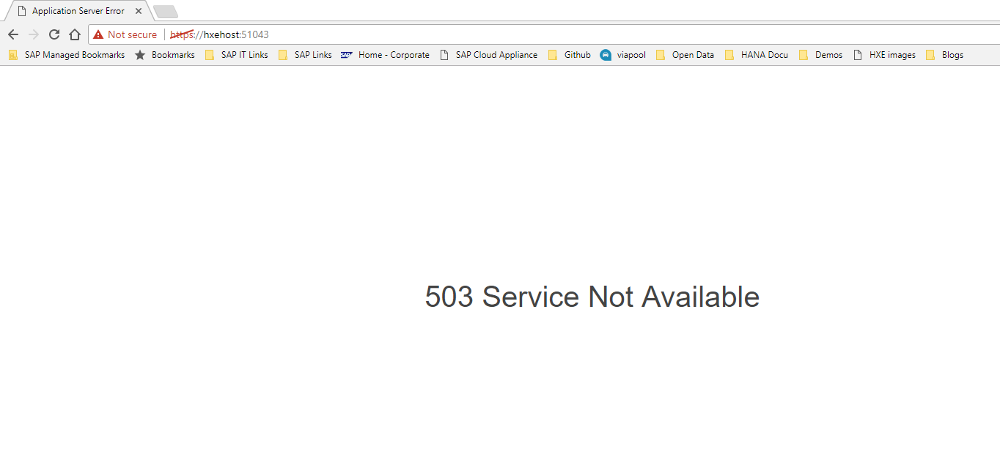
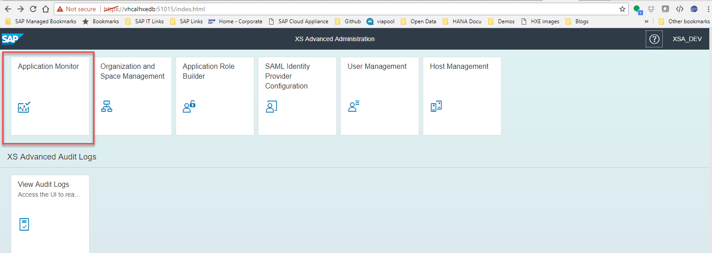
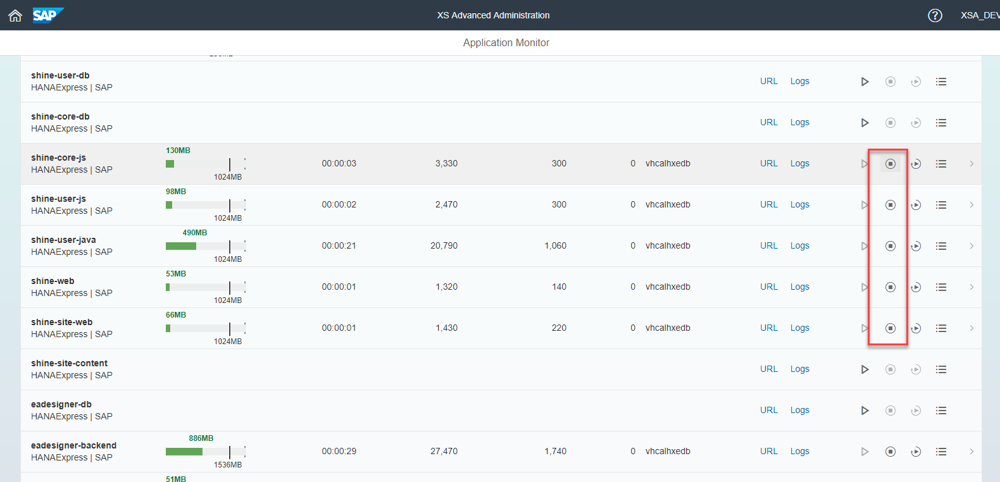

## Prerequisites  
 - **Proficiency:** Beginner | Intermediate | Advanced
 - Have an account in Amazon Web Services or Microsoft Azure


## Next Steps
- [Review SAP HANA, express edition content, tutorials and quick start guides](https://www.sap.com/developer/topics/sap-hana-express.tutorials.html)
- **XS Advanced:** [ Get started with XS Advanced development](http://www.sap.com/developer/topics/sap-hana-express.html)
- **XS Advanced:** [Explore the basics tools in XS Advanced - like the administration cockpit and SAP Web IDE for SAP HANA](https://www.sap.com/developer/tutorials/xsa-explore-basics.html)

## Details
### You will learn  
SAP HANA Express Edition on MS Azure or Amazon Web Services via SAP Cloud Appliance Library

### Time to Complete
**15 Min**

---

[ACCORDION-BEGIN [Step 1: ](Register or log in at the Cloud Appliance Library)]

Go to the [SAP Cloud Appliance Library](https://cal.sap.com/) and create an account and register.


As a pre-requisite you need to have performed the same in a Cloud Provider and generated an **access key** in Amazon Web Services or a **Subscription ID** in Microsoft Azure, depending on your choice. Check this [FAQ wiki for more information on AWS](https://wiki.scn.sap.com/wiki/display/SAPCAL/FAQ+-+Specific+questions+for+Amazon+Web+Services). For Azure, you can access your Subscription ID from the `More Services` menu.

Link your account in the cloud provider from the **Account** menu:


For MS Azure, you can find your subscription ID here:


In Amazon Web Services, you can create a user specifically for CAL and generate the access keys:


Check this [FAQ wiki for more information](https://wiki.scn.sap.com/wiki/display/SAPCAL/FAQ+-+Specific+questions+for+Amazon+Web+Services)

[ACCORDION-END]

[ACCORDION-BEGIN [Step 2: ](Choose your instance)]

Look for `SAP HANA express` and click on **Create Instance**:


Click on **Advanced Mode** :


Choose your account and click on **Step 2**:


Once in **Step 2**,  fill in the instance details and click on **Create**


**Note - AWS**: Be sure to choose `ECS-Internet` to have an external IP to connect to your machine.


Review the access ports. These will generally be enough for your machine:


You will be prompted for a password. Make sure this password follows the rules and you remember it, as it will be the password for the administration and development users:


Perform the final **Review**. You can specify if you want the machine to be suspended automatically so that you do not incur in higher costs:


And **Create** your machine:


You will get a disclaimer about the use of HANA Express. After you read it, you will be prompted to store and download a key.  **Store** it and **Download** it in a secure location you can access later:


**IMPORTANT**: Save the downloaded `.pem` file. You will need it to access the instance from an SSH or SCP console.

The machine will take about 20 minutes to become available. You will see the instance as **Active** once it is ready for use:


[ACCORDION-END]


[ACCORDION-BEGIN [Step 3: ](Map your hosts file)]

Click on the instance to access the details. Use your external IP address to map it to the hosts file in your computer.


You need administration permissions to do this.

- For Windows Computers:
  Your user will need administration rights. Right-click on Notepad and choose `Run as Administrator`. If you are an administrator user, proceed to the next point.

  

  Open the file or navigate with Windows explorer. You need to edit the file called `hosts` in the directory `C:\Windows\System32\drivers\etc`

  


- For Mac OS:
  Open a terminal (`Finder -> Applications -> Terminal`) and type `sudo nano /etc/hosts`

  


Add the IP address followed by the name of the host, `vhcalhxedb`:


**Save** and close the editor.

> Note: If Notepad asks you to create a new file you do not have enough permissions to save the file. Creating a new file will not alter the configuration as intended.


</br>


[ACCORDION-END]

[ACCORDION-BEGIN [Step 4: ](Connect to your machine using SSH)]

In order to change the XS Advanced users or if you want to check on the progress of your system during startup, you need connect to the server using an SSH console.


- If you are using a **Windows** computer, you will need to download an SSH client [such as the `PuTTY` Installation Package](https://winscp.net/eng/download.php#putty).

      Convert the `.pem` key first, using PuTTYGen (downloaded with PuTTY installation package). This will generate a `.ppk` file. Save it in a secure folder.

      

      **Back in PuTTY**, go to `Auth->` Select the `.ppk` you generated.

      

      In `session`, use `vhcalhxedb` as the address and click on **Open** to connect:

      

      Log in as root:

      


- If you are using an **Apple** computer, open a terminal (`Finder -> Applications -> Terminal`)

      Run the following command in the terminal, replacing the `.pem` file, username and IP by the one in your virtual machine:

      ```
      ssh -i /path/my-key-pair.pem root@vhcalhxedb
      ```
      

[ACCORDION-END]

[ACCORDION-BEGIN [Step 5: ](Change the XS Advanced user passwords)]

Once in the console, you will need to change the passwords for users `XSA_DEV` and `XSA_ADMIN`.

Switch to user `hxeadm` first and then log in to the SQL prompt with user SYSTEM:

```sql
hdbsql -i 90 -d systemdb -u SYSTEM

```

You will be prompted for a password. Enter the password you set up in the second step. Now, replace the password below by a password of your choice. **Do not think too hard and avoid special characters**, you will be prompted to change it upon your first log in using a graphical interface:


```sql
alter user XSA_ADMIN password HanaRocks17;
alter user XSA_DEV password HanaRocks17;
```

Like this:



Use command `quit` to exit the SQL console.

[ACCORDION-END]

[ACCORDION-BEGIN [Step 6: ](Follow the startup progress)]

After the machine appears as active, it will take about 10 minutes before the services are available. If you have connected to the server using SSH or have [downloaded the XS Command Line Interface from the Download Manager](https://www.sap.com/developer/topics/sap-hana-express.html) you can check the progress by logging in to the CLI and using the `xs apps` command.

```ssh
sudo su - hxeadm
xs login -a https://localhost:39030 --skip-ssl-validation -u XSA_ADMIN
```

>Note: You can **optionally**  download the CLI using the download manager. You can get the download manager from the [HANA Express download site](https://www.sap.com/developer/topics/sap-hana-express.html) after you register. Choose `clients.zip` to download it. If you downloaded the CLI and are connecting from your local computer, replace `localhost` with `vhcalhxedb`

As follows:



You will be prompted for your password and then for the space. This is the password you setup in the previous step. The space in this case will be SAP. Command `xs apps` will show you which services are ready:




Alternatively, you can check the Web IDE in URL `https://vhcalhxedb:53075/` (using user `XSA_DEV`).

If you get an error message indicating that the certificate is self-signed, proceed to log in:


> **Note**:The first time you use users `XSA_DEV` or `XSA_ADMIN`, you will be prompted to change the passwords.

If the service is still loading, you will get the following `503 Service Unavailable` error message:




[ACCORDION-END]


[ACCORDION-BEGIN [Step 7: ](OPTIONAL: Stop additional applications)]

The instances in the Cloud Appliance Library have additional applications pre-installed and ready for you to use. If you are not planning on using them, you can free up resources from the Administration Cockpit:

 In a separate **incognito window**, open URL `https://vhcalhxedb:51015/` and **log in with user `XSA_ADMIN`**. Open the **Application monitor**:

 

 You will see the applications that are currently running. You can stop, restart, check the logs and find out the URL from this interface too. If you will not be using, for example, the SHINE model or the Enterprise Architecture designer, you can stop them using the `stop` icon. You can turn them on again at any time with the `Play` icon:

 


[ACCORDION-END]


## Next Steps
- [Review SAP HANA, express edition content, tutorials and quick start guides](https://www.sap.com/developer/topics/sap-hana-express.tutorials.html)
- **XS Advanced:** [ Get started with XS Advanced development](http://www.sap.com/developer/topics/sap-hana-express.html)
- **XS Advanced:** [Explore the basics tools in XS Advanced - like the administration cockpit and SAP Web IDE for SAP HANA](https://www.sap.com/developer/tutorials/xsa-explore-basics.html)
