## Prerequisites  
 - You have an account in Amazon Web Services or Microsoft Azure.


## Details
### You will learn  
  - How to set up SAP HANA Express Edition on MS Azure or Amazon Web Services via SAP Cloud Appliance Library


---

[ACCORDION-BEGIN [Step 1: ](Prerequisite: Create an account with a cloud provider)]

As a pre-requisite you need to have generated an **access key** in Amazon Web Services or a **Subscription ID** in Microsoft Azure, depending on your choice.

  -  For **MS Azure**, you can find your subscription ID here:

    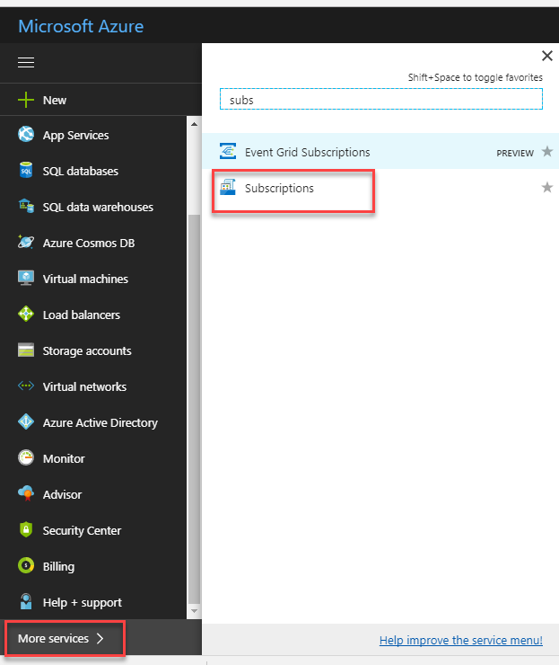

  -  In **Amazon Web Services**, you can create a user specifically for CAL and generate the access keys:

    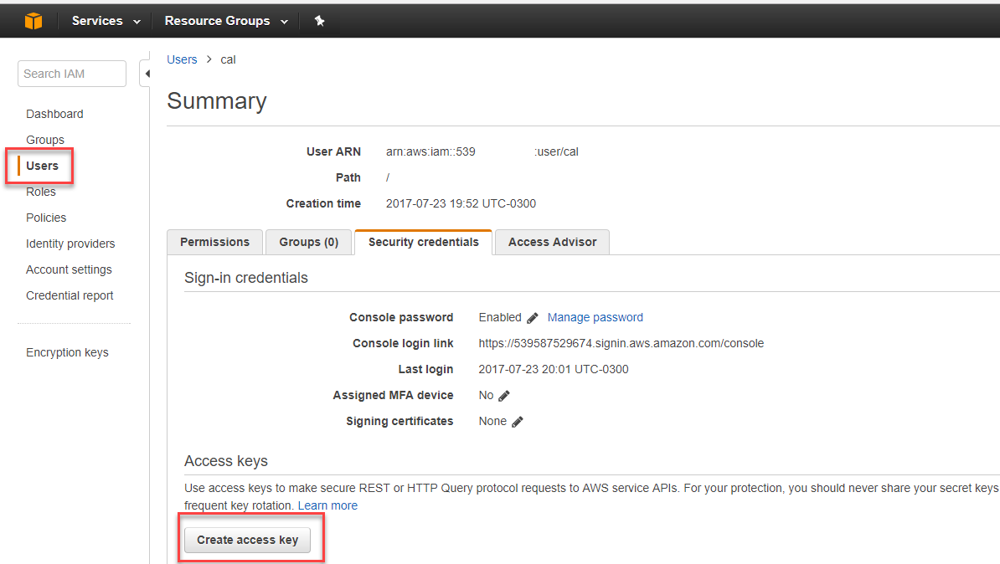
    Check this [FAQ wiki for more information on AWS](https://wiki.scn.sap.com/wiki/display/SAPCAL/FAQ+-+Specific+questions+for+Amazon+Web+Services).


[ACCORDION-END]

[ACCORDION-BEGIN [Step 1: ](Register or log in at the Cloud Appliance Library)]

Go to the [SAP Cloud Appliance Library](https://cal.sap.com/) and create an account and register or log on.

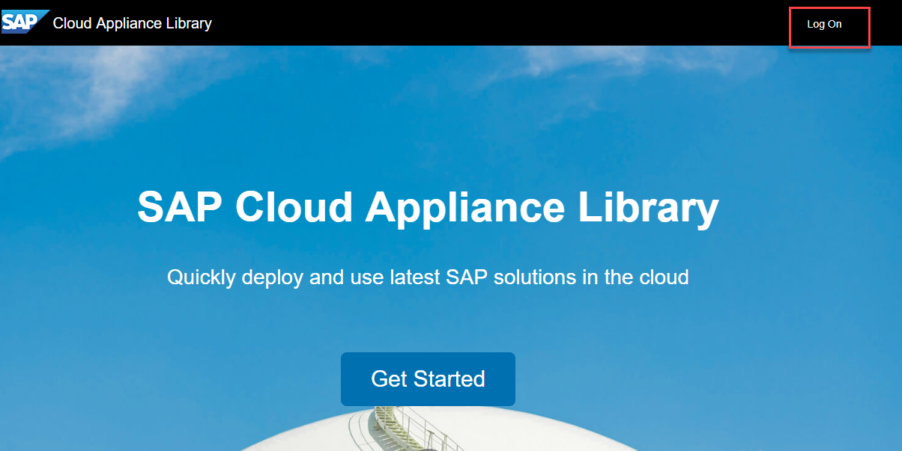


Link your account in the cloud provider from the first step in the **Account** menu:

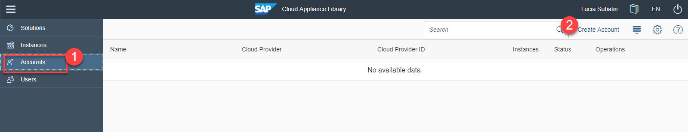


[ACCORDION-END]

[ACCORDION-BEGIN [Step 2: ](Choose your instance)]

Search for `HANA express`, choose the latest updated solution and click **Create Instance**:

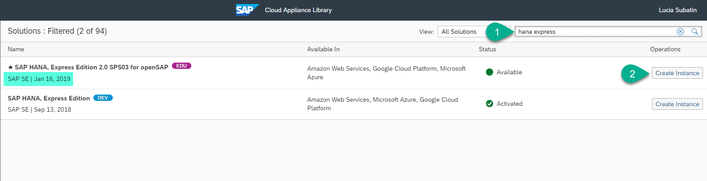

Click on **Advanced Mode** :


Choose your account and click on **Step 2**:

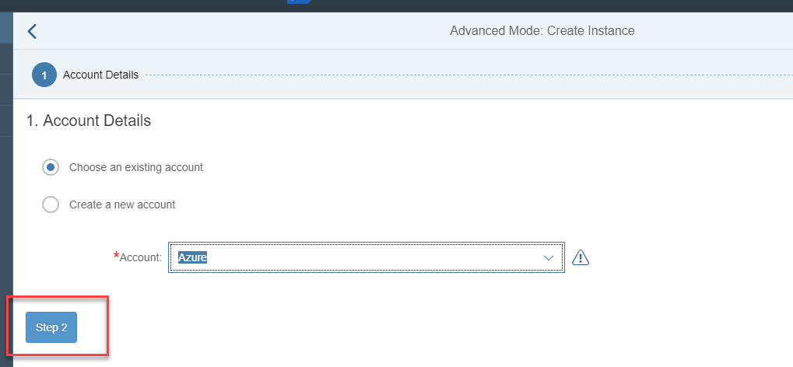

Once in **Step 2**,  fill in the instance details and click on **Create**

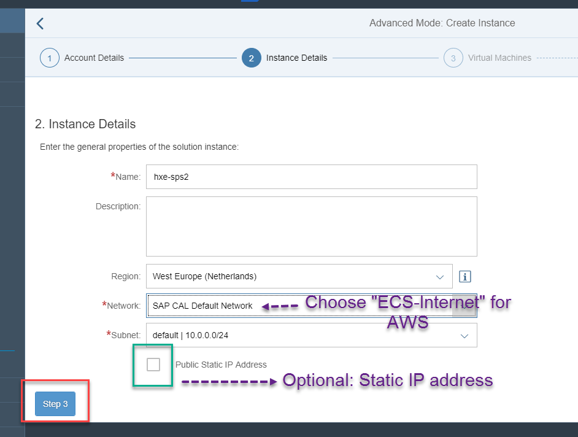

> ### **Note:** : For **AWS**, be sure to choose **`ECS-Internet`** to have an external IP to connect to your machine.


Review the access ports. These will generally be enough **if you are planning on using the remote desktop to connect**:

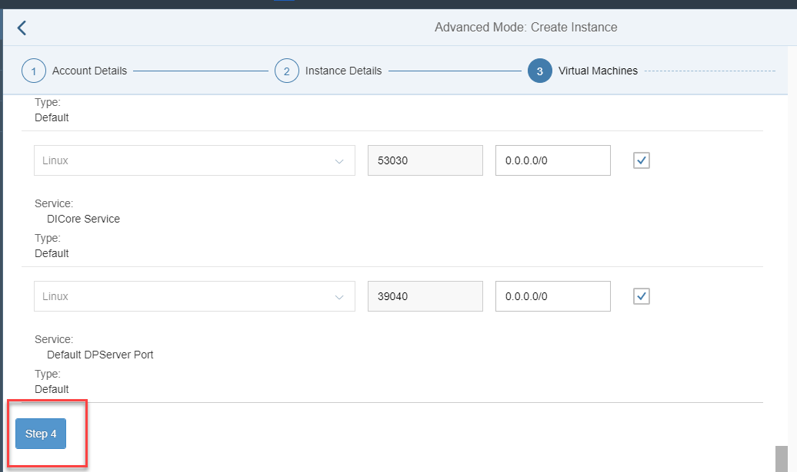

> ### **Note:** If you want to access the tools from your local computer or other applications, make sure you open the necessary ports for the Linux server. Find [all ports for the SAP HANA platform in the help](https://help.sap.com/viewer/575a9f0e56f34c6e8138439eefc32b16/2.0/en-US/616a3c0b1cc748238de9c0341b15c63c.html)


You will be prompted for a password. Make sure this password follows the rules and you remember it, as it will be the password for the administration and development users:

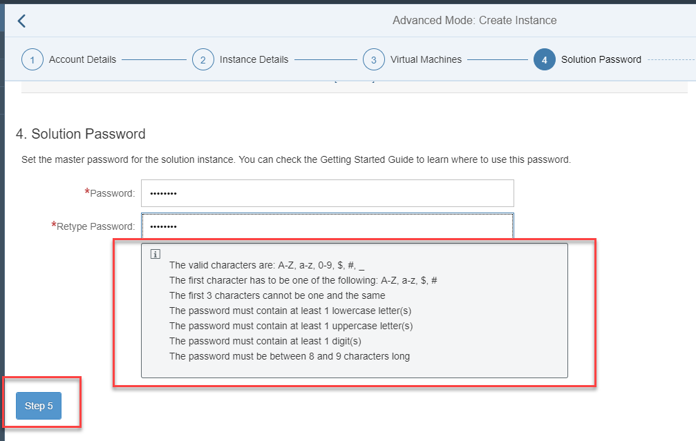

Perform the final **Review**. You can specify if you want the machine to be suspended automatically so that you do not incur in higher costs:

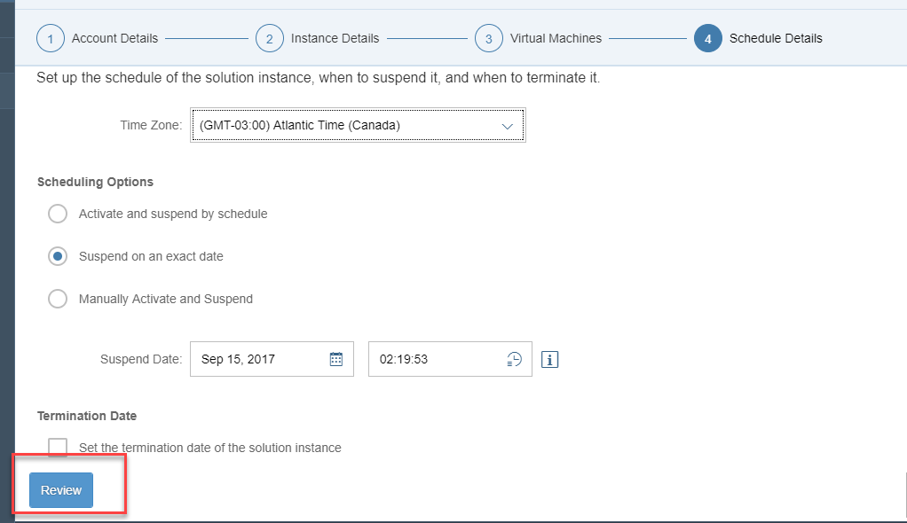

And **Create** your machine:

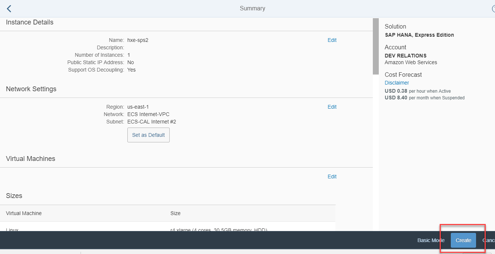

You will get a disclaimer about the use of HANA Express. After you read it, you will be prompted to store and download a key.  **Store** it and **Download** it in a secure location you can access later:


**IMPORTANT**: Save the downloaded `.pem` file. You will need it to access the instance from an SSH or SCP console.

The machine will take about 20 minutes to become available. You will see the instance as **Active** once it is ready for use:

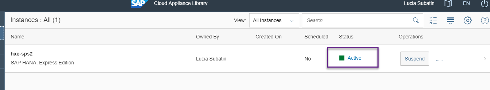

[ACCORDION-END]

[ACCORDION-BEGIN [Step 3: ](Log in to the remote desktop)]

You can connect through a remote desktop environment that has some configurations ready for you to start using your instance right away.

**You can skip to the next step if you want to use your own computer to connect to your instance**.

Click on **Connect**

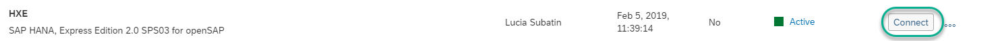

And **Connect** again

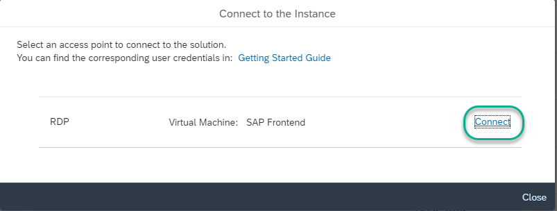

> You may get a warning because the remote desktop is using a self-signed certificate.  

When prompted, use user `Administrator` and the master password you entered when creating the instance.

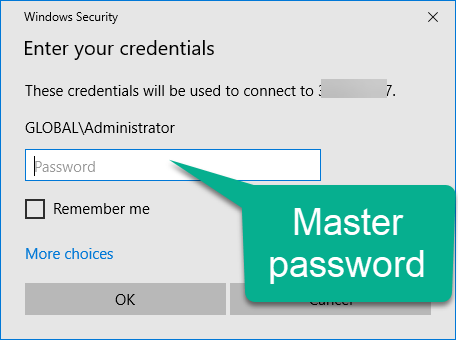

You will see a site with links to SAP Web IDE, the Database Cockpit and the XS Advanced Cockpit.

Start by downloading and installing Google Chrome and making it your default browser:

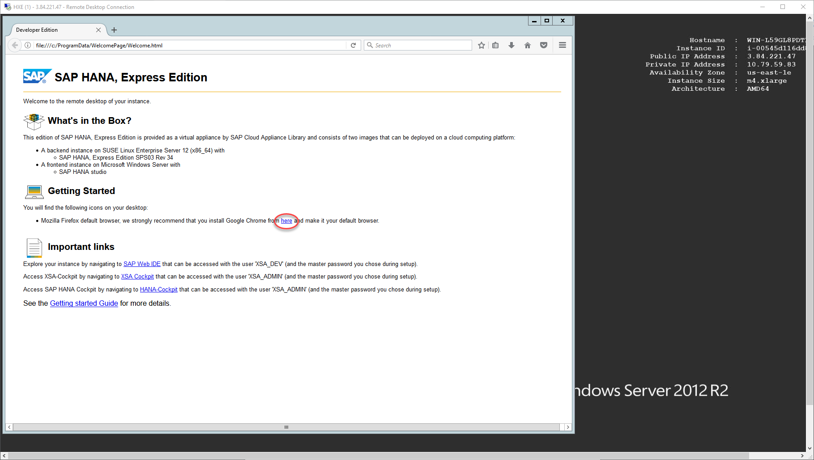

Once downloaded, you can access the different tools included in XS Advanced from the browser.

For example, SAP Web IDE:

```text
https://vhcalhxedb.dummy.nodomain:53075/
```

Log in with user `XSA_DEV` and the master password.

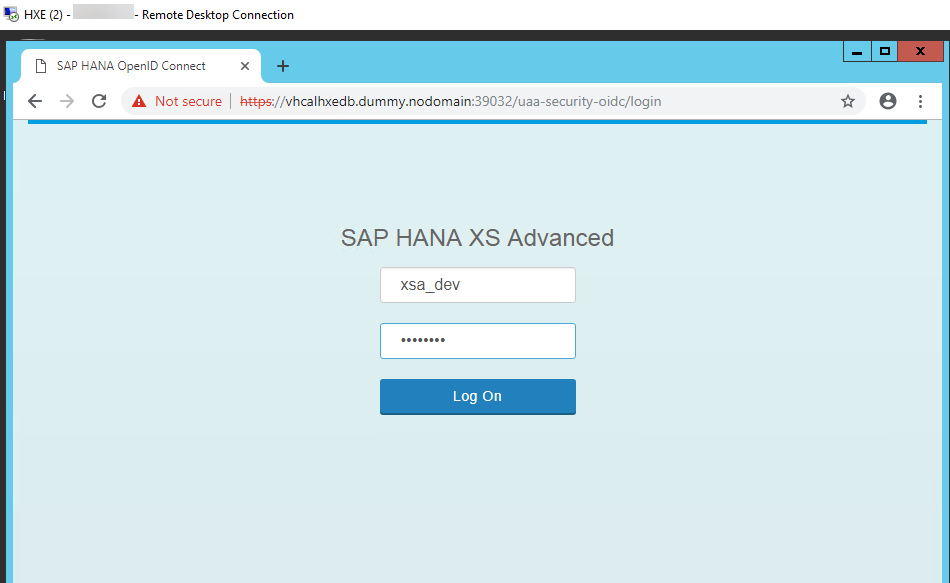

You can continue to use SAP HANA, express edition from the remote desktop. Explore the Web IDE, XS Advanced cockpit and the basic tools [in this tutorial](xsa-explore-basics) or [get started with your building your first application in XS Advanced](https://developers.sap.com/mission.xsa-get-started.html).

The next steps in this tutorial describe how to access your instance of SAP HANA, express edition from your local computer.

[ACCORDION-END]

[ACCORDION-BEGIN [Step 3: ](Map your hosts file)]

If you want to access the tools from the browser in your local machine, you need to map the external IP address to the name of the host and XS Advanced domain name.

You will need administration permissions in your local computer to do this.

Click on the instance to access the details.

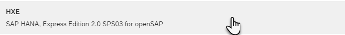

Use your external IP address (`Linux External IP address`) to map it to the hosts file in your computer.

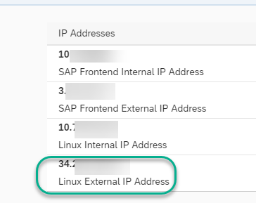

- For Windows Computers:
  Your user will need administration rights. Right-click on Notepad and choose `Run as Administrator`.

  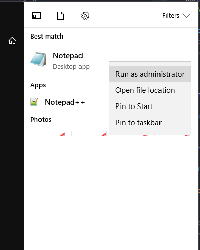

  Open the file or navigate with Windows explorer. You need to edit the file called `hosts` in the directory `C:\Windows\System32\drivers\etc`

  

  > If Notepad asks you to create a new file you do not have enough permissions to save the file. Creating a new file will not alter the configuration as intended.


- For Mac OS:
  Open a terminal (`Finder -> Applications -> Terminal`) and type `sudo nano /etc/hosts`

  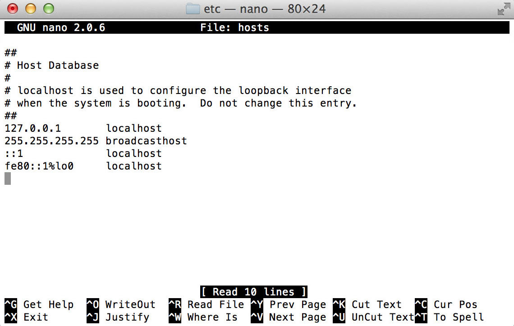


Add the IP address followed by the names of the host, `vhcalhxedb vhcalhxedb.dummy.nodomain`:

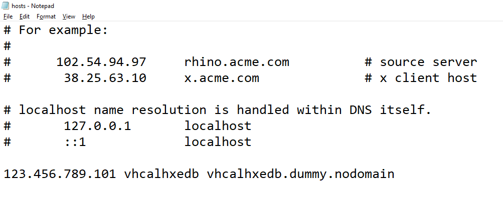

**Save** and close the editor.

> ### **Note:** If you want to access the tools from your local computer or other applications, make sure you open the necessary ports for the Linux server from the console in Cloud Appliance Library.
> 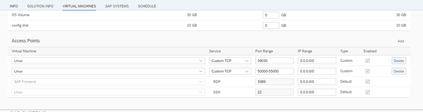
>Find [all ports for the SAP HANA platform in the help](https://help.sap.com/viewer/575a9f0e56f34c6e8138439eefc32b16/2.0/en-US/616a3c0b1cc748238de9c0341b15c63c.html)

You can now connect to the XS Advanced tools from a Chrome browser in your local computer. Use `https://vhcalhxedb.dummy.nodomain:39030/` to see a list of some of the possible applications. Explore the Web IDE, XS Advanced cockpit and the basic tools [in this tutorial](xsa-explore-basics).


</br>


[ACCORDION-END]

[ACCORDION-BEGIN [Step 4: ](Connect to your machine using SSH)]

In order to change the XS Advanced users or if you want to check on the progress of your system during startup, you need connect to the server using an SSH console.


- If you are using a **Windows** computer, you will need to download an SSH client [such as the `PuTTY` Installation Package](https://winscp.net/eng/download.php#putty).

      Convert the `.pem` key first, using PuTTYGen (downloaded with PuTTY installation package). This will generate a `.ppk` file. Save it in a secure folder.

      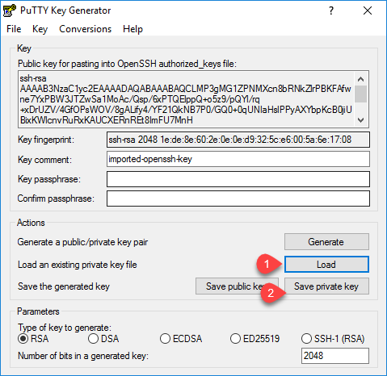

      **Back in PuTTY**, go to `Auth->` Select the `.ppk` you generated.

      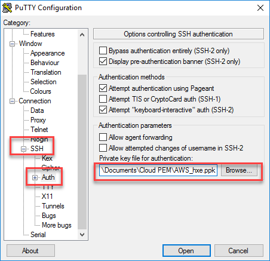

      In `session`, use `vhcalhxedb` as the address and click on **Open** to connect:

      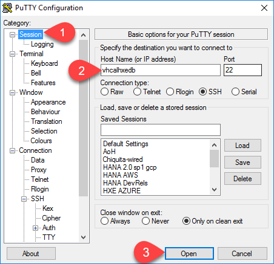

      Log in as root:

      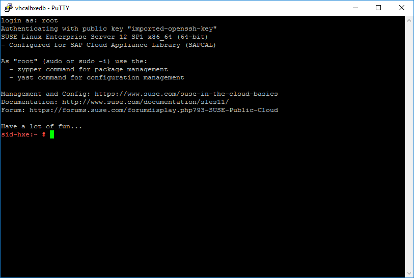


- If you are using an **Apple** computer, open a terminal (`Finder -> Applications -> Terminal`)

      Run the following command in the terminal, replacing the `.pem` file, username and IP by the one in your virtual machine:

      ```
      ssh -i /path/my-key-pair.pem root@vhcalhxedb
      ```
      

[ACCORDION-END]


## Next Steps
-  **Build your first app:** [Get started with XS Advanced development](https://developers.sap.com/mission.xsa-get-started.html)
- [Explore the basic tools in the XS Advanced platform](https://developers.sap.com/tutorials/xsa-explore-basics.html)
- [Review SAP HANA, express edition content, tutorials and quick start guides](https://developers.sap.com/topics/hana.html)
