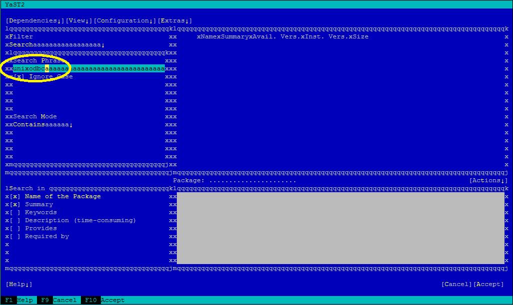
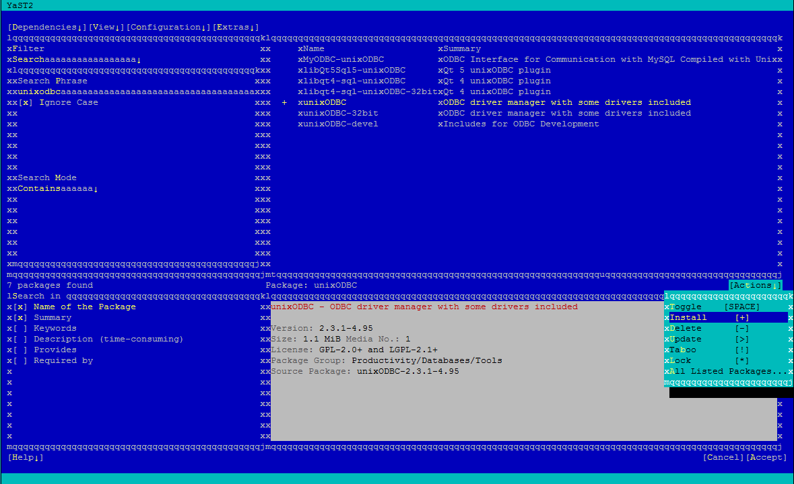
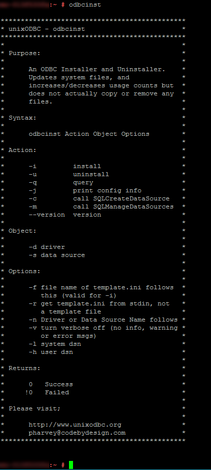
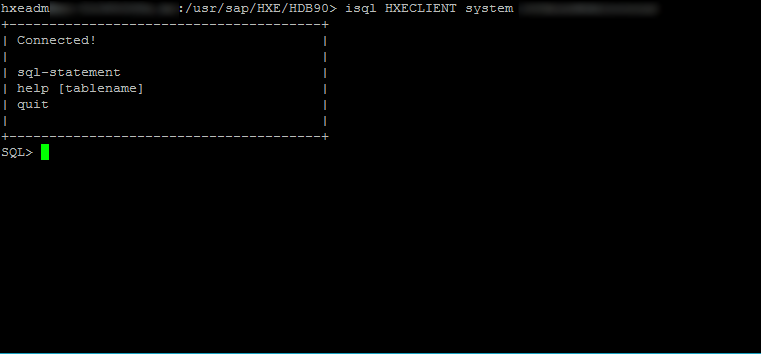

## Prerequisites
 - [Create a Backup](https://developers.sap.com/tutorials/hxe-ua-dbfundamentals-backups.html)
 - A registered version of SUSE. See the [SAP HANA Academy](https://www.youtube.com/watch?v=e6SIsAFVPoY) video for details.


## Details
### You will learn
  - How to download, install, and configure `unixODBC` to connect from your SAP HANA, express edition host machine to a client machine


In the following How-To, the "host machine" refers to the machine on which you will be installing and configuring unixODBC. The "client machine" refers to the machine (or machines) you will be connecting to using unixODBC.

> You will need the IP address of your host and client machine(s). Have that information available while you proceed through this how-to.

---

[ACCORDION-BEGIN [Step 1: ](Edit the hosts File of the Client Database)]

Before you can connect to your client database using unixODBC, you must update the client's `hosts` file with the IP address of your SAP HANA, express edition host machine. You will need to do this with each client database.

On your client machine(s), do the following:

#### Edit `/etc/hosts` on Windows

1. Navigate to **`C:\Windows\System32\drivers\etc`**.

2. In **Administrator** mode, open **hosts** in Notepad. See your operating system for information on opening applications in Administrator mode.

3. In a new uncommented row, add the IP address of your host machine with an alias of your choosing. Save your changes.

    >**Tip**: Spacing is important. Make sure your hosts file in Notepad looks like this image.

    

#### Edit `/etc/hosts` on Mac and Linux

1.	On your Mac or Linux machine, start the Terminal application.

2.  Edit the `hosts` file with the following command:

    ```bash
    sudo sh - c 'echo <ip_address_of_host>    <alias> >> /etc/hosts'
    ```

[DONE]
[ACCORDION-END]

> **Note:**
> The remaining steps are performed on your host machine.

[ACCORDION-BEGIN [Step 2: ](Install the unixODBC Driver Manager)]

> **Note:**
> If you have not registered your version of SUSE, you will have no repositories loaded onto your machine. For more information, see  the [SAP HANA Academy](https://www.youtube.com/watch?v=e6SIsAFVPoY) video for details.

1. Open a command line to your host machine.

2. Open `YaST` using `sudo`.

    ```bash
    sudo -i
    yast
    ```

3. From __Software__ go to __Software Management__

4. Search for and install `unixodbc`.

    1. Type "`unixodbc`" in the _Search Phrase_ section and press Enter.

        

    2. Select either the 32- or 64-bit version depending on your installation.

    3. Press Tab and press Enter to open an action menu. Highlight _+_ and press Enter to accept.

        

    4. Press F10 to accept. Installation will take a few moments.

5. Exit `YaST` by hitting F10 to finish and then F9 to quit.

6. Check if installation was successful. Run the command `odbcinst`. If you see a list of commands, installation was successful.

    

[DONE]
[ACCORDION-END]

[ACCORDION-BEGIN [Step 3: ](Create the .odbc.ini File)]

1. Log in as `<sid>adm` and move to `/usr/sap/HXE/home` directory.

    Example:

    ```bash
    su -l hxeadm
    cd /usr/sap/HXE/home
    ```

2. Create the `.odbc.ini` file.

    ```bash
    vi .odbc.ini
    ```

3. Add the following for each client machine:

    ```bash
    [<DATABASE_NAME>]
    servernode = <client_ip_address>:3<instance_number>13
    #location of the unixODBC driver
    driver = /usr/sap/<sid>/HDB<instance_number>/exe/libodbcHDB.so
    description = <optional_description>
    databasename = <your_database_alias>
    ```

    Here is an example:

    ```
    [HXECLIENT]
    servernode = 10.100.100:39013
    driver = /usr/sap/HXE/HDB90/exe/libodbcHDB.so
    description = Test database for unixODBC
    databasename = client
    ```

[DONE]
[ACCORDION-END]


[ACCORDION-BEGIN [Step 4: ](Use the isql Command to Connect to Your System)]

Connect to your system with the `isql` command.

```bash
isql <DATABASE_NAME> <user> <password>
```

Example:

```
isql HXECLIENT SYSTEM Password1
```

If successful, a list of commands displays:



[VALIDATE_1]
[ACCORDION-END]
