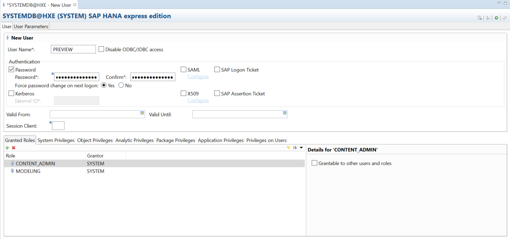
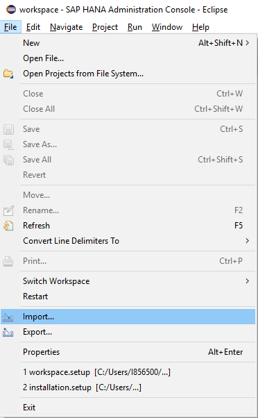
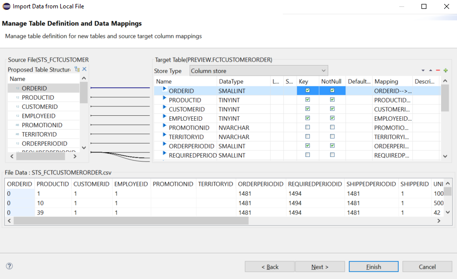
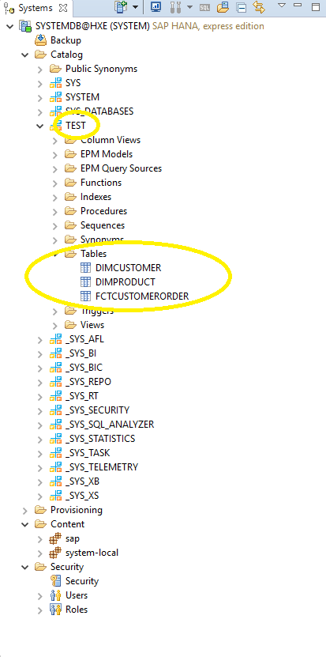
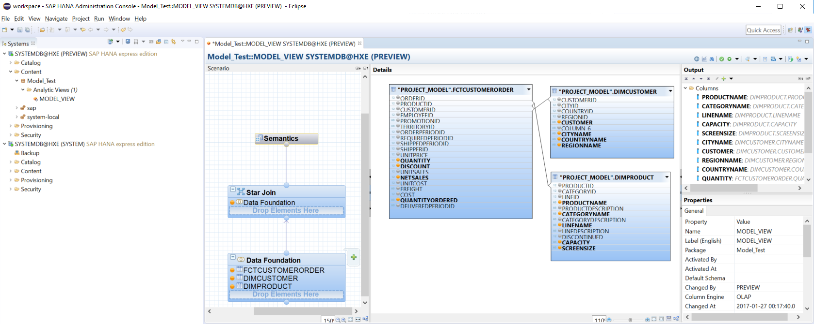
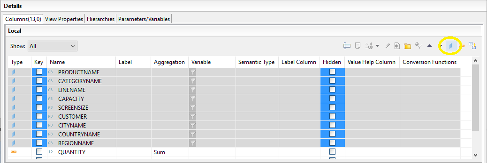
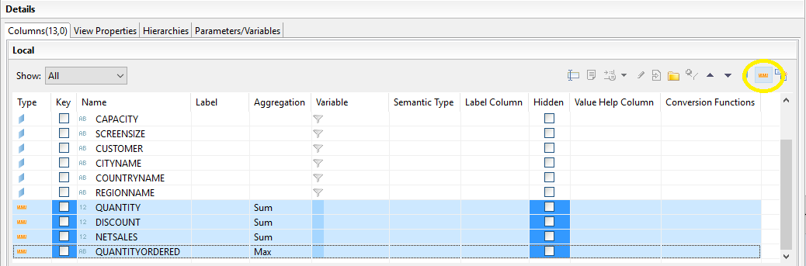

## Prerequisites
 - Download the `.csv` files from the SAP HANA Academy GitHub page: <https://github.com/saphanaacademy/HXE/tree/master/STS>.


## Next Steps
 - [Create a Tenant Database](https://developers.sap.com/tutorials/hxe-ua-dbfundamentals-tenantdb.html)

## Details
### You will learn
  - How to use SAP HANA Studio to load data onto your SAP HANA 2.0, express edition installation and create the proper user and schema, create a package, load data to that package, and preview that data


---
In SAP HANA Studio, do the following:


[ACCORDION-BEGIN [Step 1: ](Create a New User)]

1. Under your _SYSTEM_ user login, expand the **Security** folder.

2. Right-click on **Users** and select **New User**.

    

    The security editor opens.

3. Create the new user and give it the proper permissions.

    1. Give your new user a name.

    2. Give your user a strong password. You may wish to force a password change upon first login.

    3. Under **Granted Roles**, click .

    4. Select **`MODELING`**.

    5. Click **OK**.

    6. Repeat steps 3, 4, and 5 while selecting **`CONTENT_ADMIN`**.

    7. Click Deploy  to create your new user.

    


[DONE]

[ACCORDION-END]


[ACCORDION-BEGIN [Step 2: ](Create a Schema)]

1. Under the _Systems_ panel, right-click on your _SYSTEM_ login and select **Open SQL console**.

2. Create your new schema.

    ```bash
    CREATE SCHEMA <schema_name>
    ```

    Click Execute .

3. Grant rights and permissions for your new user to work on your new schema.

    ```bash
    GRANT SELECT on SCHEMA <schema_name> to <new_user>
    ```

    Example:

    ```
    GRANT SELECT on SCHEMA TEST to PREVIEW
    ```

    ```bash
    GRANT SELECT, CREATE ANY on SCHEMA <schema_name> to <new_user>
    ```

    Example:

    ```
    GRANT SELECT, CREATE ANY on SCHEMA TEST to PREVIEW
    ```

    ```bash
    GRANT SELECT, INSERT, UPDATE, DELETE, EXECUTE ON SCHEMA <schema_name> to _SYS_REPO WITH GRANT OPTION
    ```

    Example:

    ```
    GRANT SELECT, INSERT, UPDATE, DELETE, EXECUTE ON SCHEMA TEST to _SYS_REPO WITH GRANT OPTION
    ```

    Click Execute  for each line.


[DONE]

[ACCORDION-END]

[ACCORDION-BEGIN [Step 3: ](Load Table Data)]

1. Import the `STS_FCTCUSTOMERORDER.csv` file.

    1. On the **SAP HANA Studio** window, click _File_ then _Import..._. 

    2. Select _SAP HANA Content_ then _Data from local file_.

    3.  Select your _SYSTEM_ repository and click **Next**.

    4. Browse for and select the `STS_FCTCUSTOMERORDER.csv` file. Click **Open**.

    5. Select **Header row exists**.

    6. Select **New Schema** and choose the schema you created earlier in this series.

        > Note:
        > Be sure to select your new schema and not the user you create to ensure that the data is in the proper location.

    7. Give your table a name and click **Next**.

2. Choose the Data Types for the table. Select **Key** for `ORDERID`, `PRODUCTID`, `CUSTOMERID`, `EMPLOYEEID`, and `ORDERPERIODID`. Click **Next** to see a preview of your table, otherwise click **Finish** to complete the upload.

    

3. Repeat steps 1 and 2 to import the remaining two `.csv` files.

    For `STS_DIMPRODUCT.csv`, select **Key** for `PRODUCTID`. For `STS_DIMCUSTOMER.csv`, select **Key** for `CUSTOMERID`.

4. Refresh your schema.

    

You should see your new tables under the _Tables_ folder under your schema.


[DONE]

[ACCORDION-END]

[ACCORDION-BEGIN [Step 4: ](Create a New Package)]

1. Log into SAP HANA Studio as your new user.

    1. Right-click on your current system.

    2. Select **Add System with Different User...**.

    3. Enter your new user name and the appropriate password.

    > Note:
    > If prompted, change your new user's password.

2. Under the _Systems_ tab, right-click on **Content**.

3. Select **New** then **Package...**.

4. Enter a name for the package. Click **OK**.

The new package will appear under your _Content_ folder under your new user login.


[DONE]

[ACCORDION-END]

[ACCORDION-BEGIN [Step 5: ](Load and Connect Data)]

1. Right click on the package you created earlier and select **New** then **Analytic View...**.

2. Give your new _Information View_ a name.

    A new viewing window opens and a folder is added under your package.

3. Select **Data Foundation** and click _Add Objects_ .

4. Under _Type the object name to search for_, add the `FCTCUSTORDERS`, `DIMPRODUCT`, and `DIMCUSTOMER` tables you created in the previous tutorial.

5. Under the **Details** window panel, link the related information between the tables.

    Connect _PRODUCTID_ under **`"<schema_name>".DIMPRODUCT`** to _PRODUCTID_ under **`"<schema_name>".FCTCUSTOMORDERS`** by clicking the phrase, holding, and dragging your mouse. Repeat this and connect _CUSTOMERID_ under **`"<schema_name>".DIMCUSTOMER`** to _CUSTOMERID_ under **`"<schema_name>".FCTCUSTOMORDERS`**.

    > Note:
    > You can move the individual tables to better view your information.

6. Add output columns.

    1. Under **`"<schema_name>".DIMPRODUCT`**, hold the `Ctrl` button and select `PRODUCTNAME`, `CATEGORYNAME`, `LINENAME`, `CAPACITY`, and `SCREENSIZE`.

    2. Right-click on one of the selected elements and click **Add To Output**.

    3. Repeat previous steps for **`"<schema_name>".DIMCUSTOMER`** and select `CUSTOMER`, `CITYNAME`, `COUNTRYNAME`, and `REGIONNAME`.

    4. Repeat previous steps for **`"<schema_name>".FCTCUSTOMORDERS`** and select `QUANTITY`, `DISCOUNT`, `NETSALES`, and `QUANITYORDERED`.

Here is an example: 


[DONE]

[ACCORDION-END]


[ACCORDION-BEGIN [Step 6: ](Edit Semantics)]

1. Select **Semantics** under the _Scenario_ panel.

    > Note:
    > Make sure the __Show__ menu pulldown is set to _All_ otherwise you may not see your information.

2. Label _Attributes_ columns.

    1. Highlight the following columns: `PRODUCTNAME`, `CATEGORYNAME`, `LINENAME`, `CAPACITY`, `SCREENSIZE`, `CUSTOMER`, `CITYNAME`, `COUNTRYNAME`, and `REGIONNAME`.

    2. Click _Mark as Attribute_ .

    

3. Label _Measure_ columns.

    1. Highlight the following columns: `QUANTITY`, `DISCOUNT`, `NETSALES`, and `QUANTITYORDERED`.

    2. Click _Mark as Measure_ .

    

4. Adjust your data as necessary.

    - Under the _Label_ column, you can provide new names for your columns.

    - You may hide any columns by selecting its **Hidden** column box.

5. Click _Save and Validate_  to save and check your changes.

    An entry will be added to the **Job Log** window panel.

    > Note:
    > The system may return the status _Completed with warnings_. This is expected and the system should still run successfully.

6. Click _Save and Activate_  to deploy the scenario.

    An entry will be added to the **Job Log** window panel.


[DONE]

[ACCORDION-END]

[ACCORDION-BEGIN [Step 7: ](Preview Data)]

1. Refresh your package's _Analytic View_ folder.

2. Double-click the Analytic View file you created earlier.

3. Preview your data. Right-click on your Analytic View file and select **Data Preview**.

You can now preview your data by dragging _Attributes_ to the **Label axis** panel and _Measures_ to the **Values axis** window panel.

Here is an example: 


[DONE]

[ACCORDION-END]


### Additional Information
- [Create a Tenant Database](https://developers.sap.com/tutorials/hxe-ua-dbfundamentals-tenantdb.html)
- Select another SAP HANA 2.0, express edition tutorial from the [Tutorial Navigator](https://developers.sap.com/topics/hana.tutorials.html)
