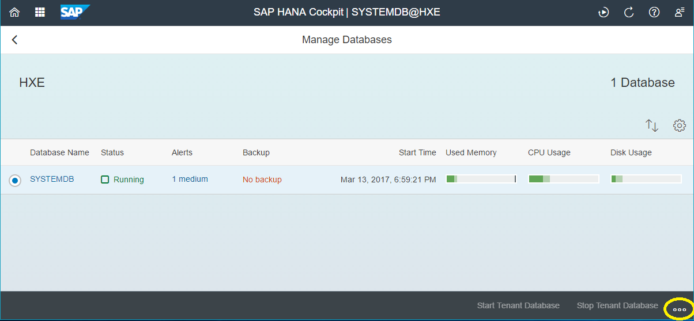
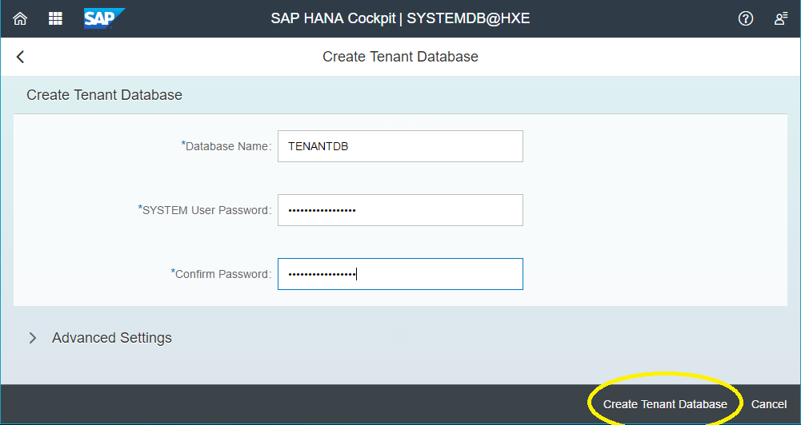
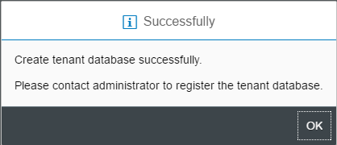

## Prerequisites  
 - [Sample Project](https://www.sap.com/developer/tutorials/hxe-ua-dbfundamentals-sample-project.html)


## Next Steps
 - [Create a Backup](https://www.sap.com/developer/how-tos/2017/03/hxe-ua-dbfundamentals-backups.html)
 - Select a tutorial from the [Tutorial Navigator](http://www.sap.com/developer/tutorial-navigator.html) or the [Tutorial Catalog](http://www.sap.com/developer/tutorials.html)

## Details
### You will learn  
How to create a tenant database using either HANA Cockpit or an SQL command line.

### Time to Complete
**15 Min**

> Note:
> When creating a tenant database, expect your system to use more memory. Ensure your system has enough memory to run an additional database.

---

[ACCORDION-BEGIN [Option 1: ](Using SAP HANA Cockpit)]

> Note:
> This option requires a SAP HANA, express edition Server + Applications installation.

1. Open SAP HANA Cockpit and log in using `XSA_ADMIN`.

2. Open your system database in the __Resource Directory__ window.

3. Under _Tenant Monitoring and Administration_, click _System Running_ in the __Overall Tenant Statuses__ tab to open the __Manage Databases__ page.

    

4. On the bottom right of the page, click __...__ then _Create Tenant Database_.

    

5. Give your tenant database a name and its SYSTEM user a secure password.

    Click _Create Tenant Database_ when you are done.

    

    A message will display that you have successfully created a new tenant database.

    


[ACCORDION-END]

[ACCORDION-BEGIN [Option 2: ](Using an SQL Command Line)]

Using SAP HANA studio or another connected SQL console, execute the following command to create a tenant database:

```bash
CREATE DATABASE <database_name> SYSTEM USER PASSWORD <SYSTEM_user_password>
```

Example:

```
CREATE DATABASE TENANTDB SYSTEM USER PASSWORD Password1
```

This creates the tenant database "TENANTDB" with the SYSTEM user password "`Password1`".


[ACCORDION-END]

## Next Steps
 - [Create a Backup](https://www.sap.com/developer/how-tos/2017/03/hxe-ua-dbfundamentals-backups.html)
 - [View all How-Tos](http://www.sap.com/developer/tutorial-navigator.how-to.html)
