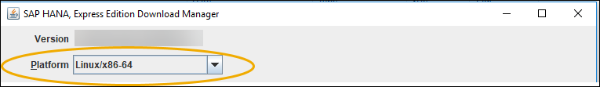
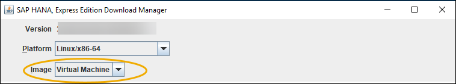
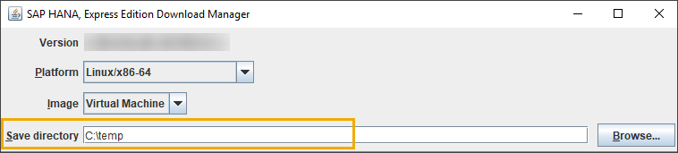
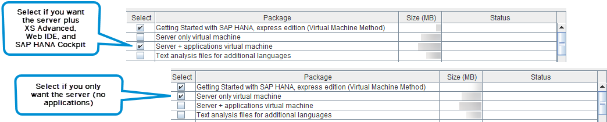
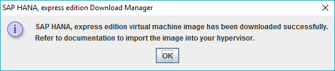

<!-- loiof14d821d2ac14186bbf202586056e1d2 -->

## Prerequisites
 - **Tutorials:** You have completed [Register](hxe-ua-register)

## Details
### You will learn
You will learn how to download installation packages using the GUI mode Download Manager

---

You can also download **optional** installation packages (like the SAP Enterprise Architecture Designer Package) at this point in your installation, before you've started the server. However, SAP does not recommend downloading optional installation packages until **after** your server is installed and running.

[ACCORDION-BEGIN [Step 1: ](Select the Linux/x86-64 platform)]

In Download Manager, from the *Platform* pull-down, select SAP HANA, express edition on `Linux/x86-64`. (Virtual machine method installation is not available for *Linux/Power (little endian)*.)

[DONE]

[ACCORDION-END]

[ACCORDION-BEGIN [Step 2: ](Select the VM image)]

From the *Image* pull-down, select *Virtual Machine*.

[DONE]

[ACCORDION-END]

[ACCORDION-BEGIN [Step 3: ](Specify a save directory)]

Click *Browse* and select a directory where your downloads will be saved.

[DONE]

[ACCORDION-END]

[ACCORDION-BEGIN [Step 4: ](Select an OVA and user guide)]

Select one or more of the following packages:

|Package|Description|
|-------|-----------|
|Getting Started with SAP HANA, express edition (Virtual Machine Method)|Selected by default.|
|Server + applications virtual machine|Downloads `hxexsa.ova`; the server plus XS Advanced, Web IDE, and SAP HANA Cockpit.|
|Server only virtual machine|Downloads `hxe.ova`; the server without any applications.|

> Note:
> SAP plans to remove SAP HANA extended application services, classic model (XSC) and the corresponding SAP HANA Repository with the next major product version of SAP HANA.
> 
> These components will be removed:
> 
> -   SAP HANA extended application services, classic model
> 
> -   SAP HANA Repository (XS classic)
> 
> -   SAP HANA Studio (Development, Modeling, and Administration perspectives)
> 
> -   SAP HANA Web-based Development Workbench (XS classic)
> 
> 
> SAP strongly advises you to plan the transition of existing content and applications from XSC to SAP HANA extended application services, advanced model (XS Advanced).
> 
> 

[DONE]

[ACCORDION-END]

[ACCORDION-BEGIN [Step 5: ]((Optional) Download optional installation packages)]

Skip to the next step unless you are an advanced user.

> Note:
> SAP recommends beginners complete the installation process first, and then download optional installation packages **after** your server is installed and running. Downloading packages after installation is faster and easier, and uses the server's built-in Download Manager (console mode). You will be asked to follow the [Install Optional Packages](hxe-ua-packages-vm-xsa) tutorial later in the installation workflow, once your server is installed and running. 
> 
> 

If you choose to download optional installation packages now (before your server is running), note that you will need to transfer the installation files to your VM once downloaded. Transfer instructions vary depending on your hypervisor, and are not included in this documentation.

> Note:
> Concerned about memory? The memory consumption of each additional package is listed in the [SAP HANA 2.0, express edition Sizing Guide (Virtual Machine Method)](https://help.sap.com/viewer/9e4243e92f244537b2164a57a405a9fd).
> 
> 

If downloading optional installation packages now, select one or more of the following:

-   *Text analysis files for additional languages* - Downloads `additional_lang.tgz`. For languages other than English and German, this package is required for the HANA Text Analysis function. (The text analysis files for English and German are already included in the *Server only virtual machine* and *Server + applications virtual machine* packages.)
-   *SAP Enterprise Architecture Designer* - This optional package is only valid on server + application virtual machine. File name is `eadesigner.tgz`. SAP EA Designer lets you capture, analyze, and present your organization's landscapes, strategies, requirements, processes, data, and other artifacts in a shared environment.
-   *SAP HANA streaming analytics* - Downloads `hsa.tgz`, which contains SAP HANA streaming analytics.
-   *SAP HANA streaming analytics studio plug-in* - Downloads `hsa_plugin.zip`, which contains an Eclipse plugin for creating and deploying streaming analytics projects.
-   *SAP HANA Interactive Education* - This optional package is only valid on server + application virtual machine. Download file name is `shine.tgz`. SHINE makes it easy to learn how to build applications on SAP HANA Extended Application Services Advanced Model (XSA).
-   *SAP HANA External Machine Learning Library* - The SAP HANA External Machine Learning Library is an application function library (AFL) supporting the integration of `Google TensorFlow`, as an external machine learning framework, with SAP HANA, express edition. Download file name is `eml.tgz`.
-   *SAP HANA Automated Predictive Library* - SAP HANA Automated Predictive Library (APL) is an application function library which exposes the data mining capabilities of the Automated Analytics engine in SAP HANA through a set of functions. Download file name is `apl.tgz`.

-   *Clients (Linux x86/64)* - Client download package for Linux machines (x86/64 architectures). Use the client packages to access developed SAP HANA, express edition applications from a client PC. The package includes:

    -   `hdb_client_linux.tgz` - Reduced HANA client for Linux 64 bit. Contains the HANA client package, drivers, and required licenses.

    -   `xs.onpremise.runtime.client_linuxx86_64.zip` - Command-line tools for Linux that enable access to (and control of) the SAP HANA XS advanced run-time environment.

-   *Clients (Linux PPC/Little Endian)* - Client download package for Linux machines (little endian on Power architectures). Use the client packages to access developed SAP HANA, express edition applications from a client PC. The package includes:

    -   `hdb_client_linux_ppc64le.tgz` - Reduced HANA client for Linux on Power. Contains the HANA client package, drivers, and required licenses.

    -   `xs.onpremise.runtime.client_linuxppc64le.zip` - Command-line tools for Linux on Power that enable access to (and control of) the SAP HANA XS advanced run-time environment.

-   *Clients (Windows)* - Client download package for Windows machines. Use the client packages to access developed SAP HANA, express edition applications from a client PC. The package includes:

-   `hdb_client_windows_x86_32.zip` - Reduced HANA client for Windows 32-bit. Contains the HANA client package, drivers, and required licenses.

-   `hdb_client_windows_x86_64zip` - Reduced HANA client for Windows 64-bit. Contains the HANA client package, drivers, and required licenses.

-   `xs.onpremise.runtime.client_ntamd64.zip` - Command-line tools for Windows that enable access to (and control of) the SAP HANA XS advanced run-time environment.

-   *Clients (Mac)* - Client download package for Mac. Use the client packages to access developed SAP HANA, express edition applications from a client PC. The package includes:

    -   `hdb_client_mac.tgz` - Reduced HANA client for Mac. Contains the HANA client package, drivers, and required licenses.

    -   `xs.onpremise.runtime.client_darwinintel64.zip` - Command-line tools for Mac that enable access to (and control of) the SAP HANA XS advanced run-time environment. - Reduced HANA client for Mac. Contains the HANA client package, drivers, and required licenses.

-   *SAP HANA smart data integration* - SAP HANA smart data integration provides functionality to access source data, and to provision, replicate, and transform that data in SAP HANA on premise, or in the cloud.

    Download file name is `sdi.tgz`.

-   *SAP HANA smart data integration - Data Provisioning Agent (Linux X86/64)* - The Data Provisioning Agent provides secure connectivity between the SAP HANA database and your adapter-based sources. Download file name is `dpagent_linux_x86_64.tgz`.

[DONE]

[ACCORDION-END]

[ACCORDION-BEGIN [Step 6: ](Download your selections)]

Click the *Download* button.

Your download is complete when a pop-up message appears confirming successful download. Make sure you wait for this message before accessing the downloaded files.

[DONE]

[ACCORDION-END]

