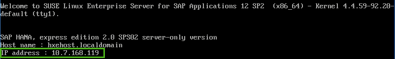
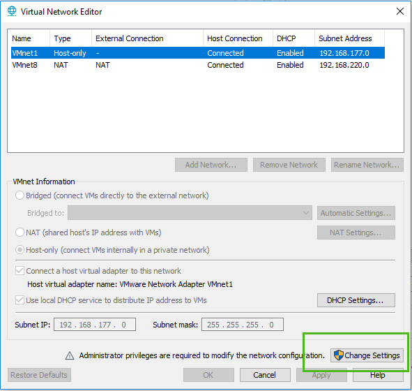

<!-- loio6b3090fbfef64012a05475a833a7e77a -->

## Prerequisites
 - **Tutorials:** You have completed [Set Keyboard and Time Zone](hxe-ua-keyboard-vm)

## Details
### You will learn
You'll learn how to start the server. At the end of this tutorial you'll have a running and configured SYSTEMDB database, and a running and configured tenant database. You'll be ready to test your installation, test XSA, and install optional components.

---

This is an on-premise installation tutorial. Other installation methods are available. See [https://developers.sap.com/topics/hana.resources.html#details](https://developers.sap.com/topics/hana.resources.html#details).

[ACCORDION-BEGIN [Step 1: ](Note the VM IP address)]

The IP address of the VM is displayed on the login screen. Make a note of the IP address, since you'll need it in future steps.



> Note:
> If the IP address and other information in this image does not show, wait few seconds and press `Enter`.
>
>

[DONE]

[ACCORDION-END]

[ACCORDION-BEGIN [Step 2: ]((Optional) Repair `VMWare` bridge networking)]


If you are using a `VMWare` product, and if the IP address still doesn't show after one minute, you may have a `VMWare` bridge networking problem. If your system has several network adapters, `VMWare` can sometimes assign the incorrect adapter to the network connection designed for bridge networking – `VMNet0`. This prevents the IP address from displaying. Use the procedure in this step to troubleshoot bridge networking for `VMNet0`. If the IP address displays normally, skip to step 3.

1.  Download and install `VMWare` Workstation Pro 15. A free 30-day evaluation edition is available. Restart your host machine.

2.  Open the Virtual Network Editor (`vmnetcfg.exe`) application from the Windows *Start* menu, or from `C:\Program Files (x86)\VMware\VMware Workstation`.

    

3.  Click the *Change Settings* button. Bridged connections show.

    

4.  Check that `VMNet0` shows at the top of the list. Under `VMNet` Information, select *Bridged*. From the *Bridged to* list, select the correct network adapter.
5.  Click *Apply* and *OK* to save your corrected bridge networking values.
6.  Exit Virtual Network Editor.
7.  Exit your virtual machine.
8.  Restart your host machine.
9.  Restart SAP HANA, express edition and go back to step 1.

[DONE]

[ACCORDION-END]

[ACCORDION-BEGIN [Step 3: ](Log in)]

At the *`hxehost` login* prompt, enter `hxeadm`.

For *Password*, enter the temporary password `HXEHana1`.

> Note:
> Is `VMWare` not recognizing your keyboard inputs? Press CTRL+G to redirect keyboard and mouse input to your VM.
>
>


When prompted for *(current) UNIX password*, enter the temporary password again: `HXEHana1`


> Note:
> When entering a password, the cursor doesn't move, and placeholder characters don't show. Don't worry – your password is being entered even though it may look like nothing is happening.
>
>

[DONE]

[ACCORDION-END]

[ACCORDION-BEGIN [Step 4: ](Enter new password)]

When prompted for *New password*, enter a strong password with at least 8 characters. If your password is not strong enough, the system logs you off and you must log in again.

> Note:
> SAP HANA, express edition requires a `very strong password` -- even stronger than other editions of SAP HANA. Your password must comply with these rules:
>
> -   At least 8 characters
> -   At least 1 uppercase letter
> -   At least 1 lowercase letter
> -   At least 1 number
> -   Can contain special characters, but not backtick, `$` (dollar sign), `\` (backslash), `'` (single quote), or `"` (double quotes)
> -   Cannot contain simplistic or systematic values, like strings in ascending or descending numerical or alphabetical order
>
>

Strong password example: `E15342GcbaFd`. Do not use this password example, since it is public and not secure. This example is for illustrative purposes only and must not be used on your system. Define your own strong password.

[DONE]

[ACCORDION-END]

[ACCORDION-BEGIN [Step 5: ](Retype new password)]

When prompted to *Retype new password*, enter your strong password again.


[DONE]

[ACCORDION-END]

[ACCORDION-BEGIN [Step 6: ](Enter new HANA database master password)]

When prompted for *New HANA database master password*, enter a strong password. Make a note of this password, since you'll need it later. You can enter the same password you used in step 4, or a new password. If you are entering a new password, see the password rules in step 4.

Entering the HANA database master password changes the SYSTEM user password. If you are installing the `server + applications virtual machine`, it also changes the `XSA_ADMIN` and `XSA_DEV` user passwords.

[DONE]

[ACCORDION-END]

[ACCORDION-BEGIN [Step 7: ](Confirm HANA database master password)]

When prompted to *Confirm "HANA database master password"*, enter the strong password again.


[DONE]

[ACCORDION-END]

[ACCORDION-BEGIN [Step 8: ](Enter proxy settings)]

When prompted *Do you need to use the proxy server to access the internet?* enter Y or N.

-   Contact your IT administrator for your company's proxy settings. If you are inside a corporate firewall, you might use a proxy for connecting to http and https servers.

-   If `Y`, enter your proxy host name, proxy port number, and (if desired) a comma-separated list of hosts that do not need a proxy. Proxy host name needs a fully qualified domain name.
-   Make sure the Non Proxy Host list includes `localhost`, `hxehost`, and `hxehost.localdomain`.

[DONE]

[ACCORDION-END]

[ACCORDION-BEGIN [Step 9: ](Wait for XSA configuration)]

Decide whether you want to wait for XSA configuration to complete before starting the server. When prompted to *Wait for XSA configuration to finish*, enter *Y* if you want to wait.

Enter *N* if you want XSA to configure in the background after server configuration completes.

[DONE]

[ACCORDION-END]

[ACCORDION-BEGIN [Step 10: ](Complete the installation)]

When prompted to *Proceed with configuration?* enter `Y`.

Wait for the success message *Congratulations! SAP HANA, express edition 2.0 is configured.*

SAP HANA 2.0, express edition is now running.

> Note:
> If the success message does not display, does this line appear in your system output?
>
> ```bash
> Fail to retrieve certificate.
> ```
>
> If you see this message, you might have a problem with `VMWare` bridge networking configuration. See step 2.
>
>

[DONE]

[ACCORDION-END]
