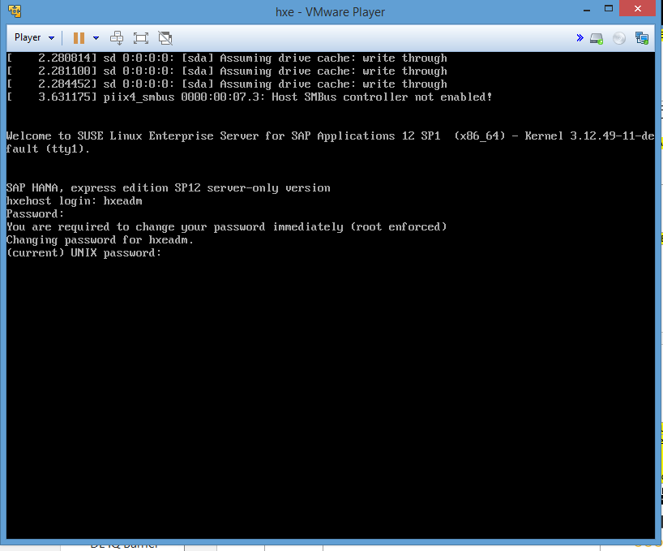
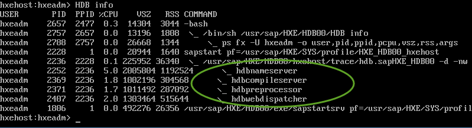

## Prerequisites  
 - **Proficiency:** Beginner
 - **Tutorials:** [Installing the VM Image](http://go.sap.com/developer/tutorials/hxe-ua-installing-vm-image.html)

## Next Steps
 - [Configure SAP HANA, express edition Security](http://go.sap.com/developer/tutorials/hxe-ua-configure-security.html)

## Details
### You will learn  
How to start the server, change the default passwords to secure your system, and connect using client tools.

### Time to Complete
**15 Min**.

---
### Start SAP HANA, express edition
1. Start the `hypervisor` and power on (or click **Play** on) your express edition VM.
2. At the **`hxehost` login** prompt, enter **`hxeadm`**
3. For **Password** enter the temporary password **`HXEHana1`**  

3. When prompted for **current (UNIX) password**, enter the temporary password again: **`HXEHana1`**
4. When prompted for **New password**, enter a strong password with at least 8 characters. If your password is not strong enough, the system logs you off and you must log in again.  
**Tip:** Your strong password should contain numbers, upper and lower case letters, and special characters. It cannot contain systematic values, like strings in ascending or descending numerical or alphabetical order.  
Strong password example: **`5342_E#1_GcbaFd!`**  
**Note:** Do not use this password example, since it is public and not secure. This example is for illustrative purposes only and must not be used on your system. Define your own strong password.
5. When prompted to **Retype new password**, enter your strong password again.

SAP HANA, express edition is now running.

### Test your Server Installation
Verify that all required SAP HANA, express edition services are running properly.
1. From the command prompt, enter:  
**HDB info**  
You should see the following services:  
**`hdbnameserver`**  
**`hdbcompileserver`**  
**`hdbpreprocessor`**  
**`hdbwebdispatcher`**  
**`hdbdiserver`** (server plus applications (`hxexsa.ova`) only)  
Multiple **`/hana/shared/HXE/xs/`** services (server plus applications (`hxexsa.ova`) only)

2. If you don't see these services, restart the database.  
Enter:  **HDB stop**  then **HDB start**  
Wait approximately 60 seconds for the system to start and the user prompt to return.

### Change the Default Password for SYSTEM User
Changing the default SYSTEM user password can help secure your system.
1. From the command prompt, enter this command:  
**`hdbsql -u SYSTEM -d SystemDB –p HXEHana1`**
2. Follow the command prompts to update the password.

### Record Your VM's IP Address
Record the IP address of your VM so you can reference it later to connect using SAP HANA client tools.
1. At the command prompt, enter:  
**/`sbin/ifconfig`**
2. Locate the IP address, listed under the **`eth0`** interface as **`inet addr`**.  
In the following example, the IP address is 10.7.186.70  

### Test XSC, XSA and Web IDE
If you installed the server plus applications (`hxexsa.ova`), test your XS installations and change the passwords of all XSA users.
1. Check that the `XSEngine` is running. From your VM desktop, open a browser and enter:  
**`http://<ip address of VM>:8000`**  
You recorded the IP address in tutorial topic **Record Your VM's IP Address**. A success page displays:  

2. Change the passwords of all XSA users:
    a. Change the `XSA_ADMIN` user password. Enter:  
    **`hdbsql -u XSA_ADMIN –p HXEHana1 –d SystemDB`**   
    Follow the prompts to update the default password.
    b. Change the `XSA_DEV` user password. Enter:  
    **`hdbsql -u XSA_DEV –p HXEHana1 –d SystemDB`**   
    Follow the prompts to update the default password.  
    c. Change the `XSA_SHINE` user password. Enter:  
    **`hdbsql -u XSA_SHINE –p HXEHana1 –d SystemDB`**  
    Follow the prompts to update the default password.
3. Log in to XSA services:  
**`xs login -u xsa_admin -p <password>`**
4. Check for a series of entries beginning with `https://<ip address of VM>:30030`. If you see these entries, XSA installed correctly.
5. Enter:  
**`xs target –s SAP`**
6. View the list of XSA applications. Enter:  
**`xs apps`**
7. Check that the application **`webide`** shows in the list of XSA applications.
8. Test your Web IDE connection.  
On Windows, update the c:\Windows\`System32`\Drivers\`etc`\hosts file.  
On Linux and  `macOS`, update /`etc`/hosts to add the IP address.  
Example:  
`<IP address of the VM>`     `hxehost`    # ``<your IP address>`
9. Enter the URL for Web IDE in a browser on your laptop. The address is the one that displays in your  
**`xs apps`**  
command output.  
Example:  `https://<hostname>:53075`

### Configure SAP HANA Studio
Download SAP HANA Studio from the SAP HANA developer edition HANA Tools site to your laptop. Then connect to your SAP HANA, express edition instance.
1. Download Eclipse Mars from [eclipse.org/downloads/](https://eclipse.org/downloads/)
2. Review the installation procedure at [tools.hana.ondemand.com/#hanatools](https://tools.hana.ondemand.com/#hanatools). Ensure your laptop meets the prerequisites.
3. Follow the installation procedure, but select Eclipse Mars.
4. When directed to the Eclipse packages site, select either **Eclipse IDE for Java EE Developers** or **Eclipse IDE for Java Developers**.
5.	Download to your laptop.
6.	Start the Eclipse installer.
7.	Select a workspace when prompted. The welcome page displays.
8.	Select *Help > Install New Software*.
9.	In the Work with field, type https://tools.hana.ondemand.com/mars and click **Add**. The Add Repository dialog box displays.
10.	In the Name field, type **SAP HANA, express edition**.
11.	Expand the **SAP HANA Tools** node.
12.	Select **SAP HANA Administrator (Developer Edition)**.
13.	Accept the installation wizard prompts. Eclipse restarts.
14.	Select *Window > Perspective > Open Perspective > Other*.
15.	Select the SAP HANA Administration Console perspective.
16.	Right-click anywhere on the Systems tab and select **Add System**. The Specify System dialog box displays.
17.	Enter:  
**Host Name**: (IP address you recorded in tutorial topic **Record Your VM's IP Address**)   
**Instance Number**: 00
18.	Ensure you click **Multiple container mode** and click **System database**. This is important because the system is configured to run on multi-tenant mode with `SystemDB` as the default database out-of-the box.
19.	Click **Next**. The Connection Properties dialog box displays.
20.	Under *Authentication by database user*, enter:  
**User Name**: SYSTEM  
**Password**: (Password you specified when you changed the default SYSTEM password)
21.	Click **Finish**. You are connected to HXE(SYSTEM).

### Edit the /etc/hosts File
You may need to edit the /etc/hosts file on the VM.
1.	Change  
**`sudo` echo <`ipaddress`> $(hostname –f) >> /`etc`/hosts**  
To  
**`sudo sh -c 'echo <Type your IP Address> $(hostname -f) >> /etc/hosts'`**

### Turn on Statistics Server (`hxe.ova` Server-only Image)
If you downloaded `hxe.ova`, you can turn on statistics server from the command prompt.
1. Enter:  
**hdbsql -d SystemDB -u SYSTEM -p <system `passwd`> “alter system alter configuration( 'nameserver.ini','SYSTEM' ) SET ( 'statisticsserver','active' ) = 'true' with reconfigure”**

## Next Steps
 - [Configure SAP HANA, express edition Security](http://go.sap.com/developer/tutorials/hxe-ua-configure-security.html)
