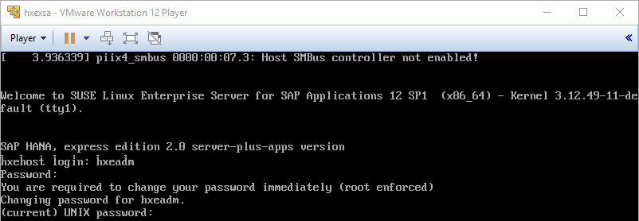
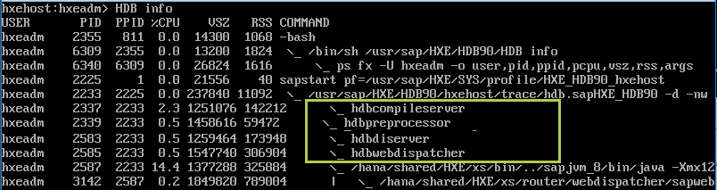
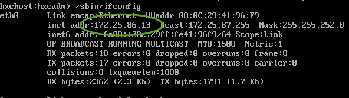
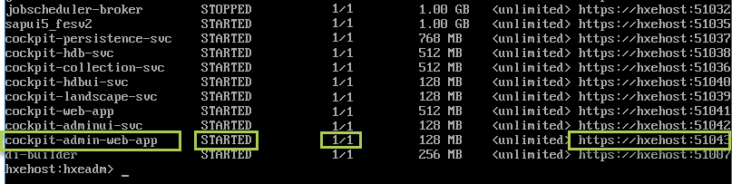
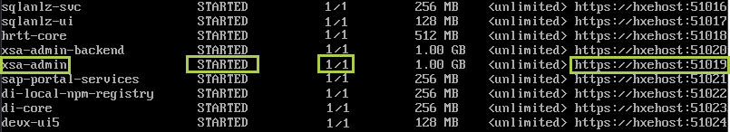
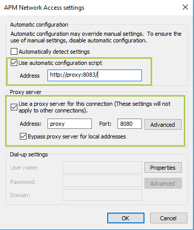

## Prerequisites  
 - **Proficiency:** Beginner
 - **Tutorials:** [Installing SAP HANA 2.0, express edition (Virtual Machine Method)](http://www.sap.com/developer/tutorials/hxe-ua-installing-vm-image.html)
 - Proxy information if behind a firewall.

<!--
 **Tip:** This tutorial is available as a [video](http://www.sap.com/assetdetail/2016/09/d2900513-8a7c-0010-82c7-eda71af511fa.html). -->

## Next Steps
 - [Configure SAP HANA, express edition Security](http://www.sap.com/developer/tutorials/hxe-ua-configure-security.html)

## Details
### You will learn  
How to start the server, change the default passwords to secure your system, and connect using client tools.

### Time to Complete
**15 Min**.

---

For troubleshooting information, see [SAP HANA, express edition Troubleshooting](http://www.sap.com/developer/how-tos/2016/09/hxe-ua-troubleshooting.html).

### Start SAP HANA 2.0, express edition

1. Start the `hypervisor` and power on (or click **Play** on) your express edition VM.

2. At the **`hxehost` login** prompt, enter **`hxeadm`**

3. For **Password** enter the temporary password **`HXEHana1`**  

    

4. When prompted for **current (UNIX) password**, enter the temporary password again: **`HXEHana1`**

5. When prompted for **New password**, enter a strong password with at least 8 characters. If your password is not strong enough, the system logs you off and you must log in again.  

    >**Tip:** Your strong password should contain numbers, upper and lower case letters, and special characters. It cannot contain systematic values, like strings in ascending or descending numerical or alphabetical order.  Strong password example: **`5342_E#1_GcbaFd!`**  

    >**Note:** Do not use this password example, since it is public and not secure. This example is for illustrative purposes only and must not be used on your system. Define your own strong password.

6. When prompted to **Retype new password**, enter your strong password again.

7. A configuration script will run if this is the first login. When prompted for **HANA database master password**, enter a strong password.

    > **Tip:** Make a note of this password, since you'll need it later. You can enter the same password you used in step 5, or a new password.

    Entering the **HANA database master password** changes the `SYSTEM` user password. If you installed the server + applications virtual machine, it also changes the user passwords for these users to the password you entered:

    - `XSA_ADMIN`

    - `XSA_DEV`

    - `XSA_SHINE`

    - `TEL_ADMIN`

    The configuration script does not change any user passwords in the tenant database. (The tenant database is stopped by default when you install SAP HANA 2.0, express edition.) If you start a tenant database at a later time, you must manually change user passwords in the tenant database.

8. When prompted to **Confirm "HANA database master password"**, enter the strong password again.

9. When prompted **Do you need to use the proxy server to access the internet?** enter Y or N.

    - Contact your IT administrator for your company's proxy settings. If you are inside a corporate firewall, you might use a proxy for connecting to http and https servers.

    - If **Y**, enter your proxy host name, proxy port number, and (if desired) a comma-separated list of hosts that do not need a proxy. Proxy host name needs a fully qualified domain name.

    - You will check your proxy settings using HANA Cockpit later in this tutorial.

10. When prompted to **Proceed with configuration?** enter **Y**.    

11. Wait for the success message **Congratulations! SAP HANA, express edition 2.0 is configured**.

The configuration script does not change any user passwords in the tenant database. (The tenant database is stopped by default when you install SAP HANA 2.0, express edition.) If you start a tenant database at a later time, you must manually change user passwords in the tenant database.

SAP HANA 2.0, express edition is now running.

### Test your Server Installation

Verify that all required SAP HANA 2.0, express edition services are running properly.

1. From the `hxehost:hxeadm>` command prompt enter:
    ```bash
    HDB info
    ```  

    You should see the following services:  

    - **`hdbcompileserver`**

    - **`hdbpreprocessor`**  

    - **`hdbnameserver`**

    - **`hdbdiserver`** (Server + applications virtual machine only)

    - **`hdbwebdispatcher`**

    

    >**Note**: It can take a few minutes after server startup for all services to start. Allow all services to start running before calling HDB info.

2. If you don't see these services, restart the database.  

    Enter:  
    ```bash
    HDB stop && HDB start
    ```

    >**Note**: After restarting, allow sufficient time for all services to start running before proceeding.

### Record Your `hxehost` IP Address

Record the `hxehost` IP address so you can reference it later to connect using SAP HANA client tools.

1. At the command prompt, enter:  
    ```bash
    /sbin/ifconfig
    ```

2. Locate the IP address, listed under the **`eth0`** interface as **`inet addr`**.  

    In the following example, the IP address is 172.25.86.13:  

    

### Edit the `/etc/hosts` File

The `hxehost` IP address is private to the VM. In order for applications on your laptop (like your web browser) to access `hxehost`, add the `hxehost` IP address to your laptop's hostname map. The hostname map is your laptop's **`/etc/hosts`** file. You must edit **`/etc/hosts`** if you want to access any XS Advanced applications, or use HANA Cockpit, from your laptop.

#### Edit `/etc/hosts` on Windows

If you installed the VM installation package to a Windows machine, follow these steps to update the `etc/hosts` file.

1. On your Windows laptop, navigate to **`C:\Windows\System32\drivers\etc`**.

2. In **Administrator** mode, open **hosts** in Notepad. See your operating system Help for information on opening applications in Administrator mode.

3. In a new uncommented row, add the IP address and **`hxehost`**. Save your changes.

    >**Tip**: Spacing is important. Make sure your hosts file in Notepad looks like this image.

    

#### Edit `/etc/hosts` on Mac and Linux

If you installed the VM installation package to a Mac or Linux machine, follow these steps to update the `etc/hosts` file.

1.	On your Mac or Linux machine, start the Terminal application.

2.  Edit the command to look like this:

    ```bash
    sudo sh - c 'echo <hxehost IP address>    hxehost >> /etc/hosts'
    ```

### Test XSC, XSA, and Web IDE (Server + Applications Virtual Machine Only)

If you installed the Server + Applications Virtual Machine package (`hxexsa.ova`), test your XS installations and Web IDE.

>**Note**: Make sure you edited your **`/etc/hosts`** file before starting this procedure.

1. Check that the `XSEngine` is running. From your host OS (not the VM guest) open a browser and enter:

    ```bash
    http://<hxehost IP address>:8090  
    ```

    You recorded the IP address earlier in this tutorial in topic **Record Your `hxehost` IP Address**. A success page displays. This indicates that XSC is running:  

    

2. Go back to your VM. Log in to XSA services:

    ```bash
    xs login -u XSA_ADMIN -p <password> -s SAP
    ```  

    You specified this password when you were prompted for **HANA database master password** at the beginning of this tutorial.

3. Check for an API endpoint showing `https://hxehost:39030`. If you see this entry, XSA installed correctly.

4. View the list of XSA applications. Enter:  

    ```bash
    xs apps
    ```

    >**Note**: When you run the `xs apps` command for the first time, it may take 1-2 minutes for the system to return the list of XSA applications.

5. Check that the application **`webide`** shows **STARTED** in the list of XSA applications , and has 1/1 instances. (If the list shows 0/1 in the instance column, the application is not started.)

    Make a note of the URL for `webide`.

    

    >**Tip**: The command **`xs apps | grep webide`** returns the `webide` row only.

6. Test your Web IDE connection. Enter the URL for Web IDE in a browser on your laptop.

    Example:  `https://hxehost:53075`

7. Log on to Web IDE using the `XSA_DEV` user. You specified this password when you were prompted for **HANA database master password** at the beginning of this tutorial.

    If you are prompted to change your password, follow the instructions.

8. Go back to your VM. Check that the application **`cockpit-admin-web-app`** shows **STARTED** in the list of XSA applications and has 1/1 instances.

    Make a note of the URL for `cockpit-admin-web-app`.

    

    >**Tip**: The command **`xs apps | grep cockpit-admin-web-app`** returns the `cockpit-admin-web-app` row only.

9. Check that the application **`xsa-admin`** shows **STARTED** in the list of XSA applications and has 1/1 instances.

    Make a note of the URL for `xsa-admin`.

    

    >**Tip**: The command **`xs apps | grep xsa-admin`** returns the `xsa-admin` row only.

10. In a browser on your laptop, enter the **`cockpit-admin-web-app`** URL you noted in step 8.

    The Cockpit logon page displays.

11. Log on to Cockpit as user `XSA_ADMIN`. You specified this password when you were prompted for **HANA database master password** at the beginning of this tutorial.     

12. If you are inside a corporate firewall and use a proxy for connecting to http and https servers, check your proxy settings using SAP HANA Cockpit.

    >**Note**: If you are not inside a firewall, you can ignore this step and skip to the next topic.

    - You set your proxy settings earlier in this tutorial.

        In this example using Internet Explorer on Windows 10, notice how connections use a proxy server on port 8080.

        

    - In Cockpit, select **Cockpit Settings > Proxy**.

        

    - Under **Http(s) Proxy**, verify that **Enable** is checked.

        >**Note**: **Http(s) Proxy** should be enabled, not the **Network Proxy**.

    - In **Host**, **Port**, and **Non Proxy Hosts**, verify the settings provided by your IT administrator.

        Make sure the host has a fully qualified domain name.

    - If you made any changes, click  **Save**.

### Best Practices: Backups

Get in the habit of making regular data backups to save your work.

For information on data backup, recovery, and log file growth, see the [SAP HANA 2.0 Administration Guide](http://help.sap.com/saphelp_hanaplatform/helpdata/en/00/0ca1e3486640ef8b884cdf1a050fbb/frameset.htm).


### (Optional) Test your Installation using the HANA Eclipse Plugin

>**Note**: Make sure you edited your **`/etc/hosts`** file before starting this procedure.

Download and install the HANA Eclipse Plugin to your host OS (not the VM guest) and connect to SAP HANA 2.0, express edition.

1. Download **Eclipse IDE for Java EE Developers** from Eclipse for [Neon](http://www.eclipse.org/neon/) or [Mars](http://www.eclipse.org/mars/) releases to your local file system.

2. Follow the eclipse installer prompts.

3. Launch when prompted, or go to the eclipse folder (example: `C:\Users\<path>\eclipse\jee-neon`) and run the **eclipse** executable file.

4. Follow the tutorial [How to download and install the HANA Eclipse plugin](http://www.sap.com/developer/how-tos/2016/09/hxe-howto-eclipse.html).

### (Optional) Install SAP Enterprise Architecture Designer (Server + Applications Virtual Machine Only)

If you installed the Server + Applications Virtual Machine package (`hxexsa.ova`), you have the option of installing the SAP Enterprise Architecture Designer (SAP EA Designer) tool.

SAP EA Designer lets you capture, analyze, and present your organization's landscapes, strategies, requirements, processes, data, and other artifacts in a shared environment. Using industry-standard notations and techniques, organizations can leverage rich metadata and use models and diagrams to drive understanding and promote shared outcomes in creating innovative systems, information sets, and processes to support goals and capabilities.

Install SAP EA Designer in your SAP HANA 2.0, express edition system using the `xs` command line tool.

>**Tip**: The SAP EA Designer installer file `XSACHANAEAD00_0.ZIP` is located at
>```bash    
/usr/sap/HXE/home/HANA_EXPRESS_20/DATA_UNITS/XSA_CONTENT_10/XSACHANAEAD00_0.ZIP
```

1. Log in as `hxeadm`.

2. Create a text file, copy the following content to it, replacing the variable <`tempPwd`> with your choice of a temporary administrator password for the first login, and save it as `firstTime.mtaext`:

    >**Important**: Incorrect indentation causes errors. If you are copying code, make sure that `- name`, `properties` and `ADMIN_PASSWORD` are indented with spaces, not tab. There are two spaces in front of `- name:`. There are two spaces in front of `properties`. There are four spaces in front of `ADMIN_PASSWORD`.

    ```bash
    _schema-version: "2.0.0"
    ID: com.sap.hana.eadesigner.ext
    extends: com.sap.hana.eadesigner

    modules:
      - name: eadesigner-backend
      properties:
         ADMIN_PASSWORD: <tempPwd>
    ```    

    >**Note**: If you do not specify this temporary password file in your installation command, the installation will proceed normally, but you will not be able to log into SAP EA Designer. We recommend that your temporary password should contain 8 or more characters including a mix of numbers and uppercase and lowercase letters. Once installation is complete, you should delete this file.

3. Login to the XSA environment with the following command and enter your credentials when prompted:

    ```bash
    xs login -a https://<hostname>:39030
    ```

4. Install the SAP EA Designer package using the following command, where `firstTime.mtaext` is the file containing the temporary administrator password:

    ```bash
    xs install XSACHANAEAD00_0.ZIP -e firstTime.mtaext
    ```

5. When the installation is complete enter the following command to confirm the status of SAP EA Designer:

    ```bash
    xs apps
    ```

    The output will include all the applications of your organization and space. You should see:   

    - `eadesigner` - The SAP EA Designer application

    - `eadesigner-service` - The SAP EA Designer Node application

    - `eadesigner-backend` - The SAP EA Designer Java application

    - `eadesigner-db` - The SAP EA Designer database creation application. This application will have a state of stopped when the installation is complete.

6. Note the URL for `eadesigner` and enter it in your web browser address bar to go to the SAP EA Designer login screen.

7. Enter the following credentials:

    - User Name - ADMIN

    >**Note**: Account names managed by SAP EA Designer are case-sensitive.

    - Password - Enter the temporary administrator password (<`tempPwd`>) you specified in `firstTime.mtaext`.

    You will be prompted to change the password and then logged in as administrator of SAP EA Designer.      

### (Optional) Install SAP HANA Interactive Education (SHINE) (`hxexsa.ova` Server + Applications Virtual Machine Only)

To install SHINE for XSC, see the [SAP HANA Interactive Education (SHINE) guide](http://help.sap.com/hana/SAP_HANA_Interactive_Education_SHINE_en.pdf).

Installation files for SHINE for **XSC** are located at:

```bash
/usr/sap/HXE/home/HANA_EXPRESS_20/DATA_UNITS/HCO_HANA_SHINE
```

To install SHINE for XSA, see the [SAP HANA Interactive Education (SHINE) for SAP HANA XS Advanced Model guide](http://help.sap.com/hana/SAP_HANA_Interactive_Education_SHINE_for_SAP_HANA_XS_Advanced_Model_en.pdf).

>**Note:** The HANA `JDBC` port number for SAP HANA, express edition is different than the default port number `30015` mentioned in [SAP HANA Interactive Education (SHINE) for SAP HANA XS Advanced Model guide](http://help.sap.com/hana/SAP_HANA_Interactive_Education_SHINE_for_SAP_HANA_XS_Advanced_Model_en.pdf). You need to update the port parameter for the resources `CrossSchemaSys` and `CrossSchemaSysBi` in the `mtaext` file to `39013`.  

If you downloaded the Server + Applications Virtual Machine (`hxexsa.ova`) package, installation files for SHINE for **XSA** are located at:

```bash
/usr/sap/HXE/home/HANA_EXPRESS_20/DATA_UNITS/XSA_CONTENT_10
```

### (Optional) Install Text Analysis Files

If you are using SAP HANA 2.0, express edition in a language other than English or German, you can download the **Text analysis files for additional languages** package in the Download Manager. This package contains the text analysis files for the HANA Text Analysis feature for languages other than English or German.

**Prerequisite**: You downloaded the package **Text analysis files for additional languages** using Download Manager.

1. Log in as `hxeadm`.

2. Navigate to `/hana/shared/HXE/exe/linuxx86_64/hdb/lexicon`.

3. Extract the contents of `additional_lang.tgz` to this directory:

    ```bash
    tar -xvzf <download_path>/additional_lang.tgz
    ```


## Next Steps
 - [Configure SAP HANA 2.0, express edition Security](http://www.sap.com/developer/tutorials/hxe-ua-configure-security.html)
