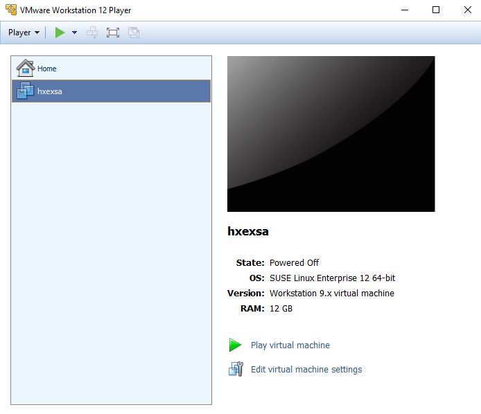
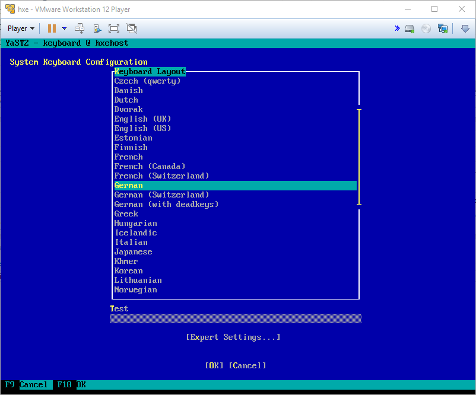
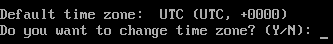
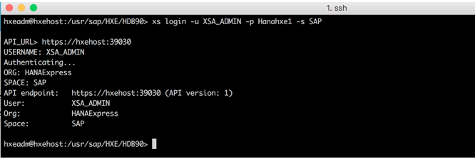
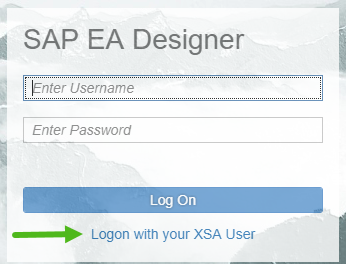

## Prerequisites  
 - **Proficiency:** Beginner
 - **Tutorials:** [Installing SAP HANA 2.0, express edition (Virtual Machine Method)](https://www.sap.com/developer/tutorials/hxe-ua-installing-vm-image.html)
 - Obtain your proxy information if behind a firewall.

 **Tip:** This tutorial is available as a [video](https://www.sap.com/assetdetail/2016/09/d2900513-8a7c-0010-82c7-eda71af511fa.html).

## Next Steps
 - [SAP HANA 2.0, express edition Troubleshooting](https://www.sap.com/developer/how-tos/2016/09/hxe-ua-troubleshooting.html)

## Details
### You will learn  
How to start the server, set keyboard and time zone, change the default passwords to secure your system, and connect using client tools.

### Time to Complete
**15 Min**.

---

[ACCORDION-BEGIN [Step 1: ](Start your VM.)]

Open your hypervisor application.

Power on (or click *Play* on) your SAP HANA 2.0, express edition VM.



[ACCORDION-END]

[ACCORDION-BEGIN [Step 2: ](Change keyboard layout.)]

Change the keyboard layout if your laptop doesn't use an English (US) QWERTY keyboard.

The system prompts you to either change the VM keyboard, or accept the default English (US) QWERTY keyboard. Enter **Y** to change the keyboard or **N** to use the default.


If you opt to change the keyboard, the System Keyboard Configuration page displays.



Scroll to the desired keyboard layout. Tab to the **OK** button, or press **F10**, to save your changes. A message displays while the system processes the keyboard layout change.


[ACCORDION-END]

[ACCORDION-BEGIN [Step 2: ](Change time zone.)]

Change the time zone if your laptop is not in the default UTC (GMT) time zone.

Enter **Y** to change the time zone, or **N** to accept the default.



If you opt to change the time zone, the Clock and Time Zone page displays.


In the Region pane, scroll down to the correct region. **Tab** to the Time Zone pane and select the correct time zone. **Tab** to the **OK** button, or press **F10**, to save your changes.

[ACCORDION-END]

[ACCORDION-BEGIN [Step 3: ](Make a note of the IP address of the VM.)]

The IP address of the VM is displayed on the login screen.


>**Note**: If the IP address and other information in this image does not show, power-off and restart your VM.

[ACCORDION-END]

[ACCORDION-BEGIN [Step 4: ](Log in.)]

At the `hxehost` login prompt, enter `hxeadm`.

For **Password**, enter the temporary password `HXEHana1`.


When prompted for **(current) UNIX password**, enter the temporary password again: `HXEHana1`:


[ACCORDION-END]

[ACCORDION-BEGIN [Step 5: ](Enter new password.)]

When prompted for **New password**, enter a strong password with at least 8 characters. If your password is not strong enough, the system logs you off and you must log in again.

>**Tip**: SAP HANA, express edition requires a very strong password that complies with these rules:

  - At least 8 characters

  - At least 1 uppercase letter

  - At least 1 lowercase letter

  - At least 1 number

  - Can contain special characters, but not _&grave;_ (`backtick`), _&#36;_ (dollar sign),  _&#92;_ (backslash), _&#39;_ (single quote), or _&quot;_ (double quotation marks).

  - Cannot contain dictionary words

  - Cannot contain simplistic or systematic values, like strings in ascending or descending numerical or alphabetical order

Strong password example: `E15342GcbaFd`. Do not use this password example, since it is public and not secure. This example is for illustrative purposes only and must not be used on your system. Define your own strong password.

[ACCORDION-END]

[ACCORDION-BEGIN [Step 6: ](Retype new password.)]

When prompted to Retype new password, enter your strong password again.


[ACCORDION-END]

[ACCORDION-BEGIN [Step 7: ](Enter new HANA database master password.)]

When prompted for New HANA database master password, enter a strong password. Make a note of this password, since you'll need it later. You can enter the same password you used in step 5, or a new password. If you are entering a new password, see the password rules in step 5.

Entering the HANA database master password changes the SYSTEM user password. If you are installing the server + applications virtual machine, it also changes the `XSA_ADMIN` and `XSA_DEV` user passwords.

[ACCORDION-END]

[ACCORDION-BEGIN [Step 8: ](Confirm HANA database master password.)]

When prompted to **Confirm HANA database master password**, enter the strong password again.

  

[ACCORDION-END]

[ACCORDION-BEGIN [Step 9: ]((Server + Applications VM Only) Enter Proxy Settings))]

When prompted **Do you need to use the proxy server to access the internet?** enter Y or N.

Contact your IT administrator for your company's proxy settings. If you are inside a corporate firewall, you might use a proxy for connecting to http and https servers.

If **Y**, enter your proxy host name, proxy port number, and (if desired) a comma-separated list of hosts that do not need a proxy. Proxy host name needs a fully qualified domain name.

Make sure the Non Proxy Host list includes `localhost`, `hxehost`, and `hxehost.localdomain`.

[ACCORDION-END]

[ACCORDION-BEGIN [Step 10: ]((Server + Applications VM Only) Wait for XSA configuration.)]

Decide whether you want to wait for XSA configuration to complete before starting the server. When prompted to Wait for XSA configuration to finish, enter **Y** if you want to wait.

Enter **N** if you want XSA to configure in the background after server configuration completes.

[ACCORDION-END]

[ACCORDION-BEGIN [Step 11: ](Complete the installation.)]

When prompted to **Proceed with configuration?** enter **Y**.

Wait for the success message **Congratulations! SAP HANA, express edition 2.0 is configured**.

SAP HANA 2.0, express edition is now running.

[ACCORDION-END]

[ACCORDION-BEGIN [Step 12: ](Record `hxehost` IP address.)]

Record the `hxehost` IP address so you can use it later when connecting to the server using SAP HANA client tools.

In your VM, at the command prompt, enter:

```bash
/sbin/ifconfig
```

In the following example, the IP address is 172.25.86.13:


[ACCORDION-END]

[ACCORDION-BEGIN [Step 13: ](Edit /etc/hosts File)]    

The `hxehost` IP address is private to the VM. In order for applications on your laptop (like your web browser) to access `hxehost`, add the `hxehost` IP address to your laptop's hostname map. The hostname map is your laptop's **`/etc/hosts`** file. You must edit **`/etc/hosts`** if you want to access any XS Advanced applications, or use HANA Cockpit, from your laptop.

#### Edit `/etc/hosts` on Windows

If you installed the VM installation package to a Windows machine, follow these steps to update the `etc/hosts` file.

1. On your Windows laptop, navigate to **`C:\Windows\System32\drivers\etc`**.

2. In Administrator mode, open hosts in Notepad. See your operating system Help for information on opening applications in Administrator mode.

3. In a new uncommented row, add the IP address and **`hxehost`**. Save your changes.

    >**Tip**: Spacing is important. Make sure your hosts file in Notepad looks like this image.

    

#### Edit `/etc/hosts` on Mac and Linux

If you installed the VM installation package to a Mac or Linux machine, follow these steps to update the `etc/hosts` file.

1.	On your Mac or Linux machine, start the Terminal application.

2.  Edit the command to look like this:

    ```bash
    sudo sh - c 'echo <hxehost IP address>    hxehost >> /etc/hosts'
    ```

[ACCORDION-END]

[ACCORDION-BEGIN [Step 14: ](Test XSC)]

Test your XSC installation.

>**Note**: Make sure you edited your **`/etc/hosts`** file before starting this procedure.

1. Check that the `XSEngine` is running. From your host OS (not the VM guest) open a browser and enter:

    ```bash
    http://<hxehost IP address>:8090  
    ```

    You recorded the IP address earlier in this tutorial in topic **Record Your `hxehost` IP Address**. A success page displays. This indicates that XSC is running:  

    

>**Note**: SAP plans to remove SAP HANA extended application services, classic model (XSC) and the corresponding SAP HANA Repository with the next major product version of SAP HANA (all editions).

>These components will be removed:

> - SAP HANA extended application services, classic model
> - SAP HANA Repository (XS classic)
> - SAP HANA Studio (Development, Modeling, and Administration perspectives)
> - SAP HANA Web-based Development Workbench (XS classic)

>SAP strongly advises you to plan the transition of existing content and applications from XSC to SAP HANA extended application services, advanced model (XS Advanced).

[ACCORDION-END]

[ACCORDION-BEGIN [Step 15: ](Test Web IDE (Server + Applications Virtual Machine Only))]

If you installed the Server + Applications Virtual Machine package (`hxexsa.ova`), test your Web IDE installation.

>**Note**: Make sure you edited your **`/etc/hosts`** file before starting this procedure.

1. View the list of XSA applications. Enter:  

    ```bash
    xs apps
    ```

    >**Note**: When you run the `xs apps` command for the first time, it may take 1-2 minutes for the system to return the list of XSA applications.

2. Check that the application **`webide`** shows **STARTED** in the list of XSA applications , and has 1/1 instances. (If the list shows 0/1 in the instance column, the application is not started.)

    **Note** Normally it only takes a few minutes for XSA services to start. However. depending on your machine, it can take over 30 minutes for XSA services to begin. If the service doesn't show STARTED and doesn't show 1/1 instances, keep waiting until the service is enabled.

    Make a note of the URL for `webide`.

    

    >**Tip**: The command **`xs apps | grep webide`** returns the `webide` row only.

3. Test your Web IDE connection. Enter the URL for Web IDE in a browser on your laptop.

    Example:  `https://hxehost:53075`

4. Log on to Web IDE using the `XSA_DEV` user. You specified this password when you were prompted for **HANA database master password** at the beginning of this tutorial.

    If you are prompted to change your password, follow the instructions.

[ACCORDION-END]

[ACCORDION-BEGIN [Step 16: ](Test XSA (Server + Applications Virtual Machine Only))]

If you installed the Server + Applications Virtual Machine package (`hxexsa.ova`), test your XSA installation.

>**Note**: Make sure you edited your **`/etc/hosts`** file before starting this procedure.

1. Go back to your VM. Log in to XSA services:

    ```bash
    xs login -u XSA_ADMIN -p "<password>" -s SAP
    ```  

    You specified this password when you were prompted for **HANA database master password** at the beginning of this tutorial.

2. Check for an API endpoint showing `https://hxehost:39030`. If you see this entry, XSA installed correctly.

>**Note**: In certain situations you may not see the API endpoint `https://hxehost:39030`. Instead, the system prompts you to enter the API URL manually. If you're prompted for the API URL, do this:

> - At the `API_URL` prompt, enter `https://hxehost:39030`.

>    The `Authenticating...` message appears. Wait until authentication completes.

>    

> - When the system prints `API Endpoint`, `User`, `Org`, and `Space`, this means XSA installed correctly.


[ACCORDION-END]


[ACCORDION-BEGIN [Step 17: ](Test Cockpit (Server + Applications Virtual Machine Only))]

If you installed the Server + Applications Virtual Machine package (`hxexsa.ova`), test your Cockpit installation.

>**Note**: Make sure you edited your **`/etc/hosts`** file before starting this procedure.

1. Go back to your VM. Check that the application **`cockpit-admin-web-app`** shows **STARTED** in the list of XSA applications and has 1/1 instances.

    **Note** Normally it only takes a few minutes for XSA services to start. However. depending on your machine, it can take over 30 minutes for XSA services to begin. If the service doesn't show STARTED and doesn't show 1/1 instances, keep waiting until the service is enabled.

    Make a note of the URL for `cockpit-admin-web-app`.

    

    >**Tip**: The command **`xs apps | grep cockpit-admin-web-app`** returns the `cockpit-admin-web-app` row only.

2. Check that the application **`xsa-admin`** shows **STARTED** in the list of XSA applications and has 1/1 instances.

    **Note** Normally it only takes a few minutes for XSA services to start. However. depending on your machine, it can take over 30 minutes for XSA services to begin. If the service doesn't show STARTED and doesn't show 1/1 instances, keep waiting until the service is enabled.

    Make a note of the URL for `xsa-admin`.

    

    >**Tip**: The command **`xs apps | grep xsa-admin`** returns the `xsa-admin` row only.

3. In a browser on your laptop, enter the **`cockpit-admin-web-app`** URL you noted earlier.

    The Cockpit logon page displays.

4. Log on to Cockpit as user `XSA_ADMIN`. You specified this password when you were prompted for **HANA database master password** at the beginning of this tutorial.  

    >**Note:** If using HANA Cockpit to register a resource, both HANA Cockpit and the SAP HANA, express edition server should be from the same release. SAP does not recommend using a newer HANA Cockpit to register an older SAP HANA, express edition.    


[ACCORDION-END]

[ACCORDION-BEGIN [Step 18: ](Optional Configuration: Test your Installation using the HANA Eclipse Plugin)]

**Note**: Make sure you edited your **`/etc/hosts`** file before starting this procedure.

Download and install the HANA Eclipse Plugin to your host OS (not the VM guest) and connect to SAP HANA 2.0, express edition.

1. Download **Eclipse IDE for Java EE Developers** from Eclipse for [Neon](http://www.eclipse.org/neon/) or [Mars](http://www.eclipse.org/mars/) releases to your local file system.

2. Follow the eclipse installer prompts.

3. Launch when prompted, or go to the eclipse folder (example: `C:\Users\<path>\eclipse\jee-neon`) and run the **eclipse** executable file.

4. Follow the tutorial [How to download and install the HANA Eclipse plugin](https://www.sap.com/developer/how-tos/2016/09/hxe-howto-eclipse.html).


[ACCORDION-END]

[ACCORDION-BEGIN [Step 19: ](Optional Configuration: Install Text Analysis Files)]

If you are using SAP HANA 2.0, express edition in a language other than English or German, you can download the **Text analysis files for additional languages** package in the Download Manager.

The Text analysis files for additional languages package contains the text analysis files for the HANA Text Analysis feature for languages other than English or German.

>**Note**: Use the server's built-in Download Manager (Console Mode) for Linux to download `additional_lang.tgz`. When logged-in as `hxeadm`, you can access the download manager (`HXEDownloadManager_linux.bin`) in directory `/usr/sap/HXE/home/bin`.

1. Run the `hxe_gc` memory management script to free up available VM memory.

    - In your VM, log in as `hxeadm` and enter:

        ```
        cd /usr/sap/HXE/home/bin
        ```

    - Execute:

        ```
        hxe_gc.sh
        ```

    - When prompted for System database user (SYSTEM) password, enter the New HANA database master password you specified during SAP HANA, express edition installation. The cleanup process runs. The command prompt returns when the cleanup process is finished.          

2. In your VM, download `additional_lang.tgz` using the built-in Download Manager. From the same directory where you ran `hxe_gc` (`/usr/sap/HXE/home/bin`) enter:

    ```bash
    HXEDownloadManager_linux.bin linuxx86_64 vm additional_lang.tgz
    ```

3. In your VM, update folder permissions on the `lang` folder.

    Navigate to `/hana/shared/<SID>/global/hdb/custom/config/lexicon/`

    Enter this command:

    ```bash
    chmod –R 755 lang
    ```

4. In your VM, extract `additional_lang.tgz`.

    This step extracts `<download_path>/additional_lang.tgz` to `/hana/shared/HXE/global/hdb/custom/config/lexicon`. Enter this command:  

    ```bash
    tar -xvzf /usr/sap/HXE/home/Downloads/additional_lang.tgz -C /hana/shared/HXE/global/hdb/custom/config/lexicon
    ```      

    >**Tip:** If your tables do not use a full text index, or if your tables use a full text index but contain very little data, you can save about 120 MB of memory if you turn off the standalone text analysis preprocessor, and activate the embedded text analysis preprocessor.

    - Stop the standalone preprocessor:

    ```bash
    alter system alter configuration ('daemon.ini','SYSTEM') set ('preprocessor','instances') = '0' with reconfigure;
    ```

    - Start the embedded preprocessor:

    ```bash
    alter system alter configuration ('preprocessor.ini','SYSTEM') set ('general','embedded') = 'true' with reconfigure;
    ```

[ACCORDION-END]

[ACCORDION-BEGIN [Step 20: ](Optional Configuration: Install SAP Enterprise Architecture Designer (Server + Applications Virtual Machine Only))]   

If you installed the Server + Applications Virtual Machine package (`hxexsa.ova`), you have the option of installing the SAP Enterprise Architecture Designer (SAP EA Designer) tool.

**Prerequisites:** You edited your laptop's **hosts** file.

SAP EA Designer lets you capture, analyze, and present your organization's landscapes, strategies, requirements, processes, data, and other artifacts in a shared environment. Using industry-standard notations and techniques, organizations can leverage rich metadata and use models and diagrams to drive understanding and promote shared outcomes in creating innovative systems, information sets, and processes to support goals and capabilities.

SAP EA Designer is a separate download in the Download Manager.

In this procedure you'll download the SAP EA Designer package (`eadesigner.tgz`) using the VM's built-in Download Manager (Console Mode), extract the package, and run the installation script. Downloading from inside the VM is the simplest and quickest method.

>**Note**: Use the server's built-in Download Manager (Console Mode) for Linux to download `eadesigner.tgz`. When logged-in as `hxeadm`, you can access the download manager (`HXEDownloadManager_linux.bin`) in directory `/usr/sap/HXE/home/bin`.

1. Run the `hxe_gc` memory management script to free up available VM memory.

    - In your VM, log in as `hxeadm` and enter:
        ```bash
        cd /usr/sap/HXE/home/bin
        ```

    - Execute:
        ```bash
        hxe_gc.sh
        ```
    - When prompted for **System database user (SYSTEM) password**, enter the **New HANA database master password** you specified during SAP HANA, express edition installation.  

    The cleanup process runs. The command prompt returns when the cleanup process is finished.

2. In your VM, download `eadesigner.tgz` using the built-in Download Manager. From the same directory where you ran `hxe_gc` (`/usr/sap/HXE/home/bin`) enter:

    ```bash
    HXEDownloadManager_linux.bin linuxx86_64 vm eadesigner.tgz
    ```

    

3. In your VM, navigate to the Downloads directory. Enter:

    ```bash
    cd /usr/sap/HXE/home/Downloads
    ```

4. In your VM, view the contents of the Downloads directory to confirm `eadesigner.tgz` exists. Enter:

    ```bash
    ls
    ```

5. In your VM, extract the file. Enter:

    ```bash
    tar -xvzf eadesigner.tgz
    ```

        

6.  In your VM, navigate to the `HANA_EXPRESS_20` directory. Enter:

    ```bash
    cd HANA_EXPRESS_20
    ```

7. In your VM, run the installation script. Enter:

    ```bash
    sh ./install_eadesigner.sh
    ```

    Installation begins.

8. When prompted for `HANA instance number [90]` press **Enter** to accept the default.  

9. When prompted for `System database user (SYSTEM) password`, enter the `hxeadm` login password.    

10. When prompted for `XSA administrator (XSA_ADMIN) password`, enter the `HANA database master password` you specified when you installed SAP HANA, express edition.    

11. When prompted to `Proceed with installation`, enter **Y**. Wait for installation to finish. A success message displays when installation completes.

       

12. Enter the following command to confirm the status of SAP EA Designer:

    ```bash
    xs apps
    ```

    The output will include all the applications of your organization and space. You should see:   

    - `eadesigner` - The SAP EA Designer application.

    - `eadesigner-service` - The SAP EA Designer Node application.

    - `eadesigner-backend` - The SAP EA Designer Java application.

    - `eadesigner-db` - The SAP EA Designer database creation application. This application will have a state of stopped when the installation is complete.

      

13. Note the URL for `eadesigner`. Launch a web browser on your laptop and enter the URL in your web browser address bar.

    The SAP EA Designer login page displays.

      

14. Click **Logon with your XSA User** on this logon page.

15. Enter `XSA_ADMIN` user and password.

You are logged in as administrator of SAP EA Designer.


[ACCORDION-END]

[ACCORDION-BEGIN [Step 21: ](Optional Configuration: Install SAP HANA Interactive Education (Server + Applications Virtual Machine Only))]       

SAP HANA Interactive Education (SHINE) makes it easy to learn how to build applications on SAP HANA Extended Application Services Advanced Model (XSA).

SHINE is a separate download in the Download Manager. To use SHINE, you need the Server + Applications Virtual Machine (`hxexsa.ova`) package.

>**Note**: Use the server's built-in Download Manager (Console Mode) for Linux to download `shine.tgz`. When logged-in as `hxeadm`, you can access the download manager (`HXEDownloadManager_linux.bin`) in directory `/usr/sap/HXE/home/bin`.

1. Run the `hxe_gc` memory management script to free up available VM memory.

    - In your VM, log in as `hxeadm` and enter:
        ```bash
        cd /usr/sap/HXE/home/bin
        ```

    - Execute:
        ```bash
        hxe_gc.sh
        ```
    - When prompted for **System database user (SYSTEM) password**, enter the **New HANA database master password** you specified during SAP HANA, express edition installation.  

    The cleanup process runs. The command prompt returns when the cleanup process is finished.

2. In your VM, download `shine.tgz` using the built-in Download Manager. From the same directory where you ran `hxe_gc` (`/usr/sap/HXE/home/bin`) enter:

    ```bash
    HXEDownloadManager_linux.bin linuxx86_64 vm shine.tgz
    ```

4. In your VM, Extract `shine.tgz`.

    ```bash
    tar -xvzf shine.tgz
    ```

5. As the `hxeadm` user, run:

    ```bash
    <extracted_path>/HANA_EXPRESS_20/install_shine.sh
    ```


[ACCORDION-END]

[ACCORDION-BEGIN [Step 22: ](Optional Configuration: Installing SAP HANA External Machine Learning Library)]

The SAP HANA External Machine Learning Library is an application function library (AFL) supporting the integration of Google `TensorFlow`, as an external machine learning framework, with SAP HANA, express edition.

>**Note**: Use the server's built-in Download Manager (Console Mode) for Linux to download `eml.tgz`. When logged-in as `hxeadm`, you can access the download manager (`HXEDownloadManager_linux.bin`) in directory `/usr/sap/HXE/home/bin`.

1. Run the `hxe_gc` memory management script to free up available VM memory.

    - In your VM, log in as `hxeadm` and enter:
        ```bash
        cd /usr/sap/HXE/home/bin
        ```

    - Execute:
        ```bash
        hxe_gc.sh
        ```
    - When prompted for **System database user (SYSTEM) password**, enter the **New HANA database master password** you specified during SAP HANA, express edition installation.  

    The cleanup process runs. The command prompt returns when the cleanup process is finished.

2. Use the Download Manager to download HANA External Machine Learning AFL, `eml.tgz`.

3. In your VM, download `eml.tgz` using the built-in Download Manager. From the same directory where you ran `hxe_gc` (`/usr/sap/HXE/home/bin`) enter:   

    ```bash
    HXEDownloadManager_linux.bin linuxx86_64 vm eml.tgz
    ```

4. In your VM, extract `eml.tgz`:

    ```bash
    tar -xvzf eml.tgz
    ```

5. As `hxeadm`, run:

    ```bash
    <extracted_path>/HANA_EXPRESS_20/install_eml.sh
    ```

    For more information on the SAP HANA External Machine Learning Library, see the SAP HANA documentation collection.    

[ACCORDION-END]

[ACCORDION-BEGIN [Step 23: ](Optional Configuration: Installing SAP HANA Smart Data Integration)]

Install the SAP HANA client package and SAP HANA smart data integration on an SAP HANA, express edition system.

You need to run a script and an installer executable to complete the necessary steps to install SAP HANA smart data integration. The script enables the Data Provisioning Server on SAP HANA, express edition, as well as deploys the data provisioning delivery unit that enables monitoring and other capabilities. The installer executable that you run installs the Data Provisioning Agent that provides connectivity between SAP HANA, express edition and your remote data sources.

> **Note:** The current version of SAP HANA, express edition supports only one Data Provisioning Agent per machine.

>**Note**: Use the server's built-in Download Manager (Console Mode) for Linux to download `sdi.tgz`. When logged-in as `hxeadm`, you can access the download manager (`HXEDownloadManager_linux.bin`) in directory `/usr/sap/HXE/home/bin`.

1. Run the `hxe_gc` memory management script to free up available VM memory.

    - In your VM, log in as `hxeadm` and enter:
        ```bash
        cd /usr/sap/HXE/home/bin
        ```

    - Execute:
        ```bash
        hxe_gc.sh
        ```
    - When prompted for **System database user (SYSTEM) password**, enter the **New HANA database master password** you specified during SAP HANA, express edition installation.  

    The cleanup process runs. The command prompt returns when the cleanup process is finished.

2. In your VM, download `sdi.tgz` using the built-in Download Manager. From the same directory where you ran `hxe_gc` (`/usr/sap/HXE/home/bin`) enter:

    ```bash
    HXEDownloadManager_linux.bin linuxx86_64 vm sdi.tgz
    ```

3. In your VM, extract `sdi.tgz`:

    ```bash
    tar -xvzf sdi.tgz
    ```

3. As the `hxeadm` user, run:

    ```bash
    HANA_EXPRESS_20/install_sdi.sh
    ```

    This enables the DP Server on HANA and deploys the monitoring delivery unit.

4. To install the Data Provisioning Agent, run `<extract directory>/HANA_EXPRESS_20/DATA_UNITS/HANA_DP_AGENT_20_LIN_X86_64/hdbinst.exe`.

    You are prompted to supply the following information (default values are given):

    - Installation path [`/usr/sap/dataprovagent`]

    - Enter User name for Agent service (user must exist)

    - Enter Agent Listener Port [5050]

    - Enter Agent Administration Port [5051]

    - Enter Shared directory for Agent Group (optional)

    - Enter Custom JRE directory (to use bundled JRE, leave it blank)

5. The SAP JVM is bundled with the Data Provisioning Agent and used as the default Java Runtime Environment. You can choose to update the version of the SAP JVM used by an installed agent, or replace it with a custom Java Runtime Environment.    

[ACCORDION-END]


[ACCORDION-BEGIN [Best Practice: ](Set the Global Memory Allocation Limit)]

Set how much memory SAP HANA, express edition utilizes by modifying the `global_allocation_limit` parameter in the `global.ini` file.

The unit for `global_allocation_limit` is MB. The default value is 0, which sets the maximum memory to the minimum of your machine limit and license limit. If the machine size is less than 16 GB, the maximum memory is set to 16 GB.

If you set `global_allocation_limit` to a non-zero value, SAP HANA, express edition will use that value as maximum memory.

>**Note**: Do not set `global_allocation_limit` to a value above the limit of your license. This can cause the database to lock down.


[ACCORDION-END]

## Next Steps
 - [SAP HANA 2.0, express edition Troubleshooting](https://www.sap.com/developer/how-tos/2016/09/hxe-ua-troubleshooting.html)
