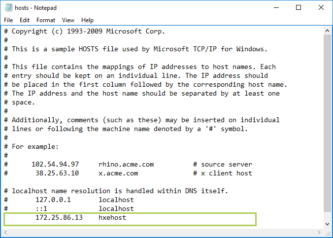

<!-- loio3040d723d58b48f1a97077c001fe4c7f -->

## Prerequisites
 - **Tutorials:** You have completed [Start SAP HANA, express edition Server](hxe-ua-getting-started-vm)

## Details
### You will learn
You'll learn how to configure your host machine to communicate with the server.

---

[ACCORDION-BEGIN [Step 1: ](Update etc/hosts on Windows)]

If you installed the VM installation package to a Windows machine, follow this step to update the `etc/hosts` file.

1.   On your Windows laptop, navigate to `C:\Windows\System32\drivers\etc` 

2.   In `Administrator` mode, open `hosts` in Notepad. See your operating system Help for information on opening applications in Administrator mode 

3.   In a new uncommented row, add the IP address and `hxehost`. Save your changes 

    Spacing is important. Make sure your hosts file in Notepad looks like this image.

    

    > Note:
    > If the VM is restarted and assigned a new IP, you'll need to update the Hosts file.
    > 
    > 

[DONE]

[ACCORDION-END]

[ACCORDION-BEGIN [Step 2: ](Update etc/hosts on Mac and Linux)]

If you installed the VM installation package to a Mac or Linux machine, follow this step to update the `etc/hosts` file.

1.   On your Mac or Linux machine, start the Terminal application 

2.   Enter the following command: 

    ```bash
    sudo sh -c 'echo <hxehost IP address> hxehost >> /etc/hosts'
    ```

    > Note:
    > If the VM is restarted and assigned a new IP, you will need to update the Hosts file.
    > 
    > 

[DONE]

[ACCORDION-END]


