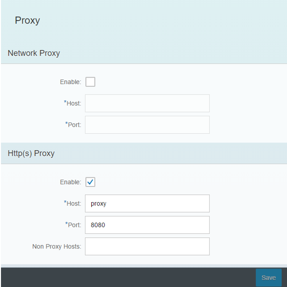
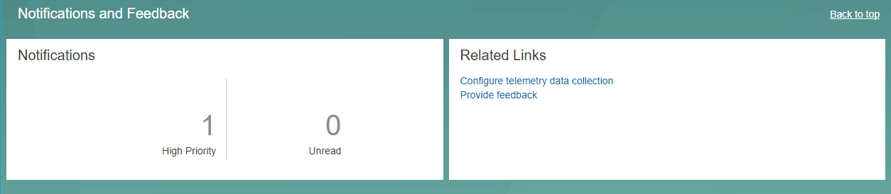
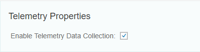
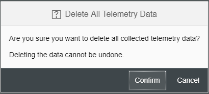

## Prerequisites
- You have installed SAP HANA 2.0, express edition using either the [Installing Binary](http://www.sap.com/developer/tutorials/hxe-ua-installing-binary.html) or [Installing the VM Image](http://www.sap.com/developer/tutorials/hxe-ua-installing-vm-image.html) tutorial.

## Next Steps
- [View similar How-Tos](http://www.sap.com/developer/tutorials.html) or [View all How-Tos](http://www.sap.com/developer/tutorials.html)

## How-To Details

When you log into SAP HANA Cockpit with your SAP HANA, express edition installation, you will see a unique category: **Notifications and Feedback**. This tutorial will describe the links in this section: _Notification_, _Configure telemetry data collection_, and _Provide feedback_.

This tutorial takes place in the SAP HANA Cockpit. Log into your Cockpit in order to proceed through the tutorial.

### Time to Complete
**5 Min**.

---

<!--[ACCORDION-BEGIN [Step 1: ](What is Telemetry?)]

When you install SAP HANA 2.0, express edition, Telemetry is enabled by default. You can disable telemetry after installation is complete. Telemetry sends anonymous performance statistics and usage statistics to SAP, so that SAP can focus development efforts on areas most vital to the SAP HANA 2.0, express edition customer base.

>**Important**: Your privacy is critical to SAP. Telemetry collects anonymous usage information while ensuring complete privacy. No identifying information or private information is collected, and you can opt out of telemetry at any time.


[ACCORDION-END]
-->

[ACCORDION-BEGIN [Setup: ](Check Your Proxy Settings (If Applicable))]

If you are inside a corporate firewall and use a proxy for connecting to http and https servers, you need to identify your proxy settings, log in to Cockpit, and update the  **Cockpit Settings > Proxy** page.

>**Note**: If your Cockpit proxy settings are incorrect, telemetry will not work properly.

Obtain your proxy settings from your network administrator.

>**Note**: If you are not inside a firewall, you can ignore this step and skip to the next topic.

- You set your proxy settings when you installed SAP HANA, express edition. In this example using Internet Explorer on Windows 10, notice how connections use a proxy server on port 8080.


In Cockpit, select **Cockpit Settings > Proxy**.



- Under **Http(s) Proxy**, verify that **Enable** is checked.

    >**Note**: **Http(s) Proxy** should be enabled, not the **Network Proxy**.

- In **Host**, **Port**, and **Non Proxy Hosts**, verify the settings provided by your IT administrator.

    Make sure the host has a fully qualified domain name.

- If you made any changes, click  **Save**.


[ACCORDION-END]

[ACCORDION-BEGIN [Information: ](Cockpit Section Links)]

The Notifications and Feedback section has three links:

| Link | Description |
|--|--|
| **Notifications** | Receive support and versioning update messages from SAP. |
| **Configure telemetry data collection** | Turn data collection on or off to send anonymous performance statistics and usage statistics to SAP. |
| **Provide feedback** | Provide anonymous feedback on your experience with SAP HANA, express edition. |




[ACCORDION-END]

[ACCORDION-BEGIN [Link: ](Notifications)]

The **Notifications** link will send you to the notification center in Cockpit. Here you will receive messages directly from SAP concerning SAP HANA, express edition. These message may include notifications concerning version updates, feedback prompts, and expected downtimes. You can save and delete these messages at any time.

> Note:
> In order to receive messages from SAP, data collection must be enabled.


[ACCORDION-END]

[ACCORDION-BEGIN [Link: ](Configuring Data Collection)]

The **Configure telemetry data collection** link opens a page where you can enable or disable data collection. When you install SAP HANA 2.0, express edition, data collection is enabled by default. You can disable data collection after installing SAP HANA, express edition. Data collection sends anonymous performance statistics and usage statistics to SAP, so that SAP can focus development efforts on areas most vital to the SAP HANA, express edition customer base.

To disable data collection, log on to your Cockpit and go to the **Notifications and Feedback** section. Click on *Configure telemetry data collection*. Untick the *Enable Telemetry Data Collection* box and click *Save*.



You can also delete data that has been collected by clicking the *Delete Collected Data* button and selecting *Confirm*.



> **Note:**
> Your privacy is important to SAP. Data collection provides SAP anonymous usage information while ensuring complete privacy. No identifying information or private information is collected, and you can opt out of the data collection at any time.

.

If you are inside a corporate firewall and use a proxy for connecting to HTTP and HTTPS servers, you need to identify your proxy settings, log in to Cockpit, and update the **Cockpit Settings** -> **Proxy** page.

> **Note:**
> If you modify the proxy settings through Cockpit, you must manually restart the Cockpit services for the changes to apply. Enter the following commands through your command line:
>
> ```
> xs restart cockpit-hdb-svc
> xs restart cockpit-xsa-svc
> xs restart cockpit-telemetry-svc
> ```


[ACCORDION-END]

[ACCORDION-BEGIN [Link: ](Provide feedback)]

In the **Provide feedback** link, you can provide feedback about your experience with SAP HANA, express edition. This feedback will be sent to the SAP HANA, express edition team.

> Note:
> The prompt is for feedback only. If you have a support question, post it to the *Community* section on the [SAP HANA, express edition](https://www.sap.com/developer/topics/sap-hana-express.community.html) home page.


[ACCORDION-END]

[ACCORDION-BEGIN [Alternative: ](Disable and Enable Data Collection via Command Line)]

Disable data collection through the command line if you wish to stop sending anonymous performance data to SAP and you do not have access to Cockpit.

Log in to your SAP HANA 2.0, express edition installation and log in as `hxeadm`.

To disable data collection, run:

```bash
/usr/sap/<sid>/home/bin/hxe_telemetry.sh -i 90 -u SYSTEM -p "<your_password>" -d SystemDB --disable
```

To re-enable data collection, run:

```bash
/usr/sap/<sid>/home/bin/hxe_telemetry.sh -i 90 -u SYSTEM -p "<your_password>" -d SystemDB --enable
```

>**Tip**: If you installed using the Virtual Machine method, `<sid>` is `HXE`.


[ACCORDION-END]

<!--
[ACCORDION-BEGIN [Step 5: ](Get Telemetry Help)]

If you want to learn more about the `hxe_telemetry.sh` script, type **`./hxe_telemetry.sh --help`**


[ACCORDION-END]
-->

## Next Steps
- [View similar How-Tos](http://www.sap.com/developer/tutorials.html) or [View all How-Tos](http://www.sap.com/developer/tutorials.html)
