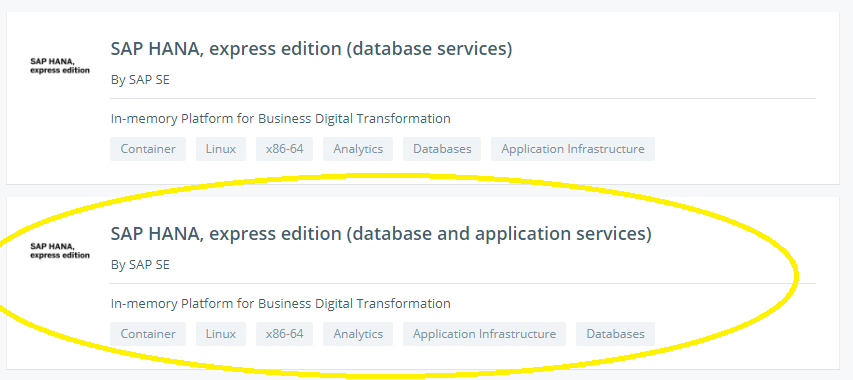
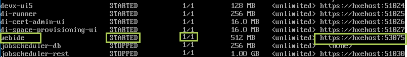

## Next Steps
- [Install the SAP HANA, express edition clients](https://developers.sap.com/group.hxe-install-clients.html)

## Details
### You will learn
  - How to install SAP HANA, express edition on your preferred Docker setup

This tutorial will show you how to install an installation of SAP HANA, express edition with XSA on your Docker installation. This version of SAP HANA, express edition does not contain XSC.

If you wish to install SAP HANA, express edition on a different virtual machine, or you want a custom setup on your Linux machine, see the [Virtual Machine](hxe-ua-installing-vm-image) or [Binary Method](hxe-ua-installing-binary) installation guides.

Before you begin, ensure your proxy settings have been properly set up. See [**HTTP/HTTPS proxy**](https://docs.docker.com/engine/admin/systemd/#httphttps-proxy) in the Docker documentation.

---

SAP HANA, express edition is a streamlined version of the SAP HANA platform which enables developers to jump-start application development in the cloud or personal computer to build and deploy modern applications that use up to 32GB memory. SAP HANA, express edition includes the in-memory data engine with advanced analytical data processing engines for business, text, spatial, and graph data - supporting multiple data models on a single copy of the data.

The software license allows for both non-production and production use cases, enabling you to quickly prototype, demo, and deploy next-generation applications using SAP HANA, express edition without incurring any license fees. Memory capacity increases beyond 32GB are available for purchase at the [SAP Store](https://www.sapstore.com/solutions/99055/SAP-HANA%2C-express-edition).

SAP HANA, express edition for Docker has been tested on the following Linux operating system versions:

| Linux OS | OS Version | Docker Editions
| --- | --- | --- |
| `Ubuntu`  | `17.04 (Zesty Zapus)` | [Community](https://store.docker.com/editions/community/docker-ce-server-ubuntu),  [Enterprise](https://store.docker.com/editions/enterprise/docker-ee-server-ubuntu) |
| `openSUSE` | `openSUSE Leap` | [Enterprise](https://store.docker.com/editions/enterprise/docker-ee-server-sles) |
| `CentOS` | `7 (Core)` | [Community](https://store.docker.com/editions/community/docker-ce-server-centos),  [Enterprise](https://store.docker.com/editions/enterprise/docker-ee-server-centos) |
| `Debian` | `9 (Stretch)` | [Community](https://store.docker.com/editions/community/docker-ce-server-debian) |
| `Fedora` | `28 (Server Edition)` | [Community](https://store.docker.com/editions/community/docker-ce-server-fedora) |

**This installation does not support Docker for Windows or Docker for Mac.**

> **Note:**
> These instructions use `openSUSE` and Docker Enterprise Edition as an example. However, any of the supported operating systems listed above are compatible. Use the operating system and Docker installation that fits your needs best.

[ACCORDION-BEGIN [Step 1: ](Install Docker)]

Download and install the appropriate Docker Edition for your system. Visit the [Docker Community Edition](https://store.docker.com/search?offering=community&type=edition) or [Docker Enterprise Edition](https://store.docker.com/search?offering=enterprise&type=edition) lists for more information and to download Docker for your machine.

> **Note:** Ensure your proxy settings have been properly set up. See [**HTTP/HTTPS proxy**](https://docs.docker.com/engine/admin/systemd/#httphttps-proxy) in the Docker documentation.

[DONE]

[ACCORDION-END]

[ACCORDION-BEGIN [Step 2: ](Manage Storage System)]

`overlay2` is recommended as the storage driver, with `ext4` or `xfs` as the backend file system. The minimum volume size of the backend file system mounting is 100G. If your current disk size is less than 100G, please resize it.

To use `overlay2`, create or edit the file `/etc/docker/daemon.json` to include the following:

```bash
{
"storage-driver": "overlay2"
}
```

Restart the Docker service.

For example, on `SuSE`:

```
sudo systemctl restart docker.service
```

`devicemapper` is an available alternative storage driver for valid Docker versions. Keep in mind, `devicemapper` is no longer being supported by Docker.

For more information on the storage driver, visit the [Docker storage drivers](https://docs.docker.com/storage/storagedriver/select-storage-driver/) documentation page.

[DONE]

[ACCORDION-END]

[ACCORDION-BEGIN [Step 3: ](Log Into Docker)]

To log into your Docker account, run:

```bash
sudo docker login
```

Follow the prompts and provide your Docker ID and password.

[DONE]

[ACCORDION-END]

[ACCORDION-BEGIN [Step 4: ]((Optional) Test Your Docker Installation)]

Test your Docker installation by running the "Hello World" container application. Run the following command from your Docker-enabled command prompt:

```bash
sudo docker run --name helloWorld alpine echo hello
```

If successful, the following should display:

```
Unable to find image 'alpine:latest' locally
latest: Pulling from library/alpine
88286f41530e: Pull complete
Digest: sha256:<log_number>
Status: Downloaded newer image for alpine:latest
hello
```

If `hello` is printed, you have successfully pulled the container image **alpine** (a demo Linux distribution), and ran the instance of the container `helloWorld`, and ran the command `echo` with an input parameter of `hello`.

If you **did not** get this output, the Docker installation has not been completed or the Docker daemon can not connect to the internet. Review the process and check the [Docker Documentation](https://docs.docker.com/get-started/) for more information in troubleshooting your Docker installation.

Remove the alpine image with the following command:

```bash
sudo docker image rm alpine -f
```

[DONE]

[ACCORDION-END]

[ACCORDION-BEGIN [Step 5: ](Download the SAP HANA, express edition Image from the Docker Library)]

Go to the [Docker Store](https://store.docker.com/).

Click on the search bar and search for "SAP HANA".

Choose **SAP HANA, express edition (database and application services)**.



Click on the **Setup Instructions** button.

Copy the Docker pull address. Here is an example:

```bash
sudo docker pull store/saplabs/hanaexpressxsa:2.00.040.00.20190729.1
```

Open your Docker-enabled command line and use the Docker pull address to download the image.

This loads the SAP HANA, express edition image. To ensure that the image was loaded successfully, run:

```bash
sudo docker images
```

The SAP HANA, express edition image will be listed as `hanaexpressxsa`.

> **Note:**
> You may have to log into your Docker account to pull the image. From your Docker-enabled command line, run `docker login` and follow the prompts to enter your Docker ID and password. Once you have logged in, try the pull command again.

[DONE]

[ACCORDION-END]


[ACCORDION-BEGIN [Step 6: ](Edit the host sysctl.conf file)]

Before you can start the container, ensure that the following parameters are set in your host's `/etc/sysctl.conf` file. The host can be a virtual machine, physical machine, or a cloud instance.

```bash
fs.file-max=20000000
fs.aio-max-nr=262144
vm.memory_failure_early_kill=1
vm.max_map_count=135217728
net.ipv4.ip_local_port_range=60000 65535
```

To edit the `sysctl.conf` file, use the `vi` command to open the file and press `i` to switch to interactive mode. Edit the file as necessary, hit the `esc` key, and type and enter `:wq!` to write and save the changes.

Load the changes by running:

```bash
sudo /sbin/sysctl -p
```

[DONE]

[ACCORDION-END]

[ACCORDION-BEGIN [Step 7: ](Edit the /etc/hosts file)]

The `hxehost` IP address is private to the installation. In order for applications to access `hxehost`, add the `hxehost` IP address to your machine's hostname map. The hostname map is your machine's **`/etc/hosts`** file. You must edit **`/etc/hosts`** if you want to access any XS Advanced applications or use HANA Cockpit from your machine.

Use the following command:

```bash
sudo sh -c 'echo <hxehost_IP_address>    hxehost >> /etc/hosts'
```

[DONE]

[ACCORDION-END]

[ACCORDION-BEGIN [Step 8: ]((Optional) Create a Directory to Persist SAP HANA, express edition Data Outside of the Container)]

Create a directory for the SAP HANA, express edition container and grant it the proper permissions.

```bash
mkdir -p /data/<directory_name>
chown <hxeadm userID or name>:<sapsys groupID or name> /data/<directory_name>
```

For example:

```bash
mkdir -p /data/mydirectory
chown 12000:79 /data/mydirectory
```

The name of this directory does not need to match the name you give to your SAP HANA, express edition container.

[DONE]

[ACCORDION-END]


[ACCORDION-BEGIN [Step 9: ](Set Up Password for SAP HANA, express edition)]

To make your system more secure, you specify your own password before you create your container. This is done by creating a `json` file as opposed to having a default password. The file can be stored locally or on another system accessible by URL. If the file is to be stored locally, store it in the */data/<directory_name>* directory you created earlier.

Create the `json` file:

```bash
vi <file_name>.json
```

Press `i` to start editing and use one of the following formats to create the file:

```bash
{
"master_password" : "<password>"
}
```

or:

```bash
{
"system_user_password" : "<password>",
"default_tenant_system_user_password" : "<second_password>"
}
```

Here is an example:

```
{
"master_password" : "SAPhxe123"
}
```

Press `esc` and then enter `wq!` to write and save the file.

This file serves as the master password for your SAP HANA, express edition users. The password must comply with these rules:

* At least 8 characters
* At least 1 uppercase letter
* At least 1 lowercase letter
* At least 1 number
* Can contain special characters, but not _&grave;_ (backtick), _&#36;_ (dollar sign),  _&#92;_ (backslash), _&#39;_ (single quote), or _&quot;_ (double quotation marks).
* Cannot contain dictionary words
* Cannot contain simplistic or systemic values, like strings in ascending or descending numerical or alphabetical order

You must then add permissions for this file to be readable by the `hxeadm` user in the container. Change permissions with:

```bash
sudo chmod 600 /data/<directory_name>/<file_name>.json
sudo chown <hxeadm userID or name>:<sapsys groupID or name>/<file_name>.json
```

Be sure to do this with each `json` file you use for your Docker containers.

Make a note of the path to the `json` file. You will need this to load the SAP HANA, express edition container.

[DONE]

[ACCORDION-END]

[ACCORDION-BEGIN [Step 10: ](Start SAP HANA, express edition Container)]

Use the SAP HANA, express edition image to create a container.

```bash
sudo docker run -p 39013:39013 -p 39015:39015 -p 39041-39045:39041-39045 -p 1128-1129:1128-1129 -p 59013-59014:59013-59014  -p 39030-39033:39030-39033 -p 51000-51060:51000-51060  -p 53075:53075  \
-h hxehost \
-v /data/<directory_name>:/hana/mounts \
--ulimit nofile=1048576:1048576 \
--sysctl kernel.shmmax=1073741824 \
--sysctl net.ipv4.ip_local_port_range='60000 65535' \
--sysctl kernel.shmmni=524288 \
--sysctl kernel.shmall=8388608 \
--name <container_name> \
store/saplabs/hanaexpressxsa:2.00.040.00.20190729.1 \
--agree-to-sap-license \
--passwords-url <file://<path_to_json_file> OR http/https://<url_to_json_file>> \
--proxy-host <proxy_hostname> \
--proxy-port <proxy_port> \
--no-proxy <no_proxy>
```

For information on the TCP/IP port ranges, see [TCP/IP Ports of All SAP Products](https://help.sap.com/viewer/ports). Filter the list by "SAP Cloud Platform".

Example:

```
sudo docker run -p 39013:39013 -p 39015:39015 -p 39041-39045:39041-39045 -p 1128-1129:1128-1129 -p 59013-59014:59013-59014  -p 39030-39033:39030-39033 -p 51000-51060:51000-51060  -p 53075:53075  \
-h hxehost \
-v /data/express_edition:/hana/mounts \
--ulimit nofile=1048576:1048576 \
--sysctl kernel.shmmax=1073741824 \
--sysctl net.ipv4.ip_local_port_range='60000 65535' \
--sysctl kernel.shmmni=524288 \
--sysctl kernel.shmall=8388608 \
--name express_edition \
store/saplabs/hanaexpressxsa:2.00.040.00.20190729.1 \
--agree-to-sap-license \
--passwords-url file:///hana/password.json \
--proxy-host <proxy_hostname> \
--proxy-port <proxy_port> \
--no-proxy <no_proxy>
```

This example creates the SAP HANA, express edition container with the name `express_edition`. This process will take several minutes. The prompt will read `Startup finished` once the container has been successfully running. This container starts in detached mode so you will need to open another command prompt to continue.

> **Note:**
> If you placed the password file in `/data/<directory_name>/<file_name>.json`, substitute  `file://<path_to_json_file>` with `file:///hana/mounts/<file_name>.json`.

> **Note:**
> Check if the password file `/hana/mounts/<file_name>.json` was deleted after the SAP HANA, express edition container starts.  If not, you can manually delete it. If the `JSON` file you are using is an *http* or *https* URL, you can leave out the `-v` option.

> **Note:**
> Ignore `--proxy-host, --proxy-port, --no-proxy` if you do not have a proxy server.

> **Note:**
> For Linux kernel versions earlier than 4, omit the `net.ipv4.ip_local_port_range` option.

[DONE]

[ACCORDION-END]

[ACCORDION-BEGIN [Step 11: ](Log into SAP HANA, express edition Container)]

To start your SAP HANA, express edition container, run the following command:

```bash
sudo docker exec -it <container_name> bash
```

Example:

```
sudo docker exec -it express_edition bash
```


[DONE]

[ACCORDION-END]

[ACCORDION-BEGIN [Step 12: ]((Optional) Test the Container)]

When you are logged into the SAP HANA, express edition container, you can test your installation by entering the following:

```bash
whoami
```

You should be logged in as `hxeadm`, the default SAP HANA, express edition user.

You can also enter the following:

```bash
HDB info
```

And you should see the following services running:

* `hdbnameserver`
* `hdbcompileserver`
* `hdbdiserver`
* `hdbwebdispatcher`

[DONE]

[ACCORDION-END]

[ACCORDION-BEGIN [Step 13: ]((Optional) Log Into System or Tenant Database)]

You can log into the system database with the following command:

```bash
hdbsql -i 90 -d <system_database> -u SYSTEM -p <password>
```

You can log into your tenant database with the following command:

```bash
hdbsql -i 90 -d <tenant_database> -u SYSTEM -p <password>
```

__JDBC__

---

To log into your system database via JDBC, use the following command:

```bash
jdbc:sap://<ip_address>:39013/?databaseName=<database_name>
```

To log into your tenant database via JDBC, use the following command:

```bash
jdbc:sap://<ip_address>:39015/?databaseName=<tenant_name>
```

For detailed information on the connection properties you can specify when connecting using JDBC, see [JDBC Connection Properties](https://help.sap.com/viewer/0eec0d68141541d1b07893a39944924e/latest/en-US/109397c2206a4ab2a5386d494f4cf75e.html) in the *SAP HANA Client Interface Programming Reference*.

>**Note**: Are you trying to connect to SAP HANA, express edition on Docker from an application or command line on the host OS? You will need to make the IP of the container on the internal container network visible to the host.
>
>**Example: Docker Machine on Windows** - In this example, 192.168.99.100 is the external `docker-machine` `vm` and `hxehost` is the container host name:
>
>```bash
>ALTER SYSTEM ALTER CONFIGURATION ('global.ini', 'system') SET ('public_hostname_resolution', 'use_default_route') = 'name' WITH RECONFIGURE;
ALTER SYSTEM ALTER CONFIGURATION ('global.ini', 'system') SET ('public_hostname_resolution', 'map_hxehost') = '192.168.99.100' WITH RECONFIGURE;
>```
>**Example: Docker Machine on Mac** - In this example, `localhost` is the Docker daemon running on the Mac, and `hxehost` is the container host name:
>
>```bash
ALTER SYSTEM ALTER CONFIGURATION ('global.ini', 'system') SET ('public_hostname_resolution', 'use_default_route') = 'name' WITH RECONFIGURE;
ALTER SYSTEM ALTER CONFIGURATION ('global.ini', 'system') SET ('public_hostname_resolution', 'map_hxehost') = 'localhost' WITH RECONFIGURE;
>```


[DONE]

[ACCORDION-END]

[ACCORDION-BEGIN [Step 14: ]((Optional) Test SAP Web IDE)]

After you have logged in, view the list of XSA applications. Enter:

```bash
xs apps
```

> **Note:**
> When you run the `xs apps` command for the first time, it may take 1-2 minutes for the system to return the list of XSA applications.

Check that the application `webide` shows `STARTED` in the list of XSA applications, and has 1/1 instances. (If the list shows 0/1 in the instance column, the application is not started.)

> **Note:**
> Normally it only takes a few minutes for XSA services to start. However. depending on your machine, it can take over 30 minutes for XSA services to begin. If the service doesn't show `STARTED` and doesn't show `1/1` instances, keep waiting until the service is enabled.

Make a note of the URL for `webide`.



> **Note:**
> The command `xs apps | grep webide` returns the `webide` row only.

Test your Web IDE connection. Enter the URL for Web IDE in a web browser.

```
Example: https://hxehost:53075
```

Log on to Web IDE using the `XSA_DEV` user and the password you made during installation.

If you are prompted to change your password, follow the instructions.

[DONE]

[ACCORDION-END]

[ACCORDION-BEGIN [Step 15: ]((Optional) Update Your Docker Image)]

Set the root password and login.

```bash
docker exec -it -u root <container_name> bash
```

```bash
passswd
```

Check the update utility. It can be found in the `<sid>adm/bin` directory. Use `HXECheckUpdate_linux.bin`. Run this to check for, and download, the latest files. Follow the prompts to download the new files. By default, they will be downloaded to `/usr/sap/<sid>/home/Downloads`. The downloaded files will be `hxe.tgz` and `hxexsa.tgz`.

Extract the contents of the packages.

Example:

```bash
tar -zxf <downloaded_path>/hxe.tgz
tar -zxf <downloaded_path>/hxexsa.tgz
```

Navigate to the directory where you extracted the packages:

```bash
cd <extract_path>/HANA_EXPRESS_20/
```

> Note:
> If the update you are applying includes the Applications package, increase your allocated memory by 3GB and run `./hxe_gc.sh`. Follow the prompts and then continue with the procedure.

As the root user, run the upgrade script to update the server:

```bash
sudo ./hxe_upgrade.sh
```

Follow the prompts to complete the server update.

[DONE]

[ACCORDION-END]

[ACCORDION-BEGIN [Docker Run Usage: ](-Help Command)]

The following is a list of options available for the `sudo docker run store/saplabs/hanaexpressxsa` command.

```
docker run store/saplabs/hanaexpressxsa:2.00.040.00.20190729.1 -h
usage: [options]

--dont-check-consistency           Skip consistency check between mount points
--dont-check-mount-points          Skip check for allowed mount points
--dont-check-version               Skip compatibility check of current and last HANA version
--dont-check-system                Skip check for incompatible /proc/sys values
--dont-exit-on-error               Halt script on error to allow root cause analysis
                                   (MUST NOT be used in production)
--license-url <url>                URL for a license file (json)
                                   Format: {"landscape-id":"<8-4-4-4-12 GUID>", "license":"<license>"}
--passwords-url <url>              URL for a password file (json). Format:
                                       {"master_password":"<pwd>"}
                                   or
                                       {"system_user_password":"<pwd>","default_tenant_system_user_password":"<pwd>"}
--proxy-host                       Proxy host name
--proxy-host                       Proxy port number
--no-proxy                         Comma separated list of hosts/domains that do not need proxy

--agree-to-sap-license             Indicates you agree to the SAP Developer Center Software Developer License Agreement.
```

[DONE]

[ACCORDION-END]

### Additional Information
- [Install the SAP HANA, express edition clients](https://developers.sap.com/group.hxe-install-clients.html)
- [TCP/IP Ports of All SAP Products](https://help.sap.com/viewer/ports)
