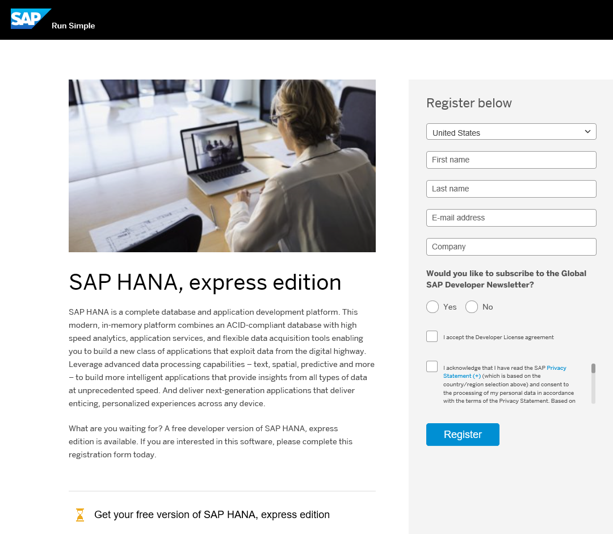
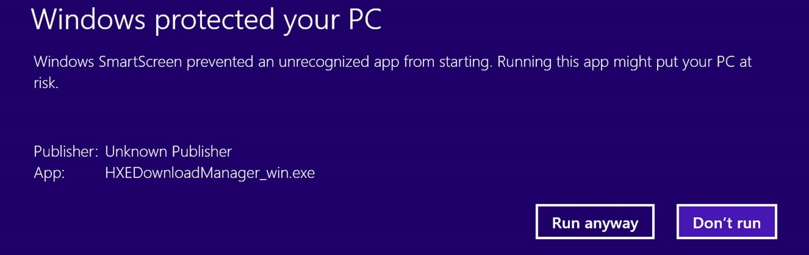
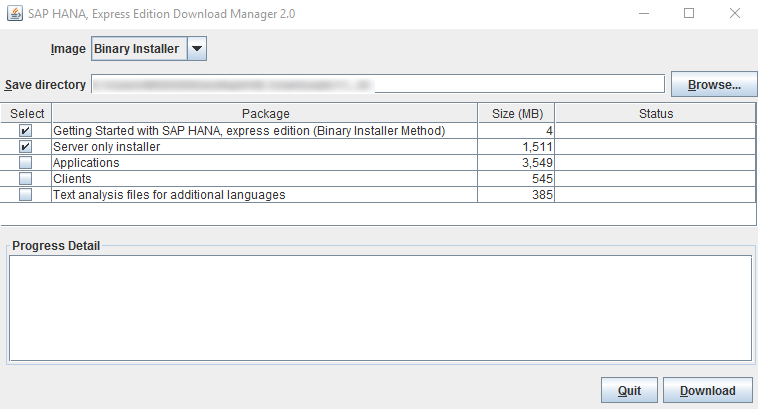

The SAP HANA, express edition is for Linux machines running specific installations, provided your host machine meets the storage and memory prerequisites. Choose this installation method if you want a custom setup. This tutorial is available as a [video](http://go.sap.com/assetdetail/2016/09/eccafc12-8a7c-0010-82c7-eda71af511fa.html).

## Prerequisites
- **Proficiency** Beginner
- **Software** Your server will need the following:
  - Java Runtime Environment 8
  - OpenSSL .0.9.8
  - Linux SUSE for SAP in one of the following versions:
    - SUSE Linux Enterprise Server for SAP 12 SP1
    - SUSE Linux Enterprise Server for SAP 12
    - SUSE Linux Enterprise Server for SAP 11.4
- **Hardware** Your server will need the following:
    - 16 GB RAM
    - 120 GB HDD
    - 2 cores (4 recommended)

>**Tip:**
> If you are installing a SUSE Linux Enterprise Server for SAP for the first time, register your copy. You may need to install add-on packages later, and add-ons are only available to registered user. Register and download a 60 day evaluation of SUSE Linux Enterprise for SAP at: <https://www.suse.com/products/sles-for-sap/download>.

## Next Steps
- Start using SAP HANA, express edition. See tutorial [Start Using SAP HANA, express edition](http://go.sap.com/developer/tutorials/hxe-ua-getting-started-binary.html).

## Details
### You will learn
Download the binary image of SAP HANA, express edition, install the image on your Linux server, and install additional tools for express edition if desired.

For troubleshooting information, see [SAP HANA, express edition Troubleshooting](http://go.sap.com/developer/how-tos/hxe-ua-troubleshooting.html).
### Time to Complete
**Approximately 60 Minutes. Download and installation speeds will vary.**

---

### Download the Installer Files

1. Go directly to the registration page at [sap.com/sap-hana-express](http://sap.com/sap-hana-express).   
    **Or**  
    Go to the SAP HANA, express edition launch page at [go.sap.com/developer/topics/sap-hana-express.html](http://go.sap.com/developer/topics/sap-hana-express.html) and click the **Register and download SAP HANA, express edition download manager** link.  

    The registration page opens.

2. Complete the registration form and click the **Register** button.  

    >**Note:**
    >If you have an SAP login, click the Login icon at the top of the page to populate the registration form automatically.

    
    The **Registration Success** page displays. (You will also receive an email indicating successful registration.)

3. On the **Registration Success** page, click the **Download** button.
      
    The SAP HANA, express edition Download Manager opens.

    >**Note:**
    >If you are using a Windows machine, you may receive a prompt preventing the Download Manager from running. Click **More info** and then click **Run anyway** to run the Download Manager.

    >

4. In Download Manager, in the **Image** pull-down, select **Binary Installer**.
    

5. Click **Browse** and select a directory where your downloads will be saved.

6. Select one or more of the following packages:  
    **Server only** - Downloads **`hxe.tgz`**; a basic server-only package, and **`hxescripts.tgz`**; a post-installation script.  
    **Server + applications** - Downloads **`hxexsa.tgz`**; the server plus XSA and Web IDE.  
    **Text analysis files for additional languages** - For languages other than English and German, these files are required for the HANA Text Analysis function. (The text analysis files for English and German are already included in the **Server only** and **Server + applications** packages.)

7. Click the **Download** button.

### Gather Server Information
1. In a shell, enter:

    `hostname -f `

2. Record the hostname.

## Installing the SAP HANA, express edition Server
1. Navigate to the directory where you wish to extract `hxe.tgz`.

2. Extract the contents of `hxe.tgz`:

    `tar -xvzf <download_path>/hxe.tgz`

    >**Tip**
    > Run the tar command from the command shell as shown, rather than using a GUI-based extraction tool.

3. Install the server. You will be prompted to enter passwords during the installation.

    1. Navigate to the `hdblcm` and execute it to install the server. Change to the `hdblcm` directory:

        `cd <extracted_path>/HANA_10_DEE/DATA_UNITS/HDB_SERVER_LINUX_X86_G4`

    2. Execute hdblcm:

        `sudo ./hdblcm -s <SID> -H <HostName> --hdbinst_server_import_content=off`

        Example:

        `sudo ./hdblcm -s HXE -H myserver.mydomain.com --hdbinst_server_import_content=off`

    3. Enter: **1(Install new system)**.
    4. When prompted for database isolation, enter **1 (low)**.
    5. Enter default settings and passwords.
    6. When *Summary Before Execution* displays, click **y** to continue with installation.  

    >**Note**
    >If a `libssl.so.0.9.8` error occurs, see [Installation Fails with Error "Cannot load libssl.so.0.9.8"](http://go.sap.com/developer/how-tos/hxe-ua-troubleshooting.html).

### (Optional) Installing XSC, XS Advanced, and Web IDE

1. Navigate to the directory where you wish to extract `hxexsa.tgz`.

2. Extract the contents of `hxexsa.tgz`:

    `tar -xvzf <download_path>/hxexsa.tgz`

    >**Tip**
    > Run the tar command from the command shell as shown, rather than using a GUI-based extraction tool.

3. Install XSC:

    `sudo /hana/shared/<SID>/global/hdb/install/bin/hdbupdrep --content_directory=/hana/shared/<SID>/global/hdb/auto_content`

    `sudo /hana/shared/<SID>/global/hdb/install/bin/hdbupdrep --content_directory=/hana/shared/<SID>/global/hdb/auto_content/systemdb`

4. Install HANA Extended Services (XSA):
      1. Install statistics:

          `sudo su - hxeadm
          hdbsql -d SystemDB -u SYSTEM -p "${SYSTEM_PWD}" "alter system alter configuration('nameserver.ini','SYSTEM') SET ('statisticsserver','active')" = 'true' with reconfigure"`

          Example:

          `sudo su - hxeadm
          hdbsql -d SystemDB -u SYSTEM -p ABCD1234 "alter system alter configuration('nameserver.ini','SYSTEM') SET ('statisticsserver','active')" = 'true' with reconfigure"`

      2. Install XSA using `hdblcm`:

          `sudo ./hdblcm -s <SID> -H <HOSTNAME> --action=update --components=xs --xs_components=all --configfile=configurations/auto_install.cfg --component_medium=<download_path>/HANA_10_DEE`

          Example:

          `sudo ./hdblcm -s HXE -H myhost.localdomain.com --action=update --components=xs --xs_components=all --configfile=configurations/auto_install.cfg --component_medium=/home/myname/Downloads/HANA_10_DEE`

5. Execute the post-installation script.
     1. Check proxy settings.
        1. In SUSE, go to YAST. Click on *Proxy*
        2. Ensure you have the fully qualified address for your proxy in the HTTP Proxy URL.
        3. Check the "Use the same proxy" checkbox.
        4. Add additional local domains to the No Proxy Domains list as necessary.
     2. Extract `hxescripts.tgz`.

          `tar -xvzf <download_path>/hxescripts.tgz`

     3. Enable `<sid>adm`.

          `sudo su - <sid>adm`

     4. Navigate to the directory where you extracted *hxescripts.tgz* and execute the script.

          `cd <extracted_path>
          ./hxe_optimize.sh`

     5. Follow the prompts to enter the appropriate passwords.

## Next Steps
- Start using SAP HANA, express edition. See tutorial [Start Using SAP HANA, express edition](http://go.sap.com/developer/tutorials/hxe-ua-getting-started-binary.html).
