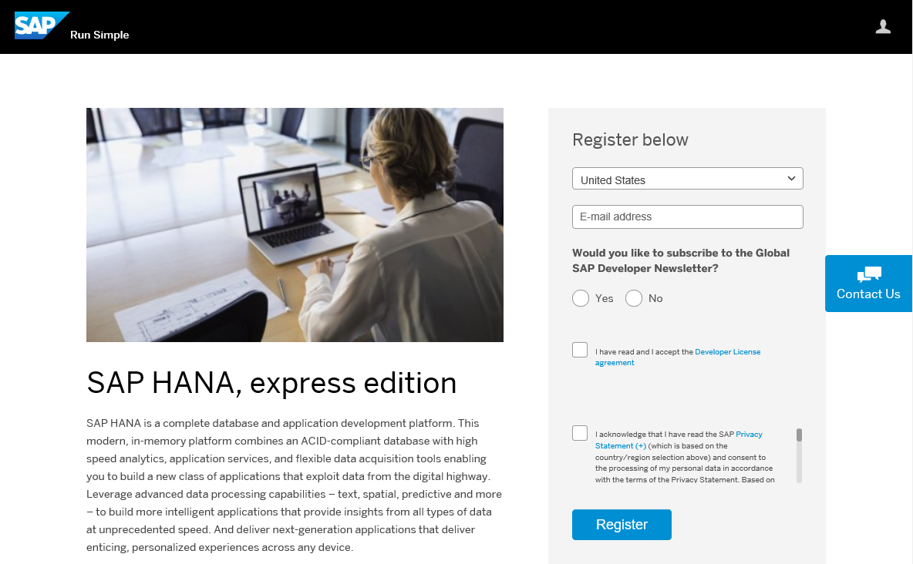
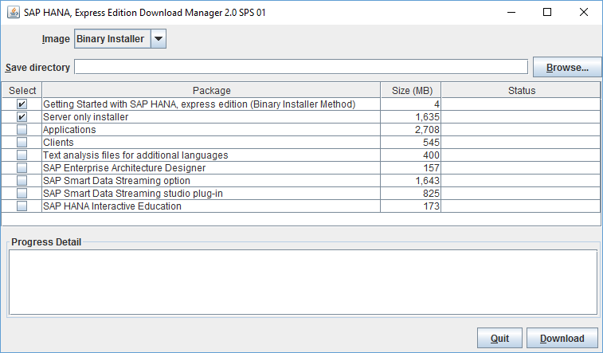

SAP HANA 2.0, express edition is for Linux machines running specific installations, provided your host machine meets the storage and memory prerequisites. Choose this installation method if you want a custom setup. This tutorial is available as a [video](http://www.sap.com/assetdetail/2016/09/eccafc12-8a7c-0010-82c7-eda71af511fa.html).

## Prerequisites
- **Proficiency** Beginner


>**Tip:**
> If you are installing a SUSE Linux Enterprise Server for SAP for the first time, register your copy. You may need to install add-on packages later, and add-ons are only available to registered user. Register and download a 60 day evaluation of SUSE Linux Enterprise for SAP at: <https://www.suse.com/products/sles-for-sap/download>.

## Next Steps
- Start using SAP HANA, express edition. See tutorial [Start Using SAP HANA, express edition](http://www.sap.com/developer/tutorials/hxe-ua-getting-started-binary.html).

## Disclaimer
SAP HANA, express edition is officially supported on SLES. SAP Community members have been successful in running SAP HANA, express edition on other Linux operating systems that are not formally supported by SAP, such as Ubuntu, `openSUSE` and Fedora. SAP is not committing to resolving any issues that may arise from running SAP HANA, express edition on these platforms.

## Details
### You will learn
How to download the binary image of SAP HANA 2.0, express edition, install the image on your Linux server, and install additional tools for your SAP HANA 2.0, express edition installation as desired.

For troubleshooting information, see [SAP HANA, express edition Troubleshooting](http://www.sap.com/developer/how-tos/2016/09/hxe-ua-troubleshooting.html).
### Time to Complete
**Approximately 60 Minutes. Download and installation speeds will vary.**

---

[ACCORDION-BEGIN [Pre-Installation Info: ](Machine Requirements)]

Your server will need the following:

#### Software

- **Java Runtime Environment (JRE) 8 or higher** - If you are planning to install the SAP HANA 2.0, express edition Download Manager for Windows or Linux, you need the 64-bit JRE. If you are planning to install the platform-independent Download Manager, you can use either the 32- or 64-bit JRE.

- **SUSE Linux Enterprise Server for SAP 12 SP1**

#### Hardware

- **RAM** 16 GB minimum (24 GB recommended)

>**Note**: If you are installing on a system with 16 GB of RAM, increase the amount of swap space to at least 32 GB.

- **HDD** 120 GB HDD recommended

- **Cores** 2 cores (4 recommended)

[DONE] [ACCORDION-END]

[ACCORDION-BEGIN [Step 1: ](Register for SAP HANA, express edition)]

Go to the registration page at <http://sap.com/sap-hana-express>. Alternately, you can go to the SAP HANA, express edition launch page at <http://www.sap.com/developer/topics/sap-hana-express.html> and click the **Register and download SAP HANA, express edition download manager** link.

The registration page opens.

Complete the registration form and click the **Register** button.  

> **Note:** If you have an SAP login, click the Login icon at the top of the page to populate the registration form automatically.



The **Registration Success** page displays. (You will also receive an email indicating successful registration.)

[DONE] [ACCORDION-END]

[ACCORDION-BEGIN [Step 2:](Download the Download Manager)]

On the **Registration Success** page, under **1A. ON-PREMISE INSTALLATION**, click the download manager that matches your system: Linux or Windows.

>Note:
>If you have a Mac, or another type of machine, click "Platform-independent" for a platform-independent download manager.


Save the **Download Manager** file to your laptop.

[DONE] [ACCORDION-END]

[ACCORDION-BEGIN [Step 3:](Choose Your Installation Downloads)]

Run the **Download Manager**. If your system displays a security warning when you open the file, accept the warning.

**Note:**
If you are inside a corporate firewall, you will be prompted for your proxy settings. Contact your IT administrator.



In the **Image** pull-down, select **Binary Installer**. Click **Browse** and select where you want your downloads to be saved. Then select one or more of the following packages:

- **Server only installer** - Downloads **`hxe.tgz`**; the SAP HANA 2.0, express edition server with Application Function Library. **This file is necessary for installing SAP HANA 2.0, express edition**.  

- **Applications** - Downloads the optional package **`hxexsa.tgz`**; XSA, Web IDE, SAP HANA cockpit, and EA Designer. Download this and **`hxe.tgz`** to install those applications.  

- **Clients** - Downloads a zip file containing four compressed client-tools bundles. Use the client packages to access developed SAP HANA 2.0, express edition applications from a client PC. See [How to Install the SAP HANA 2.0, express edition Clients](http://www.sap.com/developer/how-tos/2016/12/hxe-ua-howto-installing-clients.html).

    - **`hdb_client_linux.tgz`** - Reduced HANA client for Linux 64-bit. Contains the HANA client package, drivers, and required licenses.

    - **`hdb_client_windows.zip`** - Reduced HANA client for Windows 64-bit. Contains the HANA client package, drivers, and required licenses.

    - **`xs.onpremise.runtime.client_linuxx86_64.zip`** - Command-line tools for Linux that enable access to (and control of) the SAP HANA XS advanced run-time environment.

    - **`xs.onpremise.runtime.client_ntamd64.zip`** - Command-line tools for Windows that enable access to (and control of) the SAP HANA XS advanced run-time environment.

    > **Tip:** After you develop an application using SAP HANA, express edition, install Download Manager to a client machine and download the *Clients* package to that client machine. You can then use the clients to connect to -- and test -- your HANA application, emulating a customer.  

- **Text analysis files for additional languages** - For languages other than English and German, these files are required for the HANA Text Analysis function. (The text analysis files for English and German are already included in the **Server only** and **Applications** packages.) Download this and **`hxe.tgz`** to install these files. For the text analysis files installation procedure, see *Install Text Analysis Files* at [Start Using SAP HANA 2.0, express edition](http://www.sap.com/developer/tutorials/hxe-ua-getting-started-binary.html).

- **SAP Enterprise Architect Designer (XSA only)** - Downloads **`eadesigner.tgz`**. Extract this in the same directory as **`hxe.tgz`** and **`hxexsa.tgz`** to include EA Designer in your installation process.

- **SAP Smart Data Streaming option** - Downloads **`sds.tgz`**, which contains SAP HANA smart data streaming. Extract this in the same directory as **`hxe.tgz`** and **`hxexsa.tgz`** to include smart data streaming in your installation process.

- **SAP Smart Data Streaming studio plug-in** - Downloads **`sds_plugin.tgz`**, which contains an Eclipse plugin for creating and deploying smart data streaming projects. For installation steps see [Installing and Configuring the Streaming Studio Plugin](https://www.sap.com/developer/tutorials/hxe-ua-streaming-plugin.html).

- **SAP HANA Interactive Education (XSA only)** - Downloads **`shine.tgz`**. Extract this in the same directory as **`hxe.tgz`** and **`hxexsa.tgz`** to include SHINE in your installation process.

Click the **Download** button to being your download.

[DONE] [ACCORDION-END]

[ACCORDION-BEGIN [Step 4:](Extract Your Downloaded Packages)]

**Note:**
You may have to disable your firewall for SAP HANA 2.0, express edition to install successfully.

Navigate to the directory where you wish to extract the installation files. Extract the contents of `hxe.tgz`, `hxexsa.tgz` (if you are installing the Applications package), `eadesigner.tgz` (if you are install SAP EA Designer), `sds.tgz` (if you are installing smart data streaming), and `shine.tgz` (if you are installing SHINE):

```bash
tar -xvzf <download_path>/hxe.tgz
```

```bash
tar -xvzf <download_path>/hxexsa.tgz
```

```bash
tar -xvzf <download_path>/eadesigner.tgz
```

```bash
tar -xvzf <download_path>/tgz.tgz
```

```bash
tar -xvzf <download_path>/shine.tgz
```

>**Tip:**
> Run the tar command from the command shell as shown, rather than using a GUI-based extraction tool.

>**Tip:**
> You may have to give these files run permissions. Example:

> ```bash
> chmod -R 777 <download_path>/hxe.tgz
> ```

[DONE] [ACCORDION-END]


[ACCORDION-BEGIN [Step 5:](Install SAP HANA, express edition)]

Navigate to the directory where you extracted the files and run `./setup_hxe.sh` as the root user:

```bash
cd <extracted_path>
```

```bash
sudo ./setup_hxe.sh
```

Follow the prompts to configure your installation.

>**Note:**
> The master password you specify during installation is used for the `<sid>adm`,  `sapadm` OS users, the telemetry technical user, and the SYSTEM user. If you are installing the Applications package, this password is also used for the `XSA_ADMIN`, `XSA_DEV`, and `XSA_SHINE` users.

>`A1a` (Upper case letters, numbers, lowercase letters) is the default policy to set master password. You will need at least 8 or more characters. Special characters are allowed except for the _&bsol;_ (backslash), _&quot;_ (double quotation marks), and _&grave;_ (backtick) characters. Your password cannot contain a dictionary word, nor can it be too simplistic or systematic (for example: alphabetic sequences or keyboard patterns).

[DONE] [ACCORDION-END]

## Next Steps
- Start using SAP HANA 2.0, express edition. See tutorial [Start Using SAP HANA, express edition](http://www.sap.com/developer/tutorials/hxe-ua-getting-started-binary.html).
