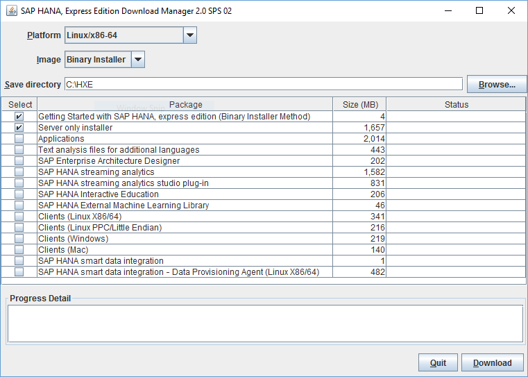

SAP HANA 2.0, express edition is for Linux machines running specific installations, provided your host machine meets the storage and memory prerequisites. Choose this installation method if you want a custom setup. This tutorial is available as a [video](https://www.sap.com/assetdetail/2016/09/eccafc12-8a7c-0010-82c7-eda71af511fa.html).

## Prerequisites
- **Proficiency** Beginner


>**Tip:**
> If you are installing a SUSE Linux Enterprise Server for SAP for the first time, register your copy. You may need to install add-on packages later, and add-ons are only available to registered user. Register and download a 60 day evaluation of SUSE Linux Enterprise for SAP at: <https://www.suse.com/products/sles-for-sap/download>.

## Next Steps
- Start using SAP HANA, express edition. See tutorial [Start Using SAP HANA, express edition](https://www.sap.com/developer/tutorials/hxe-ua-getting-started-binary.html).

## Disclaimer
SAP HANA, express edition is officially supported on SLES. SAP Community members have been successful in running SAP HANA, express edition on other Linux operating systems that are not formally supported by SAP, such as Ubuntu, `openSUSE` and Fedora. SAP is not committing to resolving any issues that may arise from running SAP HANA, express edition on these platforms.

## Details
### You will learn
How to download the binary image of SAP HANA 2.0, express edition, install the image on your Linux server, and install additional tools for your SAP HANA 2.0, express edition installation as desired.

For troubleshooting information, see [SAP HANA, express edition Troubleshooting](https://www.sap.com/developer/how-tos/2016/09/hxe-ua-troubleshooting.html).
### Time to Complete
**60 Min**

---

[ACCORDION-BEGIN [Pre-Installation Info: ](Machine Requirements)]

Your server will need the following:

#### Software

- **Java Runtime Environment (JRE) 8 or higher** - If you are planning to install the SAP HANA 2.0, express edition Download Manager for Windows or Linux, you need the 64-bit JRE. If you are planning to install the platform-independent Download Manager, you can use either the 32- or 64-bit JRE.

- One of the following operating systems:
    - **SUSE Linux Enterprise Server for SAP Applications, 12.1, 12.2**
    - **SUSE Linux Enterprise Server for SAP Applications, IBM Power Systems (`ppc64le` - "Little Endian"), 12.1, 12.2**
    - **Red Hat Enterprise Linux for SAP Applications 7.2, 7.3**
    - **Red Hat Enterprise Linux for SAP Applications for Power 7.3 (SAP HANA, express edition 2.0 SPS 02 Rev 21 or higher required)**

>**Note**: To install on SLES for SAP 12.1, the `libgcc_s1` and `libstdc++6` packages must be version 6.2 or newer. To update these packages, register your system with SUSE and run `zypper install libgcc_s1 libstdc++6`. For registration instructions, see the SUSE Linux Enterprise Server 12 documentation.

>**Note**: To install on RHEL for SAP, first install the `compat-sap-c++-6` package using the following command: `yum install compat-sap-c++-6`.

>**Note**: The following components are not available on IBM Power systems
> - SAP Enterprise Architecture Designer
> - SAP HANA streaming analytics
> - SAP HANA Extended Machine Learning AFL

#### Hardware

- **RAM**
    - Server: 16 GB minimum (24 GB recommended)
    - Server + Applications: 24 GB minimum (32 GB recommended)

>**Note**: If you are installing on a system with 16 GB of RAM, increase the amount of swap space to at least 32 GB.

- **HDD**: 120 GB HDD recommended

- **Cores**: 2 cores (4 recommended)

 [ACCORDION-END]

[ACCORDION-BEGIN [Step 1: ](Register for SAP HANA, express edition)]

Go to the registration page at <https://www.sap.com/sap-hana-express>. Alternately, you can go to the SAP HANA, express edition launch page at <https://www.sap.com/developer/topics/sap-hana-express.html> and click the **Register and download SAP HANA, express edition download manager** link.

The registration page opens.

Complete the registration form and click the **Register** button.  

> **Note:** If you have an SAP login, click the Login icon at the top of the page to populate the registration form automatically.


The **Registration Success** page displays. (You will also receive an email indicating successful registration.)

 [ACCORDION-END]

[ACCORDION-BEGIN [Step 2:](Download the Download Manager)]

On the **Registration Success** page, under **1A. ON-PREMISE INSTALLATION**, click the download manager that matches your system: Linux or Windows.

>Note:
>If you have a Mac, or another type of machine, click "Platform-independent" for a platform-independent download manager.


Save the **Download Manager** file to your laptop.

 [ACCORDION-END]

[ACCORDION-BEGIN [Step 3:](Choose Your Installation Downloads)]

Run the **Download Manager**. If your system displays a security warning when you open the file, accept the warning.

**Note:**
If you are inside a corporate firewall, you will be prompted for your proxy settings. Contact your IT administrator.



In the **Image** pull-down, select **Binary Installer**. Click **Browse** and select where you want your downloads to be saved. Then select one or more of the following packages:

- **Server only installer** - Downloads **`hxe.tgz`**; the SAP HANA 2.0, express edition server with Application Function Library. **This file is necessary for installing SAP HANA 2.0, express edition**.  

- **Applications** - Downloads the optional package **`hxexsa.tgz`**; XSA, Web IDE, and SAP HANA cockpit. Download this and **`hxe.tgz`** to install those applications.  

- **Text analysis files for additional languages** - For languages other than English and German, these files are required for the HANA Text Analysis function. (The text analysis files for English and German are already included in the **Server only** and **Applications** packages.) Download this and **`hxe.tgz`** to install these files. For the text analysis files installation procedure, see *Install Text Analysis Files* at [Start Using SAP HANA 2.0, express edition](https://www.sap.com/developer/tutorials/hxe-ua-getting-started-binary.html).

- **SAP Enterprise Architect Designer (XSA only)** - Downloads **`eadesigner.tgz`**. Extract this in the same directory as **`hxe.tgz`** and **`hxexsa.tgz`** to include EA Designer in your installation process.

- **SAP HANA streaming analytics** - Downloads **`hsa.tgz`**, which contains SAP HANA streaming analytics. Extract this in the same directory as **`hxe.tgz`** and **`hxexsa.tgz`** to include streaming analytics in your installation process.

- **SAP HANA streaming analytics studio plug-in** - Downloads **`hsa_plugin.tgz`**, which contains an Eclipse plugin for creating and deploying streaming analytics projects. For installation steps see [Installing and Configuring the Streaming Studio Plugin](https://www.sap.com/developer/tutorials/hxe-ua-streaming-plugin.html).

- **SAP HANA Interactive Education (XSA only)** - Downloads **`shine.tgz`**. Extract this in the same directory as **`hxe.tgz`** and **`hxexsa.tgz`** to include SHINE in your installation process.

- **SAP HANA External Machine Learning Library** - The SAP HANA External Machine Learning Library is an application function library (AFL) supporting the integration of Google `TensorFlow`, as an external machine learning framework, with SAP HANA, express edition. Download file name is `eml.tgz`.

- **Clients (Linux x86/64)** - Client download package for Linux machines (x86/64 architectures). Use the client packages to access developed SAP HANA, express edition applications from a client PC. See [How to Install SAP HANA 2.0, express edition Clients](https://www.sap.com/developer/how-tos/2016/12/hxe-ua-howto-installing-clients.html). The package includes:

    - **`hdb_client_linux.tgz`** - Reduced HANA client for Linux 64 bit. Contains the HANA client package, drivers, and required licenses.

    - **`xs.onpremise.runtime.client_linuxx86_64.zip`** - Command-line tools for Linux that enable access to (and control of) the SAP HANA XS advanced run-time environment.

- **Clients (Linux PPC/Little Endian)** -  Client download package for Linux machines (little endian on Power architectures). Use the client packages to access developed SAP HANA, express edition applications from a client PC. See [How to Install SAP HANA 2.0, express edition Clients](https://www.sap.com/developer/how-tos/2016/12/hxe-ua-howto-installing-clients.html). The package includes:

    - **`hdb_client_linux_ppc64le.tgz`** - Reduced HANA client for Linux on Power. Contains the HANA client package, drivers, and required licenses.

    - **`xs.onpremise.runtime.client_linuxppc64le.zip`** - Command-line tools for Linux on Power that enable access to (and control of) the SAP HANA XS advanced run-time environment.

- **`Clients (Windows)`** - Client download package for Windows machines. Use the client packages to access developed SAP HANA, express edition applications from a client PC. See [How to Install SAP HANA 2.0, express edition Clients](https://www.sap.com/developer/how-tos/2016/12/hxe-ua-howto-installing-clients.html). The package includes:

    - **`hdb_client_windows_x86_32.zip`** - Reduced HANA client for Windows 32-bit. Contains the HANA client package, drivers, and required licenses.

    - **`hdb_client_windows_x86_64zip`** - Reduced HANA client for Windows 64-bit. Contains the HANA client package, drivers, and required licenses.

    - **`xs.onpremise.runtime.client_ntamd64.zip`** - Command-line tools for Windows that enable access to (and control of) the SAP HANA XS advanced run-time environment.

- **`Clients (Mac)`** - Client download package for Mac. Use the client packages to access developed SAP HANA, express edition applications from a client PC. See [How to Install SAP HANA 2.0, express edition Clients](https://www.sap.com/developer/how-tos/2016/12/hxe-ua-howto-installing-clients.html). The package includes:

    - **`hdb_client_mac.tgz`** - Reduced HANA client for Mac. Contains the HANA client package, drivers, and required licenses.

    - **`xs.onpremise.runtime.client_darwinintel64.zip`** - Command-line tools for Mac that enable access to (and control of) the SAP HANA XS advanced run-time environment.

    > **Tip:** After you develop an application using SAP HANA, express edition, install Download Manager to a client machine and download the *Clients* package to that client machine. You can then use the clients to connect to -- and test -- your HANA application, emulating a customer.  

- **SAP HANA smart data integration** - SAP HANA smart data integration provides functionality to access source data, and to provision, replicate, and transform that data in SAP HANA on premise, or in the cloud. Download file name is `sdi.tgz`. <!--Needs link to Mike Madsen's tutorial when available-->

- **SAP HANA smart data integration - Data Provisioning Agent (Linux X86/64)** - The Data Provisioning Agent provides secure connectivity between the SAP HANA database and your adapter-based sources. Download file name is `dpagent_linux_x86_64.tgz`. <!--Needs link to Mike Madsen's tutorial when available-->

Click the **Download** button to being your download.

> **Note:** SAP plans to remove SAP HANA extended application services, classic model (XSC) and the corresponding SAP HANA Repository with the next major product version of SAP HANA.
> These components will be removed:
> - SAP HANA extended application services, classic model
> - SAP HANA Repository (XS classic)
> - SAP HANA Studio (Development, Modeling, and Administration perspectives
> - SAP HANA Web-based Development Workbench (XS classic)
> SAP strongly advises you to plan the transition of existing content and applications from XSC to SAP HANA extended application services, advanced model (XS Advanced).

[ACCORDION-END]

[ACCORDION-BEGIN [Step 3: ]((Optional) Download Using the Download Manager (Console Mode))]

Run the Download Manager in console mode if you're using a command line interface.

Before you begin, close the Download Manager if it is running in GUI mode.

Open a command prompt at the location where you saved the Download Manager file (`HXEDownloadManager.jar`, or `HXEDownloadManager_linux.bin`). You can display the command help using the `-h` argument.

Linux Download Manager example:

```bash
HXEDownloadManager_linux.bin -h
```

Platform-independent Download Manager example:

```bash    
java -jar HXEDownloadManager.jar -h
```

> **Note:**
> You must include an argument with each command. If you call the Download Manager without an argument, it opens in GUI mode.

Familiarize yourself with the command syntax and command arguments.

Command syntax:

```
HXEDownloadManager [( [-h|-X] | [-d <save_directory>] [--ph <proxy_host>] [--pp <proxy_port>] <platform> <image> <file>... )]
```

Command arguments:

|  Argument         |  Description  |
| ---------------- | -------------|
| -h            | Print this help. |
| -x            | Print extended help. |
| -d <save_directory>      | Directory where to save the download file. Default is `%USERPROFILE%\Downloads` on Windows; `~/Downloads` on Linux.      |
| --`ph` <proxy_host> | Proxy host name or IP address.      |
| --`pp` <proxy_port> | Proxy host name or IP address.      |
| `<platform>`      | HANA platform. Valid values are `linuxx86_64`, `linuxppc64le`.     |
| `<image>`         | Type of image to download. Valid values for `linuxx86_64` platform are: `vm`, `installer`. Valid values for `linuxppc64le` platform are: `installer`.      |
| `<file>`          | File(s) to download.      |

Valid values for `linuxx86_64` platform and Binary image:

|  Value (`linuxx86_64`)       |  Component  |
| ------------- |-------------------|
| `Getting_Started_Binary_Installer.pdf`            | User manual in PDF format: *Getting Started with SAP HANA, express edition (Binary Installer Method)*. |
| `hxe.tgz`           | Server only binary installer |
| `hxexsa.tgz`           | Server + applications binary installer |       
| `additional_lang.tgz`           | Text analysis files for additional languages  |    
| `eadesigner.tgz`           | SAP Enterprise Architecture Designer* |   
| `hsa.tgz`           | SAP HANA streaming analytics |   
| `hsa_plugin.zip`           | SAP HANA streaming analytics studio plug-in  |   
| `shine.tgz`           |SAP HANA Interactive Education (SHINE)*  |
| `eml.tgz`           | SAP HANA External Machine Learning Library |
| `clients_linux_x86_64.tgz`           | Client download package for Linux machines (x86/64 architectures) |   
| `clients_linux_ppc64le.tgz`           | Client download package for Linux machines (little endian on Power architectures). |   
| `clients_windows.zip`           | Client download package for Windows machines  |   
| `clients_mac.tgz`           | Client download package for Mac |
| `sdi.tgz`           | SAP HANA smart data integration   |
| `dpagent_linux_x86_64.tgz`           | SAP HANA smart data integration - Data Provisioning Agent (Linux X86/64)  |

> **Note**
> Components with an `*` are only compatible with `hxexsa.tgz`.

To download a component, follow these examples:

This example uses the Linux Download Manager `HXEDownloadManager_linux.bin`. It specifies a proxy host, proxy port, and downloads the Getting Started with SAP HANA, express edition (Binary Installer Method) PDF and the SHINE package ( `shine.tgz`).

```bash
XXEDownloadManager_linux.bin --ph proxy.yourcompany.corp --pp 8080 linuxx86_64 installer Getting_Started_Binary_Installer.pdf shine.tgz
```

This example uses the platform-independent Download Manager `HXEDownloadManager.jar`. It downloads the Getting Started with SAP HANA, express edition (Binary Installer Method) PDF and `hxexsa.tgz`.

```bash
java -jar HXEDownloadManager.jar linuxx86_64 installer Getting_Started_Binary_Installer.pdf hxexsa.tgz
```


[ACCORDION-END]

[ACCORDION-BEGIN [Step 4:](Extract Your Downloaded Packages)]

**Note:**
You may have to disable your firewall for SAP HANA 2.0, express edition to install successfully.

Navigate to the directory where you wish to extract the installation files. Extract the contents of `hxe.tgz`, `hxexsa.tgz` (if you are installing the Applications package), `eadesigner.tgz` (if you are install SAP EA Designer), `eml.tgz` (if you are installing the External Machine Learning Library), `hsa.tgz` (if you are installing streaming analytics), `shine.tgz` (if you are installing SHINE), `sdi.tgz` (if you are installing smart data integration), and `dpagent_linux_x86_64.tgz` (if you are installing the Data Provisioning Agent):

```bash
tar -xvzf <download_path>/hxe.tgz
```

```bash
tar -xvzf <download_path>/hxexsa.tgz
```

```bash
tar -xvzf <download_path>/eadesigner.tgz
```

```bash
tar -xvzf <download_path>/eml.tgz
```

```bash
tar -xvzf <download_path>/hsa.tgz
```

```bash
tar -xvzf <download_path>/shine.tgz
```

```bash
tar -xvzf <download_path>/sdi.tgz
```

```bash
tar -xvzf <download_path>/dpagent_linux_x86_64.tgz
```


>**Tip:**
> Run the tar command from the command shell as shown, rather than using a GUI-based extraction tool.

>**Tip:**
> You may have to give these files read and write permissions. Example:

> ```bash
> chmod +x <download_path>/hxe.tgz
> ```

 [ACCORDION-END]


[ACCORDION-BEGIN [Step 5:](Install SAP HANA, express edition)]

Navigate to the directory where you extracted the files and run `./setup_hxe.sh` as the root user:

```bash
cd <extracted_path>
```

```bash
sudo ./setup_hxe.sh
```

Follow the prompts to configure your installation.

>**Note:**
> The master password you specify during installation is used for the `<sid>adm`,  `sapadm` OS users, the telemetry technical user, and the SYSTEM user. The password is also used for the following users in additional components:
> - `XSA_ADMIN` and `XSA_DEV` (Applications package)
> - `XSA_SHINE` (SHINE)
> - `SYS_STREAMING` and `SYS_STREAMING_ADMIN` (streaming analytics)

> SAP HANA, express edition requires a very strong password that complies with these rules:
> - At least 8 characters
> - At least 1 uppercase letter
> - At least 1 lowercase letter
> - At least 1 number
> - Can contain special characters, but not _&grave;_ (backtick), _&#36;_ (dollar sign),  _&#92;_ (backslash), _&#39;_ (single quote), or _&quot;_ (double quotes)
> - Cannot contain dictionary words
> - Cannot contain simplistic or systematic values, like strings in ascending or descending numerical or alphabetical order

 [ACCORDION-END]

## Next Steps
- Start using SAP HANA 2.0, express edition. See tutorial [Start Using SAP HANA, express edition](https://www.sap.com/developer/tutorials/hxe-ua-getting-started-binary.html).
