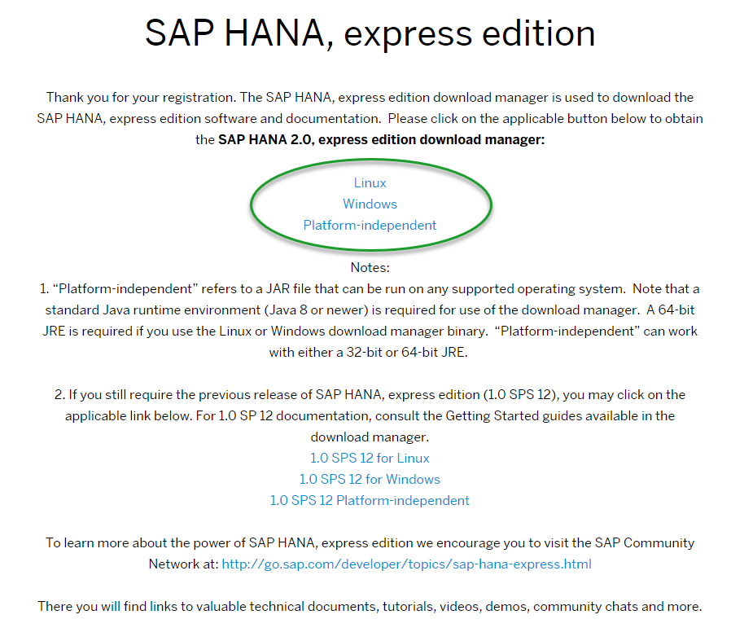
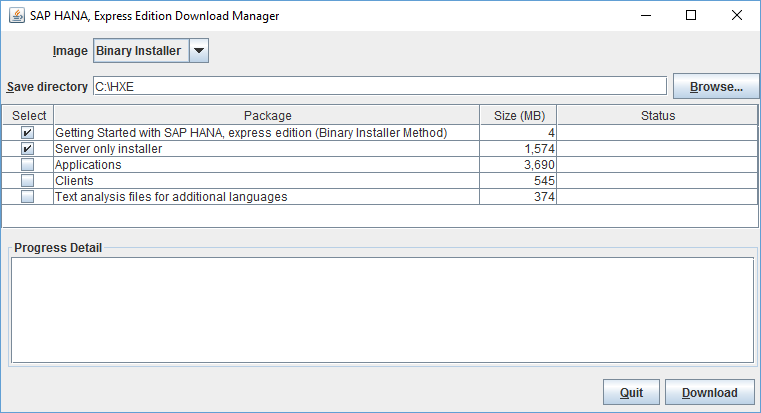

The SAP HANA, express edition is for Linux machines running specific installations, provided your host machine meets the storage and memory prerequisites. Choose this installation method if you want a custom setup. This tutorial is available as a [video](http://www.sap.com/assetdetail/2016/09/eccafc12-8a7c-0010-82c7-eda71af511fa.html).

## Prerequisites
- **Proficiency** Beginner

>**Tip:**
> If you are installing a SUSE Linux Enterprise Server for SAP for the first time, register your copy. You may need to install add-on packages later, and add-ons are only available to registered user. Register and download a 60 day evaluation of SUSE Linux Enterprise for SAP at: <https://www.suse.com/products/sles-for-sap/download>.

## Next Steps
- Start using SAP HANA, express edition. See tutorial [Start Using SAP HANA, express edition](http://www.sap.com/developer/tutorials/hxe-ua-getting-started-binary.html).

## Details
### You will learn
Download the binary image of SAP HANA, express edition, install the image on your Linux server, and install additional tools for express edition if desired.

For troubleshooting information, see [SAP HANA, express edition Troubleshooting](http://www.sap.com/developer/how-tos/hxe-ua-troubleshooting.html).
### Time to Complete
**Approximately 60 Minutes. Download and installation speeds will vary.**

---
### Machine Requirements
Your server will need the following:

#### Software

- **Java Runtime Environment** (JRE) 8 or higher. If you are planning to install the SAP HANA 2.0 express edition Download Manager for Windows or Linux, you need the 64-bit JRE. If you are planning to install the platform-independent Download Manager, you can use either the 32- or 64-bit JRE.

- **OpenSSL .0.9.8**

- One of the following operating system versions:
    - **SUSE Linux Enterprise Server for SAP 12 SP1**

#### Hardware

- **RAM** 16 GB minimum (24 GB recommended)

>**Note**: If you are installing on a system with 16 GB of RAM, increase the amount of swap space to at least 32 GB.

- **HDD** 120 GB HDD recommended

- **Cores** 2 cores (4 recommended)

### Download the Installer Files

1. Go to the registration page at <http://sap.com/sap-hana-express>

    (Alternately, you can go to the SAP HANA, express edition launch page at <http://www.sap.com/developer/topics/sap-hana-express.html> and click the **Register and download SAP HANA, express edition download manager** link.)  

    The registration page opens.

2. Complete the registration form and click the **Register** button.  

    > **Note:** If you have an SAP login, click the Login icon at the top of the page to populate the registration form automatically.

    

    The **Registration Success** page displays. (You will also receive an email indicating successful registration.)

3. Under **SAP HANA 2.0, express edition download manager**, click the download manager that matches your system: Linux or Windows.

    If you have a Mac, or another type of machine, click “Platform-independent” for a platform-independent download manager.

    

4. Save the download manager installation file to your laptop and open it.

  If your system displays a security warning when you open the file, accept the warning.

  > **Note:**
  > If you are inside a corporate firewall, you will be prompted for your proxy settings. Contact your IT administrator.

5. In Download Manager, in the **Image** pull-down, select **Binary Installer**.
    

6. Click **Browse** and select a directory where your downloads will be saved.

7. Select one or more of the following packages:  

    - **Server only installer** - Downloads **`hxe.tgz`**; the SAP HANA 2.0, express edition server with Application Function Library. **This file is necessary for installing SAP HANA 2.0, express edition**.  

    - **Applications** - Downloads optional package **`hxexsa.tgz`**; XSA, Web IDE, SAP HANA cockpit, and EA Designer. Download this and **`hxe.tgz`** to install those applications.  

    - **Clients** - Downloads a zip file containing four compressed client-tools bundles. Use the client packages to access developed express edition applications from a client PC. See [How to Install the SAP HANA 2.0, express edition Clients](http://www.sap.com/developer/how-tos/2016/12/hxe-ua-howto-installing-clients.html).

        - **`hdb_client_linux.tgz`** - Reduced HANA client for Linux 64 bit. Contains the HANA client package, drivers, and required licenses.

        - **`hdb_client_windows.zip`** - Reduced HANA client for Windows 64 bit. Contains the HANA client package, drivers, and required licenses.

        - **`xs.onpremise.runtime.client_linuxx86_64.zip`** - Command-line tools for Linux that enable access to (and control of) the SAP HANA XS advanced run-time environment.

        - **`xs.onpremise.runtime.client_ntamd64.zip`** - Command-line tools for Windows that enable access to (and control of) the SAP HANA XS advanced run-time environment.

     > **Tip:** After you develop an application using SAP HANA, express edition, install Download Manager to a client machine and download the *clients only* to that client machine. You can then use the clients to connect to -- and test -- your HANA application, emulating a customer.  

    - **Text analysis files for additional languages** - For languages other than English and German, these files are required for the HANA Text Analysis function. (The text analysis files for English and German are already included in the **Server only** and **Server + applications** packages.) Download this and **`hxe.tgz`** to install these files. For the text analysis files installation procedure, see *Install Text Analysis Files* at [Start Using SAP HANA, express edition](http://www.sap.com/developer/tutorials/hxe-ua-getting-started-binary.html).

8. Click the **Download** button.

## Install SAP HANA, express edition
1. Navigate to the directory where you wish to extract the installation files.

2. Extract the contents of `hxe.tgz`, and `hxexsa.tgz` if you are also installing applications:

    `tar -xvzf <download_path>/hxe.tgz`
    `tar -xvzf <download_path>/hxexsa.tgz`

    >**Tip**
    > Run the tar command from the command shell as shown, rather than using a GUI-based extraction tool.

3. Navigate to the directory where you extracted the files and run `./setup_hxe.sh` as the root user:

    `cd <extracted_path>`
    `sudo ./setup_hxe.sh`

4. Follow the prompts to configure your installation.

    >**Note**
    > The master password you specify during installation is used for the `<sid>adm`,  `sapadm` OS users, the telemetry technical user, and the SYSTEM user. If you are installing the Applications package, this password is also used for the `XSA_ADMIN`, `XSA_DEV`, and `XSA_SHINE` users.

Installation of SAP HANA 2.0, express edition will take some time. Installation is successful when your command line reads `SAP HANA Express Edition System installed`.

## Next Steps
- Start using SAP HANA, express edition. See tutorial [Start Using SAP HANA, express edition](http://www.sap.com/developer/tutorials/hxe-ua-getting-started-binary.html).
