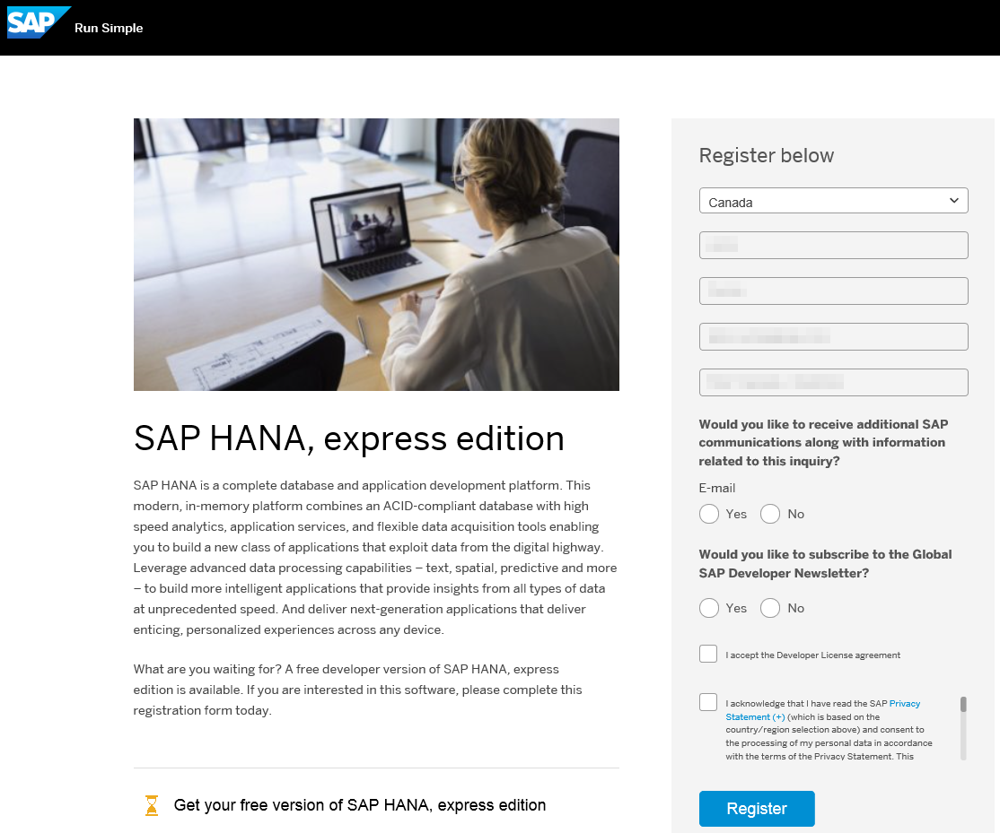
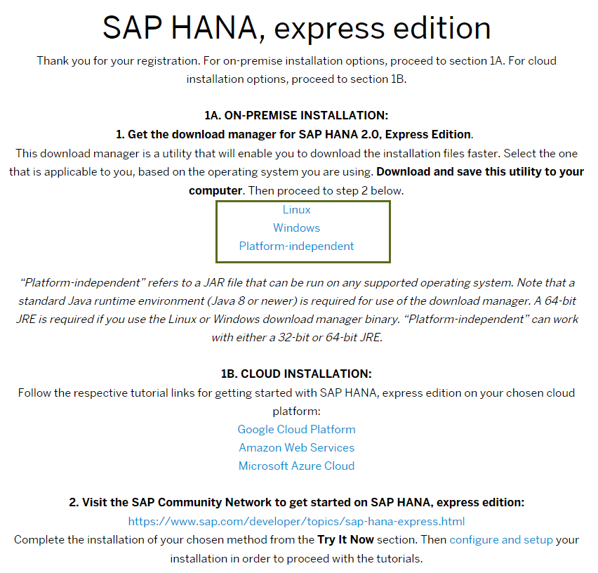
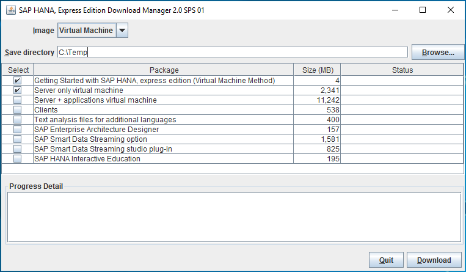
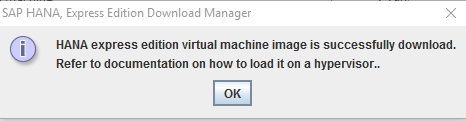
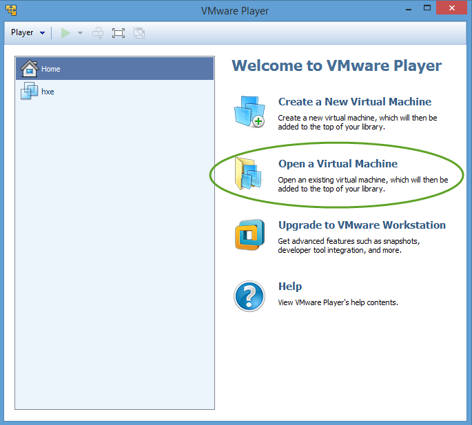

## Prerequisites  
 - **Proficiency:** Beginner
 - **Tutorials:** [Select the correct SAP HANA 2.0, express edition version](http://www.sap.com/developer/how-tos/2016/09/hxe-ua-version.html)
<!--
 **Tip:**  This tutorial is available as a [video](http://www.sap.com/assetdetail/2016/09/d2900513-8a7c-0010-82c7-eda71af511fa.html). -->

## Next Steps
 - [Start Using SAP HANA 2.0, express edition (Virtual Machine Method)](http://www.sap.com/developer/tutorials/hxe-ua-getting-started-vm.html)

## Disclaimer
SAP HANA, express edition is officially supported on SLES. SAP Community members have been successful in running SAP HANA, express edition on other Linux operating systems that are not formally supported by SAP, such as Ubuntu, `openSUSE` and Fedora. SAP is not committing to resolving any issues that may arise from running SAP HANA, express edition on these platforms.

## Details
### You will learn  
How to download the VM image of SAP HANA 2.0, express edition, install the image on your laptop, and get started.

### Time to Complete
**15 Min**.

---

[ACCORDION-BEGIN [Pre-Installation Info: ](Before you Begin)]

### Important Changes in SAP HANA 2.0, express edition

- The instance number has changed from `00` to `90`.
- Tenant database (HXE) is deactivated on startup to save system resources.

### What is the Virtual Machine Installation Method?

The SAP HANA 2.0, express edition VM package is platform-independent; you can install it to a Windows, OS X, or Linux machine, provided your host machine meets the storage and memory prerequisites. Choose this installation method if you want the simplest setup.

The Virtual Machine method installs:

- A VM running SUSE Linux Enterprise Server (SLES) for SAP Applications 12 SP1.  

- An SAP HANA 2.0, express edition instance on the VM, preconfigured and ready to start.  

For troubleshooting information, see [SAP HANA, express edition Troubleshooting](http://www.sap.com/developer/how-tos/2016/09/hxe-ua-troubleshooting.html).

[DONE]
[ACCORDION-END]

[ACCORDION-BEGIN [Pre-Installation Info: ](Requirements)]

### Machine Requirements

Check if your machine has the recommended hardware to successfully install and run the SAP HANA 2.0, express edition VM image.

#### Software

- **Java Runtime Environment 8** - The Download Manager requires Java SE Runtime Environment 8 (JRE 8) or higher.

    >**Note**: If you are planning to use the SAP HANA, express edition Download Manager for Windows or Linux, you need the 64-bit JRE. If you are planning to use the platform-independent Download Manager, you can use either the 32- or 64-bit JRE.

#### Hardware

- **RAM** - 16 GB RAM minimum. 24 GB RAM recommended.

- **HDD** 120 GB HDD recommended.

- **Cores** - 2 cores (4 recommended).  

- **Hardware `Virtualization`** - (Intel processors only) For Intel processors, `virtualization` is a BIOS setting known as either *Intel `Virtualization` Technology* or *Intel `VT`*. Go to [Determine If Your Processor Supports Intel `Virtualization` Technology](http://www.intel.com/content/www/us/en/support/processors/000005486.html) to determine if your processor is capable of supporting `virtualization`. If `virtualization` is turned off on your `virtualization-capable` machine, consult documentation from your machine vendor on how to enable `virtualization` technology (or Intel `VT`) in the BIOS.

#### Supported `Hypervisors`

Install a supported `hypervisor` on your machine if you don't have one already. `Hypervisors` are software products used for creating and running virtual machines.
SAP HANA 2.0, express edition has been tested on these `hypervisors`:

- [`VMware Workstation Player 12.x`](http://www.vmware.com/products/player/playerpro-evaluation.html)

- [`VMware Workstation Player 7.x`](https://my.vmware.com/web/vmware/searchresults?client=my_download&site=my_download&proxystylesheet=my_download_en&gsa_lang=en&c=ALL&q=vmware+player.html)

- [`VMware Workstation Pro 12.x`](http://www.vmware.com/products/workstation/workstation-evaluation.html)

- [`VMware Fusion or VMware Fusion Pro 8.x`](http://www.vmware.com/products/fusion/fusion-evaluation.html)

- [`Oracle VirtualBox`](https://www.virtualbox.org/wiki/Downloads)

This tutorial uses VMware Player.

[DONE]
[ACCORDION-END]

[ACCORDION-BEGIN [Step 1: ](Install a Hypervisor)]

### Install a `Hypervisor`

VMware Player is a `hypervisor` compatible with SAP HANA 2.0, express edition. You can install any supported `hypervisor`, but examples in this tutorial use VMware Player.

1. Download VMware Player from [http://www.vmware.com](http://www.vmware.com/products/player/playerpro-evaluation.html) and run the installer.  

2. Ensure you're downloading the correct version for your machine.  

3. Register when prompted and follow the setup instructions.

[DONE]
[ACCORDION-END]

[ACCORDION-BEGIN [Step 2: ](Download the VM Package)]

### Download the VM Package using the Download Manager

Register and then use the Download Manager to download a server-only virtual machine package, or a server + applications virtual machine package. Applications include XS Advanced (XSA), Web IDE, SAP HANA Cockpit, and SAP Enterprise Architecture Designer.

1. Go to the registration page at <http://sap.com/sap-hana-express>.

    (Alternately, you can go to the SAP HANA, express edition launch page at <http://www.sap.com/developer/topics/sap-hana-express.html> and click the **Register and download SAP HANA, express edition download manager** link.)  

    The registration page opens.

2. Complete the registration form and click the **Register** button.  

    > **Note:** If you have an SAP login, click the Login icon at the top of the page to populate the registration form automatically.

    

    The **Registration Success** page displays. (You will also receive an email indicating successful registration.)

3. Under **1A. ON-PREMISE INSTALLATION**, click the download manager that matches your system: Linux or Windows.

    If you have a Mac, or another type of machine, click `Platform-independent` for a platform-independent download manager.

    

4. Save the download manager file to your laptop and open it.

    If your system displays a security warning when you open the file, ignore the warning.

    

    > **Note:** If you are inside a corporate firewall, you will be prompted for your proxy settings. Contact your IT administrator.

5. In Download Manager, in the **Image** pull-down, select **Virtual Machine**.

        

6. Click **Browse** and select a directory where your downloads will be saved.

7. Select one or more of the following packages:  

    - **Getting Started with SAP HANA, express edition (Virtual Machine Method)** - Selected by default. Downloads this document.

    - **Server only virtual machine** - Downloads **`hxe.ova`**; the server plus Application Function Library (AFL).  

    - **Server + applications virtual machine** - Downloads **`hxexsa.ova`**; the server plus XS Advanced, Web IDE, and SAP HANA Cockpit.  

        >**Note**: Although this package will run on a 16 GB machine, SAP recommends 24 GB of RAM for optimum performance using the full suite of developer applications.

    - **Clients** - Downloads **`clients.zip`** which contains four compressed client packages. Use the client packages to access developed SAP HANA, express edition applications from a client PC. See **How to Install the SAP HANA, express edition Clients**. See [How to Install SAP HANA 2.0, express edition Clients](http://www.sap.com/developer/how-tos/2016/12/hxe-ua-howto-installing-clients.html).

        - **`hdb_client_linux.tgz`** - Reduced HANA client for Linux 64 bit. Contains the HANA client package, drivers, and required licenses.

        - **`hdb_client_windows.zip`** - Reduced HANA client for Windows 64 bit. Contains the HANA client package, drivers, and required licenses.

        - **`xs.onpremise.runtime.client_linuxx86_64.zip`** - Command-line tools for Linux that enable access to (and control of) the SAP HANA XS advanced run-time environment.

        - **`xs.onpremise.runtime.client_ntamd64.zip`** - Command-line tools for Windows that enable access to (and control of) the SAP HANA XS advanced run-time environment.

    > **Tip:** After you develop an application using SAP HANA, express edition, install Download Manager to a client machine and download the *clients only* to that client machine. You can then use the clients to connect to -- and test -- your HANA application, emulating a customer.  

    - **Text analysis files for additional languages** - Downloads `additional_lang.tgz`. For languages other than English and German, this package is required for the HANA Text Analysis function. (The text analysis files for English and German are already included in the **Server only virtual machine** and **Server + applications virtual machine** packages.) For the text analysis files installation procedure, see [Start Using SAP HANA 2.0, express edition](http://www.sap.com/developer/tutorials/hxe-ua-getting-started-vm.html).

    - **SAP Enterprise Architecture Designer** - This optional package is only valid on server + application virtual machine. File name is `eadesigner.tgz`. SAP EA Designer lets you capture, analyze, and present your organization's landscapes, strategies, requirements, processes, data, and other artifacts in a shared environment.

    - **SAP Smart Data Streaming option** - Downloads `sds.tgz`, which contains SAP HANA smart data streaming.

    - **SAP Smart Data Streaming studio plug-in** - Downloads `sds_plugin.zip`, which contains an Eclipse plugin for creating and deploying smart data streaming projects.

    - **SAP HANA Interactive Education (SHINE)** - This optional package is only valid on server + application virtual machine. The download file name is `shine.tgz`. SHINE makes it easy to learn how to build applications on SAP HANA Extended Application Services Advanced Model (XSA).

8. Click the **Download** button.

    Your download is complete when a pop-up message appears confirming successful download. Make sure you wait for this message before accessing the downloaded files.

    

[DONE]
[ACCORDION-END]

[ACCORDION-BEGIN [Step 3: ](Import the OVA)]

### Import the OVA into `VMWare` Player

Import the downloaded Open Virtual Appliance (OVA) file (either `hxe.ova` or `hxexsa.ova`) into your `hypervisor` to begin using SAP HANA 2.0, express edition.

1. Start VMware Player and select *Open a Virtual Machine*.  

    

2. Browse to the OVA file you downloaded and click **Open**. The Import Virtual Machine dialog box displays.

3. Accept the defaults and click **Import**. The VM imports. The import process takes approximately 5 minutes for `hxe.ova`, and 5-10 minutes for `hxexsa.ova`.

4. Power on your VM.

[DONE]
[ACCORDION-END]

## Next Steps
 - Start using SAP HANA, express edition. See tutorial [Start Using SAP HANA 2.0, express edition (Virtual Machine Method)](http://www.sap.com/developer/tutorials/hxe-ua-getting-started-vm.html)
