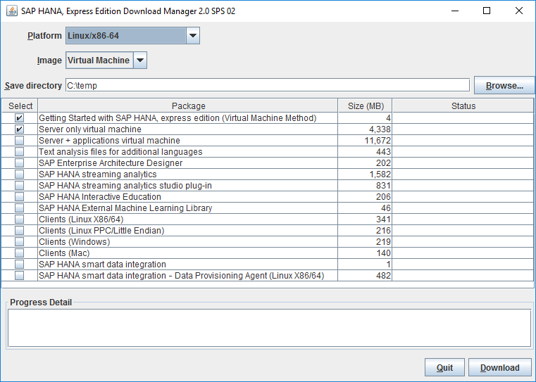

## Prerequisites  
 - **Proficiency:** Beginner
 - **Tutorials:** [Select the correct SAP HANA 2.0, express edition version](https://www.sap.com/developer/how-tos/2016/09/hxe-ua-version.html)

**Tip:** This tutorial is available as a [video](https://www.sap.com/assetdetail/2016/09/d2900513-8a7c-0010-82c7-eda71af511fa.html).

## Next Steps
 - [Start Using SAP HANA 2.0, express edition (Virtual Machine Method)](https://www.sap.com/developer/tutorials/hxe-ua-getting-started-vm.html)


## Disclaimer
SAP HANA, express edition is officially supported on SLES. SAP Community members have been successful in running SAP HANA, express edition on other Linux operating systems that are not formally supported by SAP, such as Ubuntu, `openSUSE` and Fedora. SAP is not committing to resolving any issues that may arise from running SAP HANA, express edition on these platforms.

## Details
### You will learn  
How to download the VM image of SAP HANA 2.0, express edition, install the image on your laptop, and get started.

### Time to Complete
**15 Min**.

---


[ACCORDION-BEGIN [Pre-Installation Info: ](Before you Begin)]

### Important Changes in SAP HANA 2.0, express edition

If you're familiar with the older 1.0 SPS 12 version, note these important changes:

- The instance number has changed from `00` to `90`.

### What is the Virtual Machine Installation Method?

The SAP HANA 2.0, express edition VM package is platform-independent; you can install it to a Windows, OS X, or Linux machine, provided your host machine meets the storage and memory prerequisites. Choose this installation method if you want the simplest setup.

The Virtual Machine method installs:

- A VM running SUSE Linux Enterprise Server (SLES) for SAP Applications 12 SP2.  

- An SAP HANA 2.0, express edition instance on the VM, preconfigured and ready to start.  

For troubleshooting information, see [SAP HANA, express edition Troubleshooting](https://www.sap.com/developer/how-tos/2016/09/hxe-ua-troubleshooting.html).


[ACCORDION-END]

[ACCORDION-BEGIN [Pre-Installation Info: ](Requirements)]

### Machine Requirements

Check if your machine has the recommended hardware to successfully install and run the SAP HANA 2.0, express edition VM image.

#### Software

- **Java Runtime Environment 8** - The Download Manager requires Java SE Runtime Environment 8 (JRE 8) or higher.

    >**Note**: If you are planning to use the SAP HANA, express edition Download Manager for Windows or Linux, you need the 64-bit JRE. If you are planning to use the platform-independent Download Manager, you can use either the 32- or 64-bit JRE.

#### Hardware

- **RAM** -  

    - Server plus applications virtual machine: 16 GB RAM minimum. 24 GB RAM recommended.
    - Server-only virtual machine: 8 GB RAM minimum. (If you add additional components, or run heavy processing loads, you will need to increase your RAM.)

    >**Tip**: Concerned about memory? The memory consumption of each optional component is listed in the [SAP HANA 2.0, express edition Sizing Guide (Virtual Machine Method)](https://help.sap.com/viewer/DRAFT/9e4243e92f244537b2164a57a405a9fd/latest/en-US).

- **HDD** - 120 GB HDD recommended.

- **Cores** - 2 cores (4 recommended).  

- **Hardware `Virtualization`** - (Intel processors only) For Intel processors, `virtualization` is a BIOS setting known as either *Intel `Virtualization` Technology* or *Intel `VT`*. Go to [Determine If Your Processor Supports Intel `Virtualization` Technology](http://www.intel.com/content/www/us/en/support/processors/000005486.html) to determine if your processor is capable of supporting `virtualization`. If `virtualization` is turned off on your `virtualization-capable` machine, consult documentation from your machine vendor on how to enable `virtualization` technology (or Intel `VT`) in the BIOS.

#### Supported `Hypervisors`

Install a supported `hypervisor` on your machine if you don't have one already. `Hypervisors` are software products used for creating and running virtual machines.
SAP HANA 2.0, express edition has been tested on these `hypervisors`:

- [`VMware Workstation Player 12.x`](http://www.vmware.com/products/player/playerpro-evaluation.html)

- [`VMware Workstation Player 7.x`](https://my.vmware.com/web/vmware/searchresults?client=my_download&site=my_download&proxystylesheet=my_download_en&gsa_lang=en&c=ALL&q=vmware+player.html)

- [`VMware Workstation Pro 12.x`](http://www.vmware.com/products/workstation/workstation-evaluation.html)

- [`VMware Fusion or VMware Fusion Pro 8.x`](http://www.vmware.com/products/fusion/fusion-evaluation.html)

- [`Oracle VirtualBox`](https://www.virtualbox.org/wiki/Downloads)

This tutorial uses VMware Player.


[ACCORDION-END]

[ACCORDION-BEGIN [Step 1: ](Install a Hypervisor)]

You can install any supported `hypervisor`, but examples in this tutorial use VMware Player.

1. Download VMware Player from [http://www.vmware.com](http://www.vmware.com/products/player/playerpro-evaluation.html) and run the installer.  

2. Ensure you're downloading the correct version for your machine.  

3. Register when prompted and follow the setup instructions.


[ACCORDION-END]

[ACCORDION-BEGIN [Step 2: ](Register)]

Register your copy of SAP HANA, express edition to access the download manager.

1. Go to the registration page at <https://www.sap.com/sap-hana-express>.

    (Alternately, you can go to the SAP HANA, express edition launch page at <https://www.sap.com/developer/topics/sap-hana-express.html> and click the **Register and download SAP HANA, express edition download manager** link.)  

    The registration page opens.

2. Complete the registration form and click the **Register** button.  

    > **Note:** If you have an SAP login, click the Login icon at the top of the page to populate the registration form automatically.

    

    The **Registration Success** page displays. (You will also receive an email indicating successful registration.)

3. On the Registration Success page, under **1A. ON-PREMISE INSTALLATION**, click the download manager link that matches your system: Linux or Windows.

    If you have a Mac, or another type of machine, click `Platform-independent` for a platform-independent download manager.

    

4. Save the download manager file to your laptop and open it.

    If your system displays a security warning when you open the file, ignore the warning.

    

    > **Note:** If you are inside a corporate firewall, you will be prompted for your proxy settings. Contact your IT administrator for your proxy host and proxy port information.


[ACCORDION-END]

[ACCORDION-BEGIN [Step 3: ](Download Using the Download Manager (GUI Mode))]

Use the Download Manager (GUI mode) to download a server-only virtual machine package, or a server + applications virtual machine package. You can also download additional packages. Note that a console mode Download Manager is also available.

1. In Download Manager, in the **Platform** pull-down, select SAP HANA, express edition on **`Linux/x86-64`**. (Virtual machine method installation is not available for **`Linux/Power (little endian)`**.)

2. In Download Manager, in the **Image** pull-down, select **Virtual Machine**.

        

3. Specify a save directory. Click **Browse** and select a directory where your downloads will be saved.

4. Select one or more of the following packages:  

    - **Getting Started with SAP HANA, express edition (Virtual Machine Method)** - Selected by default. Downloads this document.

    - **Server only virtual machine** - Downloads **`hxe.ova`**; the server plus XSC, and the Application Function Library (AFL).  

    - **Server + applications virtual machine** - Downloads **`hxexsa.ova`**; the server plus XS Advanced, Web IDE, and SAP HANA Cockpit.  

        >**Note**: Although the Server + applications virtual machine package will run on a 16 GB machine, SAP recommends 24 GB of RAM for optimum performance using the full suite of developer applications.

5. (Optional) Download additional packages now (before your server is running), but note that you will need to transfer the downloaded installer files to your VM later.

    Alternately, you can wait until your server is running, and then download additional packages using the VM's built-in Download Manager (console mode). This latter method is faster and more efficient.

    >**Tip**: Concerned about memory? The memory consumption of each optional component is listed in the [SAP HANA 2.0, express edition Sizing Guide (Virtual Machine Method)](https://help.sap.com/viewer/DRAFT/9e4243e92f244537b2164a57a405a9fd/latest/en-US).

    If downloading additional packages now, select one or more of the following:

    - **Text analysis files for additional languages** - Downloads `additional_lang.tgz`. For languages other than English and German, this package is required for the HANA Text Analysis function. (The text analysis files for English and German are already included in the **Server only virtual machine** and **Server + applications virtual machine** packages.)

    - **SAP Enterprise Architecture Designer** - This optional package is only valid on server + application virtual machine. File name is `eadesigner.tgz`. SAP EA Designer lets you capture, analyze, and present your organization's landscapes, strategies, requirements, processes, data, and other artifacts in a shared environment.

    - **SAP HANA streaming analytics** - Downloads `hsa.tgz`, which contains SAP HANA smart data streaming.

    - **SAP HANA streaming analytics studio plug-in** - Downloads `hsa_plugin.zip`, which contains an Eclipse plugin for creating and deploying smart data streaming projects.

    - **SAP HANA Interactive Education (SHINE)** - This optional package is only valid on server + application virtual machine. The download file name is `shine.tgz`. SHINE makes it easy to learn how to build applications on SAP HANA Extended Application Services Advanced Model (XSA).   

    - **SAP HANA External Machine Learning Library** - The SAP HANA External Machine Learning Library is an application function library (AFL) supporting the integration of Google `TensorFlow`, as an external machine learning framework, with SAP HANA, express edition. Download file name is `eml.tgz`.

    - **Clients (Linux x86/64)** - Client download package for Linux machines (x86/64 architectures). Use the client packages to access developed SAP HANA, express edition applications from a client PC. See [How to Install SAP HANA 2.0, express edition Clients](https://www.sap.com/developer/how-tos/2016/12/hxe-ua-howto-installing-clients.html). The package includes:

        - **`hdb_client_linux.tgz`** - Reduced HANA client for Linux 64 bit. Contains the HANA client package, drivers, and required licenses.

        - **`xs.onpremise.runtime.client_linuxx86_64.zip`** - Command-line tools for Linux that enable access to (and control of) the SAP HANA XS advanced run-time environment.

    - **Clients (Linux PPC/Little Endian)** -  Client download package for Linux machines (little endian on Power architectures). Use the client packages to access developed SAP HANA, express edition applications from a client PC. See [How to Install SAP HANA 2.0, express edition Clients](https://www.sap.com/developer/how-tos/2016/12/hxe-ua-howto-installing-clients.html). The package includes:

        - **`hdb_client_linux_ppc64le.tgz`** - Reduced HANA client for Linux on Power. Contains the HANA client package, drivers, and required licenses.

        - **`xs.onpremise.runtime.client_linuxppc64le.zip`** - Command-line tools for Linux on Power that enable access to (and control of) the SAP HANA XS advanced run-time environment.

    - **`Clients (Windows)`** - Client download package for Windows machines. Use the client packages to access developed SAP HANA, express edition applications from a client PC. See [How to Install SAP HANA 2.0, express edition Clients](https://www.sap.com/developer/how-tos/2016/12/hxe-ua-howto-installing-clients.html). The package includes:

        - **`hdb_client_windows_x86_32.zip`** - Reduced HANA client for Windows 32-bit. Contains the HANA client package, drivers, and required licenses.

        - **`hdb_client_windows_x86_64zip`** - Reduced HANA client for Windows 64-bit. Contains the HANA client package, drivers, and required licenses.

        - **`xs.onpremise.runtime.client_ntamd64.zip`** - Command-line tools for Windows that enable access to (and control of) the SAP HANA XS advanced run-time environment.

    - **`Clients (Mac)`** - Client download package for Mac. Use the client packages to access developed SAP HANA, express edition applications from a client PC. See [How to Install SAP HANA 2.0, express edition Clients](https://www.sap.com/developer/how-tos/2016/12/hxe-ua-howto-installing-clients.html). The package includes:

        - **`hdb_client_mac.tgz`** - Reduced HANA client for Mac. Contains the HANA client package, drivers, and required licenses.

        - **`xs.onpremise.runtime.client_darwinintel64.zip`** - Command-line tools for Mac that enable access to (and control of) the SAP HANA XS advanced run-time environment.

    - **SAP HANA smart data integration** - SAP HANA smart data integration provides functionality to access source data, and to provision, replicate, and transform that data in SAP HANA on premise, or in the cloud. Download file name is `sdi.tgz`. <!--Needs link to Mike Madsen's tutorial when available-->

    - **SAP HANA smart data integration - Data Provisioning Agent (Linux X86/64)** - The Data Provisioning Agent provides secure connectivity between the SAP HANA database and your adapter-based sources. Download file name is `dpagent_linux_x86_64.tgz`. <!--Needs link to Mike Madsen's tutorial when available-->   

6. Click the **Download** button.

    Your download is complete when a pop-up message appears confirming successful download. Make sure you wait for this message before accessing the downloaded files.

    


[ACCORDION-END]


[ACCORDION-BEGIN [Step 4: ]((Optional) Download Using the Download Manager (Console Mode))]

Run the Download Manager in console mode if you're used to a command line interface. The VM contains built-in Download Manager (Console Mode) which lets you download additional packages from within the VM itself.

> **Note:** The Download Manager for Windows (`HXEDownloadManager_win.exe`) runs in `asynchronous` mode, and console mode is not available. If you are a Windows user, download the platform-independent Download Manager (`HXEDownloadManager.jar`) to use console mode.

1. If the Download Manager (GUI Mode) is running, close it.

2. Open a command prompt at the location where you saved the Download Manager file (`HXEDownloadManager.jar`, or `HXEDownloadManager_linux.bin`).

    > **Note:** If you've already installed and started SAP HANA express edition using the Virtual Machine method, call the Download Manager at the `hxehost:hxeadm>` prompt.

3. Display the command help using the `-h` argument.

    Linux Download Manager example:

    ```bash
        HXEDownloadManager_linux.bin -h
    ```

    Platform-independent Download Manager example:

    ```bash    
    java -jar HXEDownloadManager.jar -h
    ```

    > **Note:** You must include an argument with each command. If you call the Download Manager without an argument, it opens in GUI mode.

4. Familiarize yourself with the command syntax, and the command arguments.

    Command syntax is:

    ```bash
    HXEDownloadManager [( [-h|-X] | [-d <save_directory>] [--ph <proxy_host>] [--pp <proxy_port>] <platform> <image> <file>... )]
    ```

    Command arguments are:

    | Argument         | Description  |
    | ---------------- | -------------|
    | -h            | Print this help. |
    | -x            | Print extended help. |
    | -d <save_directory>      | Directory where to save the download file. Default is `%USERPROFILE%\Downloads` on Windows; `~/Downloads` on Linux.      |
    | --ph <proxy_host> | Proxy host name or IP address.      |
    | --pp <proxy_port> | Proxy host name or IP address.      |
    | `<platform>`      | HANA platform. Valid values are `linuxx86_64`, `linuxppc64le`.     |
    | `<image>`         | Type of image to download. Valid values for `linuxx86_64` platform are: `vm`, `installer`. Valid values for `linuxppc64le` platform are: `installer`.      |
    | `<file>`          | File(s) to download.      |

    Valid <file> values for `linuxx86_64` platform and VM image:

    | <file> value (`linuxx86_64`)       |    Description     |
    | ------------- |-------------------|
    | Getting_Started_HANAexpress_VM.pdf            | User manual in PDF format: `Getting Started with SAP HANA, express edition (Virtual Machine Method)`. |
    | `hxe.ova`           | Downloads `hxe.ova`; the server plus `XSC` and Application Function Library (AFL). |
    | `hxexsa.ova`           | Downloads `hxexsa.ova`; the server plus XS Advanced, Web IDE, and SAP HANA Cockpit. |       
    | additional_lang.tgz           | Downloads additional_lang.tgz. For languages other than English and German, this package is required for the HANA Text Analysis function. (The text analysis files for English and German are already included in the `hxe.ova` and `hxexsa.ova` packages.)  |    
    | eadesigner.tgz           | Valid only with `hxexsa.ova`. SAP EA Designer lets you capture, analyze, and present your organization's landscapes, strategies, requirements, processes, data, and other artifacts in a shared environment |   
    | hsa.tgz           | Downloads SAP HANA streaming analytics. |   
    | hsa_plugin.zip           | Downloads the Eclipse plugin for creating and deploying streaming analytics projects. |   
    | shine.tgz           | Valid only with `hxexsa.ova`. SAP HANA Interactive Education (SHINE) makes it easy to learn how to build applications on SAP HANA Extended Application Services Advanced Model (XSA).  |
    | eml.tgz           | Downloads HANA Extended Machine Learning AFL. |
    | clients_linux_x86_64.tgz           | Client download package for Linux machines (x86/64 architectures). Use the client packages to access developed SAP HANA, express edition applications from a client PC. |   
    | clients_linux_ppc64le.tgz           | Client download package for Linux machines (little endian on Power architectures). Use the client packages to access developed SAP HANA, express edition applications from a client PC. |   
    | clients_windows.zip           | Client download package for Windows machines. Use the client packages to access developed SAP HANA, express edition applications from a client PC |   
    | clients_mac.tgz           | Client download package for Mac. Use the client packages to access developed SAP HANA, express edition applications from a client PC.  |
    | `sdi.tgz`           | SAP HANA smart data integration download package. SAP HANA smart data integration provides functionality to access source data, and to provision, replicate, and transform that data in SAP HANA on premise, or in the cloud.  |
    | `dpagent_linux_x86_64.tgz`           | SAP HANA smart data integration - Data Provisioning Agent (Linux X86/64) download package. The Data Provisioning Agent provides secure connectivity between the SAP HANA database and your adapter-based sources.  |

5. Download one or more files.

    >**Tip**: Concerned about memory? The memory consumption of each optional component is listed in the [SAP HANA 2.0, express edition Sizing Guide (Virtual Machine Method)](https://help.sap.com/viewer/DRAFT/9e4243e92f244537b2164a57a405a9fd/latest/en-US).

    This example uses the Linux Download Manager `HXEDownloadManager_linux.bin`. It specifies a proxy host, proxy port, and downloads Getting Started with SAP HANA, express edition (Virtual Machine Method and the SHINE package ( `shine.tgz`).

    ```bash
    HXEDownloadManager_linux.bin --ph proxy.yourcompany.corp --pp 8080 linuxx86_64 vm Getting_Started_HANAexpress_VM.pdf shine.tgz
    ```

    This example uses the platform-independent Download Manager `HXEDownloadManager.jar`. It downloads `Getting Started with SAP HANA, express edition (Virtual Machine Method)` and `hxexsa.ova`.

    ```bash
    java -jar HXEDownloadManager.jar linuxx86_64 vm Getting_Started_HANAexpress_VM.pdf hxexsa.ova
    ```


[ACCORDION-END]

[ACCORDION-BEGIN [Step 5: ](Import the OVA)]

Import the downloaded Open Virtual Appliance (OVA) file (either `hxe.ova` or `hxexsa.ova`) into your `hypervisor` to begin using SAP HANA 2.0, express edition.

This example uses `VMWare` player as the `hypervisor`. You can use any supported `hypervisor`.

1. Start `VMware` Player and select *Open a Virtual Machine*.  

    

2. Browse to the OVA file you downloaded and click **Open**. The Import Virtual Machine dialog box displays.

3. Accept the defaults and click **Import**. The VM imports. The import process takes approximately 5 minutes for `hxe.ova`, and 5-10 minutes for `hxexsa.ova`.

4. Power on your VM.


[ACCORDION-END]

## Next Steps
 - Start using SAP HANA, express edition. See tutorial [Start Using SAP HANA 2.0, express edition (Virtual Machine Method)](https://www.sap.com/developer/tutorials/hxe-ua-getting-started-vm.html)
