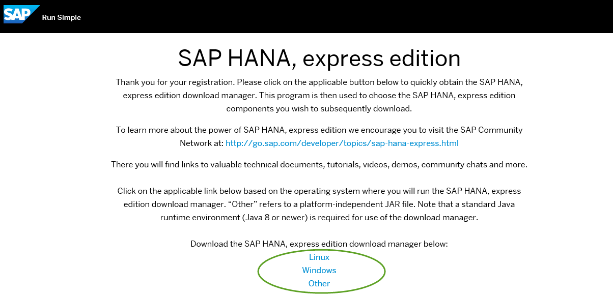
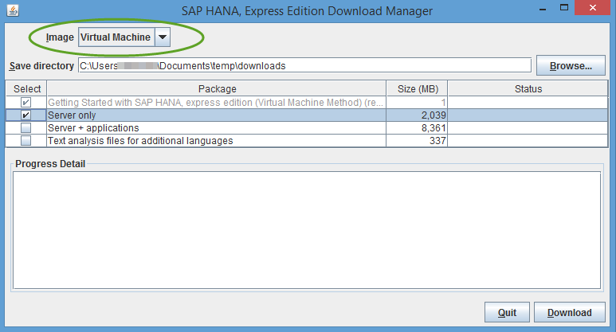

## Prerequisites  
 - **Proficiency:** Beginner
 - **Tutorials:** [Select the correct SAP HANA, express edition version](http://go.sap.com/developer/how-tos/hxe-ua-version.html)

## Next Steps
 - [Start Using SAP HANA, express edition](http://go.sap.com/developer/tutorials/hxe-ua-getting-started-vm.html)

## Details
### You will learn  
How to download the VM image of SAP HANA, express edition, install the image on your laptop, and get started.

### Time to Complete
**15 Min**.

---

This tutorial is available as a [video](http://go.sap.com/assetdetail/2016/09/d2900513-8a7c-0010-82c7-eda71af511fa.html).

The SAP HANA, express edition VM image is platform-independent; you can install it to a Windows, OS X, or Linux machine, provided your host machine meets the storage and memory prerequisites. Choose this installation method if you want the simplest setup.

Installing the OVA installs:
 * A VM running SUSE Linux Enterprise Server (SLES) for SAP Applications 12 SP1.
 * An SAP HANA, express edition instance on the VM, preconfigured and ready to start.

### Machine Requirements
Check if your machine has the recommended hardware to successfully install and run the express edition VM image.

**JRE 8** - The Download Manager requires JRE 8 or higher. If you are planning to install the SAP HANA, express edition Download Manager for Windows or Linux, you need the 64-bit JRE. If you are planning to install the platform-independent Download Manager, you can use either the 32- or 64-bit JRE.
**RAM** - 16 GB RAM recommended.  
**HDD** - 120 GB recommended.  
**Cores** - 2 cores (4 recommended).  
**Hardware `Virtualization`** - (Intel processors only) For Intel processors, `virtualization` is a BIOS setting known as either *Intel `Virtualization` Technology* or *Intel `VT`*. Go to <http://www.intel.com/content/www/us/en/support/processors/000005486.html> to determine if your processor is capable of supporting `virtualization`. If `virtualization` is turned off on your `virtualization-capable` machine, consult documentation from your machine vendor on how to enable `virtualization` technology (or Intel `VT`) in the BIOS.

#### Install a `Hypervisor`
Install a supported `hypervisor` on your machine if you don't have one already. `Hypervisors` are software products used for creating and running virtual machines.
SAP HANA, express edition has been tested on these `hypervisors`:
* [`VMware Player 7.1`](https://www.vmware.com/)
* [`VMware Workstation Pro 12.1`](https://www.vmware.com/)
* [`VMware Fusion or VMware Fusion Pro 8.x`](https://www.vmware.com/)
* [`Oracle VirtualBox`](https://www.virtualbox.org/)

For the purposes of this tutorial, you will use the VMware Player.

#### Install VMware Player
VMware Player 7.1 is a `hypervisor` compatible with SAP HANA express edition. You can install any supported `hypervisor`, but examples in this tutorial use VMware Player 7.1.

1. Download VMware Player from <www.vmware.com> and run the installer.
2. Ensure you're downloading the correct version for your machine.
3. Register when prompted and follow the setup instructions.

### Download the OVA using the Download Manager
Register and then use the Download Manager to download a server-only OVA, or a server-plus-applications OVA. Applications include XS Advanced (XSA) and Web IDE.

1. Go to the registration page at <http://sap.com/sap-hana-express> (Alternately, you can go to the SAP HANA, express edition launch page at <http://go.sap.com/developer/topics/sap-hana-express.html> and click the **Register and download SAP HANA, express edition download manager** link.)  The registration page opens.

2. Complete the registration form and click the **Register** button.  

    > **Note:** If you have an SAP login, click the Login icon at the top of the page to populate the registration form automatically.

    

    The **Registration Success** page displays. (You will also receive an email indicating successful registration.)

3. At the bottom of the **Registration Success** page, click the download manager that matches your system: Linux or Windows. If you have a Mac, or another type of machine, click “other” for a platform-independent download manager.

    

4. Save the download manager installation file to your laptop and open it.

5. If Windows prevents the download manager installation file from running, click **More info** on the warning message and select **Run anyway**.  

    

6. In Download Manager, in the **Image** pull-down, select **virtual machine**.

    

7. Click **Browse** and select a directory where your downloads will be saved.

8. Select one or more of the following packages:  
**Server only** - Downloads **`hxe.ova`**; a basic server-only package.  
**Server + applications** - Downloads **`hxexsa.ova`**; the server plus XSA and Web IDE.  
**Text analysis files for additional languages** - For languages other than English and German, files required for the HANA Text Analysis function. (The text analysis files for English and German are already included in the **Server only** and **Server + applications** packages.)

9. Click the **Download** button.

### Import the OVA into `VMWare` Player
Import the downloaded OVA file into your `hypervisor` to begin using SAP HANA, express edition.

1. Start VMware Player 7.1 and select *Open a Virtual Machine*.  

    

2. Browse to the OVA file you downloaded and click **Open**. The Import Virtual Machine dialog box displays.

3. Accept the defaults and click **Import**. The VM imports. The import process takes approximately 5 minutes.

4. Power on your VM.

## Next Steps
 - Start using SAP HANA, express edition. See tutorial [Start Using SAP HANA, express edition](http://go.sap.com/developer/tutorials/hxe-ua-getting-started-vm.html)
