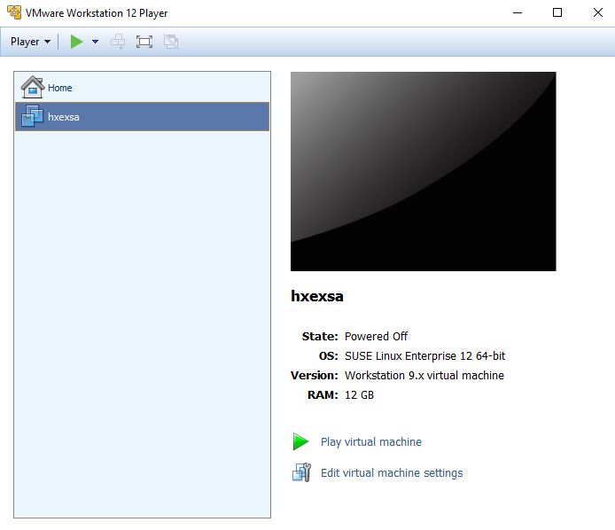
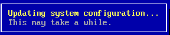
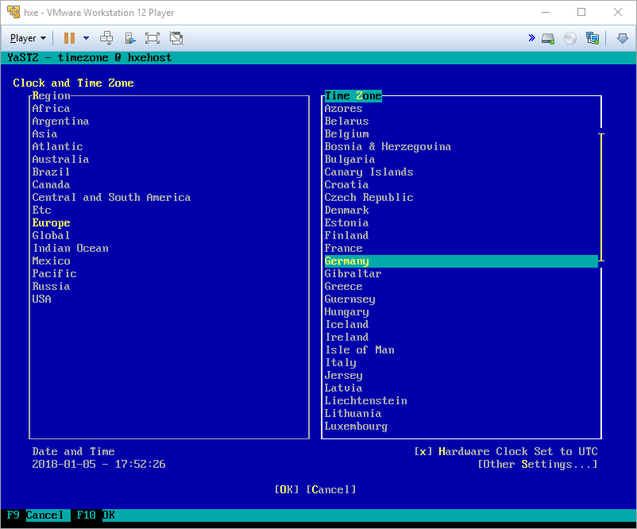

<!-- loiod0775daa77ca4aaea29ea74b3e2e2ac1 -->

## Prerequisites
 - **Tutorials:**  You have completed [Import the OVA](hxe-ua-ova-vm) 

## Details
### You will learn
You'll learn how to start the VM, change the VM default keyboard layout, and change the default time zone.

---

If you don't change the keyboard layout to match the physical keyboard of your host machine (referred to as your **laptop** in this documentation), you may encounter problems later when logging in.

[ACCORDION-BEGIN [Step 1: ](Start your VM)]

Open your hypervisor application.

Power on (or click *Play* on) your SAP HANA 2.0, express edition VM.

[DONE]

[ACCORDION-END]

[ACCORDION-BEGIN [Step 2: ](Change the keyboard layout if your laptop doesn't use an English (US) keyboard)]

The system prompts you to either change the VM keyboard, or accept the default English (US) QWERTY keyboard. Enter `Y` to change the keyboard or `N` to use the default.

> Note:
> Having difficulty entering text in your virtual machine in `VMWare`? Press ` CTRL G ` to switch the focus from your host machine to the VM.
> 
> 

If you opt to change the keyboard, the System Keyboard Configuration page displays.

Use the arrow keys to scroll to the desired keyboard layout. `Tab` to the *OK* button, or press `F10`, to save your changes. A message displays while the system processes the keyboard layout change.

 

[DONE]

[ACCORDION-END]

[ACCORDION-BEGIN [Step 3: ](Change time zone)]

Change the time zone if your laptop is not in the default UTC (GMT) time zone.

Enter `Y` to change the time zone, or `N` to accept the default.

If you opt to change the timezone, the Clock and Time Zone page displays.

In the Region pane, use the arrow keys to scroll down to the correct region. `Tab` to the Time Zone pane and select the correct time zone. `Tab` to the *OK* button, or press `F10`, to save your changes.

[DONE]

[ACCORDION-END]

