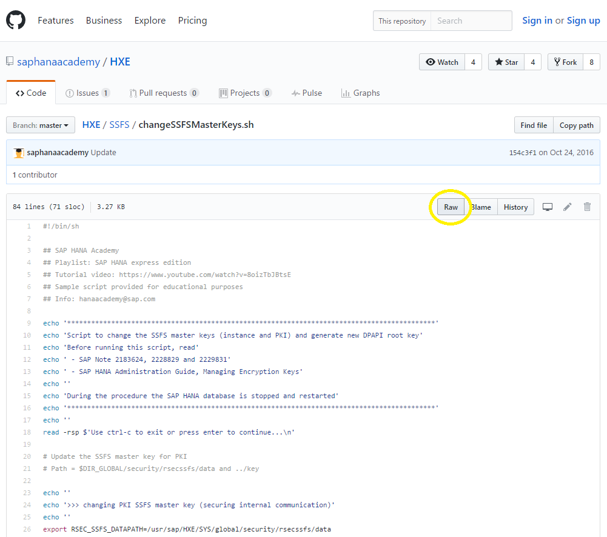

## Prerequisites  
  - [Installing SAP HANA 2.0, express edition (Virtual Machine Method)](https://developers.sap.com/tutorials/hxe-ua-installing-vm-image.html) **or**
 [Installing SAP HANA 2.0, express edition (Binary Installer Method)](https://developers.sap.com/tutorials/hxe-ua-installing-binary.html)


## Details
### You will learn  
  - How to change the encryption keys to your SAP HANA, express edition installation to make it more secure

SAP HANA, express edition shares the same encryption keys across installations. For security purposes, generate new encryption keys for your SAP HANA, express edition installation.

---

[ACCORDION-BEGIN [Step 1: ](Check if Encryption Keys have Reset)]

Open your SAP HANA Studio and connect to your database as the SYSTEM user. Open an SQL console and run the following:

```bash
SELECT * FROM SYS.M_SECURESTORE;
SELECT * FROM SYS.CREDENTIALS;
SELECT * FROM SYS.P_DPAPI_KEY_ WHERE caller = 'XsEngine';
SELECT * FROM PSE_CERTIFICATES WHERE certificate_usage = 'OWN';
```

You receive four results pages. The first page will give you the reset count to three encryption logs. If this is your first attempt to reset the encryption keys, the `RESET_COUNT` column will read `0`.

The next three result pages should not contain any entries. If one of these pages has an entry, you may want to contact your HANA administrator before proceeding as you will lose access to the files listed.


[DONE]

[ACCORDION-END]

[ACCORDION-BEGIN [Step 2: ](Copy the SAP HANA Academy code)]

Using your preferred web browser, go to the [SAP HANA Academy GitHub](https://github.com/saphanaacademy) page and enter the HXE repository. Click the `SSFS` folder and select `changeSSFSMasterKeys.sh`. Click **Raw**.



Press **Ctrl + a** to select all, and then **Ctrl + c** to copy the code.


[DONE]

[ACCORDION-END]

[ACCORDION-BEGIN [Step 3: ](Create the changeSSFSMasterKeys.sh File)]

Log into your SAP HANA, express edition installation using a your preferred command prompt. Log in as `hxeadm`. In the `/usr/sap/HXE/home` directory, create the `changeSSFSMasterKey.sh` file.

```bash
su -l hxeadm
```

```bash
cd /usr/sap/HXE/home
```

```bash
vi changeSSFSMasterKeys.sh
```

In the editor, paste the code from the SAP HANA Academy page. Press `Esc` to exit then `:wq` to write and quit the editor.


[DONE]

[ACCORDION-END]

[ACCORDION-BEGIN [Step 4: ](Change the Permissions of changeSSFSMasterKeys.sh)]

Give `changeSSFSMasterKeys.sh` execute permissions.

```bash
chmod u+x changeSSFSMasterKeys.sh
```


[DONE]

[ACCORDION-END]

[ACCORDION-BEGIN [Step 5: ](Run the Script)]

Execute the `changeSSFSMasterKeys.sh` script.

```bash
./changeSSFSMasterKeys.sh
```

Follow the on-screen prompts to reset your encryption keys. This process will take some time.


[DONE]

[ACCORDION-END]

[ACCORDION-BEGIN [Step 6: ](Check if Encryption Was Successful)]

Return to SAP HANA Studio and run this part of the previous SQL command:

```bash
SELECT * FROM SYS.M_SECURESTORE;
```

The `RESET_COUNT` for the `KEY_TYPE` `DPAPI` will increase by 1.


[DONE]

[ACCORDION-END]
