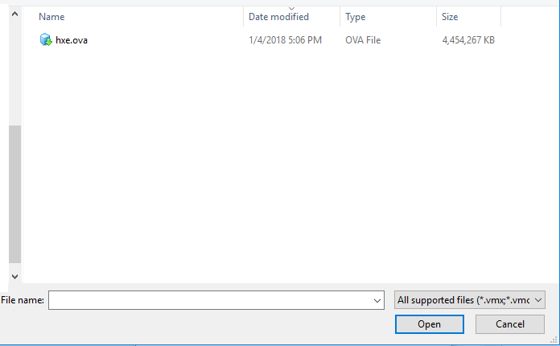
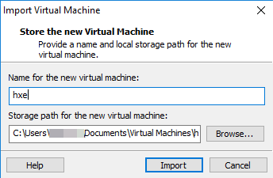

<!-- loiofd337714a73f45cea49e20d6594d1109 -->

## Prerequisites
 - **Proficiency:** Beginner
 - **Tutorials:** 

## Details
### You will learn
You will learn how to import the OVA file into your hypervisor.

### Time to Complete
1 min

---

This example uses `VMware Player` as the hypervisor. You can use any supported hypervisor.

[ACCORDION-BEGIN [Step 1: ](Open an existing virtual machine.)]

Start `VMware Player` and select *Open a Virtual Machine*.

[ACCORDION-END]

[ACCORDION-BEGIN [Step 2: ](Open the OVA file.)]

Browse to the OVA file you downloaded and click *Open*.

The Import Virtual Machine dialog box displays.

[ACCORDION-END]

[ACCORDION-BEGIN [Step 3: ](Import the VM.)]

Accept the defaults and click *Import*. The VM imports.

The import process takes approximately 5 minutes for `hxe.ova`.

The import process takes approximately 5-10 minutes for `hxexsa.ova`.

[ACCORDION-END]

[ACCORDION-BEGIN [Step 4: ](Power on your VM.)]

Click *Play Virtual Machine*.

[ACCORDION-END]

