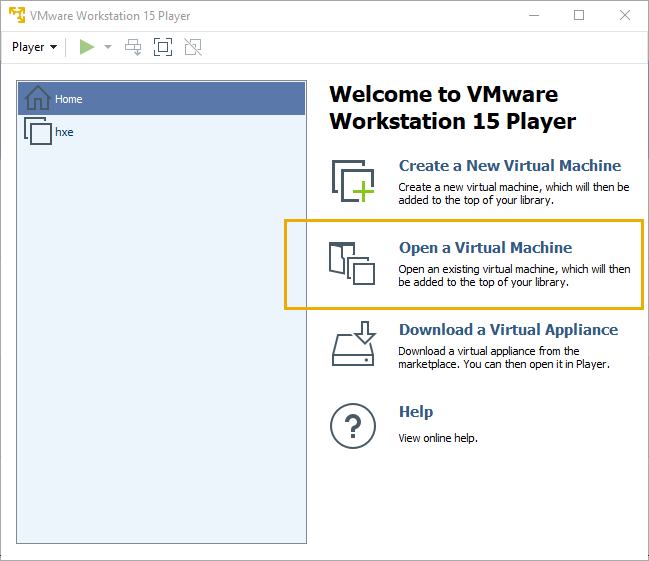
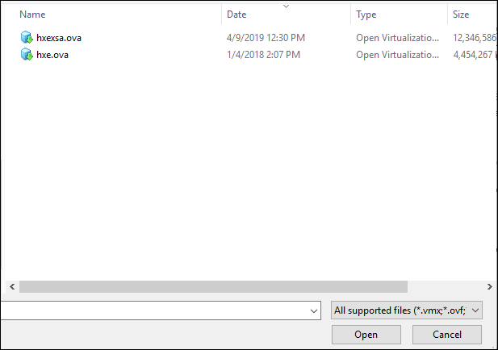
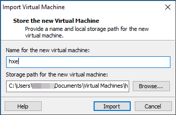

<!-- loiofd337714a73f45cea49e20d6594d1109 -->

## Prerequisites
 - **Tutorials:** You have completed [Download Using the Download Manager (GUI Mode)](hxe-ua-download-vm)

## Details
### You will learn
You will learn how to import the OVA file into your hypervisor.

---

This example uses `VMware Player` as the hypervisor. You can use any supported hypervisor.

[ACCORDION-BEGIN [Step 1: ](Open an existing virtual machine)]

Start `VMware Player` and select *Open a Virtual Machine*.

[DONE]

[ACCORDION-END]

[ACCORDION-BEGIN [Step 2: ](Open the OVA file)]

The OVA file name is either `hxexsa.ova` or `hxe.ova` depending on which VM image you downloaded in the previous tutorial.

Browse to the OVA file you downloaded and click *Open*.

The Import Virtual Machine dialog box displays.

[DONE]

[ACCORDION-END]

[ACCORDION-BEGIN [Step 3: ](Import the VM)]

Accept the defaults and click *Import*. The VM imports.

The import process takes approximately 5 minutes for `hxe.ova`.

The import process takes approximately 5-10 minutes for `hxexsa.ova`.

[DONE]

[ACCORDION-END]

[ACCORDION-BEGIN [Step 4: ](Power on your VM)]

Click *Play Virtual Machine*.

[DONE]

[ACCORDION-END]

