## Prerequisites  
  - [Predictive Analytics Using SQL Script]

## Next Steps
 - Find more Predictive Analysis Library tutorials on the [SAP HANA Academy YouTube Channel](https://www.youtube.com/playlist?list=PLkzo92owKnVw05sPUtcKJM66fYfk9sG-g)

## Details
### You will learn  
  - How to use the Predictive Analysis Library through SAP HANA Studio

This tutorial creates the same models as the previous tutorial by only using template modules within SAP HANA Studio. For more tutorials on using Predictive Analysis Library, see the [SAP HANA Academy YouTube Playlist](https://www.youtube.com/playlist?list=PLkzo92owKnVw05sPUtcKJM66fYfk9sG-g).

---

[ACCORDION-BEGIN [Step 1: ](Open the SAP HANA Development Perspective)]

In your SAP HANA Studio window, hover over __Window__ -> __Perspective__ -> __Open Perspective__. Select __SAP HANA Development__ if is available, otherwise, click __Other...__. From the drop down list, select __SAP HANA Development__.

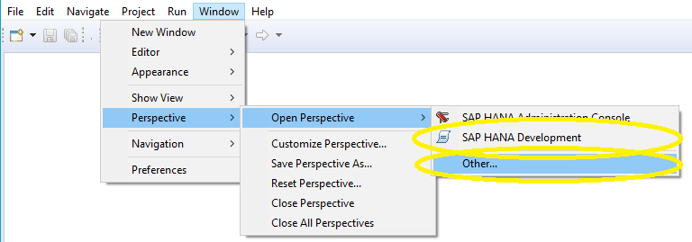

The *SAP HANA Development* perspective opens.

[DONE]

[ACCORDION-END]

[ACCORDION-BEGIN [Step 2: ](Create a New Repository Workspace)]

Through the _Repositories_ tab, right-click on your user login for your tenant database and select __Create Repository Workspace__.

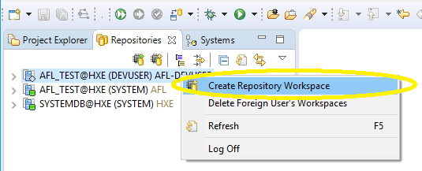

The _Create New Repository Workspace_ window opens.

Make sure your user login for your tenant database is selected. You may use your default workspace, or untick the _Use Default Workspace_ box and create a new workspace by filling in _Workspace Name_ and _Workspace Root_. By default, these locations are the same as the home repository you select when starting Eclipse and SAP HANA Studio.

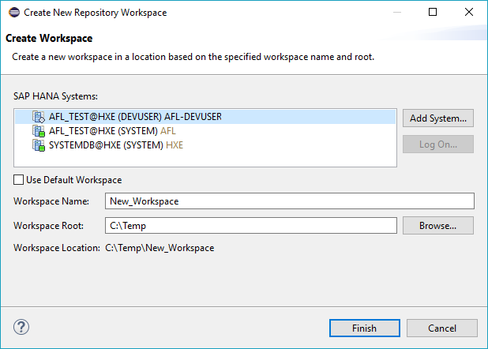

Click __Finish__ to create your new workspace.

[DONE]

[ACCORDION-END]

[ACCORDION-BEGIN [Step 3: ](Create a New Repository Package)]

Right-click on your new repository workspace and select __New__ -> __Repository Package__.

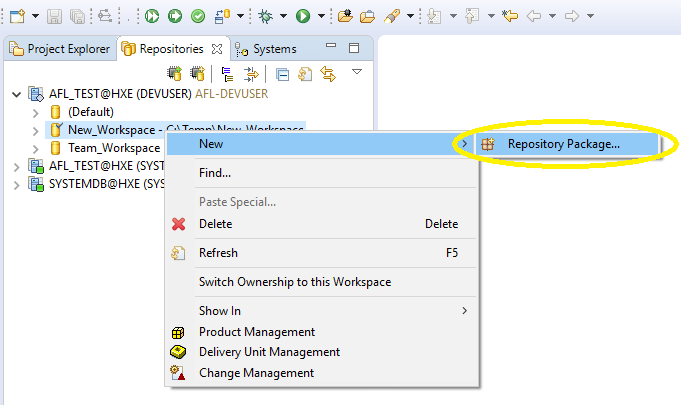

The _Create Repository Package_ window opens.

Give your package a name and click __Finish__ to create the package.

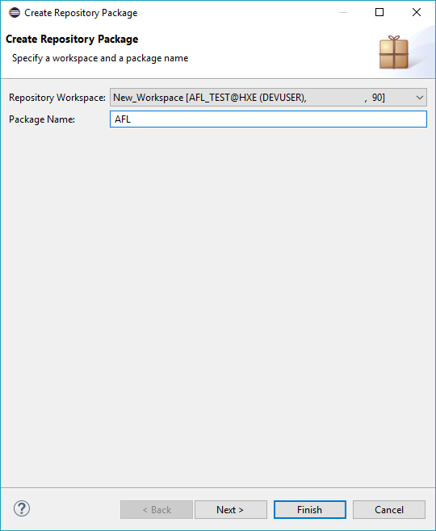

[DONE]

[ACCORDION-END]

[ACCORDION-BEGIN [Step 4: ](Create a Flowgraph Model)]

Right-click on your new package and select __New__ -> __Other...__.

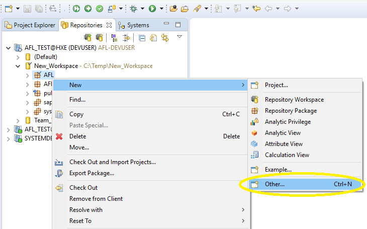

The _New_ window opens.

Scroll down to __SAP HANA__ -> __Database Development__ -> __Flowgraph Model__. Click __Next >__.

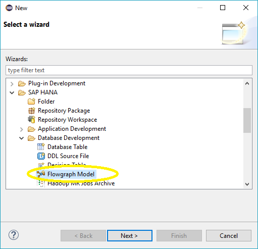

The _New Flowgraph Model_ window opens.

Ensure that your new package is highlighted. Give your flowgraph a name. Ensure that __Flowgraph for Activation as Stored Procedure__ is selected. Click __Finish__.

>**Note:**
> SAP HANA Studio will automatically add `.hdbflowgraph` to your file name.

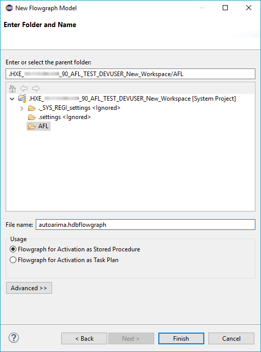

Your new flowgraph opens.

[DONE]

[ACCORDION-END]

[ACCORDION-BEGIN [Step 5: ](Arrange the Flowgraph)]

Under the _Predictive Analysis Library_ window, select __Time Series Analysis__, scroll down and drag and drop __Auto ARIMA__ onto your flowgraph.

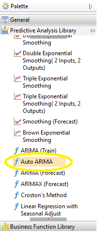

Under the _General_ window, drag and drop __Data Source__ onto your flowgraph.

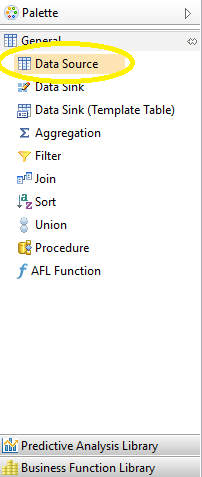

The _Choose a Table or a View_ window opens. For this example, search for and select the _STOCKS (PAL)_ table. Click __OK__.

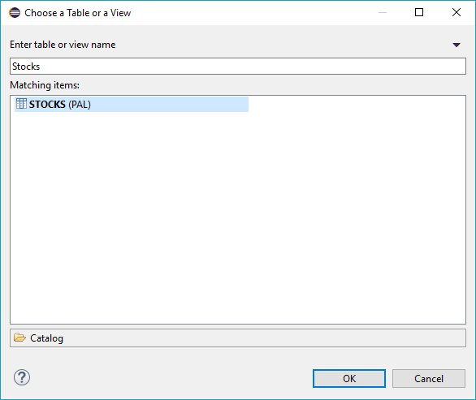

Hover over the _STOCKS_ block. Click and hold the **Connect** icon  from *Data_2* and drag over to _Data_ under the _Auto ARIMA_ block.

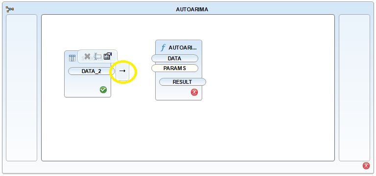

Under the _General_ window, drag and drop __Data Sink (Template Table)__ onto your flowgraph.

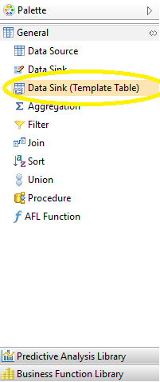

Hover over the _AUTOARIMA_ block. Click and hold the _Connect_ icon  from _RESULT_ and drag over to *DATA_3* under the _TEMPLATESINK_ block.

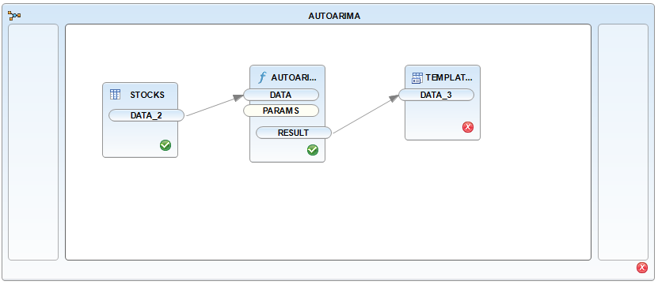

[DONE]

[ACCORDION-END]

[ACCORDION-BEGIN [Step 6: ](Adjust Model Properties)]

To view the results you will need to change the _RESULT_ and _TEMPLATESINK_ properties. Hover over _RESULT_ under __AUTOARIMA__. Click the __Properties__ icon .

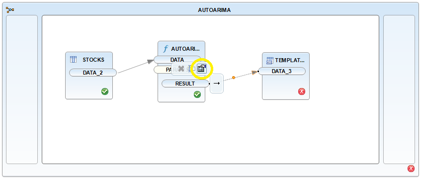

The _Properties_ window opens. Click  __Signature__. Change _VALUE_ _Length_ to _5000_.

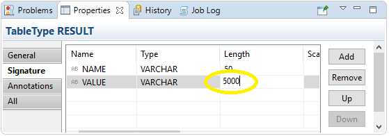

Change the _TEMPLATESINK_ properties. Hover over _TEMPLATESINK_ and click the __Properties__ icon .

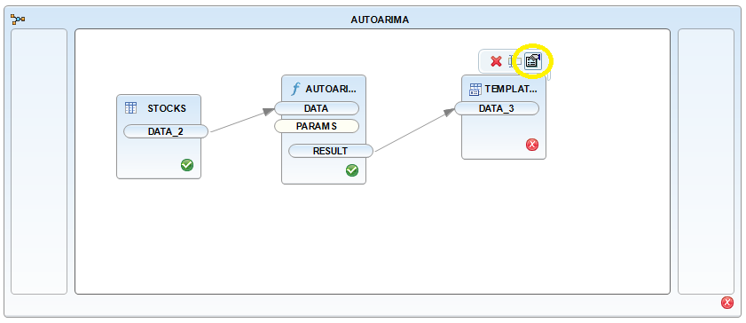

Under the _Properties_ window, add your user schema to _Authoring Schema_. Add a name for _Catalog Object_. You may also check the _Truncate Table_ box.

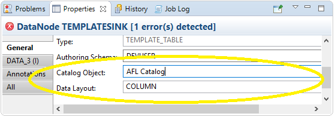

[DONE]

[ACCORDION-END]

[ACCORDION-BEGIN [Step 7: ](Create the Model)]

Change the properties of the flowgraph. Right-click on the white space and select __Properties__.

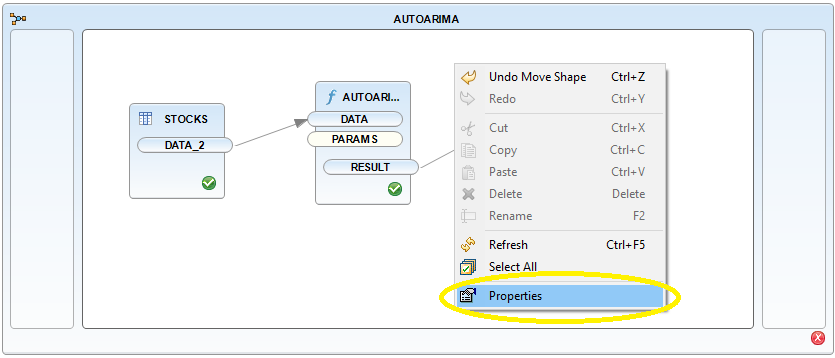

By _Target Schema_, add your user schema.

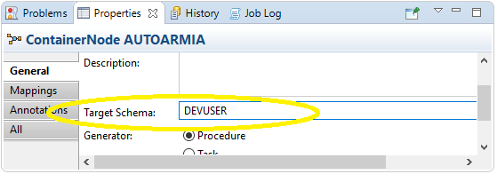

Click the __Activate__ icon . A new job will appear in your Job Log.

Click the __Execute__ icon .

> __Note:__
> If you receive an error during this step, see the troubleshooting section below.

[DONE]

[ACCORDION-END]

[ACCORDION-BEGIN [Optional: ](Preview the Model)]

Return to the _SAP HANA Administration Console_ perspective. Under your user login to your tenant database, cascade down from __Catalog__ -> __User__ -> __Tables__. Right-click on **`Catalog_Object`** and click __Open Data Preview__.

> __Note:__
> The Catalog Object is named earlier in this tutorial.

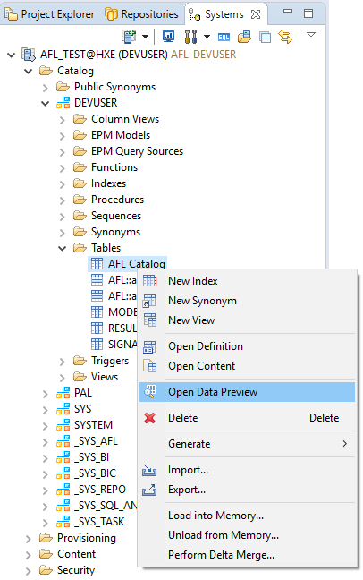

You may notice that this data is identical to _Step 2: Run the Model SQL Script_ in the previous tutorial.

[DONE]

[ACCORDION-END]

[ACCORDION-BEGIN [Step 8: ](Prepare the Model for Analysis)]

Return to your flowgraph.

Under the _Predictive Analysis Library_ window, select __Time Series Analysis__ and scroll down and drag and drop __ARIMA (Forecast)__ onto your flowgraph.

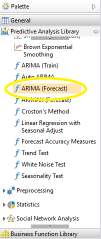

Hover over the _AUTOARIMA_ block. Click and hold the _Connect_ icon  from _RESULT_ and drag over to _INPUT_ under the _ARIMAFORECAST_ block.

Change the *PARAMS_2* by hovering over it and clicking the __Properties__ icon . Under the _Fixed Content_ tab, change the _INTARGS_ to __200__.

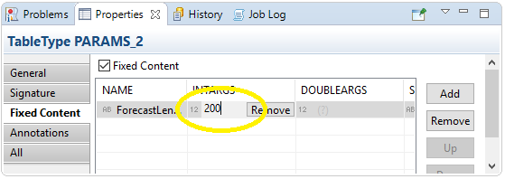

[DONE]

[ACCORDION-END]

[ACCORDION-BEGIN [Step 9: ](Prepare the New Flowgraph Blocks)]

Under the _General_ window, drag and drop another __Data Sink (Template Table)__ onto your flowgraph.

Hover over the _ARIMAFORECAST_ block. Click and hold the _Connect_ icon  from _OUTPUT_ and drag over to *DATA_4* under the new *TEMPLATESINK_2* block.

As before, change the _TEMPLATESINK_ properties. Hover over *TEMPLATESINK_2* and click the __Properties__ icon . Under the _Properties_ window, add your user schema to _Authoring Schema_. Add a name to _Catalog Object_. You may also check the _Truncate Table_ box.

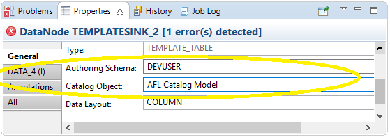

Click the __Activate__ icon . A new job will appear in your Job Log.

[DONE]

[ACCORDION-END]

[ACCORDION-BEGIN [Step 10: ](Preview the Data)]

Click the __Execute__ icon .

Go to the _Systems_ tab. Refresh your tenant database. Find the results table under your user login. Go to __Catalog__ -> **User** -> **Tables** -> **`Second_Catalog_Object`**. Right-click on the table and select __Open Data Preview__.

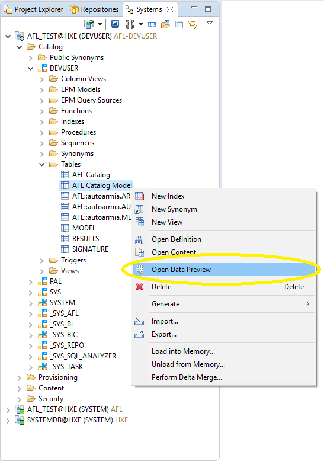

You will notice that this data is identical to _Step 4: Run the Predict SQL Script_ in the previous tutorial.

[DONE]

[ACCORDION-END]

[ACCORDION-BEGIN [Troubleshooting: ](Unsupported encoding Cp 1252)]

When you _Activate_ your Auto ARIMA model, you may encounter this error:

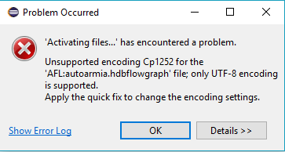

To fix this error, open the _Problems_ window. Go to __Window__ -> __Show View__ -> __Other...__. From there, go to __General__ and select __Problems__. Click __OK__.

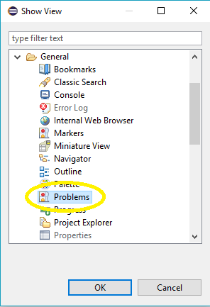

You will see the error in the log. Right-click the error and click __Quick Fix__. The _Quick Fix_ window opens.

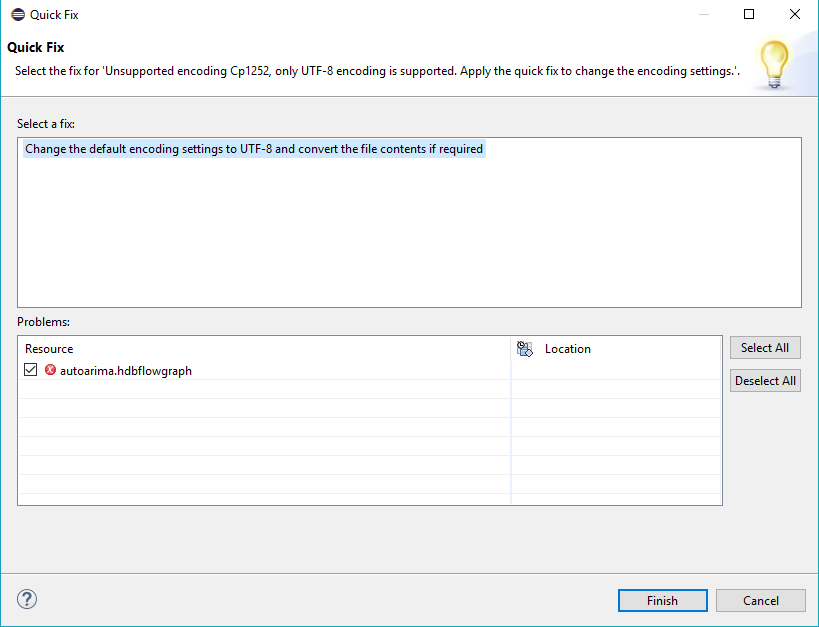

Click __Finish__. A message explaining the fix will appear.

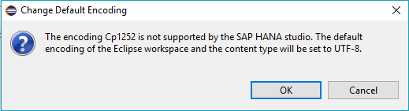

Click __OK__.

Click the __Activate__ icon  and continue with the tutorial.

[DONE]

[ACCORDION-END]

#### Additional Information
- Find more Predictive Analysis Library tutorials on the [SAP HANA Academy YouTube Channel](https://www.youtube.com/playlist?list=PLkzo92owKnVw05sPUtcKJM66fYfk9sG-g)
