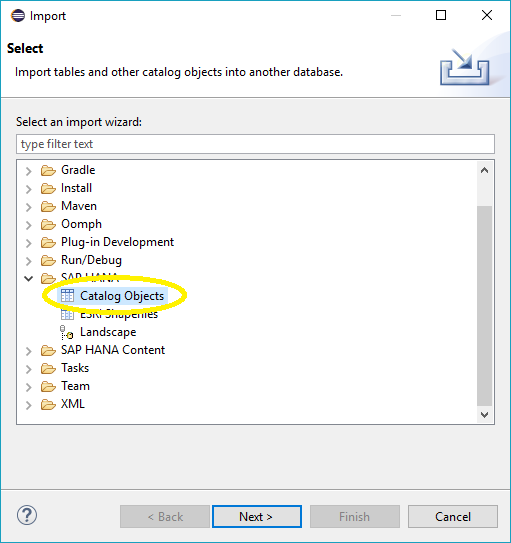
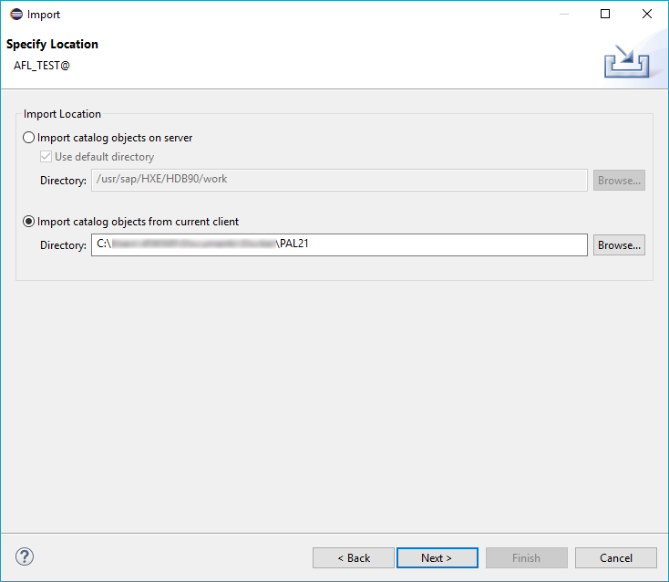
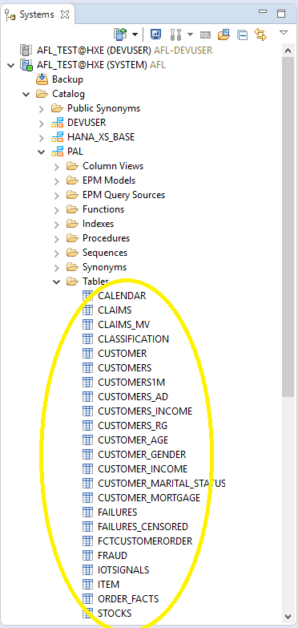
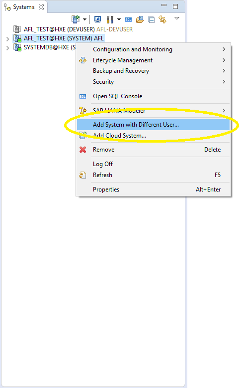
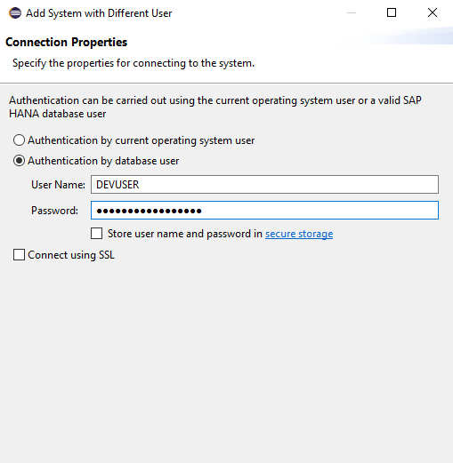

## Details
### You will learn  
  - How to prepare your SAP HANA, express edition installation for Predictive Analytics


---

[ACCORDION-BEGIN [Step 1: ](Ensure AFL is Installed)]

Log in to your system database and select your database. Click on the Administration icon  and under the __Overview__ tab, next to _Installed Plug-ins_ check that **AFL** is installed.


Open an SQL command line to your database and check again that AFL PAL Functions are installed.

```bash
SELECT * FROM SYS.AFL_FUNCTIONS WHERE PACKAGE_NAME='PAL';
```

If a list of AFL functions is generated, AFL PAL Functions are installed.


[DONE]

[ACCORDION-END]

[ACCORDION-BEGIN [Step 2: ](Create a Tenant Database and Activate the Script Server)]

Through your SQL command line, create a new tenant database.

```bash
CREATE DATABASE <DATABASE_NAME> SYSTEM USER PASSWORD <password>;
```

Example:

```
CREATE DATABASE AFL_TEST SYSTEM USER PASSWORD Password1;
```

Activate script server on your new tenant database.

```bash
ALTER DATABASE <DATABASE_NAME> ADD 'scriptserver';
```


[DONE]

[ACCORDION-END]

[ACCORDION-BEGIN [Step 3: ](Connect to Your Tenant Database)]

Click on the __Add System...__ icon .

Add the Host Name, Instance Number, Mode, and Description for your tenant database.

- The _Host Name_ and _Instance Number_ are the same as your System database.

- For _Mode_, when you select _Multiple containers_ select _Tenant database_ and enter the name of your tenant database.    

- Click __Next >__.

Choose _Authentication by database user_ and add the __SYSTEM__ user with your tenant SYSTEM user password.

Click __Finish__.


[DONE]

[ACCORDION-END]

[ACCORDION-BEGIN [Step 4: ](Download and Import the PAL Schema Sample Data)]

Open your preferred web browser and visit the [SAP HANA Academy GitHub](https://github.com/saphanaacademy/PAL/tree/master/Source%20Data) page and download the `PAL21.zip` file. Extract the `PAL21.zip` onto your local machine.

On SAP HANA Studio, select _File_ > _Import..._

Under the _SAP HANA_ folder, select _Catalog Objects_. Click __Next >__.



Select your **tenant** database.

Select _Import catalog objects from current client_ and select the directory where you extracted `PAL21.zip`. It will read __PAL21__.



For __Select Catalog Objects for Import__, select and __Add__ all of the objects from the **PAL21** directory.

Click __Next >__.

Click __Finish__ to begin your upload.

Importing the data will take some time.

> Note:
> You can check if the upload was successful by logging into your tenant database and cascading down from _Catalog_ -> _PAL_ -> _Tables_. You will see a series of tables.
> 


[DONE]

[ACCORDION-END]

[ACCORDION-BEGIN [Step 5: ](Add a New User and Grant Proper Permissions for the Tenant Database)]

Open an SQL command line to your **tenant** database.

Create a new user:

```bash
CREATE USER <NEW_USER> PASSWORD <password>;
```

Example:

```
CREATE USER DEVUSER PASSWORD Password1;
```

> Note:
> The script in the following tutorial assumes your new username is _DEVUSER_. Consider naming your new user _DEVUSER_ to avoid additional steps.

Authorize creation, removal, and execution of PAL Procedures:

```bash
GRANT AFLPM_CREATOR_ERASER_EXECUTE, AFL__SYS_AFL_AFLPAL_EXECUTE TO <NEW_USER>;
```

Enable modeling:

```bash
GRANT MODELING TO <NEW_USER>;
```

Enable Native Development:

```bash
GRANT EXECUTE ON REPOSITORY_REST TO <NEW_USER>;
GRANT REPO.READ, REPO.EDIT_NATIVE_OBJECTS, REPO.ACTIVATE_NATIVE_OBJECTS, REPO.MAINTAIN_NATIVE_PACKAGES ON ".REPO_PACKAGE_ROOT" TO <NEW_USER>;
```

Grant access to the sample data:

```bash
GRANT SELECT ON SCHEMA PAL TO <NEW_USER>;
GRANT SELECT ON SCHEMA PAL TO _SYS_REPO;
```


[DONE]

[ACCORDION-END]

[ACCORDION-BEGIN [Step 6: ](Log in to the Tenant Database with the New User)]

Right-click on your tenant database. Select **Add System with Different User...**.



Add your new user and input its password.



Click **Finish**.

>**Note**
> You may be asked to give your new user a new password.


[DONE]

[ACCORDION-END]

[ACCORDION-BEGIN [Step 7: ](Grant Access to New User Schema)]

Open an SQL command line to your **tenant** database through your **new user** and enter the following:

```bash
GRANT SELECT, INSERT, DELETE ON SCHEMA <NEW_USER> TO _SYS_REPO;
```


[ACCORDION-END]
