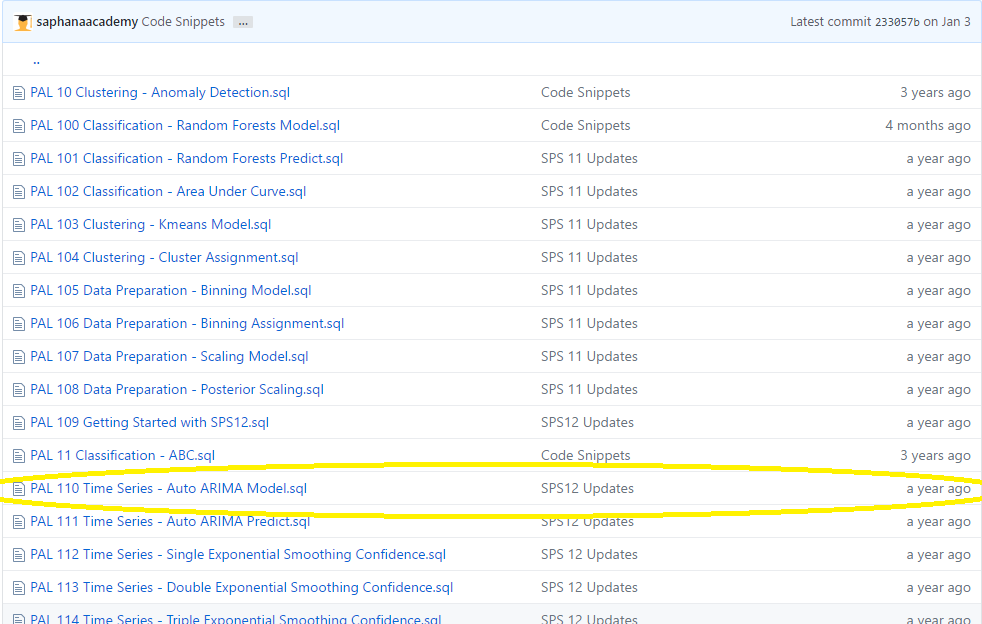
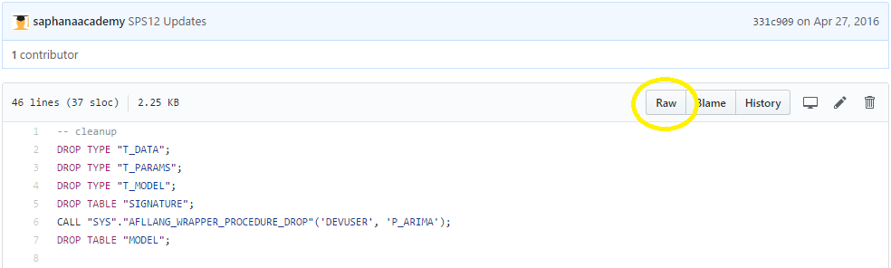
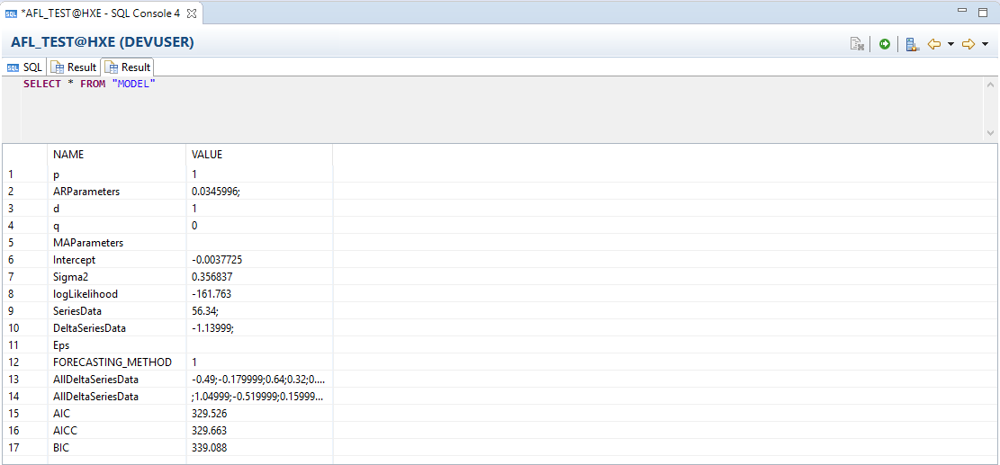
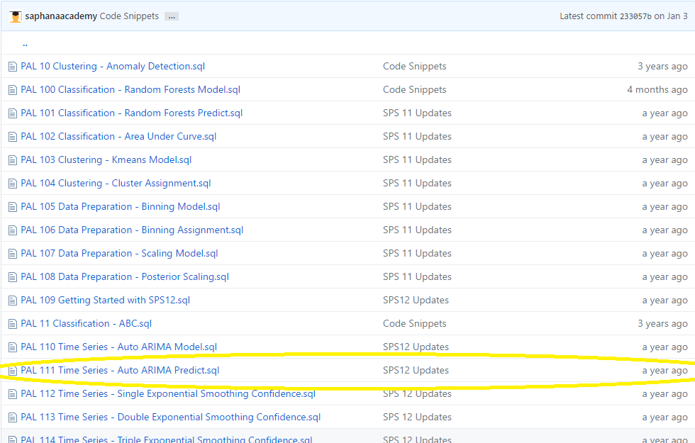
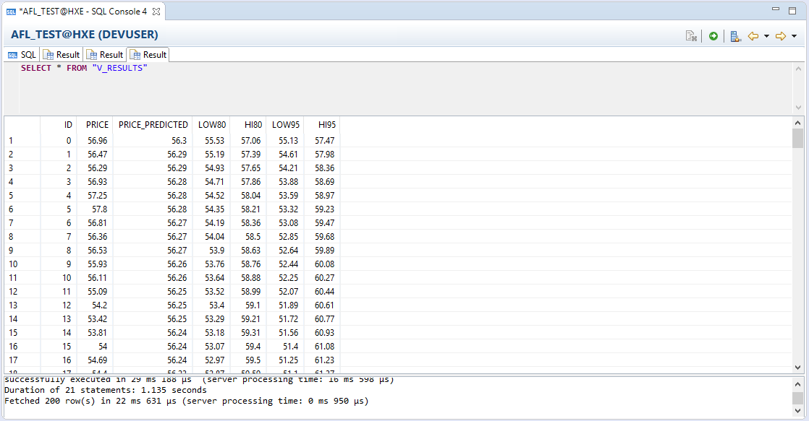
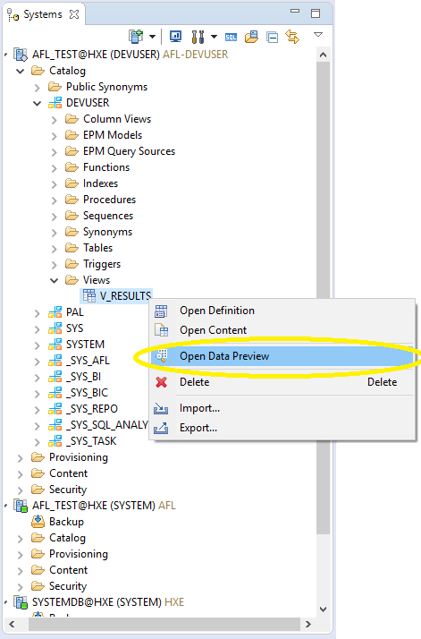
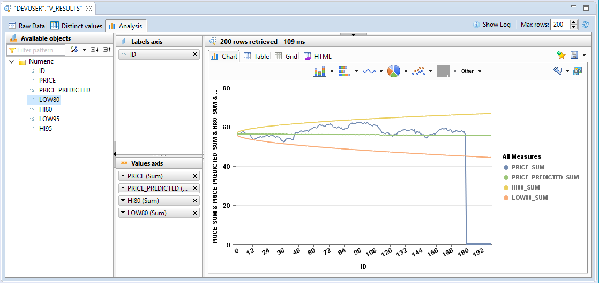

## Details
### You will learn  
  - How to use predictive analytics with a pre-written SQL script

This tutorial describes one of many SAP HANA Academy Predictive Analysis Library tutorials. For more tutorials on using Predictive Analysis Library, see the [SAP HANA Academy YouTube Playlist](https://www.youtube.com/playlist?list=PLkzo92owKnVw05sPUtcKJM66fYfk9sG-g).


---

[ACCORDION-BEGIN [Prerequisite: ](Memory Cleanup (VM only))]

Before running the script on your VM installation, you will need to clean up the memory processes.

Open a command line to your VM and run the following commands:

```bash
hdbcons "resman shrink"
```

```bash
hdbcons "mm gc -f"
```

```bash
hdbcons -e hdbnameserver "resman shrink"
```

```bash
hdbcons -e hdbnameserver "mm gc -f"
```


[DONE]

[ACCORDION-END]

[ACCORDION-BEGIN [Step 1: ](Copy the First SAP HANA Academy Script)]

Go to the [SAP HANA Academy GitHub](https://github.com/saphanaacademy) site. Click on the **PAL** repository. From there, navigate to **Code Snippets** -> **`PAL 110 Time Series - Auto ARIMA Model.sql`**.



Click on **Raw**.



Use the keys _Ctrl_ + _a_ to select all, and _Ctrl_ + _c_ to copy the script.


[DONE]

[ACCORDION-END]

[ACCORDION-BEGIN [Step 2: ](Run the Model SQL Script)]

Open an SQL command line to your **tenant** database through your **new user**. Paste the script and click the Execute icon  to run the code. The **Result** page appears.

>**Note:**
> This script assumes the user name is **DEVUSER**. If you created a user with a different name, you will need to modify the script by replacing the instances of **DEVUSER** with your user's name.



>**Note:**
> The first time you run this script, you may receive the errors _Could not execute 'DROP TYPE ...'_ and the error _Could not execute 'DROP TABLE "#PARAMS"'_. This is expected behavior as these elements are created in the script. The errors will not affect output.

This builds the model used for predictive analysis.


[DONE]

[ACCORDION-END]

[ACCORDION-BEGIN [Step 3: ](Copy the Second SAP HANA Academy Script)]

Go back to the [SAP HANA Academy GitHub](https://github.com/saphanaacademy) site. Click on the **PAL** repository. From there, navigate to **Code Snippets** -> **`PAL 111 Time Series - Auto ARIMA Predict.sql`**.



Click on **Raw**.


Use the keys _Ctrl_ + _a_ to select all, and _Ctrl_ + _c_ to copy the code.


[DONE]

[ACCORDION-END]

[ACCORDION-BEGIN [Step 4: ](Run the Predict SQL Script)]

Back in your command line, paste the script and click the **Execute** icon  to run the code. A new *Result* page appears. This creates a predictive analysis table from the model you created earlier.

>**Note:**
> This script assumes the user name is **DEVUSER**. If you created a user with a different name, you will need to modify the script by replacing the instances of **DEVUSER** with your user's name.




[DONE]

[ACCORDION-END]

[ACCORDION-BEGIN [Step 5: ](View the Results)]

To preview the data, go to your user login to your tenant database and cascade down to **Catalog** -> **`USER`** -> **Views**. Right-click on **`V_Results`** and click **Open Data Preview**.



From there, you can view the raw data or create charts under the *Analysis* tab.




[DONE]

[ACCORDION-END]

[ACCORDION-BEGIN [Info: ](Script Information)]

For more information about the scripts, watch the SAP HANA Academy videos [PAL: 110. Time Series - Auto ARIMA Model](https://www.youtube.com/watch?v=YpC6wATFTA8&index=132) and [PAL: 111. Time Series - Auto ARIMA Predict](https://www.youtube.com/watch?v=qiCuxj7yJmU).


[DONE]

[ACCORDION-END]
