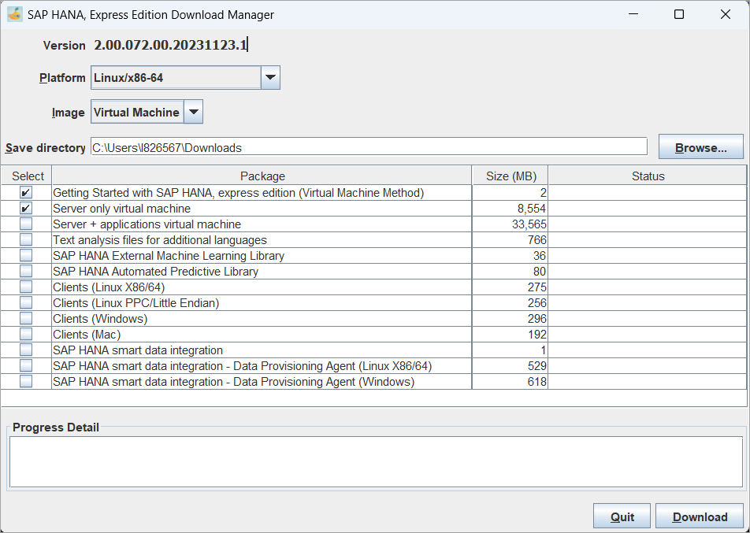

# Register for SAP HANA, express edition
<!-- description --> Register your copy of SAP HANA, express edition to access the download manager.

## Prerequisites
 - **Tutorials:** You have completed [Pre-installation Tasks](https://developers.sap.com/tutorials/hxe-ua-installing-vm-image.html).

## You will learn
- How to register for the product, and access the download manager.

---

### Complete the registration form
Go to the [SAP HANA, express edition Trial](https://www.sap.com/products/technology-platform/hana/express-trial.html) page and click on **Start your free trial**.

Acknowledge the download agreement and select a download manager such as the Platform-independent DM.


### Start the download manager
Open the download manager.  

The Platform-independent DM can be started with the following command.

```Shell
java -jar HXEDownloadManager.jar
```


