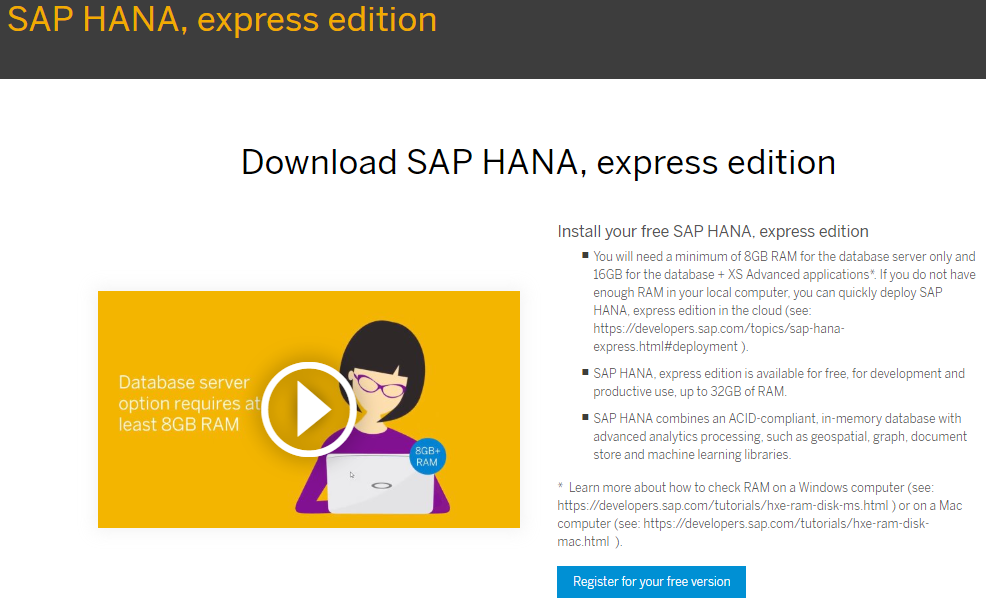
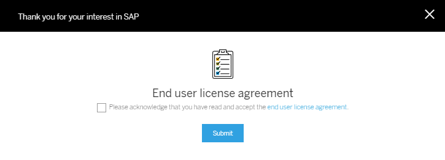
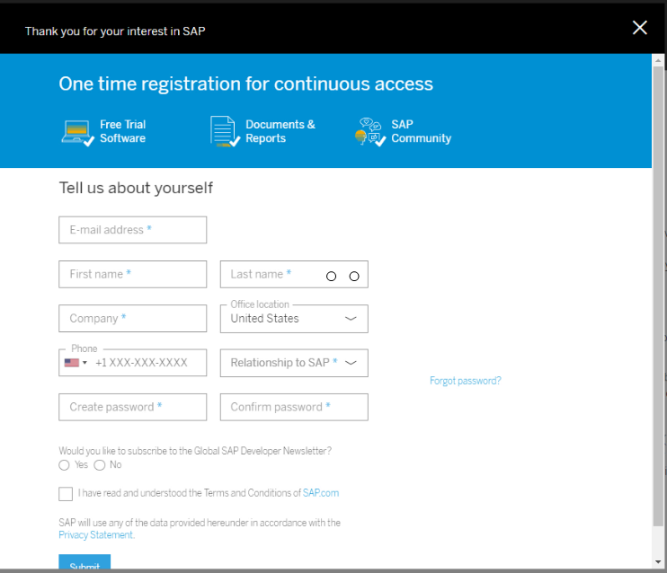
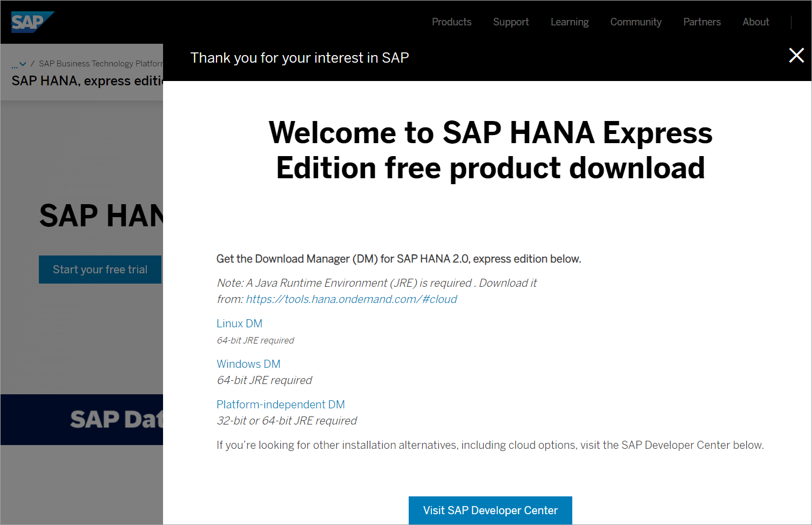

<!-- loio05993a86616940d5a3eb52589d1aa834 -->

## Prerequisites
 - **Tutorials:** You have completed [Pre-installation Tasks](https://developers.sap.com/tutorials/hxe-ua-installing-vm-image.html).

## Details
### You will learn
You will learn how to register for the product, and access the download manager.

---

[ACCORDION-BEGIN [Step 1: ](Complete the registration form)]

Go to the **Download SAP HANA, express edition** registration page at [https://www.sap.com/cmp/td/sap-hana-express-edition.html](https://www.sap.com/cmp/td/sap-hana-express-edition.html).

Click **Register for your free version**.

!

Read and accept the end user license agreement, and then click **Submit**.

!

The registration form displays.

On the registration form, enter all required information and click **Submit**.

!

> If you have an SAP login, click the Login icon at the top of the page to populate the registration form automatically.
>
>

You will receive an email indicating successful registration.

[DONE]

[ACCORDION-END]

[ACCORDION-BEGIN [Step 2: ](Choose a download manager)]

Click the download manager that matches your system: **Linux DM** or **Windows DM**.

If you have a Mac, or another type of machine, click **Platform-independent DM** for a platform-independent download manager.

!

> You must click the download manager links on the Registration Success page. If you attempt to copy a download manager URL to your browser, the download will fail with an error.
>
>

[DONE]

[ACCORDION-END]

[ACCORDION-BEGIN [Step 3: ](Save the download manager file)]

Save the download manager file to your laptop and open it. If your system displays a security warning when you open the file, ignore the warning.

> If you are inside a corporate firewall, you will be prompted for your proxy settings. Contact your IT administrator for your proxy host and proxy port information.
>
>

[DONE]

[ACCORDION-END]
