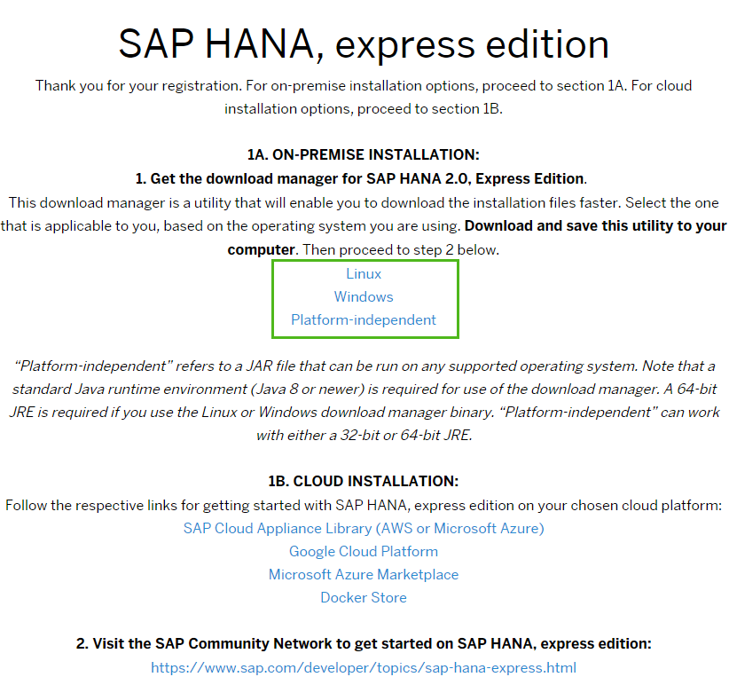

<!-- loio05993a86616940d5a3eb52589d1aa834 -->

## Prerequisites
 - **Proficiency:** Beginner
 - **Tutorials:** 

## Details
### You will learn
You will learn how to register for the product, and access the download manager.

### Time to Complete
2 min

---

[ACCORDION-BEGIN [Step 1: ](Open the registration page.)]

Go to the registration page at [http://sap.com/sap-hana-express](http://sap.com/sap-hana-express). (Alternately, you can go to the SAP HANA, express edition launch page at [http://www.sap.com/developer/topics/sap-hana-express.html](http://www.sap.com/developer/topics/sap-hana-express.html) and click the *Free Download* link.)

The registration page opens.

[ACCORDION-END]

[ACCORDION-BEGIN [Step 2: ](Complete the registration form.)]

Enter all required information and click the *Register* button.

> Note:
> If you have an SAP login, click the Login icon at the top of the page to populate the registration form automatically.
> 
> 

The *Registration Success* page displays. (You will also receive an email indicating successful registration.)

[ACCORDION-END]

[ACCORDION-BEGIN [Step 3: ](Choose a download manager.)]

Under *1A. ON-PREMISE INSTALLATION*, click the download manager that matches your system: Linux or Windows.

If you have a Mac, or another type of machine, click *Platform-independent* for a platform-independent download manager.

> Note:
> You must click the download manager links on the Registration Success page. If you attempt to copy a download manager URL to your browser, the download will fail with an error.
> 
> 

[ACCORDION-END]

[ACCORDION-BEGIN [Step 4: ](Save the download manager file.)]

Save the download manager file to your laptop and open it. If your system displays a security warning when you open the file, ignore the warning.

> Note:
> If you are inside a corporate firewall, you will be prompted for your proxy settings. Contact your IT administrator for your proxy host and proxy port information.
> 
> 

[ACCORDION-END]

