## Prerequisites  
 - **Proficiency:** Beginner
 - **Tutorials:**
    - [Installing SAP HANA Streaming Analytics for SAP HANA, Express Edition](https://developers.sap.com/tutorials/hxe-ua-installing-streaming.html)

## Next Steps
 - [Create a Streaming Project with SAP HANA Streaming Analytics](https://developers.sap.com/tutorials/sds-create-streaming-project.html)

## Details
Install the streaming analytics plugin for Eclipse, add a connection to the streaming analytics server, and create a HANA service.

### Time to Complete
**10 Min**

---

[ACCORDION-BEGIN [Step 1: ](Edit the /etc/hosts File)]    

If you're running SAP HANA, express edition in a virtual machine or cloud server instance, then depending on the network configuration, you may need to edit the `/etc/hosts` file on your local machine so Eclipse can connect to the streaming analytics server.

#### Edit `/etc/hosts` on Windows

If you are running Eclipse on a Windows machine, follow these steps to update the `etc/hosts` file:

1. On your Windows laptop, navigate to **`C:\Windows\System32\drivers\etc`**.

2. In **Administrator** mode, open **hosts** in Notepad. See your operating system Help for information on opening applications in Administrator mode.

3. In a new uncommented row, add the IP address and **`hxehost`** (virtual machine) or the hostname of the machine where SAP HANA, express edition is installed (binary installation). Save your changes.

    >**Tip**: Spacing is important. Make sure your hosts file in Notepad looks like this image.

    

#### Edit `/etc/hosts` on Mac and Linux

If you are running Eclipse on a Mac or Linux machine, follow these steps to update the `etc/hosts` file:

1.	On your Mac or Linux machine, open a terminal.

2.  Enter the following command:

    ```bash
    sudo sh - c 'echo <hxehost IP address>    hxehost >> /etc/hosts'
    ```

[DONE]

[ACCORDION-END]

[ACCORDION-BEGIN [Step 2: ](Install the plugin)]

1. Use the SAP HANA, express edition Download Manager to download the streaming studio plugin, `hsa_plugin.zip`.

2. Extract the contents of the `hsa_plugin.zip` file.

3. Open Eclipse and select _Help > Install New Software_:

    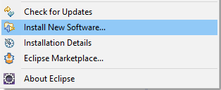

4. In the Install dialog, click **Add**:

    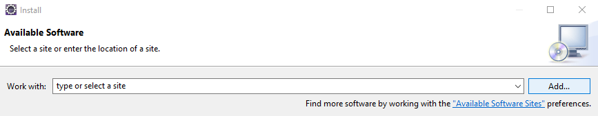

5. In the Add Repository dialog, click **Local**, select the `<extracted_path>/<platform>/SAP_HANA_STREAMING/repository` folder, and click **OK**:

    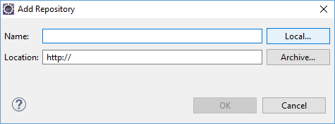

    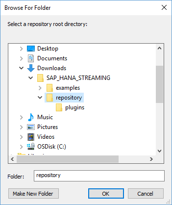

6. In the Install dialog, check SAP HANA streaming analytics, then click **Next**:

    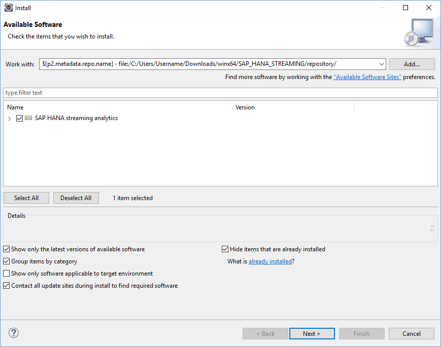

7. Review the items to be installed, then click **Next**:

    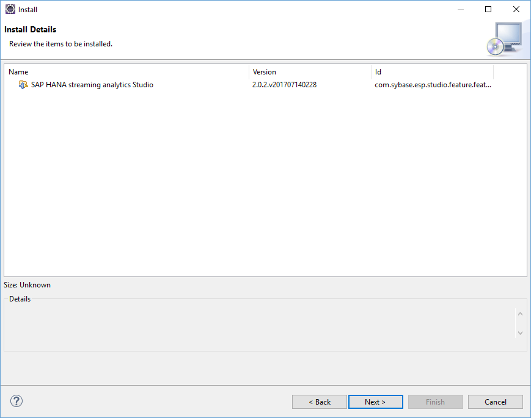

8. Review the license, accept the terms and conditions to continue, then click **Finish**:

    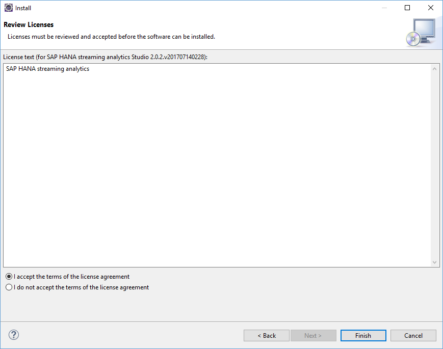

9. For any security warnings, click **OK**.

10. At the prompt to restart Eclipse, select **Yes**.

11. If you are installing the plugin into Eclipse for Linux, log off of the machine and log back in.


[DONE]

[ACCORDION-END]

[ACCORDION-BEGIN [Step 3: ](Open the streaming perspectives)]

1. In Eclipse, select _Window > Perspective > Open Perspective > Other_, then select the **SAP HANA Streaming Development** perspective and click **OK**:

    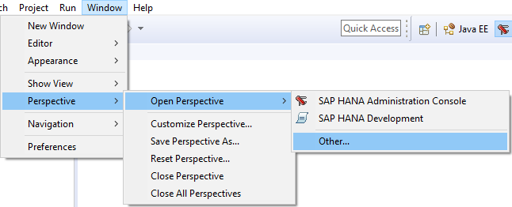

    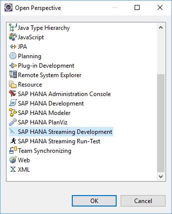

2. Select _Window > Perspective > Open Perspective > SAP HANA Streaming Run-Test_:

    


[DONE]

[ACCORDION-END]


[ACCORDION-BEGIN [Step 4: ](Add a streaming analytics connection)]

Here we will connect our streaming design time tools to the SAP HANA streaming analytics server.

1. In the **SAP HANA Streaming Run-Test** perspective, in the **Server** view, select **New Server URL**:

    

2. Enter the following connection details:
    - Host Name: `hxehost` (The hostname or IP address for your SAP HANA, express edition installation)
    - Port: 39041 (virtual machine) or 3`<instance-number>`41 (binary installation)

    Enable SSL, then click **OK**:

      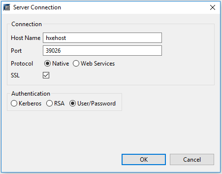

3. Right-click on the new server and select **Change User Name and Password**:

    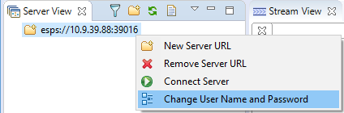

4. Enter the credentials for `SYSTEM` and click **OK**:

    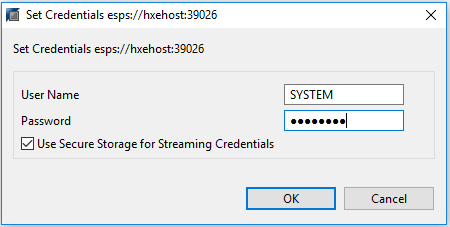

    >**Note:**
    > To automatically connect to the streaming server when starting Eclipse, check **Use Secure Storage for Streaming Credentials**.

5. Right-click on the server and select **Connect Server**:

    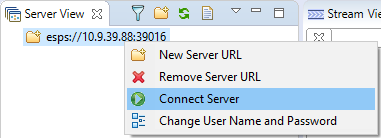

6. Open _Window > Preferences_ and select **SAP HANA streaming analytics** from the list:

    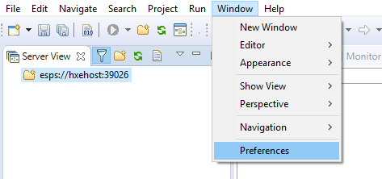

    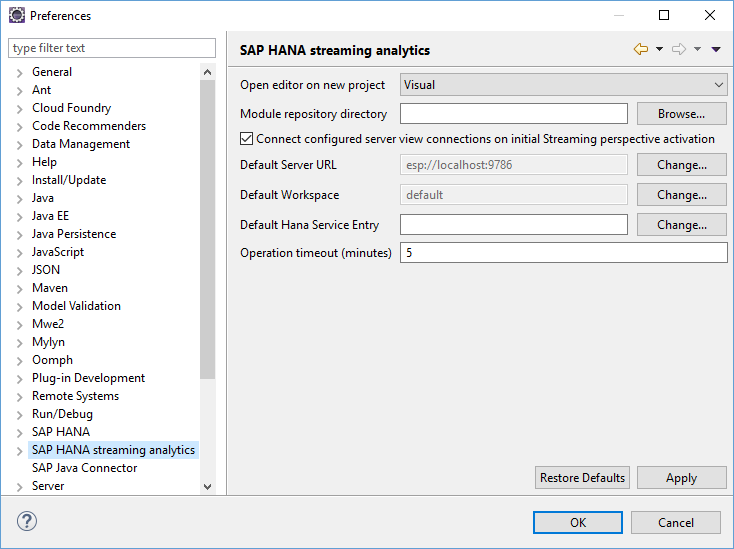

7. Set **Default Server URL** to the new server and click **OK**:

    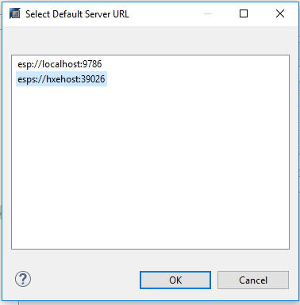


[DONE]

[ACCORDION-END]

[ACCORDION-BEGIN [Step 5: ](Add a HANA service)]

In this step we will create a named **Data Service** on the SAP HANA streaming analytics server.  In this case, the data service will connect to a particular HANA database. Streaming projects use named data services to connect to database tables.

1. Switch to the **SAP HANA Streaming Development** perspective and select the **Data Services** tab:

    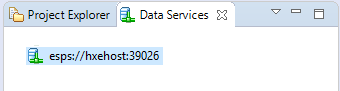

2. Right-click on the new server and select **Load Workspaces**:

    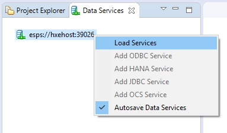

3. Right-click on the **Server-wide** folder and select **Add HANA Service**:

    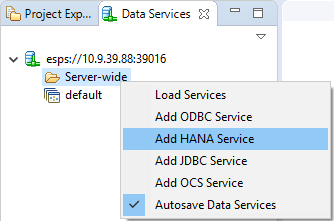

4. Select **`newservice1`** and, in the **Properties** view:
    - Enter the credentials for `SYSTEM`.
    - Uncheck **Use Default HANA Server**.
    - Select **Multi Tenant**.
    - Set **Database Name** to `HXE`.
    - Set **HANA Hostname** to the hostname or IP address for your SAP HANA, express edition installation
    - Set **HANA Instance Number** to the instance number for your installation (for the virtual machine version, the instance number is 90).

    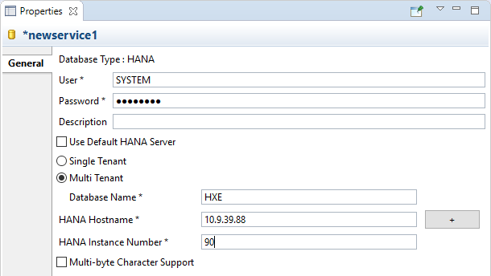

5. Right-click on **`newservice1`** and select **Rename Service**. Name the new service `hanadb`:

    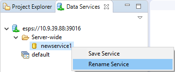

    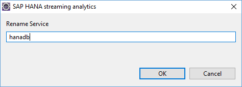

6. To confirm that the HANA service is configured properly, right-click on it and select **Discover**:

    


[DONE]

[ACCORDION-END]
