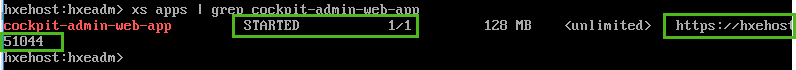
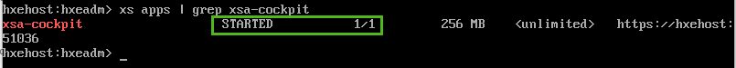
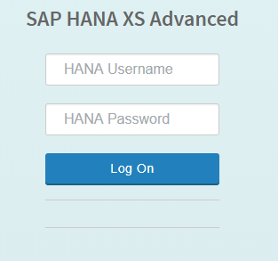
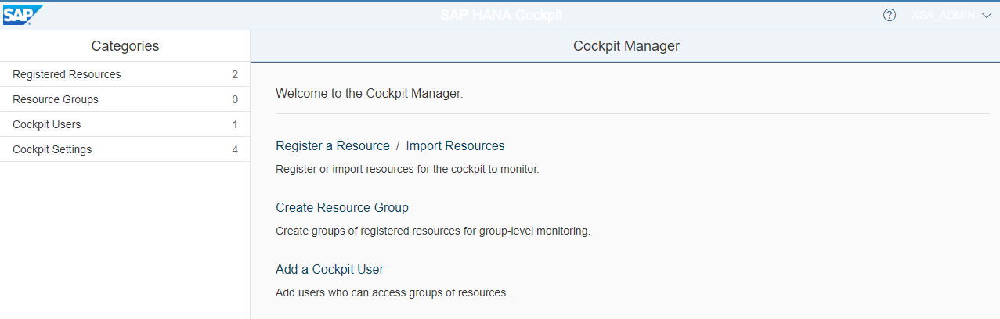

<!-- loio0377017816dc46b09db7b2e13bfabc0a -->

## Prerequisites
 - **Tutorials:** You have completed [Edit the Hosts File](https://developers.sap.com/tutorials/hxe-ua-hosts.html)

## Details
### You will learn
You'll learn how to connect to the server from applications, and check if the applications installed correctly.

---

> Note:
> Make sure you edited your `/etc/hosts` file before starting this procedure.
>
>

[ACCORDION-BEGIN [Step 1: ](Test XSA)]

1.   In your VM, log in to XSA services:

    ```bash
    xs-admin-login
    ```

2.   When prompted for the `XSA_ADMIN` password, enter the master password

    You specified this password when you were prompted for the HANA database master password earlier in [Start SAP HANA, express edition Server](hxe-ua-getting-started-vm-xsa).

[DONE]

[ACCORDION-END]

[ACCORDION-BEGIN [Step 2: ]((Optional) Turn on XSA messaging)]

If you want the XSA messaging service, issue these commands to start the messaging service applications:

```bash
xs start messaging-service-hub
xs start messaging-service-node
xs start messaging-service-broker

```

[DONE]

[ACCORDION-END]

[ACCORDION-BEGIN [Step 3: ](Test SAP Web IDE)]

1.   Display the status and URL for the application `webide`. Enter:

    ```bash
    xs apps | grep webide
    ```

    

2.   Check that the application `webide` shows `STARTED` in the list of XSA applications, and has 1/1 instances. (If the output shows 0/1 in the instance column, the application is not started.)

    > Note:
    > Normally it only takes a few minutes for XSA services to start. However, depending on your machine, it can take over 30 minutes for XSA services to begin. If the service doesn't show `STARTED` and doesn't show `1/1` instances, keep waiting until the service is enabled.
    >
    >

    Make a note of the URL for `webide`.

3.   Test your Web IDE connection. Enter the URL for Web IDE in a browser on your laptop.

    ```bash
    Example: https://hxehost:53075
    ```

    

4.   For *HANA Username*, enter `XSA_DEV`.

    You specified this password when you were prompted for `HANA database master password` in [Start SAP HANA, express edition Server](hxe-ua-getting-started-vm-xsa).

    Web IDE displays.

    If you are prompted to change your password, follow the instructions.

[DONE]

[ACCORDION-END]

[ACCORDION-BEGIN [Step 4: ](Test Cockpit)]

1.   Go back to your VM. Enter:

    ```bash
    xs apps | grep cockpit-admin-web-app
    ```

2.   Check that the application `cockpit-admin-web-app` shows `STARTED` in the list of XSA applications and has 1/1 instances.

    

    > Note:
    > Normally it only takes a few minutes for XSA services to start. However. depending on your machine, it can take over 30 minutes for XSA services to begin. If the service doesn't show `STARTED` and doesn't show `1/1` instances, keep waiting until the service is enabled.
    >
    >

    Make a note of the URL for `cockpit-admin-web-app`.

3.   Check that the application `xsa-cockpit` shows `STARTED` in the list of XSA applications and has 1/1 instances. Enter:

    ```bash
    xs apps | grep xsa-cockpit
    ```

    > Note:
    > Normally it only takes a few minutes for XSA services to start. However. depending on your machine, it can take over 30 minutes for XSA services to begin. If the service doesn't show `STARTED` and doesn't show `1/1` instances, keep waiting until the service is enabled.
    >
    >

    

4.   In a browser on your laptop, enter the `cockpit-admin-web-app` URL you noted earlier.

    The Cockpit log in page displays.

    

5.   For *HANA Username*, enter `XSA_ADMIN`.

6.   For *HANA Password*, enter the master password.

    You specified this password when you were prompted for `HANA database master password` earlier in this tutorial.

    Cockpit displays:

[DONE]

[ACCORDION-END]

[ACCORDION-BEGIN [Step 5: ]((Optional) Test XSC)]

Check that the XSEngine is running. From your host OS (not the VM guest) open a browser and enter:

```bash
http://<hxehost IP address>:8090
```

You recorded the IP address earlier in [Start SAP HANA, express edition Server](hxe-ua-getting-started-vm-xsa). A success page displays. This indicates that XSC is running:


> Note:
> SAP plans to remove SAP HANA extended application services, classic model (XSC) and the corresponding SAP HANA Repository with the next major product version of SAP HANA.
>
> These components will be removed:
>
> -   SAP HANA extended application services, classic model
>
> -   SAP HANA Repository (XS classic)
>
> -   SAP HANA Studio (Development, Modeling, and Administration perspectives)
>
> -   SAP HANA Web-based Development Workbench (XS classic)
>
>
> SAP strongly advises you to plan the transition of existing content and applications from XSC to SAP HANA extended application services, advanced model (XS Advanced).
>
>

[DONE]

[ACCORDION-END]

[ACCORDION-BEGIN [Step 6: ](Next steps)]

-   **Drivers and connectors for Python, Node.js, .NET, Java and others**: Check sample applications using different drivers and languages [such as Node.js and Python](https://developers.sap.com/mission.hana-cloud-clients.html).

-   **Learn XS Advanced basics**: Explore the basics of XS Advanced tools, such as the administration cockpit or SAP Web IDE for SAP HANA. This tutorial includes a step for mapping the tenant database to the development space. See [SAP HANA XS Advanced, explore the basic tools](xsa-explore-basics).


[DONE]

[ACCORDION-END]
