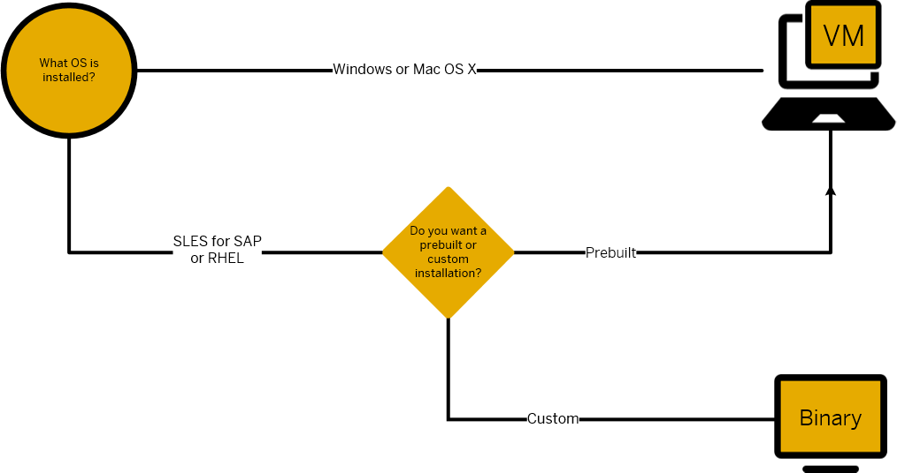

## Prerequisites  
 - **Systems used:** Windows, Mac OSX, SLES for SAP or Red Hat Enterprise Linux

## Next Steps
 - Return to the SAP HANA, express edition developer page (coming soon)
 - [View all How-Tos](http://www.sap.com/developer/tutorial-navigator.how-to.html)

## How-To Details
SAP HANA, express edition is available as a Virtual Machine or a binary version. Follow the flowchart to select the right version for you.

### Time to Complete
**1 Min**.

---

[ACCORDION-BEGIN [Step 1: ](Decide which version of SAP HANA, express edition to download)]

Follow the chart below to decide which version of SAP HANA, express edition to download.

[ACCORDION-END]

## Next Steps
 - Return to the SAP HANA, express edition developer page (coming soon)
 - [View all How-Tos](http://www.sap.com/developer/tutorial-navigator.how-to.html)  
