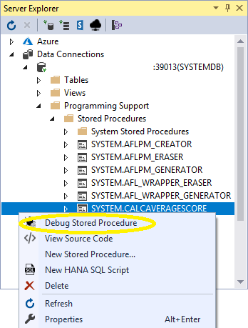
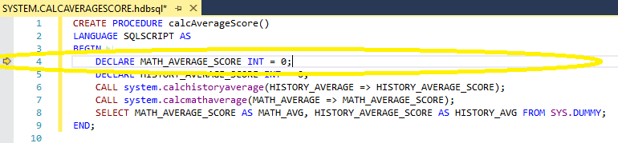
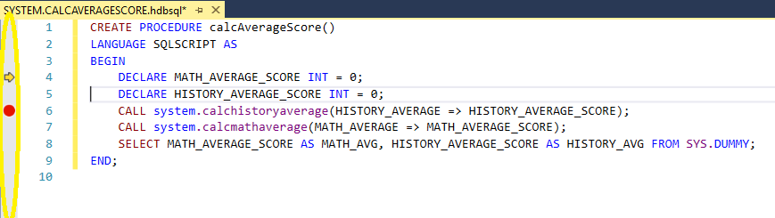

## Prerequisites
 - **Tutorials:** [SAP HANA Plugin for Microsoft Visual Studio 2017 - Working with Tables](https://developers.sap.com/tutorials/hxe-ua-visual-studio-tables.html)

## Next Steps
 - [SAP HANA Plugin for Microsoft Visual Studio 2017 - Word Mapping Project](https://developers.sap.com/tutorials/hxe-ua-visual-studio-word-mapping.html)


## Details
### You will learn
  - How to open and use the debugging features of the SAP HANA plugin for Microsoft Visual Studio 2017.
---

[ACCORDION-BEGIN [Step 1: ](Open a Stored Procedure)]

Open the __Server Explorer__ window. Under your server, cascade from your server to __Programming Support__ > __Stored Procedures__. Right-click `SYSTEM.CALCAVERAGESCORE` and select  _Debug Stored Procedure_.



The Debugging mode is activated.

[DONE]

[ACCORDION-END]

[ACCORDION-BEGIN [Step 2: ](Stepping Over Lines)]

In debugging mode, the currently selected debugging line is indicated by the  arrow to the left of the code line number.



Stepping over lines allows you to run them individually to see if there is an error. Click the  **Step Over** button to run the currently selected debugging line.

Step over until you have the following debugging line selected:

```
CALL system.calcmathaverage(MATH_AVERAGE => MATH_AVERAGE_SCORE);
```

[DONE]

[ACCORDION-END]

[ACCORDION-BEGIN [Step 3: ](Mark a Breakpoint)]

To mark a line as a **Breakpoint**, click the left side of the code line. A red dot  appears and the line of code is added to the _Breakpoints_ window.



If you click the  **Continue Button** you will be taken to the most recent **Breakpoint** that you have not stepped over.

[DONE]

[ACCORDION-END]

[ACCORDION-BEGIN [Step 4: ](Stepping Into the Procedure)]

If your line of code contains a procedure, you can  __Step Into__ the procedure. This opens up another window with the procedure selected.

Click the  __Step Into__ button. This opens the `system.calcMathAverage` procedure.

A new window opens with the following procedure:

```
CREATE OR REPLACE PROCEDURE calcMathAverage (OUT MATH_AVERAGE INT)
LANGUAGE SQLSCRIPT AS
BEGIN

	DECLARE SCORE_SUMMARY int = 0;
	DECLARE SCORE_CURRENT int = 0;
	DECLARE SCORE_COUNT int = 0;
	DECLARE CURSOR C_MATH_SCORES FOR SELECT SCORE_HISTORY FROM SYSTEM.DEMO_STUDENT_SCORE_TABLE;

	FOR cur_row AS C_MATH_SCORES
		  DO
			     SCORE_SUMMARY = SCORE_SUMMARY + cur_row.SCORE_HISTORY;
			     SCORE_COUNT = SCORE_COUNT + 1;
	END FOR;

	MATH_AVERAGE = SCORE_SUMMARY / SCORE_COUNT;
END;
```

[DONE]

[ACCORDION-END]

[ACCORDION-BEGIN [Step 5: ](Local, Call Stack, and Watch Windows)]

When you step into a procedure, the __Locals__ and __Call Stack__ windows automatically populate. For the __Locals__ window, values are added as each step is processed.

The __Call Stack__ window provides a list of procedures that are currently open. The _Call Stack_ includes the `system.calcMATHAVERAGE` and `system.calcAVERAGESCORE` procedures.

The __Watch__ window displays any values that you have added to it. Highlight `SCORE_SUMMARY / SCORE_COUNT` and press *Ctrl* + *C* to copy the line. In the _Watch_ window, underneath the __Name__ column, click the text box and press *Ctrl* + *V* to paste the copied line. Press *Enter* to add the value to the watch list. As you  __Step Over__ the procedure, the __Value__ changes from __NaN__ to __80__.

Once you are finished,  __Step Out__ of the procedure.

[DONE]

[ACCORDION-END]

[ACCORDION-BEGIN [Step 6: ](Ending the Debugging Mode)]

To exit Debugging Mode,  __Step Over__ the remaining steps of the procedures.

You can also click the  __Stop Debugging__ button.

[DONE]

[ACCORDION-END]
