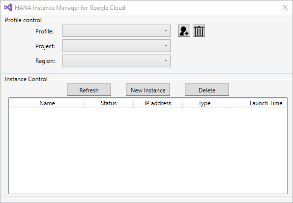
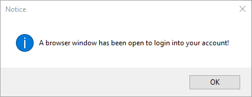
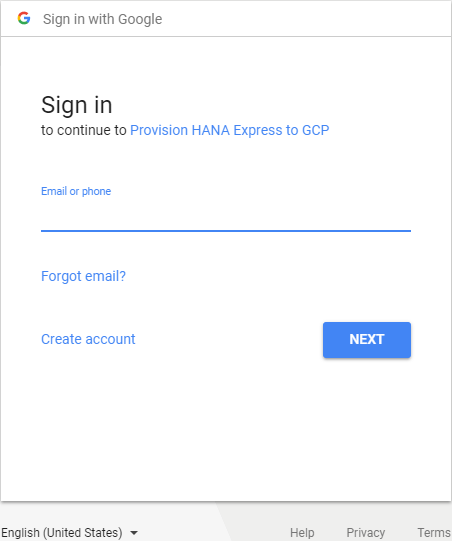
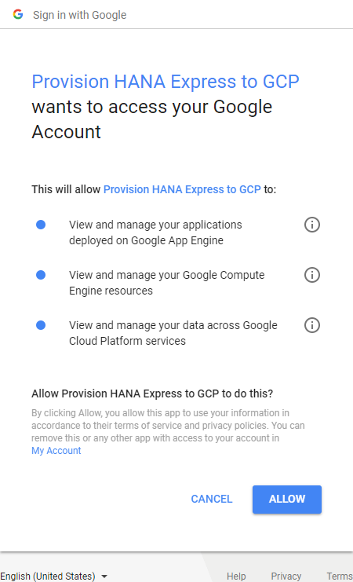
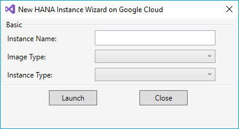
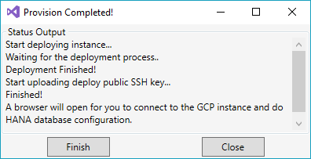

## Prerequisites
 - **Tutorials:** [SAP HANA Plugin for Microsoft Visual Studio 2017 - Word Mapping Project](https://developers.sap.com/tutorials/hxe-ua-visual-studio-word-mapping.html)

## Details
### You will learn
  - How to deploy your SAP HANA, express edition installation to the Google Cloud Platform by using the SAP HANA plugin for Microsoft Visual Studio 2017.

---

[ACCORDION-BEGIN [Step 1: ](Open Microsoft Visual Studio 2017)]

Launch Microsoft Visual Studio 2017. Ensure that the SAP HANA plugin is installed by going to **Tools** then **Extensions and Updates...**. In your **Installed** list, confirm that **SAP HANA Explorer for Visual Studio** is installed.

[DONE]

[ACCORDION-END]

[ACCORDION-BEGIN [Step 2: ](Deploy to the Google Cloud Platform from Microsoft Visual Studio)]

In the **Server Explorer** window, click the  **Deploy HANA express in cloud** button. The **HANA Instance Manager for Google Cloud** window opens.



In the new window, click the  **New Profile** button, which opens an internet browser page.



[DONE]

[ACCORDION-END]


[ACCORDION-BEGIN [Step 3: ](Log In To Your Google Account)]

In your browser window, choose the Google account that you want to use or create a new Google account.



Grant permission to allow **Provision HANA Express to GCP** to access your Google Account. Click **Allow** to proceed.



The success page opens.


[DONE]

[ACCORDION-END]

[ACCORDION-BEGIN [Step 4: ](Create a New Instance)]

Return to Microsoft Visual Studio and the **HANA Instance Manager for Google Cloud** window. Choose your profile, project, and the region where you are deploying your installation.

> **Note:**
> You must create a project to continue creating your instance. If you do not have a project, go to the [Google Cloud Resource Manager](https://console.cloud.google.com/cloud-resource-manager) to create a project.

Click **New Instance** once you have made your choices.

> **Note:**
> You must enable the **Google Compute Engine API** for use in your project. To enable the API, go to `https://console.developers.google.com/apis/api/compute.googleapis.com/overview?project=<project_number>`.

[DONE]

[ACCORDION-END]

[ACCORDION-BEGIN [Step 5: ](Deploy SAP HANA, express edition to the Google Cloud Platform)]



Name your instance, choose the image type, and the instance type. Click **Launch** once you have made your choices. The instance deploys.



> **Note:**
> You must enable the **Google Cloud Deployment Manager API** for use in your project. To enable the API, go to `https://console.developers.google.com/apis/api/deploymentmanager.googleapis.com/overview?project=<project_number>`.

When you are prompted to connect to the instance via an SSH connection, click **Connect**.


[DONE]

[ACCORDION-END]

[ACCORDION-BEGIN [Step 6: ](Install SAP HANA, express edition onto Google Cloud Platform)]

In the SSH connection, log in to the system:

```
su - hxeadm
```

The installation process begins. Follow the prompts to install SAP HANA, express edition. Once the installation is completed, the following line appears:

`*** Congratulations! SAP HANA, express edition 2.0 is configured. ***`

[DONE]

[ACCORDION-END]

---
